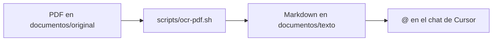

# Cómo usar PDFs escaneados en Cursor

Cursor **no lee PDFs directamente** en el chat. Este proyecto convierte escaneos a Markdown y tú referencias esos archivos con `@`.

## Flujo rápido



## Paso a paso en el chat

1. Abre un **nuevo chat** en Cursor (Agent o Ask).
2. Escribe **`@`** en el campo de mensaje.
3. Elige **Files** (Archivos).
4. Selecciona uno de estos:
   - `@documentos/texto/INDICE.md` — vista general de todos los documentos
   - `@documentos/texto/scan-2022-10-18.md` — documento específico
   - `@documentos/texto/` — carpeta completa (varios documentos)
5. Escribe tu pregunta. Ejemplo:

   > Con base en @documentos/texto/scan-2022-10-18.md, resume los antecedentes y la decisión de la diligencia.

## Agregar un nuevo PDF

```bash
# 1. Copia el PDF a documentos/original/
# 2. Ejecuta el OCR:
chmod +x scripts/ocr-pdf.sh
./scripts/ocr-pdf.sh documentos/original/mi-documento.pdf
# 3. Actualiza documentos/texto/INDICE.md
```

## Dependencias (ya instaladas en este Mac)

- `tesseract` + `tesseract-lang` (idioma `spa` para español)
- `poppler` (`pdftoppm` para convertir PDF en imágenes)

Reinstalar si hace falta: `brew install tesseract tesseract-lang poppler`

## Consejo

Revisa el `.md` generado y corrige errores de OCR (nombres, fechas, artículos) antes de confiar en análisis jurídicos.
