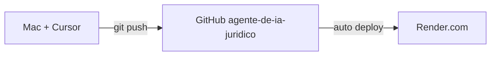

# Despliegue: Mac → GitHub → Render

## Flujo diario



1. Desarrollas y pruebas en la Mac
2. `git push` sube cambios a GitHub
3. Render redeploya automáticamente (2–5 min)

---

## Desarrollo local (Mac)

```bash
cd "/Users/ricardodebiase/Documents/agente de IA juridico"
python3 -m venv .venv
.venv/bin/pip install -e ".[dev]"
cp .env.example .env   # editar con tus claves

.venv/bin/python scripts/validate_fase0.py
.venv/bin/python -m pytest tests/ -v
.venv/bin/python -m src.main

# otra terminal:
curl http://localhost:8000/health
```

---

## Subir cambios a GitHub

```bash
git add .
git commit -m "Describe tu cambio"
git push origin main
```

**Nunca** subas `.env` — solo `.env.example` sin secretos.

---

## Render (primera vez)

1. Entra en [render.com](https://render.com) → **Sign in with GitHub**
2. **New → Blueprint** (o Web Service)
3. Conecta el repo **`agente-de-ia-juridico`**
4. Render detecta `render.yaml` en la raíz
5. En **Environment**, añade secretos:
   - `OPENAI_API_KEY` (obligatorio para GPT)
   - `SLACK_BOT_TOKEN` + `SLACK_SIGNING_SECRET` (Slack)
   - `TWILIO_*` (WhatsApp, cuando lo actives)
6. Deploy → URL: `https://agente-de-ia-juridico.onrender.com` (o similar)

### Probar en Render

```bash
curl https://TU-APP.onrender.com/health
curl -X POST https://TU-APP.onrender.com/chat \
  -H "Content-Type: application/json" \
  -d '{"message":"¿Qué áreas del derecho maneja el despacho?"}'
```

### WhatsApp (Twilio)

Webhook URL en Twilio:

```
https://TU-APP.onrender.com/whatsapp/webhook
```

---

## Plan gratis Render

- El servicio se **duerme** tras ~15 min sin uso
- El primer request puede tardar 30–60 s (cold start)
- Suficiente para desarrollo/staging

---

## GitHub Pages (tu website)

GitHub Pages **no** corre esta app Python. Tu website estática puede seguir en Pages; el agente vive solo en Render.
