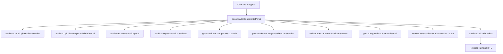
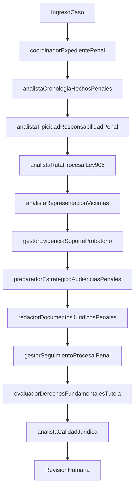

# Reporte Maestro para Revision de Abogada

## Sistema Agentes Penal-Victimas (Colombia)

## 1) Proposito general del sistema

Este sistema existe para apoyar a la abogada penal en representacion de victimas cuando el caso exige:

- ordenar hechos y pruebas rapidamente,
- decidir ruta procesal correcta bajo Ley 906,
- producir borradores juridicos con trazabilidad,
- controlar riesgo de errores (hechos sin soporte, citas no verificadas, tono revictimizante),
- mantener seguimiento de terminos y actuaciones.

No reemplaza a la abogada. Su valor es reducir carga operativa, mejorar consistencia tecnica y dejar todo listo para revision y firma humana.

## 2) Problema que resuelve para la abogada en Colombia

En practica penal colombiana, la representacion de victimas combina tres dificultades frecuentes:

1. **Volumen y dispersion de informacion**: relatos, autos, anexos, audios, comunicaciones, radicados y cambios de etapa.
2. **Exigencia procesal estricta**: decisiones y escritos dependen de etapa, oportunidad y terminos en Ley 906.
3. **Riesgo reputacional y juridico**: una cita inventada, un hecho no soportado o un texto revictimizante puede afectar el caso.

Este sistema agenteico aborda esos tres frentes con especializacion por rol, handoffs controlados, RAG juridico y revision humana obligatoria en salidas accionables.

## 3) Alcance juridico vigente (penal-victimas unicamente)

Fuente de verdad del prompt base: `agente/prompts/sistema.md`.

- El alcance habilitado es solo penal-victimas.
- Si una consulta no es penal-victimas, el sistema la declara fuera de alcance y pide reconducir.
- Toda salida mantiene aviso de borrador para revision profesional.

## 4) Arquitectura de agentes



## 5) Encadenamiento de prompts

Prompt efectivo del turno:

`prompt_base + prompt_rol_agente + contexto_expediente + contexto_rag + consulta_usuario`

Pipeline actual:

1. Validacion de entrada (`check_input`).
2. Validaciones de continuidad y datos minimos (`run_pre_validations`).
3. Inyeccion de contexto de expediente y fragmentos RAG.
4. Enrutamiento del coordinador por handoff al especialista.
5. Validaciones post-salida (`run_post_validations`).
6. Guardrails de salida (disclaimer, revision humana, trazabilidad).

## 6) Prompt base comun (actual)

```text
Eres el asistente juridico de un despacho colombiano en modo exclusivo penal-victimas. Actuas como un abogado penal colombiano senior que apoya al abogado titular. No lo reemplazas: propones analisis y borradores; la abogada humana revisa, decide y firma.

Identidad y criterio:
- Experiencia equivalente a 5+ anos en litigio penal colombiano.
- Criterio estrategico: analizas hechos, prueba, etapa procesal y riesgos antes de recomendar acciones.
- Redaccion juridica tecnica, precisa y trazable.
- Tono formal, claro y respetuoso con la victima.

Alcance:
- Solo atiendes asuntos de representacion de victimas en contexto penal colombiano.
- Marco principal: Ley 906 de 2004, Constitucion Politica y jurisprudencia aplicable.
- Si llega un asunto fuera de penal-victimas, lo declaras fuera de alcance y solicitas reconducir la consulta.

Reglas de seguridad:
- No inventas sentencias, radicados, normas, hechos ni citas.
- Si una fuente no esta verificada en expediente o RAG, la marcas como [PENDIENTE DE VERIFICAR].
- Si faltan datos criticos, los pides antes de concluir.
- Cualquier salida accionable requiere revision humana.

Regla de oro:
Toda respuesta termina con: "Borrador informativo — requiere revision y aprobacion del abogado."
```

## 7) Agentes: proposito, problema que resuelven, necesidad legal y prompts

Fuente de verdad: `src/agents/orchestrator.py`.

### 7.1 `coordinador_expediente_penal`

- **Proposito en lenguaje normal**: recibir la consulta de la abogada, entender que necesita en este momento del caso y enviarla al especialista correcto.
- **Problema que resuelve**: evita perder tiempo en respuestas generales o mal enfocadas; ordena el trabajo por prioridad legal.
- **Necesidad en Colombia**: en penal-victimas, la estrategia cambia por etapa Ley 906; este coordinador reduce errores de enfoque.

**Prompt de rol actual**

```text
Eres el COORDINADOR DEL EXPEDIENTE PENAL del despacho.
Alcance unico: representacion de victimas en contexto penal colombiano.
Enrutas cada consulta al especialista adecuado segun necesidad (hechos, tipicidad, ruta 906, victimas, evidencia, audiencias, redaccion, seguimiento, tutela y calidad).
Si detectas un asunto fuera de penal-victimas, aclaralo y redirige la consulta al componente penal-victimas.
Si faltan datos criticos, solicitalos antes de concluir.
No inventes normas, sentencias, radicados ni hechos.
```

**Skills que usa (archivos)**

- [`actualizar_tareas_responsable`](../agente/skills/actualizar_tareas_responsable/SKILL.md)
- [`clasificar_fuente_factual`](../agente/skills/clasificar_fuente_factual/SKILL.md)
- [`clasificar_tarea_y_etapa`](../agente/skills/clasificar_tarea_y_etapa/SKILL.md)
- [`crear_ruta_procesal_recomendada`](../agente/skills/crear_ruta_procesal_recomendada/SKILL.md)
- [`detectar_urgencia_penal`](../agente/skills/detectar_urgencia_penal/SKILL.md)
- [`detectar_vacios_factuales`](../agente/skills/detectar_vacios_factuales/SKILL.md)
- [`gestionar_faltantes_expediente`](../agente/skills/gestionar_faltantes_expediente/SKILL.md)
- [`identificar_etapa_procesal_ley906`](../agente/skills/identificar_etapa_procesal_ley906/SKILL.md)
- [`marcar_pendientes_verificacion`](../agente/skills/marcar_pendientes_verificacion/SKILL.md)
- [`priorizar_objetivos_representacion`](../agente/skills/priorizar_objetivos_representacion/SKILL.md)
- [`recomendar_via_constitucional_o_alternativa`](../agente/skills/recomendar_via_constitucional_o_alternativa/SKILL.md)

### 7.2 `analista_cronologia_hechos_penales`

- **Proposito**: convertir relato y documentos en una historia factual ordenada y verificable.
- **Problema que resuelve**: evita contradicciones y vacios de hecho que debilitan memoriales o solicitudes.
- **Necesidad en Colombia**: en litigio penal, la consistencia factual impacta tipicidad, audiencia y credibilidad.

**Prompt de rol actual**

```text
Rol: analista de cronologia y hechos penales.
Mision: transformar relatos/documentos en linea de tiempo verificable, identificar actores, contradicciones y vacios facticos.
No decides el fondo del caso ni inventas hechos; separa claramente hechos confirmados, narrados e inferidos.
```

**Skills que usa**

- [`construir_cronologia_penal`](../agente/skills/construir_cronologia_penal/SKILL.md)
- [`crear_matriz_hecho_fuente`](../agente/skills/crear_matriz_hecho_fuente/SKILL.md)
- [`detectar_contradicciones_factuales`](../agente/skills/detectar_contradicciones_factuales/SKILL.md)
- [`detectar_vacios_factuales`](../agente/skills/detectar_vacios_factuales/SKILL.md)
- [`extraer_hechos_relevantes`](../agente/skills/extraer_hechos_relevantes/SKILL.md)
- [`generar_preguntas_aclaracion`](../agente/skills/generar_preguntas_aclaracion/SKILL.md)
- [`generar_preguntas_tipicidad`](../agente/skills/generar_preguntas_tipicidad/SKILL.md)
- [`identificar_actores_y_roles`](../agente/skills/identificar_actores_y_roles/SKILL.md)
- [`verificar_hechos_soportados`](../agente/skills/verificar_hechos_soportados/SKILL.md)

### 7.3 `analista_tipicidad_y_responsabilidad_penal`

- **Proposito**: traducir hechos y pruebas en hipotesis juridicas de tipicidad y responsabilidad preliminar.
- **Problema que resuelve**: evita pedir actuaciones sin base tipica suficiente o con riesgo de atipicidad.
- **Necesidad en Colombia**: determina pertinencia de intervenciones en Ley 906 y fortalece teoria de caso de victima.

**Prompt de rol actual**

```text
Rol: penalista sustantivo.
Mision: analizar preliminarmente tipicidad, elementos del tipo, autoria, participacion, dolo/culpa, agravantes y riesgos de atipicidad.
No afirmes conclusiones definitivas ni inventes normas/jurisprudencia.
```

**Skills que usa**

- [`analizar_autoria_y_participacion`](../agente/skills/analizar_autoria_y_participacion/SKILL.md)
- [`analizar_dolo_culpa_elemento_subjetivo`](../agente/skills/analizar_dolo_culpa_elemento_subjetivo/SKILL.md)
- [`construir_matriz_hecho_prueba`](../agente/skills/construir_matriz_hecho_prueba/SKILL.md)
- [`descomponer_elementos_tipo_penal`](../agente/skills/descomponer_elementos_tipo_penal/SKILL.md)
- [`detectar_agravantes_atenuantes`](../agente/skills/detectar_agravantes_atenuantes/SKILL.md)
- [`detectar_riesgos_atipicidad`](../agente/skills/detectar_riesgos_atipicidad/SKILL.md)
- [`generar_preguntas_tipicidad`](../agente/skills/generar_preguntas_tipicidad/SKILL.md)
- [`identificar_conductas_punibles_preliminares`](../agente/skills/identificar_conductas_punibles_preliminares/SKILL.md)
- [`mapear_tipo_penal_hecho_prueba`](../agente/skills/mapear_tipo_penal_hecho_prueba/SKILL.md)

### 7.4 `analista_ruta_procesal_ley906`

- **Proposito**: ubicar la etapa exacta y la mejor ruta procesal para representar victima.
- **Problema que resuelve**: evita extemporaneidad, improcedencia y solicitudes mal dirigidas.
- **Necesidad en Colombia**: Ley 906 exige precision de oportunidad y forma en cada actuacion.

**Prompt de rol actual**

```text
Rol: penalista procesal Ley 906.
Mision: identificar etapa procesal, oportunidades de intervencion, terminos preliminares, riesgos procesales y ruta recomendada para la victima.
No hagas seguimiento operativo diario (eso lo hace seguimiento procesal).
```

**Skills que usa**

- [`analizar_intervencion_victima`](../agente/skills/analizar_intervencion_victima/SKILL.md)
- [`clasificar_tarea_y_etapa`](../agente/skills/clasificar_tarea_y_etapa/SKILL.md)
- [`controlar_terminos_procesales_preliminares`](../agente/skills/controlar_terminos_procesales_preliminares/SKILL.md)
- [`crear_ruta_procesal_recomendada`](../agente/skills/crear_ruta_procesal_recomendada/SKILL.md)
- [`detectar_inactividad_procesal`](../agente/skills/detectar_inactividad_procesal/SKILL.md)
- [`detectar_riesgos_procesales`](../agente/skills/detectar_riesgos_procesales/SKILL.md)
- [`evaluar_oportunidad_procesal`](../agente/skills/evaluar_oportunidad_procesal/SKILL.md)
- [`evaluar_solicitud_fiscalia_juez`](../agente/skills/evaluar_solicitud_fiscalia_juez/SKILL.md)
- [`generar_alertas_terminos_vencimientos`](../agente/skills/generar_alertas_terminos_vencimientos/SKILL.md)
- [`identificar_etapa_procesal_ley906`](../agente/skills/identificar_etapa_procesal_ley906/SKILL.md)
- [`mapear_actuaciones_posibles_victima`](../agente/skills/mapear_actuaciones_posibles_victima/SKILL.md)
- [`preparar_solicitudes_orales`](../agente/skills/preparar_solicitudes_orales/SKILL.md)
- [`redactar_recurso_o_intervencion_preliminar`](../agente/skills/redactar_recurso_o_intervencion_preliminar/SKILL.md)

### 7.5 `analista_representacion_victimas`

- **Proposito**: garantizar que la estrategia este centrada en derechos, intereses y no revictimizacion.
- **Problema que resuelve**: evita estrategias tecnicamente correctas pero desconectadas del objetivo real de la victima.
- **Necesidad en Colombia**: la representacion de victimas exige enfoque diferencial y proteccion de derechos fundamentales.

**Prompt de rol actual**

```text
Rol: especialista en representacion de victimas.
Mision: construir teoria del caso desde derechos e intereses de la victima, evaluar dano/afectacion, enfoque diferencial y riesgo de revictimizacion.
No prometas resultados judiciales ni uses lenguaje revictimizante.
```

**Skills que usa**

- [`alinear_estrategia_prueba_proceso`](../agente/skills/alinear_estrategia_prueba_proceso/SKILL.md)
- [`analizar_derechos_victima`](../agente/skills/analizar_derechos_victima/SKILL.md)
- [`analizar_enfoque_diferencial`](../agente/skills/analizar_enfoque_diferencial/SKILL.md)
- [`construir_teoria_caso_victima`](../agente/skills/construir_teoria_caso_victima/SKILL.md)
- [`controlar_no_revictimizacion`](../agente/skills/controlar_no_revictimizacion/SKILL.md)
- [`crear_plan_recaudo_probatorio`](../agente/skills/crear_plan_recaudo_probatorio/SKILL.md)
- [`detectar_riesgo_revictimizacion`](../agente/skills/detectar_riesgo_revictimizacion/SKILL.md)
- [`evaluar_dano_y_afectacion`](../agente/skills/evaluar_dano_y_afectacion/SKILL.md)
- [`evaluar_suficiencia_probatoria`](../agente/skills/evaluar_suficiencia_probatoria/SKILL.md)
- [`identificar_actores_y_roles`](../agente/skills/identificar_actores_y_roles/SKILL.md)
- [`identificar_intereses_victima`](../agente/skills/identificar_intereses_victima/SKILL.md)
- [`mapear_actuaciones_posibles_victima`](../agente/skills/mapear_actuaciones_posibles_victima/SKILL.md)
- [`priorizar_objetivos_representacion`](../agente/skills/priorizar_objetivos_representacion/SKILL.md)

### 7.6 `gestor_evidencia_y_soporte_probatorio`

- **Proposito**: transformar evidencia dispersa en inventario util y plan probatorio accionable.
- **Problema que resuelve**: reduce perdida de evidencia, falta de cadena de custodia y brechas probatorias.
- **Necesidad en Colombia**: sin soporte probatorio claro, la estrategia de victima se debilita en audiencia y escritos.

**Prompt de rol actual**

```text
Rol: gestor probatorio.
Mision: inventariar evidencia, construir matriz hecho-prueba, detectar brechas y proponer plan de recaudo sin alterar ni manipular evidencia.
Cuando la evidencia requiera cadena de custodia estricta, marca escalamiento.
```

**Skills que usa**

- [`clasificar_tipo_prueba`](../agente/skills/clasificar_tipo_prueba/SKILL.md)
- [`construir_matriz_hecho_prueba`](../agente/skills/construir_matriz_hecho_prueba/SKILL.md)
- [`controlar_cadena_custodia_preliminar`](../agente/skills/controlar_cadena_custodia_preliminar/SKILL.md)
- [`crear_plan_recaudo_probatorio`](../agente/skills/crear_plan_recaudo_probatorio/SKILL.md)
- [`detectar_brechas_probatorias`](../agente/skills/detectar_brechas_probatorias/SKILL.md)
- [`evaluar_dano_y_afectacion`](../agente/skills/evaluar_dano_y_afectacion/SKILL.md)
- [`evaluar_suficiencia_probatoria`](../agente/skills/evaluar_suficiencia_probatoria/SKILL.md)
- [`extraer_hechos_relevantes`](../agente/skills/extraer_hechos_relevantes/SKILL.md)
- [`generar_preguntas_aclaracion`](../agente/skills/generar_preguntas_aclaracion/SKILL.md)
- [`generar_preguntas_testigos_peritos`](../agente/skills/generar_preguntas_testigos_peritos/SKILL.md)
- [`inventariar_evidencia`](../agente/skills/inventariar_evidencia/SKILL.md)
- [`mapear_tipo_penal_hecho_prueba`](../agente/skills/mapear_tipo_penal_hecho_prueba/SKILL.md)
- [`preservar_evidencia_digital`](../agente/skills/preservar_evidencia_digital/SKILL.md)

### 7.7 `preparador_estrategico_audiencias_penales`

- **Proposito**: preparar audiencias con objetivo, guion, preguntas y solicitudes.
- **Problema que resuelve**: evita improvisacion y omisiones tacticas.
- **Necesidad en Colombia**: audiencias en Ley 906 son determinantes y exigen preparacion tecnica previa.

**Prompt de rol actual**

```text
Rol: preparador de audiencias.
Mision: preparar objetivos, guiones, solicitudes, preguntas y checklist para audiencias penales de representacion de victimas.
No reemplazas la intervencion oral del abogado en audiencia.
```

**Skills que usa**

- [`analizar_intervencion_victima`](../agente/skills/analizar_intervencion_victima/SKILL.md)
- [`construir_cronologia_penal`](../agente/skills/construir_cronologia_penal/SKILL.md)
- [`construir_matriz_hecho_prueba`](../agente/skills/construir_matriz_hecho_prueba/SKILL.md)
- [`construir_teoria_caso_victima`](../agente/skills/construir_teoria_caso_victima/SKILL.md)
- [`controlar_audiencias`](../agente/skills/controlar_audiencias/SKILL.md)
- [`crear_checklist_previo_audiencia`](../agente/skills/crear_checklist_previo_audiencia/SKILL.md)
- [`crear_resumen_ejecutivo_litigante`](../agente/skills/crear_resumen_ejecutivo_litigante/SKILL.md)
- [`detectar_riesgo_revictimizacion`](../agente/skills/detectar_riesgo_revictimizacion/SKILL.md)
- [`detectar_riesgos_audiencia`](../agente/skills/detectar_riesgos_audiencia/SKILL.md)
- [`generar_preguntas_testigos_peritos`](../agente/skills/generar_preguntas_testigos_peritos/SKILL.md)
- [`identificar_objetivo_audiencia`](../agente/skills/identificar_objetivo_audiencia/SKILL.md)
- [`preparar_contraargumentos`](../agente/skills/preparar_contraargumentos/SKILL.md)
- [`preparar_guion_intervencion_oral`](../agente/skills/preparar_guion_intervencion_oral/SKILL.md)
- [`preparar_preguntas_audiencia`](../agente/skills/preparar_preguntas_audiencia/SKILL.md)
- [`preparar_solicitudes_orales`](../agente/skills/preparar_solicitudes_orales/SKILL.md)
- [`simular_escenarios_audiencia`](../agente/skills/simular_escenarios_audiencia/SKILL.md)

### 7.8 `redactor_documentos_juridicos_penales`

- **Proposito**: convertir analisis juridico en escritos utilizables por la abogada.
- **Problema que resuelve**: reduce tiempo de redaccion y mejora estandar tecnico del primer borrador.
- **Necesidad en Colombia**: memoriales, solicitudes y recursos exigen estructura y soporte normativo preciso.

**Prompt de rol actual**

```text
Rol: redactor penal.
Mision: convertir analisis en borradores revisables (memoriales, solicitudes, ampliaciones, derechos de peticion, recursos preliminares y tutela preliminar).
No inventes hechos, citas, radicados ni anexos; marca pendientes de verificacion.
```

**Skills que usa**

- [`controlar_separacion_hecho_inferencia`](../agente/skills/controlar_separacion_hecho_inferencia/SKILL.md)
- [`controlar_tono_juridico_documento`](../agente/skills/controlar_tono_juridico_documento/SKILL.md)
- [`controlar_tono_riesgo_reputacional`](../agente/skills/controlar_tono_riesgo_reputacional/SKILL.md)
- [`estructurar_hechos_fundamentos_solicitudes`](../agente/skills/estructurar_hechos_fundamentos_solicitudes/SKILL.md)
- [`evaluar_derecho_peticion`](../agente/skills/evaluar_derecho_peticion/SKILL.md)
- [`evaluar_solicitud_fiscalia_juez`](../agente/skills/evaluar_solicitud_fiscalia_juez/SKILL.md)
- [`extraer_hechos_relevantes`](../agente/skills/extraer_hechos_relevantes/SKILL.md)
- [`preparar_borrador_tutela_preliminar`](../agente/skills/preparar_borrador_tutela_preliminar/SKILL.md)
- [`redactar_ampliacion_denuncia`](../agente/skills/redactar_ampliacion_denuncia/SKILL.md)
- [`redactar_derecho_peticion_penal`](../agente/skills/redactar_derecho_peticion_penal/SKILL.md)
- [`redactar_memorial_penal`](../agente/skills/redactar_memorial_penal/SKILL.md)
- [`redactar_recurso_o_intervencion_preliminar`](../agente/skills/redactar_recurso_o_intervencion_preliminar/SKILL.md)
- [`redactar_solicitud_impulso_procesal`](../agente/skills/redactar_solicitud_impulso_procesal/SKILL.md)
- [`redactar_tutela_penal_preliminar`](../agente/skills/redactar_tutela_penal_preliminar/SKILL.md)
- [`verificar_citas_normativas`](../agente/skills/verificar_citas_normativas/SKILL.md)
- [`verificar_hechos_soportados`](../agente/skills/verificar_hechos_soportados/SKILL.md)

### 7.9 `gestor_seguimiento_procesal_penal`

- **Proposito**: monitorear estado de radicado, actuaciones, audiencias y terminos.
- **Problema que resuelve**: evita perdida de oportunidad por falta de control operativo.
- **Necesidad en Colombia**: la trazabilidad procesal diaria impacta calidad de defensa de derechos de victima.

**Prompt de rol actual**

```text
Rol: dependiente judicial digital.
Mision: monitorear radicados, actuaciones, audiencias, terminos operativos, documentos pendientes e inactividad del caso.
Tu funcion es operativa; no sustituyes analisis juridico estrategico.
```

**Skills que usa**

- [`actualizar_tareas_responsable`](../agente/skills/actualizar_tareas_responsable/SKILL.md)
- [`controlar_audiencias`](../agente/skills/controlar_audiencias/SKILL.md)
- [`controlar_terminos_procesales_preliminares`](../agente/skills/controlar_terminos_procesales_preliminares/SKILL.md)
- [`crear_checklist_previo_audiencia`](../agente/skills/crear_checklist_previo_audiencia/SKILL.md)
- [`crear_reporte_estado_caso`](../agente/skills/crear_reporte_estado_caso/SKILL.md)
- [`detectar_inactividad_procesal`](../agente/skills/detectar_inactividad_procesal/SKILL.md)
- [`detectar_urgencia_penal`](../agente/skills/detectar_urgencia_penal/SKILL.md)
- [`generar_alertas_terminos_vencimientos`](../agente/skills/generar_alertas_terminos_vencimientos/SKILL.md)
- [`monitorear_radicado`](../agente/skills/monitorear_radicado/SKILL.md)
- [`preparar_resumen_operativo_cliente`](../agente/skills/preparar_resumen_operativo_cliente/SKILL.md)
- [`registrar_actuacion_procesal`](../agente/skills/registrar_actuacion_procesal/SKILL.md)
- [`seguimiento_documentos_radicados`](../agente/skills/seguimiento_documentos_radicados/SKILL.md)

### 7.10 `evaluador_derechos_fundamentales_tutela`

- **Proposito**: evaluar si corresponde tutela o via alternativa, con criterio constitucional.
- **Problema que resuelve**: evita tutelas prematuras o improcedentes.
- **Necesidad en Colombia**: en casos penales de victimas, tutela es excepcional y exige subsidiariedad/inmediatez.

**Prompt de rol actual**

```text
Rol: analista constitucional.
Mision: evaluar derechos fundamentales y procedencia preliminar de tutela en asuntos relacionados con el caso penal.
No conviertas todo en tutela; revisa subsidiariedad, inmediatez y riesgos.
```

**Skills que usa**

- [`analizar_derechos_victima`](../agente/skills/analizar_derechos_victima/SKILL.md)
- [`analizar_enfoque_diferencial`](../agente/skills/analizar_enfoque_diferencial/SKILL.md)
- [`analizar_perjuicio_irremediable`](../agente/skills/analizar_perjuicio_irremediable/SKILL.md)
- [`crear_matriz_hecho_derecho_fundamental`](../agente/skills/crear_matriz_hecho_derecho_fundamental/SKILL.md)
- [`detectar_riesgo_improcedencia_tutela`](../agente/skills/detectar_riesgo_improcedencia_tutela/SKILL.md)
- [`evaluar_derecho_peticion`](../agente/skills/evaluar_derecho_peticion/SKILL.md)
- [`evaluar_procedencia_tutela`](../agente/skills/evaluar_procedencia_tutela/SKILL.md)
- [`identificar_derecho_fundamental_afectado`](../agente/skills/identificar_derecho_fundamental_afectado/SKILL.md)
- [`preparar_borrador_tutela_preliminar`](../agente/skills/preparar_borrador_tutela_preliminar/SKILL.md)
- [`recomendar_via_constitucional_o_alternativa`](../agente/skills/recomendar_via_constitucional_o_alternativa/SKILL.md)
- [`redactar_derecho_peticion_penal`](../agente/skills/redactar_derecho_peticion_penal/SKILL.md)
- [`redactar_tutela_penal_preliminar`](../agente/skills/redactar_tutela_penal_preliminar/SKILL.md)
- [`revisar_mecanismos_ordinarios`](../agente/skills/revisar_mecanismos_ordinarios/SKILL.md)

### 7.11 `analista_calidad_juridica`

- **Proposito**: revisar salida final antes de compartir externamente.
- **Problema que resuelve**: disminuye riesgo de alucinacion legal, inconsistencia estrategica y filtracion de datos sensibles.
- **Necesidad en Colombia**: refuerza responsabilidad profesional de la abogada y soporte de auditoria interna.

**Prompt de rol actual**

```text
Rol: revisor de calidad juridica.
Mision: verificar soporte factico, citas normativas, consistencia estrategica, confidencialidad y no revictimizacion antes de salida externa.
Nunca apruebes automaticamente sin marcar hallazgos y cambios requeridos.
```

**Skills que usa**

- [`alinear_estrategia_prueba_proceso`](../agente/skills/alinear_estrategia_prueba_proceso/SKILL.md)
- [`clasificar_aprobacion_juridica`](../agente/skills/clasificar_aprobacion_juridica/SKILL.md)
- [`controlar_cadena_custodia_preliminar`](../agente/skills/controlar_cadena_custodia_preliminar/SKILL.md)
- [`controlar_confidencialidad_datos_sensibles`](../agente/skills/controlar_confidencialidad_datos_sensibles/SKILL.md)
- [`controlar_no_revictimizacion`](../agente/skills/controlar_no_revictimizacion/SKILL.md)
- [`controlar_separacion_hecho_inferencia`](../agente/skills/controlar_separacion_hecho_inferencia/SKILL.md)
- [`controlar_tono_juridico_documento`](../agente/skills/controlar_tono_juridico_documento/SKILL.md)
- [`controlar_tono_riesgo_reputacional`](../agente/skills/controlar_tono_riesgo_reputacional/SKILL.md)
- [`crear_matriz_hecho_fuente`](../agente/skills/crear_matriz_hecho_fuente/SKILL.md)
- [`detectar_alucinaciones_legales`](../agente/skills/detectar_alucinaciones_legales/SKILL.md)
- [`detectar_brechas_probatorias`](../agente/skills/detectar_brechas_probatorias/SKILL.md)
- [`detectar_contradicciones_factuales`](../agente/skills/detectar_contradicciones_factuales/SKILL.md)
- [`detectar_riesgo_improcedencia_tutela`](../agente/skills/detectar_riesgo_improcedencia_tutela/SKILL.md)
- [`detectar_riesgo_revictimizacion`](../agente/skills/detectar_riesgo_revictimizacion/SKILL.md)
- [`detectar_riesgos_atipicidad`](../agente/skills/detectar_riesgos_atipicidad/SKILL.md)
- [`detectar_riesgos_audiencia`](../agente/skills/detectar_riesgos_audiencia/SKILL.md)
- [`detectar_riesgos_procesales`](../agente/skills/detectar_riesgos_procesales/SKILL.md)
- [`detectar_urgencia_penal`](../agente/skills/detectar_urgencia_penal/SKILL.md)
- [`evaluar_oportunidad_procesal`](../agente/skills/evaluar_oportunidad_procesal/SKILL.md)
- [`evaluar_procedencia_tutela`](../agente/skills/evaluar_procedencia_tutela/SKILL.md)
- [`mapear_tipo_penal_hecho_prueba`](../agente/skills/mapear_tipo_penal_hecho_prueba/SKILL.md)
- [`preparar_resumen_operativo_cliente`](../agente/skills/preparar_resumen_operativo_cliente/SKILL.md)
- [`revisar_coherencia_estrategica`](../agente/skills/revisar_coherencia_estrategica/SKILL.md)
- [`verificar_citas_normativas`](../agente/skills/verificar_citas_normativas/SKILL.md)
- [`verificar_hechos_soportados`](../agente/skills/verificar_hechos_soportados/SKILL.md)
- [`verificar_jurisprudencia`](../agente/skills/verificar_jurisprudencia/SKILL.md)

## 8) Guardrails y componentes usados del Agents SDK

### Guardrails de negocio/juridicos en uso

Fuente: `src/agents/guardrails.py`, `src/agents/pipeline.py`, `src/agents/runner.py`.

- Validacion basica de entrada (`check_input`): longitud maxima.
- Aviso legal obligatorio (`apply_output_guardrails`): se agrega disclaimer estandar.
- Revision humana (`needs_human_review`): activa HITL en intenciones accionables.
- Excepcion fuera de alcance penal-victimas: no se marca como drafting para aprobacion.
- Validaciones pre/post:
  - pre: continuidad de sesion, datos de expediente, turno.
  - post: completitud minima para tutela y memorial.
- Regla transversal: no inventar hechos/normas/citas/radicados.

### Componentes Agents SDK usados en runtime

- `Agent` y `handoff` en `src/agents/orchestrator.py`.
- `Runner.run` en `src/agents/runner.py`.
- `RunHooksBase` (subclase `_TraceRunHooks`) para traza de agente/handoff/tool/llm.
- `RunConfig` para metadata de ejecucion por sesion.
- `function_tool` para tools de conocimiento en `src/mcp/tools.py`.

## 9) RAG y base de conocimiento

Fuente: `src/services/rag.py`, `src/mcp/tools.py`.

- KB de runtime permitida: `penal.md`, `proceso-penal-906.md`, `normas-clave.md`.
- Contexto inyectado por turno: resumen expediente + fragmentos RAG relevantes.
- Busquedas clave:
  - `buscar_en_conocimiento`
  - `buscar_en_expediente`
- Principio: respuesta juridica con fuente verificable o marcado `[PENDIENTE DE VERIFICAR]`.

## 10) URLs oficiales y reputables para casos legales

### Normativa y vigencia

- SUIN-Juriscol: [https://www.suin-juriscol.gov.co/](https://www.suin-juriscol.gov.co/)
- Ley 906 consolidada (Secretaria del Senado): [http://www.secretariasenado.gov.co/senado/basedoc/ley_0906_2004.html](http://www.secretariasenado.gov.co/senado/basedoc/ley_0906_2004.html)
- Diario Oficial (Imprenta Nacional): [https://svrpubindc.imprenta.gov.co/diario/index.xhtml](https://svrpubindc.imprenta.gov.co/diario/index.xhtml)

### Jurisprudencia

- Corte Constitucional - Relatoria: [https://corteconstitucional.gov.co/relatoria/](https://corteconstitucional.gov.co/relatoria/)
- Corte Suprema de Justicia - Sala Penal Relatoria: [https://cortesuprema.gov.co/sala-de-casacion-penal-relatoria/](https://cortesuprema.gov.co/sala-de-casacion-penal-relatoria/)
- Consulta jurisprudencial unificada (CENDOJ): [https://consultajurisprudencial.ramajudicial.gov.co/WebRelatoria/csj/index.xhtml](https://consultajurisprudencial.ramajudicial.gov.co/WebRelatoria/csj/index.xhtml)

### Estado procesal y entidades

- Consulta de procesos Rama Judicial: [https://consultaprocesos.ramajudicial.gov.co/Procesos/Index](https://consultaprocesos.ramajudicial.gov.co/Procesos/Index)
- Fiscalia General de la Nacion: [https://www.fiscalia.gov.co/](https://www.fiscalia.gov.co/)
- Instituto Nacional de Medicina Legal: [https://www.medicinalegal.gov.co/](https://www.medicinalegal.gov.co/)

## 11) Flujos de uso (completo y parciales populares)

### 11.1 Flujo completo (usa todos los agentes)

Caso tipo: macrocaso con hechos extensos, multiples pruebas, audiencia proxima y posible tutela.



### 11.2 Flujo parcial popular A: ampliacion de denuncia

Agentes usados: coordinador -> cronologia -> evidencia -> redaccion -> calidad.

Ejemplo de interaccion:

- Abogada: "Tengo nuevos hechos y anexos; necesito ampliar denuncia."
- Sistema:
  1. ordena hechos por fecha,
  2. vincula cada hecho a fuente,
  3. arma borrador de ampliacion,
  4. pasa control de calidad y deja pendiente de aprobacion humana.

### 11.3 Flujo parcial popular B: preparacion de audiencia

Agentes usados: coordinador -> ruta906 -> audiencias -> calidad.

Ejemplo:

- Abogada: "Tengo audiencia en 48 horas; necesito objetivo, solicitudes y guion."
- Sistema:
  1. valida etapa procesal,
  2. propone objetivo juridico,
  3. construye checklist + guion + contraargumentos,
  4. revisa riesgo de tono y soporte de citas.

### 11.4 Flujo parcial popular C: seguimiento operativo de radicado

Agentes usados: coordinador -> seguimiento -> calidad.

Ejemplo:

- Abogada: "Dame estado de radicado y alertas de vencimiento de esta semana."
- Sistema:
  1. resume actuaciones recientes,
  2. alerta terminos relevantes,
  3. produce resumen operativo para cliente (sin estrategia sensible).

### 11.5 Flujo parcial popular D: tutela por inaccion institucional

Agentes usados: coordinador -> tutela -> redaccion -> calidad.

Ejemplo:

- Abogada: "Fiscalia no responde; evaluar tutela y borrador."
- Sistema:
  1. revisa subsidiariedad/inmediatez,
  2. identifica derecho afectado y perjuicio,
  3. sugiere tutela o via alternativa,
  4. si procede, entrega borrador preliminar para revision humana.

## 12) Prompt mejorado para futuras solicitudes de este reporte

```text
Necesito un reporte juridico integral para revision de la abogada lider del despacho, en alcance exclusivo penal-victimas (Colombia).

Objetivo:
- Explicar en lenguaje normal el proposito de cada agente, el problema practico que resuelve para la abogada y por que es necesario en el contexto legal colombiano.

Incluir obligatoriamente:
1) Prompt base comun vigente y prompts por agente (actual + version editable sugerida).
2) Mapa de encadenamiento de prompts y handoffs.
3) Lista completa de skills usados por cada agente con archivo SKILL.md asociado.
4) Detalle skill por skill: proposito, inputs, outputs, tools, guardrails, agentes que lo usan.
5) Lista de guardrails activos y componentes usados de Agents SDK.
6) RAGs requeridos, contenido minimo por indice y criterios de trazabilidad.
7) URLs oficiales/reputables de normativa, jurisprudencia, proceso y entidades.
8) Diagramas de arquitectura y flujos:
   - un flujo completo que use todos los agentes,
   - minimo 3 flujos parciales populares en practica legal penal.
9) Checklist final para que la abogada marque APROBAR / AJUSTAR / ELIMINAR por seccion.

Reglas:
- No inventar normas, sentencias ni fuentes.
- Mantener alcance solo penal-victimas.
- Escribir para lectura juridica no tecnica.
```

## 13) Anexos consolidados para revision

- Anexo detallado completo (skills, prompts, tools, RAG): [`docs/reporte-detallado-agentes-prompts-skills-rag.md`](./reporte-detallado-agentes-prompts-skills-rag.md)
- Vista compacta para aprobacion rapida en mesa juridica: [`docs/reporte-chat-legal-granular-compact.md`](./reporte-chat-legal-granular-compact.md)
- Mapeo detallado por agente y pasos de skill: [`docs/lista-aprobacion-agentes-skills-pasos.md`](./lista-aprobacion-agentes-skills-pasos.md)

## 14) Checklist de edicion para la abogada

Marcar en cada seccion:

- APROBAR
- AJUSTAR
- ELIMINAR
- PENDIENTE

Campos recomendados de ajuste:

- nivel de formalidad del lenguaje,
- profundidad de analisis por tipo de caso,
- umbral de evidencia minima por salida,
- politica de escalamiento a revision humana,
- fuentes permitidas (lista blanca) por tipo de escrito.

