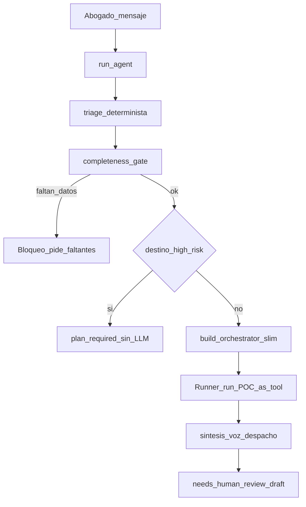

# Auditoría viva — Gerente del Caso + agentes

**Producto:** firma virtual penal-víctimas  
**Documento único** (no crear un MD por agente)  
**Commit base:** `6a94371` (2026-07-31)  
**Alcance:** POC (`coordinador_expediente_penal`) a fondo + 10 laborers  
**Código:** solo con `aprobado, ejecuta Gxx` (o lista)

Leyenda estado: `hallazgo` · `aprendido` · `propuesto` · `aprobado` · `hecho` · `diferir`

---

## 1. Arquitectura del Gerente (turno chat)

| Pieza | Archivo | Rol |
|---|---|---|
| Identidad técnica | `src/agents/orchestrator.py` | `POC_AGENT_ID` |
| Persona / voz | `agente/prompts/agents/coordinador_expediente_penal.md` | Prompt Gerente (`config-version: 14`) |
| Turno | `src/agents/runner.py` | `run_agent` state machine |
| Router | `src/agents/triage.py` | Destino regex + `TriageResult` |
| Gate completitud | `src/agents/completeness.py` + `pipeline.py` | Bloqueo antes de delegar |
| Registry skills | `src/agents/skill_catalog.py` | Ownership POC vs MOVE |
| Precedente | `docs/auditoria/plan-cierre-gerente-caso-2026-07-25.md` | Cierre gerencia julio |

---

## 2. Lista de aprendizajes (invariantes)

1. El **Gerente del Caso Penal** es el único interlocutor (POC); los 10 especialistas son **backoffice** vía `Agent.as_tool`, no caras en el chat.
2. **No hay handoffs peer** entre especialistas; el patrón canónico es as_tool + síntesis del Gerente.
3. La **completitud** y la **urgencia** son gates de **código**, no solo instrucciones de prompt (`completeness.py`, `urgency.py`).
4. Redacción y tutela son **high-risk**: en chat no existen como tools (`include_high_risk_tools=False`); van por **plan HITL** (`requires_execution_plan`).
5. El Gerente posee solo 5 skills (`POC_OWNED_SKILLS`); el resto es MOVE a especialistas.
6. Chat usa **instrucciones slim** + superficie dinámica (focus + vecinos + calidad); no lecturas MD completas ni `listar_areas`.
7. Modelos (Opción A): laborers/POC `gpt-4.1-mini` @ temp 0.2; high-risk `gpt-4.1` @ 0.1.
8. Runtime de prompts/guardrails puede venir de **Postgres config store**; el archivo MD es baseline — riesgo de drift si no se sincroniza.
9. Una sola voz al abogado: no enumerar IDs técnicos de tools; sí “equipo interno”.
10. Costo por turno ya es medible (`trace.completion.estimated_cost_usd`) — base para tunear compactación (B13) después.

---

## 3. Hallazgos priorizados (backlog propuesto)

### P0

| ID | Hallazgo | Antes | Debe | Por qué | Evidencia | Estado |
|---|---|---|---|---|---|---|
| **G01** | Early-return `plan_required` (y otros) no persisten el turno en `chat_sessions` | Mensaje “use el plan…” y el user message **no** entran al historial | Persistir user+assistant en **todos** los returns de `run_agent` (helper central) | Pierde contexto multi-turno justo en el caso high-risk más frecuente | `runner.py` L651–669 (return sin `append_chat_message`) vs L633–648 / L718–725 (sí persisten) | **hecho** |

### P1

| ID | Hallazgo | Antes | Debe | Por qué | Evidencia | Estado |
|---|---|---|---|---|---|---|
| **G02** | Completitud evaluada ≥2× por turno + ledger siempre | `build_triage` llama `assess_completeness`; `run_pre_validations` vuelve a llamar + `persist_verification` | Calcular una vez; pasar resultado; opcional skip persist en consultas triviales POC | Costo DB/CPU; writes innecesarios | `triage.py` L206–210; `pipeline.py` L165–176 | **hecho** |
| **G03** | Regex triage over-eager | `borrador`/`escrito`/`redact` → redactor → `plan_required`; `verificar` → calidad | Endurecer patrones (p. ej. memorial/recurso/tutela explícitos; “verificar hechos” ≠ calidad formal) | Fricción UX: pide plan HITL o foco calidad cuando el abogado quería tipicidad/resumen | `triage.py` L49–55, L116–123 | **hecho** |
| **G07** | Slack notifica borradores creados desde web sin toggle de canal | `_maybe_create_draft` siempre llama `notificar_borrador` | Gate: canal / flag config (p. ej. solo Slack channel o `SLACK_NOTIFY_WEB_DRAFTS`) | 1581: no empujar datos de caso a Slack sin política explícita | `runner.py` L334–354 | **hecho** |
| **G08** | Drift prompt archivo vs DB | Runtime prioriza config store; archivo puede quedar obsoleto | Smoke/assert checksum o versión activa vs header `config-version` al boot o en CI | Ya hubo incidente documentado en plan-cierre §5 | `prompt_assembly.py`; header prompt Gerente `config-version: 14` | **hecho** |

### P2

| ID | Hallazgo | Antes | Debe | Por qué | Evidencia | Estado |
|---|---|---|---|---|---|---|
| **G04** | Superficie focus+vecinos puede omitir especialista útil | Solo focus + `_SPECIALIST_NEIGHBORS` + calidad | Ampliar vecinos de pares acoplados **o** tool “expandir equipo” barata | Calidad vs tokens; p. ej. cronología sin ruta906 | `orchestrator.py` L117–185, `enabled_specialists_for_focus` | **hecho** (vecinos) |
| **G05** | Cache orchestrator por `focus_agent_id` | Hasta ~N grafos en memoria | Un build + `is_enabled` callable, o techo de cache | Memoria/costo de build | `agent_cache.py` | **hecho** (LRU max 6/24) |
| **G06** | `_ensure_poc_voice` casi muerto en chat | Solo reencuadra si `last_agent` es especialista; chat usa as_tool → last=POC | Documentar como red de seguridad plan/handoff residual **o** simplificar | Código engañoso | `runner.py` ~572–587 | **hecho** (docstring) |
| **G09** | Lista Udemy B12 dice “falta secretos” | Nota desactualizada | Marcar B12 hecho (prod `slack_socket_started: true`) | Ops confunde estado real | `UDEMY_LISTA_CAMBIOS.md` B12; `/health` prod | **hecho** |

### Orden sugerido — ejecutado 2026-07-31

1. G01 → 2. G02 → 3. G03 → 4. G07 + G08 → 5. P2 (G04–G06, G09) — **cerrado** (commit + deploy).

---

## 4. Auditoría detallada — Gerente (POC)

### 4.1 Identidad y ownership

| Campo | Valor |
|---|---|
| ID | `coordinador_expediente_penal` |
| Label desk | Gerente del Caso Penal |
| Skills propias | `clasificar_tarea_y_etapa`, `gestionar_faltantes_expediente`, `detectar_urgencia_penal`, `marcar_pendientes_verificacion`, `actualizar_tareas_responsable` |
| Modelo | `gpt-4.1-mini` @ 0.2 |
| output_type chat | No (prosa); triage es código |
| Guardrails | `poc_input/output` + tool I/O en as_tool |

**Aprendido:** el prompt describe el agent loop, pero los pasos 1–3 (triage, completitud, urgencia) ya vienen resueltos en código; el modelo no debe re-clasificar.

### 4.2 Persistencia de sesión (G01)

| Ruta | ¿Persiste historial? |
|---|---|
| Guardrail / pipeline_pre bloqueado | Sí |
| `plan_required` | **No** |
| Fallback sin API key | Sí |
| Éxito normal | Sí (vía session + reconcile) |
| `tool_approval` / budget / tripwire / error | Revisar: varios early-return **sin** append (mismo patrón G01) |

**Propuesto:** helper `_persist_turn(session_id, channel, uid, message, text)` al final de cada rama.

### 4.3 Triage y plan_required (G03)

Precedencia actual (`infer_destination_agent`): fuera de alcance → **calidad** → tutela → **redacción** → audiencia → evidencia → tipicidad → cronología → ruta906 → víctimas → seguimiento → perfil → knowledge → POC.

Riesgos UX:

- “Verificar tipicidad…” puede caer en calidad por `_CALIDAD_RE` (`verificar`) antes que tipicidad.
- “Borrador de cronología…” puede caer en redactor por `borrador`.

### 4.4 Completeness (G02)

Mínimos:

- General: hechos mínimos.
- Ruta / audiencia / seguimiento: radicado + etapa o última actuación.
- High-risk: radicado + poder/calidad + última actuación + partes.

Cada turno operativo escribe ledger (`persist_verification`) aunque el abogado solo salude al Gerente (si destination ≠ trivial — verificar `is_trivial_consultation` en planner; chat siempre corre pre_validations con destination).

### 4.5 Tool surface chat

- High-risk tools: **excluidas**.
- KB search tool: solo si RAG prefetch falló.
- Full reads / list_areas: off.
- Especialistas: focus + vecinos + calidad.
- `require_tool_approval=False` en chat (HITL de alto riesgo es plan, no interruptions).

### 4.6 HITL / Slack (G07)

`_maybe_create_draft` crea borrador + `notificar_borrador` incondicional. Web y Slack comparten camino. Prod ya tiene Socket Mode up; falta política explícita de cuándo notificar desde web.

### 4.7 Prompt vs config store (G08)

Archivo baseline con `config-version: 14`. Runtime: `load_prompt_text` / config store primero. Sin assert de paridad en boot.

### 4.8 Tests existentes / huecos

| Suite | Cobertura Gerente |
|---|---|
| `tests/test_gerencia_loop.py` | Gate completitud / ledger |
| `tests/test_batch_udemy_productizacion.py` | Models, surface tipicidad, IDOR |
| Hueco | Persistencia tras `plan_required`; regex triage golden cases; Slack notify gate |

---

## 5. Secciones por agente (laborers)

Plantilla: skill primario · schema · high-risk/HITL · vecinos · modelo · gaps.

### 5.1 `coordinador_expediente_penal` (POC)

Ver §4. Gaps: G01–G09.

---

### 5.2 `analista_cronologia_hechos_penales`

| Campo | Valor |
|---|---|
| Skill primario | `construir_cronologia_penal` |
| Schema | `CronologiaPenal` |
| High-risk / HITL salida | No / no (salvo needs_human_review genérico) |
| Vecinos | evidencia, calidad, tipicidad |
| Modelo | `gpt-4.1-mini` @ 0.2 |
| Gaps | Sin ruta906 en vecinos (G04); secundarios hechos/contradicciones/vacíos OK |

---

### 5.3 `analista_tipicidad_y_responsabilidad_penal`

| Campo | Valor |
|---|---|
| Skill primario | `descomponer_elementos_tipo_penal` |
| Schema | `MatrizTipicidad` |
| High-risk / HITL | No |
| Vecinos | evidencia, calidad, cronología |
| Modelo | `gpt-4.1-mini` @ 0.2 |
| Gaps | Compite con `_CALIDAD_RE` si el mensaje dice “verificar” (G03); draft tipo `analisis_penal` |

---

### 5.4 `analista_ruta_procesal_ley906`

| Campo | Valor |
|---|---|
| Skill primario | `identificar_etapa_procesal_ley906` |
| Schema | `RutaProcesalLey906` |
| Completeness | Exige radicado + etapa/actuación |
| Vecinos | seguimiento, audiencias, calidad |
| Modelo | `gpt-4.1-mini` @ 0.2 |
| Gaps | Knowledge regex también apunta aquí (`ley 906`) — puede sobrerutar orientación genérica |

---

### 5.5 `analista_representacion_victimas`

| Campo | Valor |
|---|---|
| Skill primario | `construir_teoria_caso_victima` |
| Schema | `RepresentacionVictimas` |
| Vecinos | cronología, calidad, **tutela** (en vecinos pero tutela no está en chat tools) |
| Modelo | `gpt-4.1-mini` @ 0.2 |
| Gaps | Vecino tutela inútil en chat (high-risk off); OK en plan |

---

### 5.6 `gestor_evidencia_y_soporte_probatorio`

| Campo | Valor |
|---|---|
| Skill primario | `inventariar_evidencia` |
| Schema | `InventarioEvidencia` |
| Nested max turns | 4 |
| Vecinos | cronología, tipicidad, calidad |
| Modelo | `gpt-4.1-mini` @ 0.2 |
| Gaps | Ninguno crítico; acoplamiento factual/tipicidad sano |

---

### 5.7 `preparador_estrategico_audiencias_penales`

| Campo | Valor |
|---|---|
| Skill primario | `preparar_preguntas_audiencia` |
| Schema | `PreparacionAudiencia` |
| HITL salida (planes) | Sí (`HITL_OUTPUT_AGENTS`) |
| Nested max | 5 |
| Completeness | Radicado + etapa/actuación |
| Vecinos | ruta906, víctimas, calidad |
| Modelo | `gpt-4.1-mini` @ 0.2 |
| Gaps | Salidas sensibles — confirmar que `needs_human_review` cubre chat sin plan |

---

### 5.8 `gestor_seguimiento_procesal_penal`

| Campo | Valor |
|---|---|
| Skill primario | `monitorear_radicado` |
| Schema | `SeguimientoProcesal` |
| HITL salida (planes) | Sí |
| Completeness | Radicado + etapa/actuación |
| Vecinos | ruta906, calidad |
| Modelo | `gpt-4.1-mini` @ 0.2 |
| Gaps | `_SEGUIMIENTO_RE` incluye “término/vencimiento” — puede robar urgencia vs tipicidad si el mensaje mezcla temas |

---

### 5.9 `redactor_documentos_juridicos_penales`

| Campo | Valor |
|---|---|
| Skill primario | `redactar_memorial_penal` |
| Schema | `BorradorDocumentoPenal` |
| High-risk | **Sí** — solo plan HITL en chat |
| Modelo | `gpt-4.1` @ 0.1 |
| Nested max | 5 |
| Vecinos | calidad, ruta906 |
| Gaps | G01 (plan_required sin historial); G03 (palabra `borrador`); guardrails `redactor_output_guardrails` |

---

### 5.10 `evaluador_derechos_fundamentales_tutela`

| Campo | Valor |
|---|---|
| Skill primario | `evaluar_procedencia_tutela` |
| Schema | `Tutela` |
| High-risk | **Sí** — solo plan HITL |
| Modelo | `gpt-4.1` @ 0.1 |
| Nested max | 4 |
| Vecinos | calidad, ruta906, víctimas |
| Gaps | G01; plazo 10 días al radicar (producto P2 ESTADO, no este batch) |

---

### 5.11 `analista_calidad_juridica`

| Campo | Valor |
|---|---|
| Skill primario | `revisar_coherencia_estrategica` |
| Schema | `DictamenCalidad` |
| Siempre en superficie | Sí (añadido si disponible en focus) |
| Nested max | 4 |
| Vecinos | cronología, ruta906 |
| Modelo | `gpt-4.1-mini` @ 0.2 |
| Gaps | G03 — `_CALIDAD_RE` prioriza sobre casi todo por la palabra `verificar` |

---

## 6. Registro de arreglos

| Fecha | ID | Cambio | Commit / smoke | Estado |
|---|---|---|---|---|
| 2026-07-31 | G01 | `_persist_chat_turn` en early-returns (`plan_required`, guardrails, fallback, errores) | `pytest tests/test_gerente_auditoria_g01_g09.py` | hecho |
| 2026-07-31 | G02 | `TriageBundle` + reuso completeness/urgency en `run_pre_validations`; skip ledger trivial POC | idem | hecho |
| 2026-07-31 | G03 | Regex redactor/calidad endurecidos (sin `borrador`/`verificar` sueltos) | idem | hecho |
| 2026-07-31 | G07 | `SLACK_NOTIFY_WEB_DRAFTS` + gate en `_maybe_create_draft` | `.env.example` | hecho |
| 2026-07-31 | G08 | `prompt_parity.py` + log en boot `main.py` | idem | hecho |
| 2026-07-31 | G04 | Vecinos: cronología/tipicidad ↔ `analista_ruta_procesal_ley906` | idem | hecho |
| 2026-07-31 | G05 | LRU cache orch/agent (max 6 / 24) | idem | hecho |
| 2026-07-31 | G06 | Docstring `_ensure_poc_voice` (red residual plan/handoff) | — | hecho |
| 2026-07-31 | G09 | Udemy B12 → hecho (Slack socket prod) | `UDEMY_LISTA_CAMBIOS.md` | hecho |
| 2026-07-31 | G08+ | Prod: prompt DB v2→v3 (contenido = checksum archivo `e5b134fe…`); parity usa checksum como autoridad (versión DB ≠ header MD) | `publicar_config_gerente.py --prod --apply` + fix `prompt_parity.py` | hecho |

---

## 7. Fuera de alcance / Won’t

- Handoffs peer entre especialistas  
- Voice / sandbox / MCP hosted / connectors con datos de caso  
- WhatsApp sin evaluación 1581/2300  
- Reescritura masiva de los 10 prompts sin demanda  
- B13 tunear compactación sin mediana de tokens  
- Subir temperatura “naturalidad”

---

## 8. Cómo usar este documento

1. Leer §2 (aprendizajes) y §3 (backlog).  
2. Aprobar ítems: `aprobado, ejecuta G01` (etc.).  
3. Tras cada fix: fila en §6 + estado → `hecho`.  
4. No crear otros MD de auditoría de agentes; actualizar **este**.
