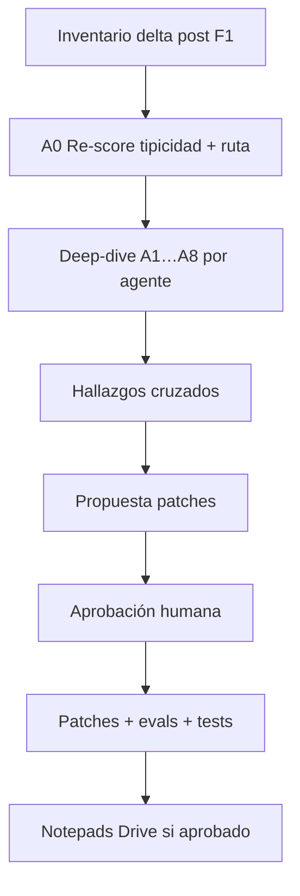

# Plan — Análisis profundo por agente (prompts, skills, herramientas)

**Estado:** `A0–A8 COMPLETO` + oleada **X COMPLETA** (2026-08-05). PR: https://github.com/rdebiasec/agente-de-ia-juridico/pull/9  
**Fecha:** 2026-08-05  
**Editor humano (E0):** Auto / Cursor  
**Modo panel:** agentes IA personificados (`PROMPT_PANEL_ANALISIS_PROMPTS_SKILLS.md`) + E0 consolida  
**Informe vivo (absorbe progreso):** [`INFORME_INSPECCION_CONFIG_NOTEPADS.md`](INFORME_INSPECCION_CONFIG_NOTEPADS.md)  
**Complementa (no reemplaza):** [`PLAN_INSPECCION_CONFIG_NOTEPADS.md`](PLAN_INSPECCION_CONFIG_NOTEPADS.md)  
**Prompt ejecutable:** [`PROMPT_PANEL_ANALISIS_PROMPTS_SKILLS.md`](PROMPT_PANEL_ANALISIS_PROMPTS_SKILLS.md)  
**Rama:** `cursor/analisis-a0-a1-prompts-skills`

---

## 0) Relación con trabajo previo (F1–F4 / O1–O2)

| Trabajo previo | Qué absorbe este plan | Qué no reabre |
|---|---|---|
| **F1** inventario 81 skills + 10 agentes | Matriz base agente×skill×guardrail×eval | Inventario desde cero |
| **F2/O1** tipicidad (H-101…H-105 + patches) | Re-score `analista_responsabilidad_tipicidad` (verificación post-patch) | Reescritura estética de skills O1 |
| **F2/O2** ruta 906 (H-201…H-204 + patches) | Re-score `analista_ruta_procesal` | Reinventar enum etapas ya alineado |
| **F3** prompts/schemas/guardrails tipicidad+ruta | Base de “cómo se ve un agente bien anclado” | G01–G09 Gerente salvo regresión |
| **F4** panel 12 servicio | Fuera de alcance de *este* plan (sigue en panel servicio) | Mezclar AppSec/SRE aquí |
| **O3–O8** skills pendientes | Se ejecutan **dentro** del deep-dive del agente dueño | Oleadas skill-only sin mirar prompt/tools/schema |

**Cambio de eje:** de “oleada de skills” → **análisis completo por `agent_id`** (prompt + skills owned/anclados + tools + I/O/T + schema + HITL + evals + notepad).  
Las oleadas O3–O8 siguen siendo el **orden jurídico** dentro de cada agente, no un track paralelo.

---

## 1) Objetivo y criterios de éxito

### Objetivo

Validar, por cada agente canónico, que el **contrato operativo** (prompt + skills + tools + guardrails + schema + HITL) sea:

1. **Técnicamente sólido** (Agents SDK, anclas, superficie de tools honestas, anti-drift, evals).  
2. **Jurídicamente / proceduralmente correcto** desde representación de víctimas Ley 906 (Colombia): tipicidad preliminar, etapas, derechos de víctima, no invención, HITL en piezas accionables.

### Éxito de la inspección (antes de patches masivos)

1. Scorecard completo de los **10 agentes** (rúbricas §6) en el informe vivo.  
2. Hallazgos con ID `A-{agent_short}-{nnn}` + citas a KB oficial o `[PENDIENTE DE VERIFICAR]`.  
3. Matriz cruzada: solapes, gaps de ancla `_SECONDARY_SKILLS`, gaps eval, tools inventadas vs `REAL_FUNCTION_TOOL_NAMES`.  
4. Top acciones priorizadas por agente (P0 jurídico primero).  
5. Lista de evals nuevos/ampliados por agente.

### Éxito de mejora (solo tras `aprobado, ejecuta`)

- Patches canónicos + bump `config-version` + sync `.cursor/skills` si aplica.  
- Tests verdes relevantes (`test_skill_config`, `test_guardrails_iot_*`, `test_l03_structured_output`, evals).  
- Prioridad semana: **calidad jurídica / procedural knowledge** (decisión #6 del plan notepads).

---

## 2) Decisiones heredadas (no reabrir)

1. Profundidad **todo profundo**.  
2. Notepads dual **DB + Google Drive** — folder [Lexiatek Shared Drive](https://drive.google.com/drive/folders/0ABOGkPnKHSC5Uk9PVA) (`0ABOGkPnKHSC5Uk9PVA`).  
3. Panel IA personificado + **E0 humano**.  
4. Un informe markdown vivo.  
5. Prioridad: calidad jurídica/procedural de skills.  
6. Caso piloto: `config/evals/agent_eval_cases.json` (sintético).  
7. IA propone; abogado revisa/aprueba. No inventar normas/radicados/sentencias.

---

## 3) Roster de expertos

Personas alineadas a `PLAN_INSPECCION_CONFIG_NOTEPADS` (L*/T*) + patrones de `PROMPT_PANEL_12…` (nombre + lente).  
Cada uno responde **solo** su pregunta; no edita archivos en auditoría.

### 3.1 Legal / despacho

| ID | Persona | Rol | Pregunta exclusiva | Entregable |
|---|---|---|---|---|
| **E0** | Editor humano (operador) | Consolida, aprueba oleadas | ¿Qué se ejecuta y en qué orden? | Acta + Top acciones + gates |
| **L1** | Sofía Mendoza — *Abogada penal-víctimas CO (906)* | Dogmática + proceso | ¿La salida es litigable, preliminar y anclada a KB sin inventar derecho? | Hallazgos A-* + checklist procedural §5.2 |
| **L2** | Andrés Quintero — *Litigante representación víctimas* | Intereses / no revictimización | ¿Protege derechos e intereses de la víctima y evita revictimización? | Hallazgos + riesgos L2 |
| **L3** | Valentina Ríos — *Ética + HITL jurídico* | Autonomía indebida | ¿Qué debe pasar por plan HITL / firma antes de redactar o actuar? | Lista HITL por agente + gaps |

### 3.2 Técnico (Agents SDK / producto)

| ID | Persona | Rol | Pregunta exclusiva | Entregable |
|---|---|---|---|---|
| **T1** | Elena Vargas — *Prompt engineer* | Slim, few-shots, anti-drift | ¿El prompt es accionable, versionado y anti-drift vs bloques compartidos? | Scorecard prompt §6.1 |
| **T2** | Marco Díaz — *Arquitecto multi-agente* | Ownership / as_tool | ¿Ownership, primarios/secundarios y routing coherentes sin solape? | Matriz skill_catalog + MOVE |
| **T3** | Nora Patel — *Guardrails I/O/T* | Capas enforceable | ¿input/output/tools cableados y coherentes con prompt/skills? | Diff prompt↔I/O/T↔schema |
| **T4** | Luis Ortega — *HITL / drafts / Slack* | Plan → draft → aprobación | ¿Hay fuga de pieza accionable sin aprobación? | Mapa HITL + `plan_templates` |
| **T5** | Camila Park — *QA / evals* | Regresión | ¿Qué caso falta en `agent_eval_cases.json`? | Propuestas eval deterministas |
| **T6** | Javier Soto — *Contexto & notepads* | Bitácora / Drive | ¿Contrato `notas_especialista` + espejo `{agent_id}.md` listo? | Spec notepad por agente |
| **T7** | Isabel Cruz — *Cumplimiento 1581 en notas/tools* | PII / ARCO | ¿Outputs/tools/notas filtran o retienen PII indebida? | Hallazgos g5/g6 + ARCO |

### 3.3 Prioridad de conflictos (E0)

1. Seguridad jurídica (no inventar, HITL, alcance penal-víctimas)  
2. Calidad jurídica / procedural knowledge  
3. Cumplimiento 1581  
4. Ownership / no solape / tools honestas  
5. Estilo / few-shots / DX  

---

## 4) Orden de agentes a analizar

Fuente: `scripts/lib/catalogo_aprobacion.py` + `src/agents/skill_catalog.py` + `agente/prompts/agents/`.

| # | Oleada | `agent_id` | Motivo del orden | Skills wave absorbida | Estado previo |
|---|---|---|---|---|---|
| **A0a** | Re-score | `analista_responsabilidad_tipicidad` | Verificar O1+F3; no rehacer | O1 | Patches hechos; scorecard post-patch |
| **A0b** | Re-score | `analista_ruta_procesal` | Verificar O2+F3; cubrir eval ya añadido | O2 | Patches hechos; scorecard post-patch |
| **A1** | Deep | `analista_cronologia_hechos` | Siguiente gap procedural (hechos → tipicidad) | O3 | **Hecho** |
| **A2** | Deep | `analista_evidencia` | Cadena hecho-prueba | O4 | **Hecho** |
| **A3** | Deep | `analista_representacion_victimas` | Hueco eval + derechos víctima | O5 | **Hecho** |
| **A4** | Deep | `analista_audiencias` | Oralidad / HITL | O6 | **Hecho** |
| **A5** | Deep | `redactor_documentos_juridicos` | High-risk + HITL obligatorio | O7 (redacción) | **Hecho** |
| **A6** | Deep | `analista_calidad_juridica` | Control alucinación / citas | O7 (calidad) | **Hecho** |
| **A7** | Deep | `analista_seguimiento_procesal` | Hueco eval + términos operativos | O8 (parcial) | **Hecho** |
| **A8** | Deep | `coordinador_caso` | POC, triage, voz única, `POC_OWNED_SKILLS` | O8 gerencia | **Hecho** |

**Gate de lanzamiento:** el operador aprueba una fila (`aprobado, ejecuta A1`) o un bloque (`aprobado, ejecuta A0`).

---

## 5) Desglose de tareas



| Paso | Quién | Entrada | Salida | Gate |
|---|---|---|---|---|
| **I — Inventario delta** | T2 + T5 | F1 + `skill_catalog.py` + evals ≥3.2 | Delta: secundarios, evals, tools vs allowlist | 15–30 min |
| **A0 — Re-score** | L1 + T1 + T3 | Skills O1/O2 v3, prompts F3, schemas | Scorecards A0a/A0b; solo hallazgos residuales | `aprobado, ejecuta A0` |
| **A1…A8 — Deep-dive** | Panel completo (roles §3) | Prompt + skills owned + I/O/T + schema + tools + HITL + evals | Scorecard + hallazgos `A-{id}-nnn` | Una oleada por aprobación |
| **X — Cruzado** | T2 + L1 + E0 | Todos los scorecards | Solapes, gaps KB, anti-patrones | Tras ≥3 agentes deep |
| **P — Patches propuestos** | Panel (conceptual) | Hallazgos P0/P1 | `antes → después → porqué` | Sin editar aún |
| **H — Aprobación** | Operador | Lista H/A-ids | `aprobado, ejecuta A-…` | **Obligatorio** |
| **E — Ejecución** | E0 + T5 | Aprobados | Edits + version bump + sync + tests/evals | Por lote |
| **N — Notepads** | T6 + T7 | Spec §8 F* | Sync `{agent_id}.md` Drive+DB | Tras prioridad skills o en paralelo P2 |

### Por cada agente (checklist de deep-dive)

1. Leer `agente/prompts/agents/{id}.md` + fragmentos `_shared/`.  
2. Listar skills owned (`Used By` / catalog) + primario + `_SECONDARY_SKILLS`.  
3. Leer cada `agente/skills/*/SKILL.md` del agente (y espejo `.cursor` solo si diverge).  
4. Leer `config/guardrails/agents/{id}/{input,output,tools}.md`.  
5. Cruzar schema en `src/agents/schemas.py` / renderer si aplica.  
6. Cruzar tools reales: `src/mcp/tools.py` (`REAL_FUNCTION_TOOL_NAMES`) + exposición en `orchestrator.py`.  
7. Cruzar HITL: `plan_templates.py`, `HITL_OUTPUT_AGENTS`, drafts.  
8. Cruzar evals que tocan el `agent_id`.  
9. Validar procedural vs KB: `agente/conocimiento/{penal,proceso-penal-906,normas-clave}.md` (+ playbooks).  
10. Emitir scorecard §7 + hallazgos §8 + notas notepad §9 del prompt panel.

---

## 6) Rúbricas

Umbral: **≥ 4** en todos los ejes aplicables. Cualquier eje **≤ 2** = al menos P1.  
Reutilizar y extender `PROMPT_REVISION_PROMPTS_Y_SKILLS.md` §§3.1–3.2.

### 6.1 Técnica (por agente)

| Eje | 5 | 1 |
|---|---|---|
| Prompt misión/límites/formato | Acotado al dominio + formato enforceable | Vacío / genérico |
| Few-shots / anti-drift | ≥2; bloques `_shared` alineados | 0; copy divergente |
| Ancla skills (`skill_catalog`) | Primario + secundarios cubren misión | Secundarios omiten ejes del prompt |
| Tools honesty | Solo `REAL_FUNCTION_TOOL_NAMES` / planned marcadas | Inventa tools o trata skills como invocables |
| Guardrails I/O/T | Políticas específicas + tests | Decorativos / domain_limits vacío |
| Schema / structured output | Campos alineados a prompt+KB | Prosa libre donde hace falta enum |
| HITL wiring | High-risk / accionable pasa por plan | Bypass chat libre |
| Evals | ≥1 route o tool-surface relevante | 0 cobertura |
| Config-version / parity | Header + checksum coherente | Drift prompt/DB |

### 6.2 Jurídico-procedural (por agente)

| Eje | 5 | 1 |
|---|---|---|
| Grounding KB | Paths `agente/conocimiento/*` + steps que leen normas/playbook | Cita sin fuente / KB no referida |
| Etapa Ley 906 | Enum/alias alineado a `proceso-penal-906.md` | Etiquetas inventadas o 1:1 roto |
| Tipicidad / dogmática | Preliminar, elementos, no imputación definitiva | Conclusión definitiva o arts inventados |
| Derechos víctima / no revictimización | Explícito donde aplica (L2) | Ignora víctima o riesgo |
| Separación hecho / inferencia | Marcadores claros | Mezcla relato e inferencia |
| Términos / oportunidad | Días hábiles, fecha_base, no falsa certeza | Certifica plazos sin base |
| Citas normativas | Verificadas o `[PENDIENTE DE VERIFICAR]` | Números de artículo sembrados sin KB |
| HITL piezas accionables | Memorial/impulso/guion oral → humano | IA “lista para radicar” |
| Alcance producto | Solo penal-víctimas; tutela OOS | Reactiva tutela / otros equipos |
| Litigabilidad salida | Checklist usable por abogado | Genérico no accionable |

---

## 7) Scorecard template (por agente)

```markdown
## Scorecard — `{agent_id}`

| Campo | Valor |
|---|---|
| Fecha | YYYY-MM-DD |
| Oleada | A0a \| A1 \| … |
| Expertos | L1, T1, … |
| Primario | `{skill_id}` |
| Secundarios anclados | … |
| Skills owned (#) | N |
| Veredicto global | PASS \| PARTIAL \| FAIL |

### Técnica (0–5)
| Eje | Score | Nota 1 línea |
|---|---|---|
| Prompt | | |
| Few-shots / anti-drift | | |
| Ancla skills | | |
| Tools honesty | | |
| Guardrails I/O/T | | |
| Schema | | |
| HITL | | |
| Evals | | |
| Config parity | | |

### Jurídico-procedural (0–5)
| Eje | Score | Nota 1 línea |
|---|---|---|
| Grounding KB | | |
| Etapa 906 | | |
| Tipicidad/dogmática | | |
| Derechos víctima | | |
| Hecho vs inferencia | | |
| Términos/oportunidad | | |
| Citas | | |
| HITL accionable | | |
| Alcance | | |
| Litigabilidad | | |

### Hallazgos abiertos
- A-{short}-001 …
### Evals a ampliar
- …
### Notepad / Drive
- Estado contrato: OK \| GAP
```

---

## 8) Esquema de IDs de hallazgo

```text
A-{agent_short}-{nnn}
```

| `agent_id` | `agent_short` |
|---|---|
| `coordinador_caso` | `coord` |
| `analista_cronologia_hechos` | `crono` |
| `analista_responsabilidad_tipicidad` | `tipi` |
| `analista_ruta_procesal` | `ruta` |
| `analista_representacion_victimas` | `vict` |
| `analista_evidencia` | `evid` |
| `analista_audiencias` | `audi` |
| `redactor_documentos_juridicos` | `reda` |
| `analista_seguimiento_procesal` | `segu` |
| `analista_calidad_juridica` | `cali` |

Hallazgos **cruzados** (multi-agente): `A-xcut-nnn`.  
Hallazgos ya emitidos como `H-xxx` en el informe notepads **se conservan**; nuevos deep-dives usan `A-*` y pueden referenciar `ver también H-xxx`.

Plantilla YAML (obligatoria): ver `PROMPT_PANEL_ANALISIS_PROMPTS_SKILLS.md` §4.

---

## 9) Funcionalidades que ayudan al objetivo

Cada ítem: propósito, dónde vive, prioridad, dependencias.

| ID | Funcionalidad | Propósito | Dónde | P | Depende de |
|---|---|---|---|---|---|
| **F-01** | Checklist deep-dive por agente (MD template) | Estandarizar auditoría A0–A8 | `docs/canon/templates/CHECKLIST_ANALISIS_AGENTE.md` (crear en ejecución) + sección en informe vivo | **P0** | Plan aprobado |
| **F-02** | Informe vivo unificado | Un solo lugar de scorecards/hallazgos | `docs/canon/INFORME_INSPECCION_CONFIG_NOTEPADS.md` (secciones A-*) o fork `INFORME_ANALISIS_POR_AGENTE.md` si crece | **P0** | E0 |
| **F-03** | Scorecard automation (script) | Calcular ejes estructurales (Fuentes KB, Used By, No duplicar, tools allowlist) | `scripts/score_skill_quality.py` + tests Top-15 | **P1 Hecho** | Inventario skills |
| **F-04** | Diff view prompt ↔ I/O/T ↔ schema | Detectar drift enforceable | `scripts/diff_agent_contract.py` | **P1 Hecho** | F3 patrón tipicidad/ruta |
| **F-05** | Sección obligatoria `## Fuentes KB` | Anclar procedural knowledge | Convención en `agente/skills/*/SKILL.md` (81/81 post-X) + lint CI | **P0 Hecho** | Decisión #6 |
| **F-06** | CI: citas KB / anti-alucinación de artículos | Fallar si skill/prompt/plan siembra `art.\s*\d+` sin path KB o marca pendiente | `tests/test_prompt_skill_quality.py` + `test_fase3_plan_product.py` | **P0 Hecho** | H-304 patrón |
| **F-07** | Evals groundedness / procedural por agente | Regresión routing + campos etapa/fuentes_kb | `config/evals/…` v3.9 + test schema `fuentes_kb` (runtime LLM = P2) | **P0 Parcial** | T5; tipicidad/ruta cerrados X |
| **F-08** | Notepads `{agent_id}.md` Drive + DB | Memoria de caso por especialista | `agente/notepads/`, `src/services/notepads.py`, `drive_bitacora.sync_expediente_notepads`, runbook | **P1 En progreso** | Decisión #2; DPA Google |
| **F-09** | Cola revisión humana E0 | Lista de A-* aprobables con un comando | Sección “Cola E0” en informe + convención `aprobado, ejecuta A-tipi-001` | **P0** | Informe vivo |
| **F-10** | Portal: checklist análisis por agente | UI para abogados auditores | Extender audit-portal / panel config (tras F-01) | **P2** | Portal auth; no bloquear análisis MD |
| **F-11** | Registry honesty check en CI | Skills no listan tools fuera de `REAL_FUNCTION_TOOL_NAMES` salvo Planned | `tests/test_skill_tools_registry.py` + overlap Function/Planned | **P1 Hecho** | `src/mcp/tools.py` |
| **F-12** | Matriz agente×eval en CI | Fallar si agente canónico sin al menos 1 eval (excepto excepción documentada) | `tests/test_agent_evals.py` o nuevo | **P1** | Gap seguimiento (víctimas cerrado A3) |
| **F-13** | Plantilla notepad de inspección | Expertos dejan notas por agente sin PII real | `agente/notepads/_TEMPLATE.md` + `{agent_id}.md`; Drive vía sync | **P1 Hecho** | F-08 diseño |
| **F-14** | Sync skills agente→cursor en gate de patch | Evitar divergencia espejo | `scripts/sync_skills_agente_a_cursor.py` (ya existe; checklist cierre) | **P0** | Patches skills |
| **F-15** | KB enrichment track | `penal.md` / 906 / normas con checklists sin arts inventados | `agente/conocimiento/*` | **P0** | L1; ya iniciado O1 |

---

## 10) Fases de ejecución (aprobación humana)

| Fase | Comando sugerido | Contenido | Estimación |
|---|---|---|---|
| **Prep** | *(este documento)* | Plan + prompt panel + pointer | Hecho al aprobar docs |
| **A0** | `aprobado, ejecuta A0` | Re-score tipicidad + ruta; residuales A-tipi / A-ruta | 0.5 turno |
| **A1** | `aprobado, ejecuta A1` | Deep `analista_cronologia_hechos` + skills O3 | **Hecho** |
| **A2** | `aprobado, ejecuta A2` | Deep evidencia + O4 | **Hecho** |
| **A3** | `aprobado, ejecuta A3` | Deep víctimas + O5 + eval nuevo | **Hecho** |
| **A4** | `aprobado, ejecuta A4` | Deep `analista_audiencias` + O6 + eval surface/budget | **Hecho** |
| **A5** | `aprobado, ejecuta A5` | Deep redactor + O7 redacción + eval surface | **Hecho** |
| **A6** | `aprobado, ejecuta A6` | Deep calidad + O7 calidad/citas | **Hecho** |
| **A7** | `aprobado, ejecuta A7` | Deep seguimiento + O8 parcial + eval | **Hecho** |
| **A8** | `aprobado, ejecuta A8` | Deep coordinador + O8 gerencia | **Hecho** |
| **X** | `aprobado, ejecuta X` | Hallazgos cruzados + Top 15 + quick wins F-05/F-06/F-07 | **Hecho** |
| **E** | `aprobado, ejecuta A-…` (lista) | Patches + evals + tests | Por lote P0 |
| **N** | `aprobado, ejecuta F-08` | Notepads Drive dual (piloto eval) | Tras o paralelo P2 |

**No ejecutar** deep-dives ni patches hasta el mensaje de aprobación del operador.

---

## 11) Fuentes canónicas a inyectar al panel

| Rol | Path |
|---|---|
| Guía | `agente/fuente/GUIA_PROYECTO_AGENTE_JURIDICO.md` |
| Requisitos | `agente/requisitos/requisitos_asistente.json` |
| Estado | `agente/fases/ESTADO_PROYECTO.md` |
| Catálogo / anclas | `src/agents/skill_catalog.py` |
| Prompts | `agente/prompts/agents/*.md`, `agente/prompts/_shared/` |
| Skills | `agente/skills/*/SKILL.md` |
| Guardrails | `config/guardrails/g*.md`, `config/guardrails/agents/{id}/` |
| Tools | `src/mcp/tools.py` |
| Schemas | `src/agents/schemas.py`, `structured_render.py` |
| HITL | `src/agents/plan_templates.py`, `src/hitl/` |
| KB | `agente/conocimiento/*` |
| Evals | `config/evals/agent_eval_cases.json` |
| Informe previo | `docs/canon/INFORME_INSPECCION_CONFIG_NOTEPADS.md` |
| Prompt revisión skills | `docs/canon/PROMPT_REVISION_PROMPTS_Y_SKILLS.md` |
| Drive | `docs/operaciones/GOOGLE_DRIVE_LEXIATEK.md` |

---

## 12) Anti-patrones

- Rehacer O1/O2 desde cero ignorando patches v3 / F3.  
- Oleada solo-skills sin mirar prompt, schema y guardrails del dueño.  
- Inventar normas o sembrar `art. N` en planes/prompts.  
- Tratar skills como function tools invocables.  
- Big-bang estético de 81 skills.  
- Mezclar alcance panel 12 servicio (AppSec/SRE) en este track.  
- PII real en notepads Drive de prueba.  
- Editar sin `aprobado, ejecuta`.

---

## 13) Criterio de cierre

Inspección por-agente **cerrada** (A0–A8 + X, 2026-08-05):

1. Scorecards A0–A8 en informe vivo.  
2. Hallazgos P0/P1 con KB o pendiente (A-* + A-xcut).  
3. Matriz cruzada + Top 15 E0 post-X.  
4. Backlog F-* priorizado (F4/F5 diferidos; F-06 CI hecho).  

Mejora **cerrada por lote** cuando patches aprobados + tests/evals verdes + sync skills si aplica.

---

## 14) Cómo lanzar

```text
aprobado, ejecuta A0
```

o

```text
aprobado, ejecuta A1
```

E0 inyecta `PROMPT_PANEL_ANALISIS_PROMPTS_SKILLS.md`, escribe en el informe vivo, **no** edita skills/prompts hasta aprobación de hallazgos concretos.
