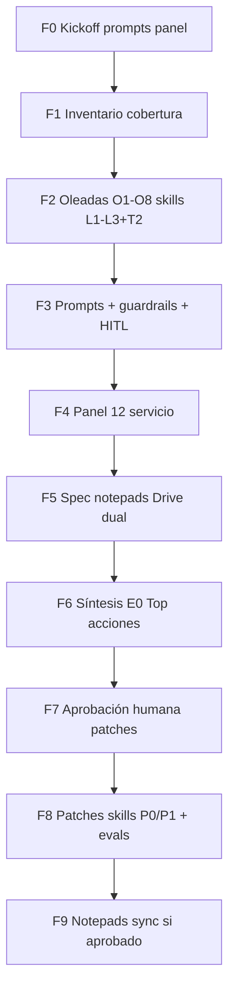

# Plan congelado — Inspección config + notepads (abogados + técnicos)

**Estado:** `EN_EJECUCION` (F1–F4/O1–O2 hechos 2026-08-05; ver `INFORME_INSPECCION_CONFIG_NOTEPADS.md`).  
**Track por agente (siguiente):** [`PLAN_ANALISIS_PROMPTS_SKILLS_HERRAMIENTAS.md`](PLAN_ANALISIS_PROMPTS_SKILLS_HERRAMIENTAS.md) — deep-dive A0–A8 (absorbe O1–O2; continúa O3–O8 dentro de cada agente).  
**Ejecución de auditoría/patches:** `aprobado, ejecuta A0` / `A1`… / `H-xxx` / `A-…`.  
**Editor humano (E0):** Auto / Cursor (este agente).  
**Modo panel:** agentes IA personificados vía prompts de panel + E0 humano consolida.  
**Rama de trabajo sugerida:** `cursor/auditoria-prompts-skills-panel`

---

## 0) Decisiones del operador (congeladas)

| # | Pregunta | Decisión |
|---|---|---|
| 1 | Alcance | **Todo:** Panel Config (prompts/skills/guardrails/HITL/notepads) **y** Panel 12 especialistas (AppSec, 1581, SRE, claims, etc.) |
| 2 | Notepads / SoT | **Dual Drive + DB.** Carpeta Drive: [Lexiatek Shared Drive](https://drive.google.com/drive/folders/0ABOGkPnKHSC5Uk9PVA) (`FOLDER_ID=0ABOGkPnKHSC5Uk9PVA`). Postgres `Expediente.bitacora` + espejo MD en Drive (extender modelo actual de `docs/operaciones/GOOGLE_DRIVE_LEXIATEK.md`) |
| 3 | Profundidad | **Todo profundo:** 10 agentes + **81 skills** + guardrails g1–g10 + I/O/T por agente + HITL + panel servicio |
| 4 | Quién audita | Agentes IA personificados (prompts del panel) + **E0 humano** |
| 5 | Entregable de plan | Este documento (`docs/canon/PLAN_INSPECCION_CONFIG_NOTEPADS.md`) |
| 6 | Prioridad P0 de la semana | **Mejorar calidad jurídica y procedural knowledge de skills** (antes que cerrar notepads Drive end-to-end) |
| 7 | Caso piloto | Casos de **`config/evals/agent_eval_cases.json`** (sintéticos); no expediente real |

### Prioridad de conflictos (E0)

1. Calidad jurídica / procedural knowledge en skills (decisión #6)  
2. Seguridad jurídica (no inventar, HITL, alcance penal-víctimas)  
3. Cumplimiento 1581 (incl. notas Drive)  
4. Autonomía indebida de la IA  
5. Reliability / claims / FinOps  

---

## 1) Objetivo

Auditar y proponer mejoras en:

- prompts (`agente/prompts/`)
- skills (`agente/skills/*/SKILL.md`, registry `skill_catalog.py`)
- guardrails (`config/guardrails/g*.md` + `agents/{id}/{input,output,tools}.md`)
- HITL (planes, drafts, Slack)
- notepads por agente (contrato MD + sync Drive↔DB)
- superficie de servicio (panel 12)

Toda recomendación de mejora jurídica/procedural debe citar **KB oficial** (`agente/conocimiento/*`, playbooks, guía/requisitos) o marcar `[PENDIENTE DE VERIFICAR]`.  
No inventar normas, radicados ni jurisprudencia.

---

## 2) Fuentes canónicas (inyectar al panel)

| Rol | Path |
|---|---|
| Guía | `agente/fuente/GUIA_PROYECTO_AGENTE_JURIDICO.md` |
| Requisitos | `agente/requisitos/requisitos_asistente.json` |
| Estado | `agente/fases/ESTADO_PROYECTO.md` |
| Prompt panel skills | `docs/canon/PROMPT_REVISION_PROMPTS_Y_SKILLS.md` |
| Prompt panel servicio | `docs/canon/PROMPT_PANEL_12_ESPECIALISTAS_SERVICIO_WEB.md` |
| Checklist 1 día | `docs/canon/CHECKLIST_AUDITORIA_1_DIA_SERVICIO_WEB.md` |
| Informe previo prompts | `docs/canon/INFORME_AUDITORIA_PROMPTS_SKILLS.md` |
| Informe previo servicio | `docs/canon/INFORME_AUDITORIA_12_ESPECIALISTAS_SERVICIO_WEB.md` |
| Auditoría Gerente (G01–G09 hecho) | `docs/auditoria/AUDITORIA_GERENTE_Y_AGENTES.md` |
| Drive bitácora | `docs/operaciones/GOOGLE_DRIVE_LEXIATEK.md` |
| Cumplimiento | `docs/operaciones/RUNBOOK_CUMPLIMIENTO_1581.md` |
| Evals piloto | `config/evals/agent_eval_cases.json` |

### Anti-patrones (rechazar siempre)

- Confundir “hay un MD” con control enforceable.  
- Reactivar tutela / WhatsApp / IDs legacy de agentes.  
- Big-bang estético de 81 skills sin cambio de contrato.  
- Prometer abogado autónomo.  
- Escribir secretos o PII real en Drive de prueba.  
- Reabrir G01–G09 salvo regresión demostrada.

---

## 3) Roster del panel (personas IA)

### Bloque A — Config jurídica / prompts / skills (prioridad #6)

| ID | Persona | Pregunta exclusiva |
|---|---|---|
| **E0** | Editor humano | ¿Qué se ejecuta y en qué orden? |
| **L1** | Abogado penal-víctimas CO (906) | ¿El skill/prompt produce salida litigable y no inventa derecho? |
| **L2** | Litigante representación víctimas | ¿Protege intereses de la víctima y evita revictimización? |
| **L3** | Ética + HITL jurídico | ¿Qué debe pasar por plan HITL antes de redactar/actuar? |
| **T1** | Prompt engineer (Agents SDK) | ¿Instrucciones slim, few-shots, anti-drift, `config-version`? |
| **T2** | Arquitecto multi-agente | ¿Ownership, `as_tool`, sin solape, IDs canónicos? |
| **T3** | Guardrails I/O/T | ¿Capas cableadas y coherentes con skills? |
| **T4** | HITL / drafts / Slack | ¿Plan → draft → aprobación sin fugas 1581? |
| **T5** | QA / evals | ¿Qué regresión falta en `agent_eval_cases.json`? |
| **T6** | Contexto & notepads | ¿Contrato MD por agente + sync Drive/DB? |
| **T7** | Cumplimiento 1581 en notas | ¿PII, retención, ARCO sobre notepads? |

Usa rúbricas y plantillas de `PROMPT_REVISION_PROMPTS_Y_SKILLS.md` §§3–4.

### Bloque B — Servicio (en paralelo / tras oleada skills)

| ID | Persona | Lente |
|---|---|---|
| **S1–S12** | Panel 12 (`PROMPT_PANEL_12…`) | AppSec, 1581, IA+HITL, arch, SRE, QA, UX, claims, ética, FinOps, obs, supply chain |

Usa checklist `CHECKLIST_AUDITORIA_1_DIA_SERVICIO_WEB.md`.

---

## 4) Superficies a inspeccionar (inventario profundo)

### 4.1 Agentes (10)

`coordinador_caso`, `analista_cronologia_hechos`, `analista_responsabilidad_tipicidad`, `analista_ruta_procesal`, `analista_representacion_victimas`, `analista_evidencia`, `analista_audiencias`, `redactor_documentos_juridicos`, `analista_seguimiento_procesal`, `analista_calidad_juridica`.

Por cada uno: prompt · guardrails I/O/T · skills owned/MOVE · contrato de notas · evals que lo tocan.

### 4.2 Skills (81 — pasada profunda)

Todas las carpetas bajo `agente/skills/*/SKILL.md`.

**Oleadas (orden de la semana — calidad jurídica primero):**

| Oleada | Foco procedural/jurídico | Skills (ejemplos / grupos) |
|---|---|---|
| **O1** | Tipicidad / dolo / autoría / agravantes | `identificar_conductas_punibles_*`, `descomponer_elementos_tipo_penal`, `analizar_dolo_*`, `analizar_autoria_*`, `detectar_agravantes_*`, `detectar_riesgos_atipicidad`, `generar_preguntas_tipicidad`, `mapear_tipo_penal_*` |
| **O2** | Ruta Ley 906 / términos / impulso | `identificar_etapa_procesal_ley906`, `crear_ruta_procesal_*`, `controlar_terminos_*`, `evaluar_oportunidad_*`, `detectar_riesgos_procesales`, `detectar_inactividad_*`, `redactar_solicitud_impulso_*`, `evaluar_solicitud_fiscalia_*` |
| **O3** | Hechos / cronología / contradicciones | `extraer_hechos_*`, `construir_cronologia_*`, `detectar_vacios_*`, `detectar_contradicciones_*`, `clasificar_fuente_*`, `crear_matriz_hecho_fuente`, `controlar_separacion_hecho_inferencia` |
| **O4** | Evidencia / prueba | `inventariar_evidencia`, `clasificar_tipo_prueba`, `construir_matriz_hecho_prueba`, `detectar_brechas_*`, `evaluar_suficiencia_*`, `crear_plan_recaudo_*`, `preservar_evidencia_*`, `controlar_cadena_custodia_*`, `alinear_estrategia_prueba_*` |
| **O5** | Representación víctima | `identificar_intereses_*`, `analizar_derechos_victima`, `construir_teoria_caso_*`, `mapear_actuaciones_*`, `priorizar_objetivos_*`, `analizar_intervencion_*`, `analizar_enfoque_diferencial`, `controlar_no_revictimizacion`, `detectar_riesgo_revictimizacion`, `evaluar_dano_*` |
| **O6** | Audiencias | `identificar_objetivo_audiencia`, `preparar_preguntas_*`, `preparar_guion_*`, `preparar_solicitudes_orales`, `crear_checklist_previo_*`, `simular_escenarios_*`, `detectar_riesgos_audiencia`, `controlar_audiencias`, `preparar_contraargumentos` |
| **O7** | Redacción / calidad / citas | `redactar_*`, `estructurar_hechos_fundamentos_*`, `verificar_citas_*`, `verificar_jurisprudencia`, `detectar_alucinaciones_*`, `clasificar_aprobacion_*`, `controlar_tono_*`, `revisar_coherencia_*` |
| **O8** | Seguimiento / gerencia POC | `monitorear_radicado`, `registrar_actuacion_*`, `seguimiento_documentos_*`, `crear_reporte_*`, `clasificar_tarea_*`, `gestionar_faltantes_*`, `detectar_urgencia_*`, `marcar_pendientes_*`, `actualizar_tareas_*`, `generar_alertas_*`, `evaluar_derecho_peticion`, resto |

Cada skill: scorecard ≥4 en ejes de `PROMPT_REVISION…` §3.1; hallazgos con cita KB.

### 4.3 Guardrails

- Globales `g1`…`g10`  
- Por agente: `input.md` / `output.md` / `tools.md`  
- Cableado SDK + tests `test_guardrails_iot_*`

### 4.4 HITL

- `requires_execution_plan` / `plan_templates`  
- Drafts + bandeja firma + Slack gate  
- High-risk: memoriales / redacción (chat sin redactor libre)

### 4.5 Notepads (Diseño — implementación tras skills P0)

**Modelo SoT (decisión #2, alineado a ops existente):**

- **Autorativo:** Postgres (`Expediente.bitacora` + `notas_trabajo` por especialista).  
- **Espejo:** Google Drive Shared Drive `0ABOGkPnKHSC5Uk9PVA`.  
- Código base hoy: `src/services/bitacora.py` → `src/services/drive_bitacora.py` (solo `bitacora.md` del Gerente).

**Estructura Drive objetivo:**

```text
Lexiatek/   # folder 0ABOGkPnKHSC5Uk9PVA
  casos/
    <caso_id_sanitizado>/
      bitacora.md                 # Gerente (ya existe)
      notepads/
        coordinador_caso.md       # = bitácora maestra o índice
        analista_cronologia_hechos.md
        analista_responsabilidad_tipicidad.md
        … (1 MD por agent_id)
```

**Contrato mínimo de cada notepad MD:**

1. Metadatos: `caso_id`, `agent_id`, `updated_at`, `eval_or_session`  
2. Hechos usados (con fuente)  
3. Inferencias (separadas)  
4. Pendientes `[PENDIENTE DE VERIFICAR]`  
5. Citas KB / normas usadas  
6. Decisiones HITL relevantes  
7. Próxima pregunta al Gerente / abogado  

**Piloto (decisión #7):** casos eval sintéticos, p. ej. `route-tipicidad`, `route-memorial`, `route-cronologia`, `route-evidencia`, `route-audiencia` — carpetas `casos/eval-<id>/`.

**1581:** solo sintético en local hasta DPA Google; ARCO Drive = fase 2 (ya documentado en ops).

---

## 5) Fases de ejecución (tras `aprobado, ejecuta`)



| Fase | Quién | Entregable | Gate |
|---|---|---|---|
| **F0** | E0 | Acta + prompts inyectados a L*/T*/S* | — |
| **F1** | T2 + T5 | Matriz agente×skill×guardrail×eval (cobertura) | Inventario completo 81 |
| **F2** | L1 L2 L3 + T2 | Hallazgos skills por oleada O1→O8 con citas KB | Scorecard; P0 primero |
| **F3** | T1 T3 T4 | Hallazgos prompts / I/O/T / HITL | Paridad catalog |
| **F4** | S1–S12 | Checklist 1 día + informe servicio | PASS/PARTIAL/FAIL |
| **F5** | T6 T7 | Spec notepads + gaps vs `drive_bitacora.py` | **En progreso** — plantillas + sync + runbook |
| **F6** | E0 | Top 15 acciones; separar skills vs servicio vs Drive | Documento síntesis |
| **F7** | Operador humano | Lista `aprobado, ejecuta H-xxx` | **Sin esto no hay patches** |
| **F8** | E0 + T5 | Edits canónicos skills/prompts + bump version + sync cursor + tests/evals | Prioridad #6 |
| **F9** | T6 | Extender sync a `notepads/{agent_id}.md`; smoke eval | Tras F8 o en paralelo si hay capacidad |

### Estimación orientativa

- F1–F2 (81 skills profundo): varios turnos / ~1–2 días efectivos de panel  
- F3–F4: 0.5–1 día  
- F5–F6: 0.5 día  
- F8: según #P0/#P1 aceptados (preferir oleadas O1–O2 primero)

---

## 6) Plantilla de hallazgo (obligatoria)

```yaml
id: H-001
severidad: P0|P1|P2
bloque: skills|prompts|guardrails|hitl|notepads|servicio
archivo: agente/skills/.../SKILL.md
experto: L1
veredicto: PASS|PARTIAL|FAIL
evidencia_repo: "ruta + cita corta"
evidencia_kb: "agente/conocimiento/... o [PENDIENTE DE VERIFICAR]"
impacto: "qué falla en calidad jurídica/procedural"
fix_propuesto: "antes → después (contrato)"
porque: "1–2 oraciones"
evals_a_ampliar: ["route-tipicidad"]  # si aplica
```

### Criterio de mejora skill (P0/P1 aceptable)

Solo si mejora **calidad jurídica o procedural knowledge** (steps verificables, inputs/outputs, no invención, alineación Ley 906 / víctima, `No duplicar`, tools reales).  
Estética sola = P2 / diferir.

---

## 7) Caso piloto (evals)

Usar mensajes y destinos de `config/evals/agent_eval_cases.json` (versión documento ≥ 3.1), como mínimo:

| Eval id | Para probar |
|---|---|
| `route-tipicidad` | Notepad tipicidad + skills O1 |
| `route-cronologia` | Notepad hechos + O3 |
| `route-evidencia` | Notepad evidencia + O4 |
| `route-audiencia` | Notepad audiencias + O6 |
| `route-memorial` | HITL plan_required + O7 |
| `route-other-team-scope` | OOS / no notepad de tutela |

Al ejecutar F9: carpeta Drive `casos/eval-<id>/` con `bitacora.md` + `notepads/*.md` sintéticos.

---

## 8) Criterio de cierre de la inspección

La inspección (F0–F6) se declara **cerrada** cuando exista:

1. Inventario 81 skills + 10 agentes con veredicto.  
2. Hallazgos priorizados con citas KB (o pendiente).  
3. Top 15 acciones E0.  
4. Spec notepads Drive+DB alineada a folder `0ABOGkPnKHSC5Uk9PVA`.  
5. Dictamen panel 12 (LISTO / LISTO CONDICIONAL / NO LISTO).  

La **mejora** (F8) solo corre ítems con `aprobado, ejecuta`.  
Éxito de la semana = oleadas **O1–O2** (y O3 si cabe) parcheadas + evals verdes — no hace falta cerrar Drive notepads en el mismo sprint (decisión #6).

---

## 9) Cómo lanzar la ejecución

Mensaje del operador:

```text
aprobado, ejecuta F1-F2
```

o por oleada:

```text
aprobado, ejecuta O1
```

E0 entonces:

1. Inyecta prompts de panel a cada persona IA.  
2. Produce hallazgos en un informe vivo (p. ej. `docs/canon/INFORME_INSPECCION_CONFIG_NOTEPADS.md`).  
3. No edita skills hasta `aprobado, ejecuta H-xxx` (o lista).

---

## 10) Referencias cruzadas

- **Análisis profundo por agente (prompts + skills + tools, dual técnico/jurídico):** [`PLAN_ANALISIS_PROMPTS_SKILLS_HERRAMIENTAS.md`](PLAN_ANALISIS_PROMPTS_SKILLS_HERRAMIENTAS.md) + prompt [`PROMPT_PANEL_ANALISIS_PROMPTS_SKILLS.md`](PROMPT_PANEL_ANALISIS_PROMPTS_SKILLS.md) — absorbe O1–O2/F3 y continúa A0–A8; no duplicar inventario F1.  
- Antes/ahora: `docs/canon/ANTES_Y_AHORA_PROMPTS_SKILLS.md`  
- Reporte histórico (obsoleto parcial): `docs/canon/reporte-detallado-agentes-prompts-skills-rag.md`  
- Drive ops: `docs/operaciones/GOOGLE_DRIVE_LEXIATEK.md`  
- Código Drive: `src/services/drive_bitacora.py`
