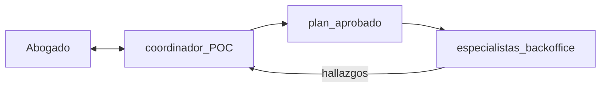

# Flujos frecuentes penal-víctimas (Colombia) — orquestación sin handoffs peer

> Decisión de arquitectura: **no** hay handoffs terminales entre especialistas. El coordinador (POC) orquesta tools/planes; el abogado ve una sola voz.

## Fuentes

| Fuente | Uso |
|--------|-----|
| CEJ, *SPOA 2025* (datos Fiscalía / CSJ / INPEC) — [PDF](https://cej.org.co/wp-content/uploads/2025/10/Presentacion-informe-SPOA-2025.pdf) | Volumen, tipologías, etapa, archivo, abreviado |
| [Estadísticas SPOA — Fiscalía](https://www.fiscalia.gov.co/colombia/gestion/estadisticas/) | Portal oficial de noticias criminales Ley 906 |
| Ley 906 de 2004 arts. 11, 134, 137 — [Función Pública](https://www.funcionpublica.gov.co/eva/gestornormativo/norma.php?i=14787) | Derechos e intervención de la víctima |
| Corte Constitucional, C-473/16 (reiteración) | Alcance de facultades de la víctima |
| MinJusticia, Boletín VIF 2024 — [PDF](https://repositorio.minjusticia.gov.co/politica-criminal/Biblioteca/Boletin%20de%20Violencia%20Intrafamiliar%202024.pdf) | Violencia intrafamiliar como flujo prioritario |
| DANE (citado en informe CEJ) | Subdenuncia ~7/10 en hurto/lesiones/extorsión |

## Hallazgos 2024 (síntesis)

| Hallazgo | Implicación operativa |
|----------|----------------------|
| ~1,87 M noticias criminales Ley 906 | Flujos repetibles > diálogo multi-agente |
| 40,3% patrimonio (hurto, estafa, extorsión…) | Caso modal: hechos + tipicidad + prueba + impulso |
| 11,5% familia (VIF, inasistencia…) | Víctimas + tipicidad + protección + no revictimización |
| 10,7% vida e integridad | Cronología + tipicidad + evidencia |
| 93,2% activos en **indagación** | Trabajo típico *pre-juicio* |
| 69,1% procedimiento **abreviado** | Querella / audiencia concentrada + seguimiento |
| ~82% evacuaciones por **archivo** | Valor alto: anti-archivo, impulso, tutela por dilación |

## Veredicto de encadenamiento

- **Sí:** pipelines orquestados por el POC (`Agent.as_tool` + `plan_executor` con `depends_on`).
- **No:** `handoff()` peer entre especialistas (rompe voz única, HITL y auditoría).

Implementación de plantillas: `src/agents/plan_templates.py`.

## Mapa caso → cadena de backoffice

| Caso | Plantilla (`template_kind`) | Cadena (orden) | Producto al abogado |
|------|----------------------------|----------------|---------------------|
| A. Impulso / anti-archivo en indagación | `indagacion_impulso` | cronología → tipicidad → ruta906 → evidencia → redacción → seguimiento → calidad | Memorial/solicitud + alertas |
| B. Querella / abreviado | `querella_abreviado` | ruta906 → tipicidad → redacción → seguimiento | Pieza querellable + plan abreviado |
| C. VIF / protección | `vif_proteccion` | víctimas → tipicidad → evidencia → audiencias → calidad | Estrategia + solicitudes art. 134 |
| D. Dilación / tutela | `tutela` (existente) | tutela → redacción → calidad | Evaluación + borrador HITL |
| E. Preparación audiencia | `audiencia` (existente) | audiencias → calidad | Guion + checklist |
| F. Cronología / relato | `cronologia` (existente) | cronología → calidad | Línea de tiempo trazable |

