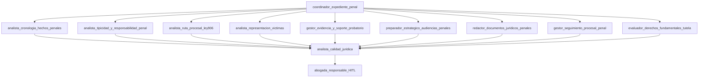

# Guia de aprobacion juridica de la firma virtual penal-victimas

## 1) Proposito del documento

Este documento esta disenado para aprobacion de la abogada lider. Explica:

- arquitectura operativa del sistema agentico penal-victimas,
- rol y alcance de cada agente,
- skills que usa cada rol para producir analisis y borradores,
- ejemplos de conversaciones reales con su flujo interno,
- puntos de control juridico que permanecen en cabeza de la abogada.

## 2) Alcance, limites y regla profesional

### Alcance funcional

- Jurisdiccion: Colombia.
- Materia: penal con enfoque en representacion de victimas.
- Cobertura operativa: intake factual, tipicidad preliminar, ruta procesal Ley 906, estrategia de victima, evidencia, audiencias, redaccion, seguimiento, tutela y control de calidad.

### Limites no negociables

- El sistema no sustituye criterio profesional ni firma del abogado.
- No se inventan hechos, normas, sentencias, radicados ni autoridades.
- Toda salida externa requiere validacion humana.
- Los datos sensibles se tratan bajo principio de minimizacion y confidencialidad.

### Regla de oro

**La IA propone; la abogada revisa, ajusta y aprueba.**

## 3) Arquitectura que debe aprobar la abogada

### Lectura juridica de la arquitectura

- `coordinador_expediente_penal` administra el triage legal-operativo y evita dispersion.
- Los agentes especialistas producen trabajo modular por funcion juridica.
- `analista_calidad_juridica` opera como puerta tecnica de control previo.
- La decision final siempre recae en `abogada_responsable_HITL`.

## 4) Roles de agentes y skills que usa cada uno

> Nota: los skills listados son los activos en el catalogo atomico actual.

### 4.1 `coordinador_expediente_penal`

**Rol juridico:** direccion del expediente y enrutamiento.

**No reemplaza:** analisis de fondo por especialidad ni aprobacion final.

**Skills:**
- `clasificar_tarea_y_etapa`
- `detectar_urgencia_penal`
- `gestionar_faltantes_expediente`
- `identificar_etapa_procesal_ley906`
- `priorizar_objetivos_representacion`
- `recomendar_via_constitucional_o_alternativa`
- `actualizar_tareas_responsable`
- `detectar_vacios_factuales`
- `marcar_pendientes_verificacion`
- `clasificar_fuente_factual`
- `crear_ruta_procesal_recomendada`

### 4.2 `analista_cronologia_hechos_penales`

**Rol juridico:** depuracion factual y linea de tiempo del caso.

**No reemplaza:** calificacion penal definitiva.

**Skills:**
- `extraer_hechos_relevantes`
- `construir_cronologia_penal`
- `identificar_actores_y_roles`
- `detectar_contradicciones_factuales`
- `detectar_vacios_factuales`
- `crear_matriz_hecho_fuente`
- `generar_preguntas_aclaracion`
- `generar_preguntas_tipicidad`
- `verificar_hechos_soportados`

### 4.3 `analista_tipicidad_y_responsabilidad_penal`

**Rol juridico:** analisis sustantivo preliminar (tipicidad y responsabilidad).

**No reemplaza:** juicio del despacho sobre imputacion, acusacion o estrategia final.

**Skills:**
- `identificar_conductas_punibles_preliminares`
- `descomponer_elementos_tipo_penal`
- `mapear_tipo_penal_hecho_prueba`
- `analizar_autoria_y_participacion`
- `analizar_dolo_culpa_elemento_subjetivo`
- `detectar_agravantes_atenuantes`
- `detectar_riesgos_atipicidad`
- `generar_preguntas_tipicidad`
- `construir_matriz_hecho_prueba`

### 4.4 `analista_ruta_procesal_ley906`

**Rol juridico:** lectura procesal penal Ley 906 por etapa y oportunidad.

**No reemplaza:** seguimiento operativo diario del radicado.

**Skills:**
- `clasificar_tarea_y_etapa`
- `identificar_etapa_procesal_ley906`
- `mapear_actuaciones_posibles_victima`
- `evaluar_oportunidad_procesal`
- `controlar_terminos_procesales_preliminares`
- `analizar_intervencion_victima`
- `evaluar_solicitud_fiscalia_juez`
- `detectar_riesgos_procesales`
- `crear_ruta_procesal_recomendada`
- `detectar_inactividad_procesal`
- `generar_alertas_terminos_vencimientos`
- `preparar_solicitudes_orales`
- `redactar_recurso_o_intervencion_preliminar`

### 4.5 `analista_representacion_victimas`

**Rol juridico:** estrategia centrada en derechos e intereses de la victima.

**No reemplaza:** decision politica o reputacional del despacho sobre el caso.

**Skills:**
- `identificar_intereses_victima`
- `construir_teoria_caso_victima`
- `analizar_derechos_victima`
- `evaluar_dano_y_afectacion`
- `detectar_riesgo_revictimizacion`
- `analizar_enfoque_diferencial`
- `priorizar_objetivos_representacion`
- `alinear_estrategia_prueba_proceso`
- `mapear_actuaciones_posibles_victima`
- `crear_plan_recaudo_probatorio`
- `evaluar_suficiencia_probatoria`
- `identificar_actores_y_roles`
- `controlar_no_revictimizacion`

### 4.6 `gestor_evidencia_y_soporte_probatorio`

**Rol juridico:** gestion probatoria y brechas de soporte.

**No reemplaza:** pericia tecnica forense ni cadena de custodia certificada.

**Skills:**
- `inventariar_evidencia`
- `clasificar_tipo_prueba`
- `construir_matriz_hecho_prueba`
- `detectar_brechas_probatorias`
- `evaluar_suficiencia_probatoria`
- `preservar_evidencia_digital`
- `controlar_cadena_custodia_preliminar`
- `crear_plan_recaudo_probatorio`
- `generar_preguntas_testigos_peritos`
- `evaluar_dano_y_afectacion`
- `extraer_hechos_relevantes`
- `generar_preguntas_aclaracion`
- `mapear_tipo_penal_hecho_prueba`

### 4.7 `preparador_estrategico_audiencias_penales`

**Rol juridico:** preparacion tactica de audiencia para representacion de victimas.

**No reemplaza:** intervencion oral de la abogada en estrados.

**Skills:**
- `identificar_objetivo_audiencia`
- `crear_resumen_ejecutivo_litigante`
- `preparar_guion_intervencion_oral`
- `preparar_solicitudes_orales`
- `preparar_preguntas_audiencia`
- `preparar_contraargumentos`
- `crear_checklist_previo_audiencia`
- `simular_escenarios_audiencia`
- `detectar_riesgos_audiencia`
- `construir_cronologia_penal`
- `construir_matriz_hecho_prueba`
- `construir_teoria_caso_victima`
- `analizar_intervencion_victima`
- `controlar_audiencias`
- `generar_preguntas_testigos_peritos`
- `detectar_riesgo_revictimizacion`

### 4.8 `redactor_documentos_juridicos_penales`

**Rol juridico:** redaccion tecnica de piezas juridicas revisables.

**No reemplaza:** criterio de firma y aprobacion de radicacion.

**Skills:**
- `redactar_memorial_penal`
- `redactar_solicitud_impulso_procesal`
- `redactar_ampliacion_denuncia`
- `redactar_derecho_peticion_penal`
- `redactar_recurso_o_intervencion_preliminar`
- `redactar_tutela_penal_preliminar`
- `estructurar_hechos_fundamentos_solicitudes`
- `controlar_tono_juridico_documento`
- `controlar_tono_riesgo_reputacional`
- `controlar_separacion_hecho_inferencia`
- `extraer_hechos_relevantes`
- `evaluar_derecho_peticion`
- `evaluar_solicitud_fiscalia_juez`
- `preparar_borrador_tutela_preliminar`
- `verificar_citas_normativas`
- `verificar_hechos_soportados`

### 4.9 `gestor_seguimiento_procesal_penal`

**Rol juridico:** dependencia judicial digital y continuidad operativa.

**No reemplaza:** lectura juridica de fondo de la actuacion.

**Skills:**
- `registrar_actuacion_procesal`
- `monitorear_radicado`
- `controlar_audiencias`
- `generar_alertas_terminos_vencimientos`
- `seguimiento_documentos_radicados`
- `crear_reporte_estado_caso`
- `detectar_inactividad_procesal`
- `actualizar_tareas_responsable`
- `preparar_resumen_operativo_cliente`
- `controlar_terminos_procesales_preliminares`
- `crear_checklist_previo_audiencia`
- `detectar_urgencia_penal`

### 4.10 `evaluador_derechos_fundamentales_tutela`

**Rol juridico:** filtro constitucional para definir procedencia de tutela y alternativas.

**No reemplaza:** decision final de litigio constitucional.

**Skills:**
- `identificar_derecho_fundamental_afectado`
- `evaluar_procedencia_tutela`
- `analizar_perjuicio_irremediable`
- `revisar_mecanismos_ordinarios`
- `crear_matriz_hecho_derecho_fundamental`
- `evaluar_derecho_peticion`
- `preparar_borrador_tutela_preliminar`
- `detectar_riesgo_improcedencia_tutela`
- `recomendar_via_constitucional_o_alternativa`
- `analizar_derechos_victima`
- `analizar_enfoque_diferencial`
- `redactar_derecho_peticion_penal`
- `redactar_tutela_penal_preliminar`

### 4.11 `analista_calidad_juridica`

**Rol juridico:** control de calidad legal antes de salida externa.

**No reemplaza:** responsabilidad profesional de la abogada.

**Skills:**
- `verificar_hechos_soportados`
- `verificar_citas_normativas`
- `verificar_jurisprudencia`
- `detectar_alucinaciones_legales`
- `controlar_separacion_hecho_inferencia`
- `controlar_confidencialidad_datos_sensibles`
- `controlar_tono_riesgo_reputacional`
- `controlar_tono_juridico_documento`
- `controlar_no_revictimizacion`
- `revisar_coherencia_estrategica`
- `clasificar_aprobacion_juridica`
- `detectar_riesgo_revictimizacion`
- `detectar_riesgos_procesales`
- `detectar_riesgos_audiencia`
- `detectar_riesgos_atipicidad`
- `detectar_brechas_probatorias`
- `detectar_contradicciones_factuales`
- `detectar_riesgo_improcedencia_tutela`
- `detectar_urgencia_penal`
- `evaluar_oportunidad_procesal`
- `evaluar_procedencia_tutela`
- `mapear_tipo_penal_hecho_prueba`
- `preparar_resumen_operativo_cliente`
- `alinear_estrategia_prueba_proceso`
- `crear_matriz_hecho_fuente`
- `controlar_cadena_custodia_preliminar`

## 5) Flujos de conversacion con ejemplos juridicos

## 5.1 Flujo A: apertura de caso y cronologia inicial

**Escenario:** victima reporta hechos de violencia y pide orientacion inmediata.

**Conversacion ejemplo (interna):**

- **Abogada:** "Tengo nueva cliente victima de amenazas. Necesito ordenar hechos, riesgo y proxima actuacion."
- **Sistema:** "Para apertura penal-victimas confirmeme: fecha de ultimo hecho, autoridad que conocio, radicado (si existe), testigos y soportes iniciales."
- **Abogada:** "Ultimo hecho 24/06, sin radicado, hay chat y dos testigos."
- **Sistema:** "Genero cronologia preliminar, vacios factuales y ruta inicial de denuncia ampliada para revision."

**Cadena de agentes y skills:**

1. `coordinador_expediente_penal`
   - `clasificar_tarea_y_etapa`
   - `detectar_urgencia_penal`
   - `gestionar_faltantes_expediente`
2. `analista_cronologia_hechos_penales`
   - `extraer_hechos_relevantes`
   - `construir_cronologia_penal`
   - `detectar_vacios_factuales`
3. `analista_representacion_victimas`
   - `identificar_intereses_victima`
   - `priorizar_objetivos_representacion`

**Salida esperada para aprobacion:**

- cronologia con fuentes,
- preguntas de aclaracion no inductivas,
- ruta preliminar de actuacion,
- bandera de revision humana obligatoria.

## 5.2 Flujo B: analisis de tipicidad preliminar

**Escenario:** se requiere valorar posibles conductas punibles antes de estrategia de litigio.

**Conversacion ejemplo (interna):**

- **Abogada:** "Con estos hechos, necesito analisis preliminar de tipicidad y riesgos de atipicidad."
- **Sistema:** "Realizo mapeo hecho-elemento-tipo y le marco vacios probatorios que pueden debilitar imputacion."
- **Abogada:** "Incluya posibles agravantes y preguntas para completar elemento subjetivo."
- **Sistema:** "Entrego matriz de tipicidad preliminar y checklist de informacion faltante."

**Cadena de agentes y skills:**

1. `analista_tipicidad_y_responsabilidad_penal`
   - `identificar_conductas_punibles_preliminares`
   - `descomponer_elementos_tipo_penal`
   - `mapear_tipo_penal_hecho_prueba`
   - `detectar_riesgos_atipicidad`
2. `gestor_evidencia_y_soporte_probatorio`
   - `detectar_brechas_probatorias`
3. `analista_calidad_juridica`
   - `verificar_hechos_soportados`

**Salida esperada para aprobacion:**

- hipotesis penales preliminares (no conclusivas),
- matriz elemento-hecho-prueba,
- riesgos de atipicidad y acciones de mitigacion.

## 5.3 Flujo C: preparacion de audiencia penal

**Escenario:** audiencia proxima y se requiere preparacion tactica de intervencion.

**Conversacion ejemplo (interna):**

- **Abogada:** "Manana audiencia preliminar. Necesito guion de intervencion y solicitudes orales."
- **Sistema:** "Confirmo tipo de audiencia, objetivo de victima, riesgos procesales y pruebas disponibles."
- **Abogada:** "Priorice proteccion de la victima y evite preguntas revictimizantes."
- **Sistema:** "Entrego resumen ejecutivo, guion, contraargumentos esperados y checklist previo."

**Cadena de agentes y skills:**

1. `analista_ruta_procesal_ley906`
   - `identificar_etapa_procesal_ley906`
   - `analizar_intervencion_victima`
2. `preparador_estrategico_audiencias_penales`
   - `identificar_objetivo_audiencia`
   - `preparar_guion_intervencion_oral`
   - `preparar_solicitudes_orales`
   - `detectar_riesgos_audiencia`
3. `analista_calidad_juridica`
   - `controlar_no_revictimizacion`
   - `revisar_coherencia_estrategica`

**Salida esperada para aprobacion:**

- guion de audiencia usable,
- checklist operativo,
- alertas juridicas y reputacionales.

## 5.4 Flujo D: redaccion de memorial de impulso procesal

**Escenario:** se debe presentar memorial con fundamento y peticiones precisas.

**Conversacion ejemplo (interna):**

- **Abogada:** "Prepare memorial de impulso procesal por inactividad, con solicitud concreta."
- **Sistema:** "Solicito validar radicado, autoridad competente, ultima actuacion y anexos soporte."
- **Abogada:** "Radicado confirmado y ultima actuacion hace 4 meses."
- **Sistema:** "Genero borrador estructurado con hechos, fundamentos y peticiones para su revision."

**Cadena de agentes y skills:**

1. `redactor_documentos_juridicos_penales`
   - `redactar_solicitud_impulso_procesal`
   - `estructurar_hechos_fundamentos_solicitudes`
   - `controlar_tono_juridico_documento`
2. `analista_calidad_juridica`
   - `verificar_citas_normativas`
   - `controlar_separacion_hecho_inferencia`
   - `clasificar_aprobacion_juridica`

**Salida esperada para aprobacion:**

- borrador listo para ajuste final,
- fuentes verificadas,
- pendientes de validacion marcados.

## 5.5 Flujo E: evaluacion de tutela relacionada con proceso penal

**Escenario:** posible vulneracion de derechos fundamentales por dilacion o falta de respuesta.

**Conversacion ejemplo (interna):**

- **Abogada:** "Evalua si procede tutela por afectacion del debido proceso y acceso a justicia."
- **Sistema:** "Analizo subsidiariedad, inmediatez, perjuicio irremediable y vias ordinarias activas."
- **Abogada:** "Si el riesgo de improcedencia es alto, proponga alternativa."
- **Sistema:** "Entrego concepto preliminar de procedencia y ruta recomendada (tutela o via alterna)."

**Cadena de agentes y skills:**

1. `evaluador_derechos_fundamentales_tutela`
   - `identificar_derecho_fundamental_afectado`
   - `evaluar_procedencia_tutela`
   - `detectar_riesgo_improcedencia_tutela`
   - `recomendar_via_constitucional_o_alternativa`
2. `redactor_documentos_juridicos_penales` (si procede)
   - `redactar_tutela_penal_preliminar`
3. `analista_calidad_juridica`
   - `verificar_citas_normativas`
   - `clasificar_aprobacion_juridica`

**Salida esperada para aprobacion:**

- matriz de procedencia,
- riesgos de improcedencia,
- borrador preliminar (si aplica).

## 5.6 Flujo F: seguimiento semanal y comunicacion al cliente

**Escenario:** reporte periodico del estado del caso.

**Conversacion ejemplo (interna):**

- **Abogada:** "Necesito reporte semanal del radicado para cliente."
- **Sistema:** "Consolido ultima actuacion, eventos proximos, terminos y pendientes del despacho."
- **Abogada:** "El resumen para cliente debe ser claro, sin exponer estrategia sensible."
- **Sistema:** "Entrego version operativa para cliente y version tecnica interna."

**Cadena de agentes y skills:**

1. `gestor_seguimiento_procesal_penal`
   - `monitorear_radicado`
   - `registrar_actuacion_procesal`
   - `crear_reporte_estado_caso`
   - `preparar_resumen_operativo_cliente`
2. `analista_calidad_juridica`
   - `controlar_confidencialidad_datos_sensibles`
   - `controlar_tono_riesgo_reputacional`

**Salida esperada para aprobacion:**

- reporte interno completo,
- version cliente depurada,
- alertas y tareas de seguimiento.

## 6) Puntos de control que competen directamente a la abogada

La abogada conserva control en cinco decisiones criticas:

1. **Aprobacion de estrategia** (no automatizable).
2. **Aprobacion de toda salida externa** (cliente, autoridad, terceros).
3. **Decision de litigio constitucional** en tutela (procedencia y riesgo).
4. **Validacion de fuentes y radicados** antes de radicar o comunicar.
5. **Ajuste final de tono, tesis y pretensiones** conforme a la teoria del caso del despacho.

## 7) Matriz de decision humana (HITL)

| Tipo de salida | Puede auto-guardarse | Requiere analista_calidad_juridica | Requiere aprobacion de la abogada |
|---|---|---|---|
| Cronologia preliminar interna | Si | Recomendado | Si, antes de uso estrategico |
| Analisis de tipicidad preliminar | Si | Si | Si |
| Guion de audiencia | No | Si | Si |
| Memorial/recurso/derecho de peticion | No | Si | Si (obligatorio) |
| Tutela preliminar | No | Si | Si (obligatorio reforzado) |
| Reporte a cliente | No | Si | Si |

## 8) Checklist de aprobacion para la abogada lider

- [ ] El alcance penal-victimas refleja la operacion real del despacho.
- [ ] Los 11 roles agenticos representan funciones juridicas utiles y no redundantes.
- [ ] Los skills por agente son suficientes para soportar trabajo diario.
- [ ] La secuencia de flujos coincide con la practica procesal bajo Ley 906.
- [ ] La gobernanza HITL preserva responsabilidad profesional y reserva.
- [ ] El sistema no habilita salidas externas sin validacion juridica humana.

## 9) Recomendacion de aprobacion operativa

Aprobar bajo modalidad: **"aprobacion condicionada con control humano obligatorio"**, con las siguientes condiciones:

- mantenimiento de guardrails activos,
- auditoria de fuentes y trazabilidad por turno,
- revision semanal de calidad en casos piloto,
- no uso externo sin aprobacion expresa de la abogada responsable.

Con este esquema, la firma virtual aporta productividad y consistencia tecnica sin comprometer la direccion juridica del despacho.
