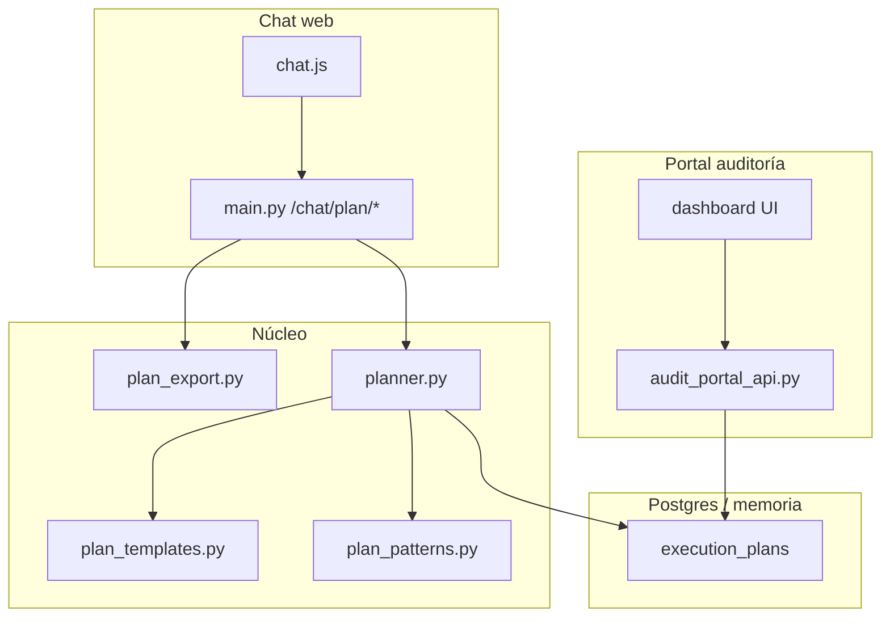

# Plan Fase 3 — Producto y auditoría (planes de ejecución)

> **Estado:** en implementación · Fases 1–2 completadas

## Objetivo

Cerrar el ciclo **plan → aprobación → ejecución → trazabilidad** para el despacho: plantillas por tipo de consulta, dashboard en el portal de auditoría y export Markdown del plan + I/O.

## Alcance (4 entregables)

| # | Entregable | Descripción | Criterio de éxito |
|---|------------|-------------|-------------------|
| 3.1 | **Plantillas de plan** | Pasos predefinidos para cronología, tutela y audiencia | `template_kind` en plan; pasos alineados al especialista |
| 3.2 | **Recordar patrón** | Al aprobar, opción de reutilizar estructura en la misma sesión | Checkbox en UI; siguiente plan en sesión hereda pasos |
| 3.3 | **Dashboard audit portal** | KPIs aprobados vs ejecutados + tabla reciente | `GET /api/audit/execution-plans/dashboard` + UI |
| 3.4 | **Export MD** | Markdown del plan + informes I/O por caso | `GET /chat/plan/{id}/export.md` + enlace en chat y portal |

## Fuera de alcance (Fase 3)

- Login individual por abogado
- Redis / multi-worker SSE
- Plantillas editables por UI (solo catálogo en código)
- REQ-029…042 (especialidades agentes — roadmap histórico distinto)

## Arquitectura



## Implementación por bloques

### Bloque A — Plantillas (`src/agents/plan_templates.py`)

- `classify_plan_template(message) -> cronologia | tutela | audiencia | generico`
- Reutiliza regex de `runner.py` (tutela, audiencia, cronología).
- `build_templated_steps(kind, destination_agent, message) -> list[PlanStep]`
- Cada plantilla añade pasos explícitos (ej. tutela: evaluación constitucional → borrador → calidad).

### Bloque B — Patrones de sesión (`src/agents/plan_patterns.py`)

- Memoria in-process por `session_id` (paridad con rate limit / SSE broker).
- `remember_from_plan(session_id, plan)` al aprobar con `remember_pattern=true`.
- `apply_session_pattern(session_id, message)` devuelve pasos si hay patrón guardado.

### Bloque C — Export MD (`src/agents/plan_export.py`)

- `render_plan_markdown(plan, io_reports, trace_summary) -> str`
- Incluye: objetivo, pasos, estado, informes I/O, timestamps.
- Sin datos sensibles completos (previews ya redactados en SSE).

### Bloque D — Persistencia y API

- `list_execution_plans(limit, status?)` y `execution_plan_stats()` en repositorio.
- `GET /chat/plan/{id}/export.md` (auth web, ownership).
- `GET /api/audit/execution-plans/dashboard` (auth auditoría).
- `GET /api/audit/execution-plans/{id}/export.md` (auth auditoría).

### Bloque E — UI

- **chat.js:** badge plantilla, checkbox «Recordar patrón», enlace export tras `plan_done`.
- **audit-portal:** sección «Planes de ejecución» con KPIs y tabla + export.

### Bloque F — Tests

- `tests/test_fase3_plan_product.py`: plantillas, patrón, export MD, dashboard API.

## Orden de ejecución

1. Bloques A + B + esquema `template_kind`
2. Integrar en `planner.py` y approve con `remember_pattern`
3. Bloque C + endpoints export
4. Bloque D stats + audit API
5. Bloque E UI
6. Bloque F tests + actualizar `roadmap-fases-plan-ejecucion.md`

## Verificación

```bash
pytest tests/test_fase3_plan_product.py tests/test_execution_plan.py -v
pytest tests/ -q
```

Smoke manual:

1. Consulta «cronología de hechos» → plan con plantilla `cronologia`
2. Aprobar con «Recordar patrón» → segunda consulta similar reutiliza estructura
3. Tras ejecución → descargar export `.md`
4. Portal `/auditoria/` → dashboard con conteos y export
