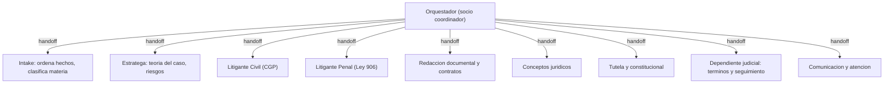

# Plan local-first: firma virtual del abogado experto (dev == prod)

> **Estado 2026-06-29:** Fase A ✅ · Fase B ✅ (mayoría) · Ver detalle en `agente/fases/ESTADO_PROYECTO.md`

Estrategia: como no hay Postgres local, **primero** construimos todo lo que es **sin estado** y por tanto idéntico en local y en Render (Fase A): la **persona del abogado experto** y la **firma de agentes con sus skills**. La **persistencia y servicios con estado** (Postgres/pgvector, HITL Slack, RAG, plazos) se hacen después (Fase B), con paridad garantizada vía **Docker** local. Regla inmutable: la IA propone, el abogado aprueba; nunca inventa normas, sentencias ni radicados.

## 0. Por qué esto da paridad dev == prod

- La capa de agentes (OpenAI Agents SDK + prompts markdown + tools que leen la KB) **no tiene base de datos**: corre igual en local y en Render (Docker, `branch: main`).
- Lo único con estado hoy son `session_store` y `trace_store`, ya **en memoria** y equivalentes en ambos lados (`src/gateway/session.py`, `src/gateway/trace.py`).
- El modelo se fija por variable de entorno `OPENAI_MODEL` idéntica en dev y en `render.yaml`: mismo comportamiento.
- Resultado: Fase A es dev==prod **por construcción**, sin instalar Postgres.

---

# FASE A — Local, sin estado (lo que hacemos ahora)

## A.1 Personificar al experto (PRIMERO)

Reescribir el prompt de sistema como un **único abogado colombiano senior**, no como "fases":
- Identidad (REQ-001..003): ~5+ años de experiencia, criterio estratégico, redacción jurídica técnica, tono formal y accesible.
- Áreas (REQ-004..011): civil/contractual, familia, societario, penal, consumidor, comercial, laboral.
- Conciencia procesal: razona según la **etapa** del proceso (civil CGP / penal Ley 906) y los términos.
- Guardrails de persona: no inventa fuentes; si falta información crítica, la pide; toda salida es borrador para revisión.

Archivos: unificar `agente/prompts/sistema-fase-0.md` y `agente/prompts/sistema-fase-1.md` en un único `agente/prompts/sistema.md`.

## A.2 La firma virtual (roster de agentes)

Reescribir `src/agents/orchestrator.py` como una firma. Roles + litigantes por área, todos con la persona compartida:

## A.3 Skills por rol/área (todas stateless, leen la KB)

Ampliar `src/mcp/tools.py`. Cada agente recibe solo sus tools:

- **Orquestador:** `clasificar_materia`, `detectar_etapa`, handoffs.
- **Intake (REQ-012..014, 017):** `ordenar_hechos`, `solicitar_datos_faltantes`.
- **Estratega (REQ-016, 018..023, 048, 049):** `analizar_riesgos`, `construir_teoria_caso`, `clasificar_civil_penal`, `detectar_pruebas_faltantes`, `preparar_entrevista`.
- **Litigante Civil — CGP (REQ-024, 027, 028):** `redactar_demanda_civil`, `redactar_contestacion`, `proponer_excepciones`, `preparar_audiencia(372|373)`.
- **Litigante Penal — Ley 906 (REQ-023, 027, 037):** `evaluar_etapa_penal`, `preparar_audiencia_preliminar`, `solicitar_audiencia`, `preparar_interrogatorio`, `definir_postura(defensa|victima)`.
- **Redacción documental (REQ-024..028, 033..037):** `plantilla_documento(tipo)` con `output_type` estructurado.
- **Conceptos jurídicos (REQ-029..032):** `output_type=ConceptoJuridico` (cliente, problema, normas, recomendación), `indagar_normas_vigentes`.
- **Tutela (REQ-038..042):** `output_type=Tutela` (accionante/accionado, derecho vulnerado, fundamentos). El cálculo del plazo de 10 días y los recordatorios automáticos llegan en Fase B (requieren scheduler/estado); aquí solo se redacta.
- **Dependiente judicial (REQ-043..047):** estructura el seguimiento y los informes a partir de datos cargados en el chat. La vigilancia automática de términos llega en Fase B.
- **Comunicación (REQ-013, 015, 050):** `redactar_correo`, `simplificar_explicacion`.
- **Conocimiento (REQ-004..011):** `listar_areas_derecho`, `leer_area_derecho`.

## A.4 Salidas estructuradas

Modelos Pydantic con campos obligatorios para reducir alucinación de estructura: `Contrato`, `ConceptoJuridico`, `Memorial` (exige proceso, partes y radicado — REQ-034), `Tutela` (exige derecho vulnerado y fundamentos — REQ-040). Se usan como `output_type` del agente correspondiente.

## A.5 Expediente como contexto (sin DB todavía)

Estructura de expediente en memoria/por request: materia, tipo de proceso, partes (y rol del despacho), radicado, etapa actual y términos declarados por el usuario. Se pasa a los agentes para que razonen según la etapa. La interfaz se diseña para que en Fase B solo cambie el backend (de memoria a Postgres) sin tocar los agentes.

## A.6 Conocimiento (grounding)

Enriquecer `agente/conocimiento/` con los playbooks procesales:
- Civil (CGP): conciliación previa → demanda/reparto → admisión/notificación → traslado/contestación → audiencia inicial (art. 372) → instrucción y juzgamiento (art. 373) → sentencia y recursos.
- Penal (Ley 906): indagación/investigación → preliminares (control de garantías) → imputación → medida de aseguramiento → acusación → preparatoria → juicio oral → recursos.

Los agentes solo afirman artículos/términos presentes en la KB; si no, lo declaran.

## A.7 Limpieza y parity

- Quitar gating: simplificar `check_phase_scope` y `active_phase` en `src/agents/guardrails.py` y `src/config.py`.
- Eliminar WhatsApp (`src/channels/whatsapp_webhook.py`); dejar Slack apagado por ahora.
- Mantener disclaimer único y `pending_review` actuales (HITL completo es Fase B).

## A.8 Pruebas y arranque local

- `pytest` para roster, enrutamiento por materia/etapa y validación de `output_type`.
- Arranque local idéntico a prod (mismo `OPENAI_MODEL`); actualizar `scripts/validate_fase0.py` (renombrar a validación general).

---

# FASE B — Persistencia y servicios con estado (después)

Paridad vía **Docker** local (mismo motor que Render), usando `deploy/docker-compose.yml`.

- **Postgres + pgvector** con `SQLAlchemy` + `Alembic`: persistir expediente, partes, actuaciones (etapas), términos, borradores, documentos, embeddings y trazas. Reemplaza los stores en memoria.
- **HITL en Slack:** estados `propuesto → en_revision → aprobado | editado | rechazado`; botones interactivos; webhook con verificación de firma; reflejo en la web. Toda salida pasa por aprobación.
- **RAG:** ingesta de documentos del caso + KB a pgvector; búsqueda con citas.
- **Servicio de documentos:** subir/parsear PDF/Word (`pypdf`, `python-docx`) y generar/descargar `.docx`/`.pdf` (WeasyPrint).
- **Motor de términos + APScheduler:** días hábiles con festivos CO (`holidays`); alertas a Slack (tutela 10 días, términos procesales, seguimiento mensual).
- **Deploy:** actualizar `render.yaml` con Postgres administrado y secretos de Slack; migraciones en arranque; endpoint de interactividad; actualizar `README.md` y `DEPLOY.md`.

## Dependencias nuevas por fase

- Fase A: ninguna nueva imprescindible (usa `openai-agents`, `fastapi`, `pydantic` ya presentes). Se retiran usos de `twilio` (WhatsApp).
- Fase B: `sqlalchemy`, `alembic`, `psycopg`, `pgvector`, `python-docx`, `pypdf`, `weasyprint`, `apscheduler`, `holidays` (Slack ya está con `slack-bolt`).

## Riesgos y decisiones tomadas

- Fase A no persiste: al reiniciar se pierde el contexto del expediente (esperado; se resuelve en Fase B). Es el precio de la paridad sin Postgres local.
- "Aprobar todo en Slack" y el control automático de plazos dependen de estado → Fase B.
- Los playbooks civil/penal y los términos se codifican y validan en la KB; el asistente no afirma artículos ni plazos no verificados.
