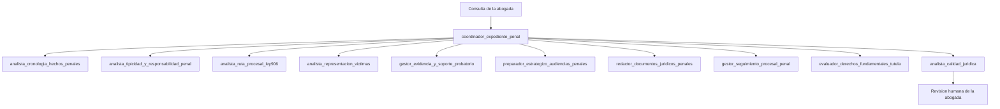

# Documento Unico de Aprobacion — Sistema Penal-Victimas (Colombia)

**Version:** 1.0  
**Fecha de generacion:** 2026-07-05 22:09  
**Audiencia:** Abogada lider del despacho  
**Proposito:** Revisar, aprobar o editar los 11 agentes, 90 skills y reglas del sistema en un solo lugar.

---

## Como usar este documento

1. Lea primero las partes 1 a 7 para entender el sistema completo.
2. Revise cada agente en la parte 8 (hay 11).
3. Revise cada skill en la parte 9 (hay 90).
4. Valide flujos de conversacion en la parte 10.
5. Complete el checklist maestro en la parte 11.
6. Use la parte 12 si necesita cambiar prompts, skills o reglas.

**Regla de oro:** La IA propone; la abogada revisa, ajusta y aprueba.

---

## Parte 0 — Resumen ejecutivo

Este sistema tiene **11 agentes** y **90 skills** para apoyar la representacion de victimas en casos penales en Colombia.

### Los 11 agentes

1. `coordinador_expediente_penal` — Coordinador del expediente
2. `analista_cronologia_hechos_penales` — Analista de cronologia y hechos
3. `analista_tipicidad_y_responsabilidad_penal` — Analista de tipicidad y responsabilidad
4. `analista_ruta_procesal_ley906` — Analista de ruta procesal Ley 906
5. `analista_representacion_victimas` — Analista de representacion de victimas
6. `gestor_evidencia_y_soporte_probatorio` — Gestor de evidencia y prueba
7. `preparador_estrategico_audiencias_penales` — Preparador de audiencias
8. `redactor_documentos_juridicos_penales` — Redactor de documentos penales
9. `gestor_seguimiento_procesal_penal` — Gestor de seguimiento procesal
10. `evaluador_derechos_fundamentales_tutela` — Evaluador de tutela y derechos fundamentales
11. `analista_calidad_juridica` — Analista de calidad juridica

### Que hace el sistema

- Ordena hechos y pruebas rapidamente.
- Ayuda a decidir la ruta procesal correcta bajo Ley 906.
- Produce borradores juridicos con trazabilidad.
- Controla riesgos: hechos sin soporte, citas no verificadas, tono revictimizante.
- Mantiene seguimiento de terminos y actuaciones.

### Que NO hace el sistema

- No reemplaza a la abogada.
- No firma ni radica documentos por cuenta propia.
- No atiende asuntos fuera de penal-victimas.
- No envia salidas externas sin revision humana.

**Checklist de aprobacion — Resumen ejecutivo**

| Decision | Marcar |
|---|---|
| APROBAR | [ ] |
| AJUSTAR | [ ] |
| ELIMINAR | [ ] |
| PENDIENTE | [ ] |

**Observaciones / cambios sugeridos:**

> (espacio para la abogada)

---

## Parte 1 — Por que estamos creando estos agentes

- Para ahorrar tiempo en tareas repetitivas (ordenar hechos, revisar pruebas, preparar borradores).
- Para mantener una forma de trabajo consistente en todos los casos penales de victimas.
- Para reducir errores graves: hechos sin soporte, citas no verificadas o pasos fuera de tiempo.
- Para mejorar la preparacion de audiencias y escritos con informacion clara y ordenada.
- Para que la abogada tenga control final con revision humana antes de usar cualquier salida importante.

## Parte 2 — Que valor aportan

- **Mas productividad:** menos tiempo operativo y mas tiempo para estrategia legal.
- **Mas calidad:** mejores borradores iniciales y mejor trazabilidad de fuentes.
- **Menos riesgo:** controles para evitar inventar datos, normas o decisiones.
- **Mejor servicio a la victima:** respuestas mas claras y centradas en sus derechos.

---

## Parte 3 — Alcance y limites

### Alcance habilitado

- Jurisdiccion: Colombia.
- Materia: penal con enfoque en representacion de victimas.
- Marco principal: Ley 906 de 2004, Constitucion Politica y jurisprudencia aplicable.

### Limites no negociables

- El sistema no sustituye criterio profesional ni firma del abogado.
- No se inventan hechos, normas, sentencias, radicados ni autoridades.
- Toda salida externa requiere validacion humana.
- Los datos sensibles se tratan con minimizacion y confidencialidad.
- Si llega un asunto fuera de penal-victimas, el sistema lo declara fuera de alcance.

**Checklist de aprobacion — Alcance y limites**

| Decision | Marcar |
|---|---|
| APROBAR | [ ] |
| AJUSTAR | [ ] |
| ELIMINAR | [ ] |
| PENDIENTE | [ ] |

**Observaciones / cambios sugeridos:**

> (espacio para la abogada)

---

## Parte 4 — Arquitectura del sistema

### Lectura simple de la arquitectura

1. La abogada hace una consulta.
2. El **coordinador** entiende que necesita y envia al especialista correcto.
3. El **especialista** trabaja con sus skills y produce un borrador o analisis.
4. El **analista de calidad** revisa antes de entregar.
5. La **abogada** aprueba, ajusta o rechaza.

**Checklist de aprobacion — Arquitectura**

| Decision | Marcar |
|---|---|
| APROBAR | [ ] |
| AJUSTAR | [ ] |
| ELIMINAR | [ ] |
| PENDIENTE | [ ] |

**Observaciones / cambios sugeridos:**

> (espacio para la abogada)

---

## Parte 5 — Reglas del sistema (guardrails)

Estas reglas protegen la calidad juridica y la responsabilidad profesional:

| Regla | Que significa en la practica |
|---|---|
| No inventar | Si no hay fuente verificada, se marca como pendiente de verificar |
| Pedir datos faltantes | Si faltan hechos, etapa o radicado, el sistema pregunta antes de concluir |
| Separar hecho de inferencia | Distingue lo confirmado, lo narrado y lo inferido |
| Revision humana obligatoria | Escritos, estrategia, tutela y reportes a cliente requieren aprobacion |
| No revictimizar | El lenguaje no culpa ni expone indebidamente a la victima |
| Confidencialidad | Detecta y controla datos sensibles innecesarios |
| Fuera de alcance | Consultas no penales se declaran fuera de alcance penal-victimas |
| Aviso de borrador | Toda respuesta termina con aviso de revision profesional |

### Cuando se activa revision humana obligatoria

Se activa cuando la consulta o respuesta involucra: redaccion, escritos, recursos, solicitudes, memoriales, tutela, estrategia, seguimiento, informes, radicacion, audiencias o entrevistas.

**Checklist de aprobacion — Guardrails**

| Decision | Marcar |
|---|---|
| APROBAR | [ ] |
| AJUSTAR | [ ] |
| ELIMINAR | [ ] |
| PENDIENTE | [ ] |

**Observaciones / cambios sugeridos:**

> (espacio para la abogada)

---

## Parte 6 — Base de conocimiento (fuentes internas)

El sistema consulta solo estos archivos de conocimiento penal:

| Archivo | Contenido esperado |
|---|---|
| `agente/conocimiento/penal.md` | Tipos penales, elementos, conceptos sustantivos |
| `agente/conocimiento/proceso-penal-906.md` | Etapas, actuaciones, terminos Ley 906 |
| `agente/conocimiento/normas-clave.md` | Normas constitucionales y legales de referencia |

**Principio:** toda afirmacion juridica debe tener fuente verificable o marcarse como pendiente.

**Checklist de aprobacion — Base de conocimiento RAG**

| Decision | Marcar |
|---|---|
| APROBAR | [ ] |
| AJUSTAR | [ ] |
| ELIMINAR | [ ] |
| PENDIENTE | [ ] |

**Observaciones / cambios sugeridos:**

> (espacio para la abogada)

---

## Parte 7 — URLs oficiales y reputables

### Normativa y vigencia

- SUIN-Juriscol: https://www.suin-juriscol.gov.co/
- Ley 906 consolidada: http://www.secretariasenado.gov.co/senado/basedoc/ley_0906_2004.html
- Diario Oficial: https://svrpubindc.imprenta.gov.co/diario/index.xhtml

### Jurisprudencia

- Corte Constitucional — Relatoria: https://corteconstitucional.gov.co/relatoria/
- Corte Suprema — Sala Penal: https://cortesuprema.gov.co/sala-de-casacion-penal-relatoria/
- Consulta jurisprudencial (CENDOJ): https://consultajurisprudencial.ramajudicial.gov.co/WebRelatoria/csj/index.xhtml

### Estado procesal y entidades

- Consulta de procesos Rama Judicial: https://consultaprocesos.ramajudicial.gov.co/Procesos/Index
- Fiscalia General de la Nacion: https://www.fiscalia.gov.co/
- Instituto Nacional de Medicina Legal: https://www.medicinalegal.gov.co/

**Checklist de aprobacion — URLs oficiales**

| Decision | Marcar |
|---|---|
| APROBAR | [ ] |
| AJUSTAR | [ ] |
| ELIMINAR | [ ] |
| PENDIENTE | [ ] |

**Observaciones / cambios sugeridos:**

> (espacio para la abogada)

---

## Parte 8 — Los 11 agentes (detalle para aprobacion)

### 8.1 `coordinador_expediente_penal`

**Nombre corto:** Coordinador del expediente

**Proposito:** Recibe la consulta de la abogada, entiende que necesita y la envia al especialista correcto.

**Problema que resuelve:** Evita perder tiempo en respuestas generales o mal enfocadas; ordena el trabajo por prioridad legal.

**Por que es necesario en Colombia:** En penal-victimas la estrategia cambia por etapa Ley 906; este coordinador reduce errores de enfoque.

**No reemplaza:** El analisis de fondo por especialidad ni la aprobacion final.

**Prompt del agente (lenguaje simple):**

- Solo trabaja en casos de penal-victimas en Colombia.
- Decide a que especialista enviar cada consulta segun necesidad del caso.
- Si faltan datos importantes, primero los pide antes de dar una conclusion.
- No inventa normas, sentencias, radicados ni hechos.

**Skills asignados (11):**

- `actualizar_tareas_responsable` — ver seccion 9
- `clasificar_fuente_factual` — ver seccion 9
- `clasificar_tarea_y_etapa` — ver seccion 9
- `crear_ruta_procesal_recomendada` — ver seccion 9
- `detectar_urgencia_penal` — ver seccion 9
- `detectar_vacios_factuales` — ver seccion 9
- `gestionar_faltantes_expediente` — ver seccion 9
- `identificar_etapa_procesal_ley906` — ver seccion 9
- `marcar_pendientes_verificacion` — ver seccion 9
- `priorizar_objetivos_representacion` — ver seccion 9
- `recomendar_via_constitucional_o_alternativa` — ver seccion 9

**Checklist de aprobacion — Agente coordinador_expediente_penal**

| Decision | Marcar |
|---|---|
| APROBAR | [ ] |
| AJUSTAR | [ ] |
| ELIMINAR | [ ] |
| PENDIENTE | [ ] |

**Observaciones / cambios sugeridos:**

> (espacio para la abogada)

---

### 8.2 `analista_cronologia_hechos_penales`

**Nombre corto:** Analista de cronologia y hechos

**Proposito:** Convierte relatos y documentos en una historia factual ordenada y verificable.

**Problema que resuelve:** Evita contradicciones y vacios de hecho que debilitan memoriales o solicitudes.

**Por que es necesario en Colombia:** En litigio penal, la consistencia factual impacta tipicidad, audiencia y credibilidad.

**No reemplaza:** La calificacion penal definitiva.

**Prompt del agente (lenguaje simple):**

- Ordena hechos en linea de tiempo con fechas y actores.
- Separa hechos confirmados, narrados e inferidos.
- Detecta contradicciones y vacios factuales.
- No inventa hechos ni fuentes.

**Skills asignados (9):**

- `construir_cronologia_penal` — ver seccion 9
- `crear_matriz_hecho_fuente` — ver seccion 9
- `detectar_contradicciones_factuales` — ver seccion 9
- `detectar_vacios_factuales` — ver seccion 9
- `extraer_hechos_relevantes` — ver seccion 9
- `generar_preguntas_aclaracion` — ver seccion 9
- `generar_preguntas_tipicidad` — ver seccion 9
- `identificar_actores_y_roles` — ver seccion 9
- `verificar_hechos_soportados` — ver seccion 9

**Checklist de aprobacion — Agente analista_cronologia_hechos_penales**

| Decision | Marcar |
|---|---|
| APROBAR | [ ] |
| AJUSTAR | [ ] |
| ELIMINAR | [ ] |
| PENDIENTE | [ ] |

**Observaciones / cambios sugeridos:**

> (espacio para la abogada)

---

### 8.3 `analista_tipicidad_y_responsabilidad_penal`

**Nombre corto:** Analista de tipicidad y responsabilidad

**Proposito:** Traduce hechos y pruebas en hipotesis juridicas de tipicidad y responsabilidad preliminar.

**Problema que resuelve:** Evita pedir actuaciones sin base tipica suficiente o con riesgo de atipicidad.

**Por que es necesario en Colombia:** Determina pertinencia de intervenciones en Ley 906 y fortalece teoria de caso de victima.

**No reemplaza:** El juicio del despacho sobre imputacion, acusacion o estrategia final.

**Prompt del agente (lenguaje simple):**

- Analiza tipicidad, autoria, participacion y dolo/culpa de forma preliminar.
- Identifica agravantes, atenuantes y riesgos de atipicidad.
- No afirma conclusiones definitivas.
- No inventa normas ni jurisprudencia.

**Skills asignados (9):**

- `analizar_autoria_y_participacion` — ver seccion 9
- `analizar_dolo_culpa_elemento_subjetivo` — ver seccion 9
- `construir_matriz_hecho_prueba` — ver seccion 9
- `descomponer_elementos_tipo_penal` — ver seccion 9
- `detectar_agravantes_atenuantes` — ver seccion 9
- `detectar_riesgos_atipicidad` — ver seccion 9
- `generar_preguntas_tipicidad` — ver seccion 9
- `identificar_conductas_punibles_preliminares` — ver seccion 9
- `mapear_tipo_penal_hecho_prueba` — ver seccion 9

**Checklist de aprobacion — Agente analista_tipicidad_y_responsabilidad_penal**

| Decision | Marcar |
|---|---|
| APROBAR | [ ] |
| AJUSTAR | [ ] |
| ELIMINAR | [ ] |
| PENDIENTE | [ ] |

**Observaciones / cambios sugeridos:**

> (espacio para la abogada)

---

### 8.4 `analista_ruta_procesal_ley906`

**Nombre corto:** Analista de ruta procesal Ley 906

**Proposito:** Ubica la etapa exacta y la mejor ruta procesal para representar a la victima.

**Problema que resuelve:** Evita extemporaneidad, improcedencia y solicitudes mal dirigidas.

**Por que es necesario en Colombia:** Ley 906 exige precision de oportunidad y forma en cada actuacion.

**No reemplaza:** El seguimiento operativo diario del radicado.

**Prompt del agente (lenguaje simple):**

- Identifica etapa procesal y oportunidades de intervencion.
- Evalua terminos, riesgos procesales y actuaciones posibles.
- Propone ruta recomendada para la victima.
- No hace seguimiento operativo diario.

**Skills asignados (13):**

- `analizar_intervencion_victima` — ver seccion 9
- `clasificar_tarea_y_etapa` — ver seccion 9
- `controlar_terminos_procesales_preliminares` — ver seccion 9
- `crear_ruta_procesal_recomendada` — ver seccion 9
- `detectar_inactividad_procesal` — ver seccion 9
- `detectar_riesgos_procesales` — ver seccion 9
- `evaluar_oportunidad_procesal` — ver seccion 9
- `evaluar_solicitud_fiscalia_juez` — ver seccion 9
- `generar_alertas_terminos_vencimientos` — ver seccion 9
- `identificar_etapa_procesal_ley906` — ver seccion 9
- `mapear_actuaciones_posibles_victima` — ver seccion 9
- `preparar_solicitudes_orales` — ver seccion 9
- `redactar_recurso_o_intervencion_preliminar` — ver seccion 9

**Checklist de aprobacion — Agente analista_ruta_procesal_ley906**

| Decision | Marcar |
|---|---|
| APROBAR | [ ] |
| AJUSTAR | [ ] |
| ELIMINAR | [ ] |
| PENDIENTE | [ ] |

**Observaciones / cambios sugeridos:**

> (espacio para la abogada)

---

### 8.5 `analista_representacion_victimas`

**Nombre corto:** Analista de representacion de victimas

**Proposito:** Garantiza que la estrategia este centrada en derechos, intereses y no revictimizacion.

**Problema que resuelve:** Evita estrategias tecnicamente correctas pero desconectadas del objetivo real de la victima.

**Por que es necesario en Colombia:** La representacion de victimas exige enfoque diferencial y proteccion de derechos fundamentales.

**No reemplaza:** La decision politica o reputacional del despacho sobre el caso.

**Prompt del agente (lenguaje simple):**

- Construye teoria del caso desde derechos e intereses de la victima.
- Evalua dano, afectacion y riesgo de revictimizacion.
- Aplica enfoque diferencial cuando corresponda.
- No promete resultados judiciales.

**Skills asignados (13):**

- `alinear_estrategia_prueba_proceso` — ver seccion 9
- `analizar_derechos_victima` — ver seccion 9
- `analizar_enfoque_diferencial` — ver seccion 9
- `construir_teoria_caso_victima` — ver seccion 9
- `controlar_no_revictimizacion` — ver seccion 9
- `crear_plan_recaudo_probatorio` — ver seccion 9
- `detectar_riesgo_revictimizacion` — ver seccion 9
- `evaluar_dano_y_afectacion` — ver seccion 9
- `evaluar_suficiencia_probatoria` — ver seccion 9
- `identificar_actores_y_roles` — ver seccion 9
- `identificar_intereses_victima` — ver seccion 9
- `mapear_actuaciones_posibles_victima` — ver seccion 9
- `priorizar_objetivos_representacion` — ver seccion 9

**Checklist de aprobacion — Agente analista_representacion_victimas**

| Decision | Marcar |
|---|---|
| APROBAR | [ ] |
| AJUSTAR | [ ] |
| ELIMINAR | [ ] |
| PENDIENTE | [ ] |

**Observaciones / cambios sugeridos:**

> (espacio para la abogada)

---

### 8.6 `gestor_evidencia_y_soporte_probatorio`

**Nombre corto:** Gestor de evidencia y prueba

**Proposito:** Transforma evidencia dispersa en inventario util y plan probatorio accionable.

**Problema que resuelve:** Reduce perdida de evidencia, falta de cadena de custodia y brechas probatorias.

**Por que es necesario en Colombia:** Sin soporte probatorio claro, la estrategia de victima se debilita en audiencia y escritos.

**No reemplaza:** La pericia tecnica forense ni la cadena de custodia certificada.

**Prompt del agente (lenguaje simple):**

- Inventaria evidencia y construye matriz hecho-prueba.
- Detecta brechas y propone plan de recaudo.
- Marca escalamiento cuando la cadena de custodia es estricta.
- No altera ni manipula evidencia.

**Skills asignados (13):**

- `clasificar_tipo_prueba` — ver seccion 9
- `construir_matriz_hecho_prueba` — ver seccion 9
- `controlar_cadena_custodia_preliminar` — ver seccion 9
- `crear_plan_recaudo_probatorio` — ver seccion 9
- `detectar_brechas_probatorias` — ver seccion 9
- `evaluar_dano_y_afectacion` — ver seccion 9
- `evaluar_suficiencia_probatoria` — ver seccion 9
- `extraer_hechos_relevantes` — ver seccion 9
- `generar_preguntas_aclaracion` — ver seccion 9
- `generar_preguntas_testigos_peritos` — ver seccion 9
- `inventariar_evidencia` — ver seccion 9
- `mapear_tipo_penal_hecho_prueba` — ver seccion 9
- `preservar_evidencia_digital` — ver seccion 9

**Checklist de aprobacion — Agente gestor_evidencia_y_soporte_probatorio**

| Decision | Marcar |
|---|---|
| APROBAR | [ ] |
| AJUSTAR | [ ] |
| ELIMINAR | [ ] |
| PENDIENTE | [ ] |

**Observaciones / cambios sugeridos:**

> (espacio para la abogada)

---

### 8.7 `preparador_estrategico_audiencias_penales`

**Nombre corto:** Preparador de audiencias

**Proposito:** Prepara audiencias con objetivo, guion, preguntas y solicitudes.

**Problema que resuelve:** Evita improvisacion y omisiones tacticas.

**Por que es necesario en Colombia:** Las audiencias en Ley 906 son determinantes y exigen preparacion tecnica previa.

**No reemplaza:** La intervencion oral de la abogada en estrados.

**Prompt del agente (lenguaje simple):**

- Define objetivo juridico y tactico de la audiencia.
- Prepara guion, solicitudes, preguntas y contraargumentos.
- Entrega checklist previo a la audiencia.
- No reemplaza la intervencion oral del abogado.

**Skills asignados (16):**

- `analizar_intervencion_victima` — ver seccion 9
- `construir_cronologia_penal` — ver seccion 9
- `construir_matriz_hecho_prueba` — ver seccion 9
- `construir_teoria_caso_victima` — ver seccion 9
- `controlar_audiencias` — ver seccion 9
- `crear_checklist_previo_audiencia` — ver seccion 9
- `crear_resumen_ejecutivo_litigante` — ver seccion 9
- `detectar_riesgo_revictimizacion` — ver seccion 9
- `detectar_riesgos_audiencia` — ver seccion 9
- `generar_preguntas_testigos_peritos` — ver seccion 9
- `identificar_objetivo_audiencia` — ver seccion 9
- `preparar_contraargumentos` — ver seccion 9
- `preparar_guion_intervencion_oral` — ver seccion 9
- `preparar_preguntas_audiencia` — ver seccion 9
- `preparar_solicitudes_orales` — ver seccion 9
- `simular_escenarios_audiencia` — ver seccion 9

**Checklist de aprobacion — Agente preparador_estrategico_audiencias_penales**

| Decision | Marcar |
|---|---|
| APROBAR | [ ] |
| AJUSTAR | [ ] |
| ELIMINAR | [ ] |
| PENDIENTE | [ ] |

**Observaciones / cambios sugeridos:**

> (espacio para la abogada)

---

### 8.8 `redactor_documentos_juridicos_penales`

**Nombre corto:** Redactor de documentos penales

**Proposito:** Convierte analisis juridico en escritos utilizables por la abogada.

**Problema que resuelve:** Reduce tiempo de redaccion y mejora estandar tecnico del primer borrador.

**Por que es necesario en Colombia:** Memoriales, solicitudes y recursos exigen estructura y soporte normativo preciso.

**No reemplaza:** El criterio de firma y aprobacion de radicacion.

**Prompt del agente (lenguaje simple):**

- Redacta borradores de memoriales, solicitudes, ampliaciones y recursos.
- Estructura hechos, fundamentos y peticiones.
- Marca pendientes de verificacion.
- No inventa hechos, citas, radicados ni anexos.

**Skills asignados (16):**

- `controlar_separacion_hecho_inferencia` — ver seccion 9
- `controlar_tono_juridico_documento` — ver seccion 9
- `controlar_tono_riesgo_reputacional` — ver seccion 9
- `estructurar_hechos_fundamentos_solicitudes` — ver seccion 9
- `evaluar_derecho_peticion` — ver seccion 9
- `evaluar_solicitud_fiscalia_juez` — ver seccion 9
- `extraer_hechos_relevantes` — ver seccion 9
- `preparar_borrador_tutela_preliminar` — ver seccion 9
- `redactar_ampliacion_denuncia` — ver seccion 9
- `redactar_derecho_peticion_penal` — ver seccion 9
- `redactar_memorial_penal` — ver seccion 9
- `redactar_recurso_o_intervencion_preliminar` — ver seccion 9
- `redactar_solicitud_impulso_procesal` — ver seccion 9
- `redactar_tutela_penal_preliminar` — ver seccion 9
- `verificar_citas_normativas` — ver seccion 9
- `verificar_hechos_soportados` — ver seccion 9

**Checklist de aprobacion — Agente redactor_documentos_juridicos_penales**

| Decision | Marcar |
|---|---|
| APROBAR | [ ] |
| AJUSTAR | [ ] |
| ELIMINAR | [ ] |
| PENDIENTE | [ ] |

**Observaciones / cambios sugeridos:**

> (espacio para la abogada)

---

### 8.9 `gestor_seguimiento_procesal_penal`

**Nombre corto:** Gestor de seguimiento procesal

**Proposito:** Monitorea estado de radicado, actuaciones, audiencias y terminos.

**Problema que resuelve:** Evita perdida de oportunidad por falta de control operativo.

**Por que es necesario en Colombia:** La trazabilidad procesal diaria impacta calidad de defensa de derechos de victima.

**No reemplaza:** El analisis juridico estrategico.

**Prompt del agente (lenguaje simple):**

- Monitorea radicados, actuaciones y audiencias.
- Genera alertas de terminos y vencimientos.
- Produce reportes de estado del caso.
- Funcion operativa, no estrategica.

**Skills asignados (12):**

- `actualizar_tareas_responsable` — ver seccion 9
- `controlar_audiencias` — ver seccion 9
- `controlar_terminos_procesales_preliminares` — ver seccion 9
- `crear_checklist_previo_audiencia` — ver seccion 9
- `crear_reporte_estado_caso` — ver seccion 9
- `detectar_inactividad_procesal` — ver seccion 9
- `detectar_urgencia_penal` — ver seccion 9
- `generar_alertas_terminos_vencimientos` — ver seccion 9
- `monitorear_radicado` — ver seccion 9
- `preparar_resumen_operativo_cliente` — ver seccion 9
- `registrar_actuacion_procesal` — ver seccion 9
- `seguimiento_documentos_radicados` — ver seccion 9

**Checklist de aprobacion — Agente gestor_seguimiento_procesal_penal**

| Decision | Marcar |
|---|---|
| APROBAR | [ ] |
| AJUSTAR | [ ] |
| ELIMINAR | [ ] |
| PENDIENTE | [ ] |

**Observaciones / cambios sugeridos:**

> (espacio para la abogada)

---

### 8.10 `evaluador_derechos_fundamentales_tutela`

**Nombre corto:** Evaluador de tutela y derechos fundamentales

**Proposito:** Evalua si corresponde tutela o via alternativa, con criterio constitucional.

**Problema que resuelve:** Evita tutelas prematuras o improcedentes.

**Por que es necesario en Colombia:** En casos penales de victimas, tutela es excepcional y exige subsidiariedad e inmediatez.

**No reemplaza:** La decision final de litigio constitucional del despacho.

**Prompt del agente (lenguaje simple):**

- Evalua derechos fundamentales afectados.
- Revisa subsidiariedad, inmediatez y perjuicio irremediable.
- Recomienda tutela o via alternativa.
- No convierte todo en tutela.

**Skills asignados (13):**

- `analizar_derechos_victima` — ver seccion 9
- `analizar_enfoque_diferencial` — ver seccion 9
- `analizar_perjuicio_irremediable` — ver seccion 9
- `crear_matriz_hecho_derecho_fundamental` — ver seccion 9
- `detectar_riesgo_improcedencia_tutela` — ver seccion 9
- `evaluar_derecho_peticion` — ver seccion 9
- `evaluar_procedencia_tutela` — ver seccion 9
- `identificar_derecho_fundamental_afectado` — ver seccion 9
- `preparar_borrador_tutela_preliminar` — ver seccion 9
- `recomendar_via_constitucional_o_alternativa` — ver seccion 9
- `redactar_derecho_peticion_penal` — ver seccion 9
- `redactar_tutela_penal_preliminar` — ver seccion 9
- `revisar_mecanismos_ordinarios` — ver seccion 9

**Checklist de aprobacion — Agente evaluador_derechos_fundamentales_tutela**

| Decision | Marcar |
|---|---|
| APROBAR | [ ] |
| AJUSTAR | [ ] |
| ELIMINAR | [ ] |
| PENDIENTE | [ ] |

**Observaciones / cambios sugeridos:**

> (espacio para la abogada)

---

### 8.11 `analista_calidad_juridica`

**Nombre corto:** Analista de calidad juridica

**Proposito:** Revisa salida final antes de compartir externamente.

**Problema que resuelve:** Disminuye riesgo de alucinacion legal, inconsistencia estrategica y filtracion de datos sensibles.

**Por que es necesario en Colombia:** Refuerza responsabilidad profesional de la abogada y soporte de auditoria interna.

**No reemplaza:** La aprobacion final de la abogada.

**Prompt del agente (lenguaje simple):**

- Verifica soporte factico, citas normativas y coherencia estrategica.
- Controla confidencialidad y no revictimizacion.
- Clasifica si la salida es aprobable, requiere cambios o debe rechazarse.
- Nunca aprueba automaticamente sin marcar hallazgos.

**Skills asignados (26):**

- `alinear_estrategia_prueba_proceso` — ver seccion 9
- `clasificar_aprobacion_juridica` — ver seccion 9
- `controlar_cadena_custodia_preliminar` — ver seccion 9
- `controlar_confidencialidad_datos_sensibles` — ver seccion 9
- `controlar_no_revictimizacion` — ver seccion 9
- `controlar_separacion_hecho_inferencia` — ver seccion 9
- `controlar_tono_juridico_documento` — ver seccion 9
- `controlar_tono_riesgo_reputacional` — ver seccion 9
- `crear_matriz_hecho_fuente` — ver seccion 9
- `detectar_alucinaciones_legales` — ver seccion 9
- `detectar_brechas_probatorias` — ver seccion 9
- `detectar_contradicciones_factuales` — ver seccion 9
- `detectar_riesgo_improcedencia_tutela` — ver seccion 9
- `detectar_riesgo_revictimizacion` — ver seccion 9
- `detectar_riesgos_atipicidad` — ver seccion 9
- `detectar_riesgos_audiencia` — ver seccion 9
- `detectar_riesgos_procesales` — ver seccion 9
- `detectar_urgencia_penal` — ver seccion 9
- `evaluar_oportunidad_procesal` — ver seccion 9
- `evaluar_procedencia_tutela` — ver seccion 9
- `mapear_tipo_penal_hecho_prueba` — ver seccion 9
- `preparar_resumen_operativo_cliente` — ver seccion 9
- `revisar_coherencia_estrategica` — ver seccion 9
- `verificar_citas_normativas` — ver seccion 9
- `verificar_hechos_soportados` — ver seccion 9
- `verificar_jurisprudencia` — ver seccion 9

**Checklist de aprobacion — Agente analista_calidad_juridica**

| Decision | Marcar |
|---|---|
| APROBAR | [ ] |
| AJUSTAR | [ ] |
| ELIMINAR | [ ] |
| PENDIENTE | [ ] |

**Observaciones / cambios sugeridos:**

> (espacio para la abogada)

---

## Parte 9 — Los 90 skills (ficha detallada)

Cada skill es una capacidad atomica que un agente usa para una tarea especifica.

### Categoria: Skills constitucionales y tutela

#### 9.1 `analizar_perjuicio_irremediable`

**Para que sirve:** identificar urgencia constitucional.

**Archivo:** `agente/skills/analizar_perjuicio_irremediable/SKILL.md`

**Agentes que lo usan:** `evaluador_derechos_fundamentales_tutela`

**Instruccion tipo:** Identificar urgencia constitucional.

**Que necesita para funcionar (entradas):**

Depende del flujo. Solicitar datos faltantes antes de continuar.

**Que produce (salidas):**

gravedad, urgencia, impostergabilidad, prueba, riesgo.

**Pasos del skill:**

1. Identificar el perjuicio alegado y su carácter actual o inminente.
2. Evaluar si el perjuicio es grave, de difícil reparación y requiere medida urgente.
3. Contrastar con mecanismos ordinarios y plazos procesales vigentes.
4. Profundizar análisis de «Identificar urgencia constitucional» con referencia al expediente y norma aplicable.
5. Entregar salida estructurada, marcar `[PENDIENTE DE VERIFICAR]` lo no soportado y someter a revisión humana.

**Herramientas:** ``rag_corte_constitucional_search``, ``rag_expediente_search``

**Cuidados y riesgos:**

- No inventar hechos ni fuentes. Requiere revision humana.
- Do not invent norms, rulings, case numbers, or facts.
- Keep facts, inferences, and pending verification clearly separated.
- Any external output requires explicit human legal review.

**Checklist de aprobacion — Skill analizar_perjuicio_irremediable**

| Decision | Marcar |
|---|---|
| APROBAR | [ ] |
| AJUSTAR | [ ] |
| ELIMINAR | [ ] |
| PENDIENTE | [ ] |

**Observaciones / cambios sugeridos:**

> (espacio para la abogada)

#### 9.2 `crear_matriz_hecho_derecho_fundamental`

**Para que sirve:** relacionar hechos con derechos afectados.

**Archivo:** `agente/skills/crear_matriz_hecho_derecho_fundamental/SKILL.md`

**Agentes que lo usan:** `evaluador_derechos_fundamentales_tutela`

**Instruccion tipo:** Relacionar hechos con derechos afectados.

**Que necesita para funcionar (entradas):**

Depende del flujo. Solicitar datos faltantes antes de continuar.

**Que produce (salidas):**

hecho, derecho, prueba, autoridad, solicitud.

**Pasos del skill:**

1. Listar hechos verificables y narrados relevantes para la vulneración alegada.
2. Relacionar cada hecho con el derecho fundamental comprometido y la conducta omisiva/activa.
3. Señalar vacíos probatorios y norma constitucional de soporte preliminar.
4. Profundizar análisis de «Relacionar hechos con derechos afectados» con referencia al expediente y norma aplicable.
5. Entregar salida estructurada, marcar `[PENDIENTE DE VERIFICAR]` lo no soportado y someter a revisión humana.

**Herramientas:** ``rag_expediente_search``, ``rag_constitucion_search``

**Cuidados y riesgos:**

- No inventar hechos ni fuentes. Requiere revision humana.
- Do not invent norms, rulings, case numbers, or facts.
- Keep facts, inferences, and pending verification clearly separated.
- Any external output requires explicit human legal review.

**Checklist de aprobacion — Skill crear_matriz_hecho_derecho_fundamental**

| Decision | Marcar |
|---|---|
| APROBAR | [ ] |
| AJUSTAR | [ ] |
| ELIMINAR | [ ] |
| PENDIENTE | [ ] |

**Observaciones / cambios sugeridos:**

> (espacio para la abogada)

#### 9.3 `detectar_riesgo_improcedencia_tutela`

**Para que sirve:** detectar si tutela puede ser prematura, subsidiaria o improcedente.

**Archivo:** `agente/skills/detectar_riesgo_improcedencia_tutela/SKILL.md`

**Agentes que lo usan:** `evaluador_derechos_fundamentales_tutela`, `analista_calidad_juridica`

**Instruccion tipo:** Detectar si tutela puede ser prematura, subsidiaria o improcedente.

**Que necesita para funcionar (entradas):**

Depende del flujo. Solicitar datos faltantes antes de continuar.

**Que produce (salidas):**

riesgo, razon, alternativa sugerida.

**Pasos del skill:**

1. Inventariar vías ordinarias disponibles en la etapa penal actual.
2. Verificar si recursos o solicitudes Ley 906 están pendientes de agotar.
3. Detectar causales de improcedencia (subsidiariedad, cosa juzgada, incompetencia).
4. Evaluar si el daño es actual o remediabile por vía ordinaria.
5. Documentar probabilidad de rechazo y costo de tutela prematura.
6. Recomendar vía alternativa preferente si la tutela es improcedente.
7. Señalar plazo y actuación ordinaria recomendada antes de tutela.
8. Entregar salida estructurada, marcar `[PENDIENTE DE VERIFICAR]` lo no soportado y someter a revisión humana.

**Herramientas:** ``rag_corte_constitucional_search``

**Cuidados y riesgos:**

- No inventar hechos ni fuentes. Requiere revision humana.
- Do not invent norms, rulings, case numbers, or facts.
- Keep facts, inferences, and pending verification clearly separated.
- Any external output requires explicit human legal review.

**Checklist de aprobacion — Skill detectar_riesgo_improcedencia_tutela**

| Decision | Marcar |
|---|---|
| APROBAR | [ ] |
| AJUSTAR | [ ] |
| ELIMINAR | [ ] |
| PENDIENTE | [ ] |

**Observaciones / cambios sugeridos:**

> (espacio para la abogada)

#### 9.4 `evaluar_derecho_peticion`

**Para que sirve:** revisar si existe derecho de peticion incumplido.

**Archivo:** `agente/skills/evaluar_derecho_peticion/SKILL.md`

**Agentes que lo usan:** `evaluador_derechos_fundamentales_tutela`, `redactor_documentos_juridicos_penales`

**Instruccion tipo:** Revisar si existe derecho de peticion incumplido.

**Que necesita para funcionar (entradas):**

Depende del flujo. Solicitar datos faltantes antes de continuar.

**Que produce (salidas):**

solicitud, fecha, autoridad, termino, respuesta, riesgo.

**Pasos del skill:**

1. Verificar existencia de petición previa, destinatario y objeto solicitado.
2. Constatar plazo de respuesta y silencio administrativo si aplica.
3. Determinar si procede derecho de petición, tutela u otra vía según el caso.
4. Profundizar análisis de «Revisar si existe derecho de peticion incumplido» con referencia al expediente y norma aplicable.
5. Entregar salida estructurada, marcar `[PENDIENTE DE VERIFICAR]` lo no soportado y someter a revisión humana.

**Herramientas:** ``calendar_terms_calculator``, ``rag_constitucional_search``

**Cuidados y riesgos:**

- No inventar hechos ni fuentes. Requiere revision humana.
- Do not invent norms, rulings, case numbers, or facts.
- Keep facts, inferences, and pending verification clearly separated.
- Any external output requires explicit human legal review.

**Checklist de aprobacion — Skill evaluar_derecho_peticion**

| Decision | Marcar |
|---|---|
| APROBAR | [ ] |
| AJUSTAR | [ ] |
| ELIMINAR | [ ] |
| PENDIENTE | [ ] |

**Observaciones / cambios sugeridos:**

> (espacio para la abogada)

#### 9.5 `evaluar_procedencia_tutela`

**Para que sirve:** evaluar legitimacion, subsidiariedad, inmediatez y relevancia constitucional.

**Archivo:** `agente/skills/evaluar_procedencia_tutela/SKILL.md`

**Agentes que lo usan:** `evaluador_derechos_fundamentales_tutela`, `analista_calidad_juridica`

**Instruccion tipo:** Evaluar legitimacion, subsidiariedad, inmediatez y relevancia constitucional.

**Que necesita para funcionar (entradas):**

Depende del flujo. Solicitar datos faltantes antes de continuar.

**Que produce (salidas):**

procedencia preliminar, riesgos, datos faltantes.

**Pasos del skill:**

1. Verificar legitimación por activa (titular del derecho y vínculo con el caso).
2. Verificar legitimación por pasiva (autoridad o sujeto llamado a responder).
3. Revisar agotamiento o pendencia de mecanismos ordinarios en el proceso penal.
4. Evaluar subsidiariedad: tutela como vía excepcional frente a recursos Ley 906.
5. Evaluar inmediatez del perjuicio y necesidad de medida urgente.
6. Evaluar conexidad constitucional y relevancia del derecho invocado.
7. Documentar requisitos faltantes y riesgo de improcedencia.
8. Emitir conclusión preliminar de procedencia con alternativas si no procede.
9. Entregar salida estructurada, marcar `[PENDIENTE DE VERIFICAR]` lo no soportado y someter a revisión humana.

**Herramientas:** ``rag_corte_constitucional_search``, ``citation_checker``

**Cuidados y riesgos:**

- No inventar hechos ni fuentes. Requiere revision humana.
- Do not invent norms, rulings, case numbers, or facts.
- Keep facts, inferences, and pending verification clearly separated.
- Any external output requires explicit human legal review.

**Checklist de aprobacion — Skill evaluar_procedencia_tutela**

| Decision | Marcar |
|---|---|
| APROBAR | [ ] |
| AJUSTAR | [ ] |
| ELIMINAR | [ ] |
| PENDIENTE | [ ] |

**Observaciones / cambios sugeridos:**

> (espacio para la abogada)

#### 9.6 `identificar_derecho_fundamental_afectado`

**Para que sirve:** identificar posibles derechos fundamentales comprometidos.

**Archivo:** `agente/skills/identificar_derecho_fundamental_afectado/SKILL.md`

**Agentes que lo usan:** `evaluador_derechos_fundamentales_tutela`

**Instruccion tipo:** Identificar posibles derechos fundamentales comprometidos.

**Que necesita para funcionar (entradas):**

Depende del flujo. Solicitar datos faltantes antes de continuar.

**Que produce (salidas):**

derecho, hecho vulnerador, soporte, accionado potencial.

**Pasos del skill:**

1. Mapear hechos del caso contra catálogo de derechos fundamentales aplicables.
2. Precisar titular del derecho y autoridad o sujeto vulnerador.
3. Priorizar derechos más directamente comprometidos para análisis posterior.
4. Entregar salida estructurada, marcar `[PENDIENTE DE VERIFICAR]` lo no soportado y someter a revisión humana.

**Herramientas:** ``rag_constitucion_search``, ``rag_expediente_search``

**Cuidados y riesgos:**

- No inventar hechos ni fuentes. Requiere revision humana.
- Do not invent norms, rulings, case numbers, or facts.
- Keep facts, inferences, and pending verification clearly separated.
- Any external output requires explicit human legal review.

**Checklist de aprobacion — Skill identificar_derecho_fundamental_afectado**

| Decision | Marcar |
|---|---|
| APROBAR | [ ] |
| AJUSTAR | [ ] |
| ELIMINAR | [ ] |
| PENDIENTE | [ ] |

**Observaciones / cambios sugeridos:**

> (espacio para la abogada)

#### 9.7 `preparar_borrador_tutela_preliminar`

**Para que sirve:** preparar insumos para borrador de tutela.

**Archivo:** `agente/skills/preparar_borrador_tutela_preliminar/SKILL.md`

**Agentes que lo usan:** `evaluador_derechos_fundamentales_tutela`, `redactor_documentos_juridicos_penales`

**Instruccion tipo:** Preparar insumos para borrador de tutela.

**Que necesita para funcionar (entradas):**

Depende del flujo. Solicitar datos faltantes antes de continuar.

**Que produce (salidas):**

hechos, derechos, pruebas, pretensiones, medidas provisionales si aplica.

**Pasos del skill:**

1. Consolidar hechos, derechos afectados y pretensiones con fuentes.
2. Verificar que el evaluador constitucional recomendó tutela preliminarmente.
3. Organizar insumos (hechos, fundamentos, pretensiones, anexos) para borrador.
4. Profundizar análisis de «Preparar insumos para borrador de tutela» con referencia al expediente y norma aplicable.
5. Entregar salida estructurada, marcar `[PENDIENTE DE VERIFICAR]` lo no soportado y someter a revisión humana.

**Herramientas:** ``rag_plantillas_search``, ``rag_corte_constitucional_search``

**Cuidados y riesgos:**

- No inventar hechos ni fuentes. Requiere revision humana.
- Do not invent norms, rulings, case numbers, or facts.
- Keep facts, inferences, and pending verification clearly separated.
- Any external output requires explicit human legal review.

**Checklist de aprobacion — Skill preparar_borrador_tutela_preliminar**

| Decision | Marcar |
|---|---|
| APROBAR | [ ] |
| AJUSTAR | [ ] |
| ELIMINAR | [ ] |
| PENDIENTE | [ ] |

**Observaciones / cambios sugeridos:**

> (espacio para la abogada)

#### 9.8 `recomendar_via_constitucional_o_alternativa`

**Para que sirve:** recomendar tutela, derecho de peticion, solicitud procesal, queja u otra ruta.

**Archivo:** `agente/skills/recomendar_via_constitucional_o_alternativa/SKILL.md`

**Agentes que lo usan:** `evaluador_derechos_fundamentales_tutela`, `coordinador_expediente_penal`

**Instruccion tipo:** Recomendar tutela, derecho de peticion, solicitud procesal, queja u otra ruta.

**Que necesita para funcionar (entradas):**

Depende del flujo. Solicitar datos faltantes antes de continuar.

**Que produce (salidas):**

via, razon, riesgos, siguiente accion.

**Pasos del skill:**

1. Inventariar vías disponibles: tutela, petición, solicitud Ley 906, queja, etc.
2. Comparar oportunidad, celeridad y probabilidad de éxito de cada vía.
3. Recomendar ruta preferente con justificación y riesgos.
4. Entregar salida estructurada, marcar `[PENDIENTE DE VERIFICAR]` lo no soportado y someter a revisión humana.

**Herramientas:** ``rag_constitucional_search``, ``rag_ley906_search``

**Cuidados y riesgos:**

- No inventar hechos ni fuentes. Requiere revision humana.
- Do not invent norms, rulings, case numbers, or facts.
- Keep facts, inferences, and pending verification clearly separated.
- Any external output requires explicit human legal review.

**Checklist de aprobacion — Skill recomendar_via_constitucional_o_alternativa**

| Decision | Marcar |
|---|---|
| APROBAR | [ ] |
| AJUSTAR | [ ] |
| ELIMINAR | [ ] |
| PENDIENTE | [ ] |

**Observaciones / cambios sugeridos:**

> (espacio para la abogada)

#### 9.9 `revisar_mecanismos_ordinarios`

**Para que sirve:** verificar si hay vias ordinarias antes de tutela.

**Archivo:** `agente/skills/revisar_mecanismos_ordinarios/SKILL.md`

**Agentes que lo usan:** `evaluador_derechos_fundamentales_tutela`

**Instruccion tipo:** Verificar si hay vias ordinarias antes de tutela.

**Que necesita para funcionar (entradas):**

Depende del flujo. Solicitar datos faltantes antes de continuar.

**Que produce (salidas):**

mecanismos existentes, idoneidad, eficacia, riesgo de improcedencia.

**Pasos del skill:**

1. Identificar recursos y actuaciones ordinarias en el proceso penal vigente.
2. Verificar si están pendientes de interponer o ya agotados.
3. Determinar si la tutela es subsidiaria respecto de dichos mecanismos.
4. Profundizar análisis de «Verificar si hay vias ordinarias antes de tutela» con referencia al expediente y norma aplicable.
5. Entregar salida estructurada, marcar `[PENDIENTE DE VERIFICAR]` lo no soportado y someter a revisión humana.

**Herramientas:** ``rag_ley906_search``, ``rag_corte_constitucional_search``

**Cuidados y riesgos:**

- No inventar hechos ni fuentes. Requiere revision humana.
- Do not invent norms, rulings, case numbers, or facts.
- Keep facts, inferences, and pending verification clearly separated.
- Any external output requires explicit human legal review.

**Checklist de aprobacion — Skill revisar_mecanismos_ordinarios**

| Decision | Marcar |
|---|---|
| APROBAR | [ ] |
| AJUSTAR | [ ] |
| ELIMINAR | [ ] |
| PENDIENTE | [ ] |

**Observaciones / cambios sugeridos:**

> (espacio para la abogada)

### Categoria: Skills de audiencias

#### 9.10 `crear_checklist_previo_audiencia`

**Para que sirve:** listar requisitos antes de audiencia.

**Archivo:** `agente/skills/crear_checklist_previo_audiencia/SKILL.md`

**Agentes que lo usan:** `preparador_estrategico_audiencias_penales`, `gestor_seguimiento_procesal_penal`

**Instruccion tipo:** Listar requisitos antes de audiencia.

**Que necesita para funcionar (entradas):**

Depende del flujo. Solicitar datos faltantes antes de continuar.

**Que produce (salidas):**

poder, radicado, enlace, hora, documentos, anexos, identificacion, estrategia, responsables.

**Pasos del skill:**

1. Listar documentos, pruebas y autorizaciones requeridas para la audiencia.
2. Verificar fecha, enlace/sala, participantes y rol de la víctima.
3. Cerrar checklist con responsables y plazos de preparación.
4. Entregar salida estructurada, marcar `[PENDIENTE DE VERIFICAR]` lo no soportado y someter a revisión humana.

**Herramientas:** ``calendar_event_reader``, ``document_bundle_builder``, ``task_manager_create``

**Cuidados y riesgos:**

- No inventar hechos ni fuentes. Requiere revision humana.
- Do not invent norms, rulings, case numbers, or facts.
- Keep facts, inferences, and pending verification clearly separated.
- Any external output requires explicit human legal review.

**Checklist de aprobacion — Skill crear_checklist_previo_audiencia**

| Decision | Marcar |
|---|---|
| APROBAR | [ ] |
| AJUSTAR | [ ] |
| ELIMINAR | [ ] |
| PENDIENTE | [ ] |

**Observaciones / cambios sugeridos:**

> (espacio para la abogada)

#### 9.11 `crear_resumen_ejecutivo_litigante`

**Para que sirve:** crear resumen de una pagina para el abogado que interviene.

**Archivo:** `agente/skills/crear_resumen_ejecutivo_litigante/SKILL.md`

**Agentes que lo usan:** `preparador_estrategico_audiencias_penales`

**Instruccion tipo:** Crear resumen de una pagina para el abogado que interviene.

**Que necesita para funcionar (entradas):**

Depende del flujo. Solicitar datos faltantes antes de continuar.

**Que produce (salidas):**

resumen, hechos clave, pruebas clave, solicitudes, alertas.

**Pasos del skill:**

1. Sintetizar objetivo, etapa procesal y postura de la víctima en una página.
2. Incluir hechos clave, riesgos y decisiones tácticas pendientes.
3. Formato listo para lectura previa del abogado en estrados.
4. Entregar salida estructurada, marcar `[PENDIENTE DE VERIFICAR]` lo no soportado y someter a revisión humana.

**Herramientas:** ``rag_expediente_search``, ``case_state_reader``

**Cuidados y riesgos:**

- No inventar hechos ni fuentes. Requiere revision humana.
- Do not invent norms, rulings, case numbers, or facts.
- Keep facts, inferences, and pending verification clearly separated.
- Any external output requires explicit human legal review.

**Checklist de aprobacion — Skill crear_resumen_ejecutivo_litigante**

| Decision | Marcar |
|---|---|
| APROBAR | [ ] |
| AJUSTAR | [ ] |
| ELIMINAR | [ ] |
| PENDIENTE | [ ] |

**Observaciones / cambios sugeridos:**

> (espacio para la abogada)

#### 9.12 `detectar_riesgos_audiencia`

**Para que sirve:** detectar riesgos de intervencion, oportunidad, revelacion de estrategia o revictimizacion.

**Archivo:** `agente/skills/detectar_riesgos_audiencia/SKILL.md`

**Agentes que lo usan:** `preparador_estrategico_audiencias_penales`, `analista_calidad_juridica`

**Instruccion tipo:** Detectar riesgos de intervencion, oportunidad, revelacion de estrategia o revictimizacion.

**Que necesita para funcionar (entradas):**

Depende del flujo. Solicitar datos faltantes antes de continuar.

**Que produce (salidas):**

riesgo, severidad, mitigacion.

**Pasos del skill:**

1. Identificar riesgos de oportunidad, revelación de estrategia y revictimización.
2. Evaluar impacto de preguntas, solicitudes y exposición de la víctima.
3. Proponer mitigaciones y líneas rojas para la intervención.
4. Entregar salida estructurada, marcar `[PENDIENTE DE VERIFICAR]` lo no soportado y someter a revisión humana.

**Herramientas:** ``revictimization_risk_checker``, ``rag_ley906_search``

**Cuidados y riesgos:**

- No inventar hechos ni fuentes. Requiere revision humana.
- Do not invent norms, rulings, case numbers, or facts.
- Keep facts, inferences, and pending verification clearly separated.
- Any external output requires explicit human legal review.

**Checklist de aprobacion — Skill detectar_riesgos_audiencia**

| Decision | Marcar |
|---|---|
| APROBAR | [ ] |
| AJUSTAR | [ ] |
| ELIMINAR | [ ] |
| PENDIENTE | [ ] |

**Observaciones / cambios sugeridos:**

> (espacio para la abogada)

#### 9.13 `identificar_objetivo_audiencia`

**Para que sirve:** definir objetivo juridico y tactico de la audiencia para la victima.

**Archivo:** `agente/skills/identificar_objetivo_audiencia/SKILL.md`

**Agentes que lo usan:** `preparador_estrategico_audiencias_penales`

**Instruccion tipo:** Definir objetivo juridico y tactico de la audiencia para la victima.

**Que necesita para funcionar (entradas):**

Depende del flujo. Solicitar datos faltantes antes de continuar.

**Que produce (salidas):**

objetivo, limites, solicitudes posibles, riesgos.

**Pasos del skill:**

1. Precisar tipo de audiencia y marco normativo Ley 906 aplicable.
2. Definir objetivo jurídico y táctico para la representación de la víctima.
3. Alinear objetivo con teoría del caso y prueba disponible.
4. Profundizar análisis de «Definir objetivo juridico y tactico de la audiencia para la victima» con referencia al expediente y norma aplicable.
5. Entregar salida estructurada, marcar `[PENDIENTE DE VERIFICAR]` lo no soportado y someter a revisión humana.

**Herramientas:** ``rag_ley906_search``, ``calendar_event_reader``

**Cuidados y riesgos:**

- No inventar hechos ni fuentes. Requiere revision humana.
- Do not invent norms, rulings, case numbers, or facts.
- Keep facts, inferences, and pending verification clearly separated.
- Any external output requires explicit human legal review.

**Checklist de aprobacion — Skill identificar_objetivo_audiencia**

| Decision | Marcar |
|---|---|
| APROBAR | [ ] |
| AJUSTAR | [ ] |
| ELIMINAR | [ ] |
| PENDIENTE | [ ] |

**Observaciones / cambios sugeridos:**

> (espacio para la abogada)

#### 9.14 `preparar_contraargumentos`

**Para que sirve:** anticipar argumentos de defensa, Fiscalia u otros intervinientes.

**Archivo:** `agente/skills/preparar_contraargumentos/SKILL.md`

**Agentes que lo usan:** `preparador_estrategico_audiencias_penales`

**Instruccion tipo:** Anticipar argumentos de defensa, Fiscalia u otros intervinientes.

**Que necesita para funcionar (entradas):**

Depende del flujo. Solicitar datos faltantes antes de continuar.

**Que produce (salidas):**

argumento esperado, respuesta posible, fuente, riesgo.

**Pasos del skill:**

1. Anticipar líneas de defensa, Fiscalía y otros intervinientes probables.
2. Formular réplicas con soporte fáctico y normativo preliminar.
3. Priorizar contraargumentos según objetivo de audiencia.
4. Entregar salida estructurada, marcar `[PENDIENTE DE VERIFICAR]` lo no soportado y someter a revisión humana.

**Herramientas:** ``rag_expediente_search``, ``rag_jurisprudencia_search``

**Cuidados y riesgos:**

- No inventar hechos ni fuentes. Requiere revision humana.
- Do not invent norms, rulings, case numbers, or facts.
- Keep facts, inferences, and pending verification clearly separated.
- Any external output requires explicit human legal review.

**Checklist de aprobacion — Skill preparar_contraargumentos**

| Decision | Marcar |
|---|---|
| APROBAR | [ ] |
| AJUSTAR | [ ] |
| ELIMINAR | [ ] |
| PENDIENTE | [ ] |

**Observaciones / cambios sugeridos:**

> (espacio para la abogada)

#### 9.15 `preparar_guion_intervencion_oral`

**Para que sirve:** estructurar intervencion oral clara y breve.

**Archivo:** `agente/skills/preparar_guion_intervencion_oral/SKILL.md`

**Agentes que lo usan:** `preparador_estrategico_audiencias_penales`

**Instruccion tipo:** Estructurar intervencion oral clara y breve.

**Que necesita para funcionar (entradas):**

Depende del flujo. Solicitar datos faltantes antes de continuar.

**Que produce (salidas):**

apertura, puntos, solicitudes, cierre, advertencias.

**Pasos del skill:**

1. Definir objetivo jurídico y táctico de la intervención en audiencia.
2. Ubicar etapa procesal y norma Ley 906 que habilita la intervención.
3. Estructurar apertura breve con postura de la víctima.
4. Desarrollar núcleo argumentativo solo con hechos soportados.
5. Anticipar réplicas a defensa y Fiscalía en puntos críticos.
6. Revisar lenguaje para evitar revictimización y filtración de estrategia.
7. Cerrar con peticiones concretas alineadas al objetivo de audiencia.
8. Entregar salida estructurada, marcar `[PENDIENTE DE VERIFICAR]` lo no soportado y someter a revisión humana.

**Herramientas:** ``hearing_template_loader``, ``rag_ley906_search``

**Cuidados y riesgos:**

- No inventar hechos ni fuentes. Requiere revision humana.
- Do not invent norms, rulings, case numbers, or facts.
- Keep facts, inferences, and pending verification clearly separated.
- Any external output requires explicit human legal review.

**Checklist de aprobacion — Skill preparar_guion_intervencion_oral**

| Decision | Marcar |
|---|---|
| APROBAR | [ ] |
| AJUSTAR | [ ] |
| ELIMINAR | [ ] |
| PENDIENTE | [ ] |

**Observaciones / cambios sugeridos:**

> (espacio para la abogada)

#### 9.16 `preparar_preguntas_audiencia`

**Para que sirve:** sugerir preguntas para victima, testigos o peritos.

**Archivo:** `agente/skills/preparar_preguntas_audiencia/SKILL.md`

**Agentes que lo usan:** `preparador_estrategico_audiencias_penales`

**Instruccion tipo:** Sugerir preguntas para victima, testigos o peritos.

**Que necesita para funcionar (entradas):**

Depende del flujo. Solicitar datos faltantes antes de continuar.

**Que produce (salidas):**

pregunta, objetivo, tipo, riesgo, fundamento.

**Pasos del skill:**

1. Definir objetivo probatorio de cada bloque de preguntas.
2. Seleccionar destinatario (víctima, testigo, perito) según matriz hecho-prueba.
3. Redactar preguntas neutrales, no inductivas y en orden lógico.
4. Revisar cada pregunta con criterio de no revictimización.
5. Señalar preguntas de alto riesgo y alternativas más seguras.
6. Alinear preguntas con solicitudes orales previstas en la audiencia.
7. Entregar salida estructurada, marcar `[PENDIENTE DE VERIFICAR]` lo no soportado y someter a revisión humana.

**Herramientas:** ``rag_expediente_search``

**Cuidados y riesgos:**

- No inventar hechos ni fuentes. Requiere revision humana.
- Do not invent norms, rulings, case numbers, or facts.
- Keep facts, inferences, and pending verification clearly separated.
- Any external output requires explicit human legal review.

**Checklist de aprobacion — Skill preparar_preguntas_audiencia**

| Decision | Marcar |
|---|---|
| APROBAR | [ ] |
| AJUSTAR | [ ] |
| ELIMINAR | [ ] |
| PENDIENTE | [ ] |

**Observaciones / cambios sugeridos:**

> (espacio para la abogada)

#### 9.17 `preparar_solicitudes_orales`

**Para que sirve:** formular solicitudes orales posibles segun etapa.

**Archivo:** `agente/skills/preparar_solicitudes_orales/SKILL.md`

**Agentes que lo usan:** `preparador_estrategico_audiencias_penales`, `analista_ruta_procesal_ley906`

**Instruccion tipo:** Formular solicitudes orales posibles segun etapa.

**Que necesita para funcionar (entradas):**

Depende del flujo. Solicitar datos faltantes antes de continuar.

**Que produce (salidas):**

solicitud, fundamento, hecho soporte, prueba, riesgo.

**Pasos del skill:**

1. Identificar solicitudes orales procedentes según etapa y tipo de audiencia.
2. Formular peticiones con fundamento normativo preliminar.
3. Ordenar por prioridad y dependencias probatorias.
4. Entregar salida estructurada, marcar `[PENDIENTE DE VERIFICAR]` lo no soportado y someter a revisión humana.

**Herramientas:** ``rag_ley906_search``, ``citation_checker``

**Cuidados y riesgos:**

- No inventar hechos ni fuentes. Requiere revision humana.
- Do not invent norms, rulings, case numbers, or facts.
- Keep facts, inferences, and pending verification clearly separated.
- Any external output requires explicit human legal review.

**Checklist de aprobacion — Skill preparar_solicitudes_orales**

| Decision | Marcar |
|---|---|
| APROBAR | [ ] |
| AJUSTAR | [ ] |
| ELIMINAR | [ ] |
| PENDIENTE | [ ] |

**Observaciones / cambios sugeridos:**

> (espacio para la abogada)

#### 9.18 `simular_escenarios_audiencia`

**Para que sirve:** plantear escenarios probables y preparacion del abogado.

**Archivo:** `agente/skills/simular_escenarios_audiencia/SKILL.md`

**Agentes que lo usan:** `preparador_estrategico_audiencias_penales`

**Instruccion tipo:** Plantear escenarios probables y preparacion del abogado.

**Que necesita para funcionar (entradas):**

Depende del flujo. Solicitar datos faltantes antes de continuar.

**Que produce (salidas):**

escenario, probabilidad preliminar, impacto, respuesta sugerida.

**Pasos del skill:**

1. Plantear escenarios favorable, intermedio y adverso probables.
2. Definir respuesta táctica para cada escenario.
3. Listar señales en audiencia que indiquen cambio de escenario.
4. Profundizar análisis de «Plantear escenarios probables y preparacion del abogado» con referencia al expediente y norma aplicable.
5. Entregar salida estructurada, marcar `[PENDIENTE DE VERIFICAR]` lo no soportado y someter a revisión humana.

**Herramientas:** ``rag_expediente_search``

**Cuidados y riesgos:**

- No inventar hechos ni fuentes. Requiere revision humana.
- Do not invent norms, rulings, case numbers, or facts.
- Keep facts, inferences, and pending verification clearly separated.
- Any external output requires explicit human legal review.

**Checklist de aprobacion — Skill simular_escenarios_audiencia**

| Decision | Marcar |
|---|---|
| APROBAR | [ ] |
| AJUSTAR | [ ] |
| ELIMINAR | [ ] |
| PENDIENTE | [ ] |

**Observaciones / cambios sugeridos:**

> (espacio para la abogada)

### Categoria: Skills de calidad juridica

#### 9.19 `clasificar_aprobacion_juridica`

**Para que sirve:** clasificar la salida como aprobable, aprobable con cambios, rechazada o escalar.

**Archivo:** `agente/skills/clasificar_aprobacion_juridica/SKILL.md`

**Agentes que lo usan:** `analista_calidad_juridica`

**Instruccion tipo:** Clasificar la salida como aprobable, aprobable con cambios, rechazada o escalar.

**Que necesita para funcionar (entradas):**

Depende del flujo. Solicitar datos faltantes antes de continuar.

**Que produce (salidas):**

decision, razones, cambios, aprobador humano requerido.

**Pasos del skill:**

1. Revisar soporte fáctico, normativo y jurisprudencial de la salida.
2. Aplicar checklist de riesgos (alucinación, confidencialidad, tono, revictimización).
3. Entregar salida estructurada, marcar `[PENDIENTE DE VERIFICAR]` lo no soportado y someter a revisión humana.

**Herramientas:** ``approval_gate_decision``, ``audit_log_write``

**Cuidados y riesgos:**

- No inventar hechos ni fuentes. Requiere revision humana.
- Do not invent norms, rulings, case numbers, or facts.
- Keep facts, inferences, and pending verification clearly separated.
- Any external output requires explicit human legal review.

**Checklist de aprobacion — Skill clasificar_aprobacion_juridica**

| Decision | Marcar |
|---|---|
| APROBAR | [ ] |
| AJUSTAR | [ ] |
| ELIMINAR | [ ] |
| PENDIENTE | [ ] |

**Observaciones / cambios sugeridos:**

> (espacio para la abogada)

#### 9.20 `controlar_confidencialidad_datos_sensibles`

**Para que sirve:** detectar datos sensibles o innecesarios.

**Archivo:** `agente/skills/controlar_confidencialidad_datos_sensibles/SKILL.md`

**Agentes que lo usan:** `analista_calidad_juridica`

**Instruccion tipo:** Detectar datos sensibles o innecesarios.

**Que necesita para funcionar (entradas):**

Depende del flujo. Solicitar datos faltantes antes de continuar.

**Que produce (salidas):**

dato, riesgo, accion, anonimizar si aplica.

**Pasos del skill:**

1. Detectar PII y datos sensibles innecesarios en la salida.
2. Proponer redacción alternativa o anonimización.
3. Entregar salida estructurada, marcar `[PENDIENTE DE VERIFICAR]` lo no soportado y someter a revisión humana.

**Herramientas:** ``pii_detector``, ``sensitive_data_classifier``

**Cuidados y riesgos:**

- No inventar hechos ni fuentes. Requiere revision humana.
- Do not invent norms, rulings, case numbers, or facts.
- Keep facts, inferences, and pending verification clearly separated.
- Any external output requires explicit human legal review.

**Checklist de aprobacion — Skill controlar_confidencialidad_datos_sensibles**

| Decision | Marcar |
|---|---|
| APROBAR | [ ] |
| AJUSTAR | [ ] |
| ELIMINAR | [ ] |
| PENDIENTE | [ ] |

**Observaciones / cambios sugeridos:**

> (espacio para la abogada)

#### 9.21 `controlar_no_revictimizacion`

**Para que sirve:** revisar que la salida no culpe ni exponga indebidamente a la victima.

**Archivo:** `agente/skills/controlar_no_revictimizacion/SKILL.md`

**Agentes que lo usan:** `analista_calidad_juridica`, `analista_representacion_victimas`

**Instruccion tipo:** Revisar que la salida no culpe ni exponga indebidamente a la victima.

**Que necesita para funcionar (entradas):**

Depende del flujo. Solicitar datos faltantes antes de continuar.

**Que produce (salidas):**

fragmento, riesgo, alternativa.

**Pasos del skill:**

1. Revisar lenguaje que culpe, minimice o exponga indebidamente a la víctima.
2. Evaluar preguntas y estrategias propuestas con enfoque de derechos.
3. Detectar exposición innecesaria de datos sensibles o relato gráfico.
4. Proponer reformulaciones respetuosas y centradas en derechos.
5. Documentar riesgos residuales para decisión del abogado.
6. Entregar salida estructurada, marcar `[PENDIENTE DE VERIFICAR]` lo no soportado y someter a revisión humana.

**Herramientas:** ``revictimization_risk_checker``

**Cuidados y riesgos:**

- No inventar hechos ni fuentes. Requiere revision humana.
- Do not invent norms, rulings, case numbers, or facts.
- Keep facts, inferences, and pending verification clearly separated.
- Any external output requires explicit human legal review.

**Checklist de aprobacion — Skill controlar_no_revictimizacion**

| Decision | Marcar |
|---|---|
| APROBAR | [ ] |
| AJUSTAR | [ ] |
| ELIMINAR | [ ] |
| PENDIENTE | [ ] |

**Observaciones / cambios sugeridos:**

> (espacio para la abogada)

#### 9.22 `controlar_separacion_hecho_inferencia`

**Para que sirve:** verificar que no se confundan hechos probados, narrados, inferidos y pendientes.

**Archivo:** `agente/skills/controlar_separacion_hecho_inferencia/SKILL.md`

**Agentes que lo usan:** `analista_calidad_juridica`, `redactor_documentos_juridicos_penales`

**Instruccion tipo:** Verificar que no se confundan hechos probados, narrados, inferidos y pendientes.

**Que necesita para funcionar (entradas):**

Depende del flujo. Solicitar datos faltantes antes de continuar.

**Que produce (salidas):**

problema, fragmento, correccion sugerida.

**Pasos del skill:**

1. Etiquetar cada afirmación como hecho confirmado, narrado, inferido o pendiente.
2. Detectar conclusiones presentadas como hechos sin soporte.
3. Exigir corrección o marcación antes de uso externo.
4. Entregar salida estructurada, marcar `[PENDIENTE DE VERIFICAR]` lo no soportado y someter a revisión humana.

**Herramientas:** ``source_reference_validator``

**Cuidados y riesgos:**

- No inventar hechos ni fuentes. Requiere revision humana.
- Do not invent norms, rulings, case numbers, or facts.
- Keep facts, inferences, and pending verification clearly separated.
- Any external output requires explicit human legal review.

**Checklist de aprobacion — Skill controlar_separacion_hecho_inferencia**

| Decision | Marcar |
|---|---|
| APROBAR | [ ] |
| AJUSTAR | [ ] |
| ELIMINAR | [ ] |
| PENDIENTE | [ ] |

**Observaciones / cambios sugeridos:**

> (espacio para la abogada)

#### 9.23 `controlar_tono_riesgo_reputacional`

**Para que sirve:** revisar tono profesional y evitar lenguaje riesgoso.

**Archivo:** `agente/skills/controlar_tono_riesgo_reputacional/SKILL.md`

**Agentes que lo usan:** `analista_calidad_juridica`, `redactor_documentos_juridicos_penales`

**Instruccion tipo:** Revisar tono profesional y evitar lenguaje riesgoso.

**Que necesita para funcionar (entradas):**

Depende del flujo. Solicitar datos faltantes antes de continuar.

**Que produce (salidas):**

fragmento, riesgo, sugerencia.

**Pasos del skill:**

1. Evaluar tono formal, preciso y no especulativo del documento.
2. Detectar expresiones agresivas, promesas de resultado o riesgo reputacional.
3. Sugerir ajustes de redacción profesional.
4. Entregar salida estructurada, marcar `[PENDIENTE DE VERIFICAR]` lo no soportado y someter a revisión humana.

**Herramientas:** ``tone_checker``

**Cuidados y riesgos:**

- No inventar hechos ni fuentes. Requiere revision humana.
- Do not invent norms, rulings, case numbers, or facts.
- Keep facts, inferences, and pending verification clearly separated.
- Any external output requires explicit human legal review.

**Checklist de aprobacion — Skill controlar_tono_riesgo_reputacional**

| Decision | Marcar |
|---|---|
| APROBAR | [ ] |
| AJUSTAR | [ ] |
| ELIMINAR | [ ] |
| PENDIENTE | [ ] |

**Observaciones / cambios sugeridos:**

> (espacio para la abogada)

#### 9.24 `detectar_alucinaciones_legales`

**Para que sirve:** detectar fuentes, hechos, conclusiones o citas inventadas.

**Archivo:** `agente/skills/detectar_alucinaciones_legales/SKILL.md`

**Agentes que lo usan:** `analista_calidad_juridica`

**Instruccion tipo:** Detectar fuentes, hechos, conclusiones o citas inventadas.

**Que necesita para funcionar (entradas):**

Depende del flujo. Solicitar datos faltantes antes de continuar.

**Que produce (salidas):**

item sospechoso, razon, severidad, accion.

**Pasos del skill:**

1. Cruzar citas normativas, sentencias y radicados con fuentes verificables.
2. Marcar referencias inventadas o no localizadas en RAG.
3. Entregar salida estructurada, marcar `[PENDIENTE DE VERIFICAR]` lo no soportado y someter a revisión humana.

**Herramientas:** ``rag_source_validator``, ``citation_checker``, ``rag_expediente_search``

**Cuidados y riesgos:**

- No inventar hechos ni fuentes. Requiere revision humana.
- Do not invent norms, rulings, case numbers, or facts.
- Keep facts, inferences, and pending verification clearly separated.
- Any external output requires explicit human legal review.

**Checklist de aprobacion — Skill detectar_alucinaciones_legales**

| Decision | Marcar |
|---|---|
| APROBAR | [ ] |
| AJUSTAR | [ ] |
| ELIMINAR | [ ] |
| PENDIENTE | [ ] |

**Observaciones / cambios sugeridos:**

> (espacio para la abogada)

#### 9.25 `revisar_coherencia_estrategica`

**Para que sirve:** asegurar que documento o recomendacion sea coherente con la estrategia aprobada.

**Archivo:** `agente/skills/revisar_coherencia_estrategica/SKILL.md`

**Agentes que lo usan:** `analista_calidad_juridica`

**Instruccion tipo:** Asegurar que documento o recomendacion sea coherente con la estrategia aprobada.

**Que necesita para funcionar (entradas):**

Depende del flujo. Solicitar datos faltantes antes de continuar.

**Que produce (salidas):**

coherente, inconsistencias, ajustes.

**Pasos del skill:**

1. Contrastar salida con teoría del caso y objetivos aprobados de la víctima.
2. Detectar contradicciones internas o con actuaciones previas.
3. Recomendar alineación o escalamiento estratégico.
4. Entregar salida estructurada, marcar `[PENDIENTE DE VERIFICAR]` lo no soportado y someter a revisión humana.

**Herramientas:** ``strategy_consistency_checker``, ``case_state_reader``

**Cuidados y riesgos:**

- No inventar hechos ni fuentes. Requiere revision humana.
- Do not invent norms, rulings, case numbers, or facts.
- Keep facts, inferences, and pending verification clearly separated.
- Any external output requires explicit human legal review.

**Checklist de aprobacion — Skill revisar_coherencia_estrategica**

| Decision | Marcar |
|---|---|
| APROBAR | [ ] |
| AJUSTAR | [ ] |
| ELIMINAR | [ ] |
| PENDIENTE | [ ] |

**Observaciones / cambios sugeridos:**

> (espacio para la abogada)

#### 9.26 `verificar_citas_normativas`

**Para que sirve:** verificar que normas, articulos y leyes citadas existan en el RAG o esten marcadas pendientes.

**Archivo:** `agente/skills/verificar_citas_normativas/SKILL.md`

**Agentes que lo usan:** `analista_calidad_juridica`, `redactor_documentos_juridicos_penales`

**Instruccion tipo:** Verificar que normas, articulos y leyes citadas existan en el RAG o esten marcadas pendientes.

**Que necesita para funcionar (entradas):**

Depende del flujo. Solicitar datos faltantes antes de continuar.

**Que produce (salidas):**

cita, estado, fuente, error, correccion sugerida.

**Pasos del skill:**

1. Validar existencia de leyes, artículos y decretos citados.
2. Verificar vigencia y pertinencia al caso penal-víctimas.
3. Entregar salida estructurada, marcar `[PENDIENTE DE VERIFICAR]` lo no soportado y someter a revisión humana.

**Herramientas:** ``citation_checker``, ``rag_normativo_search``

**Cuidados y riesgos:**

- No inventar hechos ni fuentes. Requiere revision humana.
- Do not invent norms, rulings, case numbers, or facts.
- Keep facts, inferences, and pending verification clearly separated.
- Any external output requires explicit human legal review.

**Checklist de aprobacion — Skill verificar_citas_normativas**

| Decision | Marcar |
|---|---|
| APROBAR | [ ] |
| AJUSTAR | [ ] |
| ELIMINAR | [ ] |
| PENDIENTE | [ ] |

**Observaciones / cambios sugeridos:**

> (espacio para la abogada)

#### 9.27 `verificar_jurisprudencia`

**Para que sirve:** revisar sentencias, radicados, fechas y organos judiciales.

**Archivo:** `agente/skills/verificar_jurisprudencia/SKILL.md`

**Agentes que lo usan:** `analista_calidad_juridica`

**Instruccion tipo:** Revisar sentencias, radicados, fechas y organos judiciales.

**Que necesita para funcionar (entradas):**

Depende del flujo. Solicitar datos faltantes antes de continuar.

**Que produce (salidas):**

jurisprudencia, estado verificacion, fuente, riesgo.

**Pasos del skill:**

1. Validar sentencias, radicados, fechas y órganos judiciales citados.
2. Confirmar que el precedente es pertinente al problema jurídico.
3. Marcar jurisprudencia no verificada como pendiente.
4. Entregar salida estructurada, marcar `[PENDIENTE DE VERIFICAR]` lo no soportado y someter a revisión humana.

**Herramientas:** ``citation_checker``, ``rag_jurisprudencia_search``

**Cuidados y riesgos:**

- No inventar hechos ni fuentes. Requiere revision humana.
- Do not invent norms, rulings, case numbers, or facts.
- Keep facts, inferences, and pending verification clearly separated.
- Any external output requires explicit human legal review.

**Checklist de aprobacion — Skill verificar_jurisprudencia**

| Decision | Marcar |
|---|---|
| APROBAR | [ ] |
| AJUSTAR | [ ] |
| ELIMINAR | [ ] |
| PENDIENTE | [ ] |

**Observaciones / cambios sugeridos:**

> (espacio para la abogada)

### Categoria: Skills de evidencia y soporte probatorio

#### 9.28 `clasificar_tipo_prueba`

**Para que sirve:** clasificar evidencia como documental, testimonial, digital, fisica, pericial, institucional o pendiente.

**Archivo:** `agente/skills/clasificar_tipo_prueba/SKILL.md`

**Agentes que lo usan:** `gestor_evidencia_y_soporte_probatorio`

**Instruccion tipo:** Clasificar evidencia como documental, testimonial, digital, fisica, pericial, institucional o pendiente.

**Que necesita para funcionar (entradas):**

Depende del flujo. Solicitar datos faltantes antes de continuar.

**Que produce (salidas):**

item, tipo, justificacion, riesgo.

**Pasos del skill:**

1. Inventariar elementos probatorios y clasificar por tipo (documental, testimonial, digital, pericial, etc.).
2. Registrar origen, fecha y custodia preliminar de cada elemento.
3. Señalar elementos sin clasificación definitiva como pendientes.
4. Entregar salida estructurada, marcar `[PENDIENTE DE VERIFICAR]` lo no soportado y someter a revisión humana.

**Herramientas:** ``metadata_extractor``, ``document_parser_extract_text``

**Cuidados y riesgos:**

- No inventar hechos ni fuentes. Requiere revision humana.
- Do not invent norms, rulings, case numbers, or facts.
- Keep facts, inferences, and pending verification clearly separated.
- Any external output requires explicit human legal review.

**Checklist de aprobacion — Skill clasificar_tipo_prueba**

| Decision | Marcar |
|---|---|
| APROBAR | [ ] |
| AJUSTAR | [ ] |
| ELIMINAR | [ ] |
| PENDIENTE | [ ] |

**Observaciones / cambios sugeridos:**

> (espacio para la abogada)

#### 9.29 `construir_matriz_hecho_prueba`

**Para que sirve:** relacionar hechos con pruebas existentes y faltantes.

**Archivo:** `agente/skills/construir_matriz_hecho_prueba/SKILL.md`

**Agentes que lo usan:** `gestor_evidencia_y_soporte_probatorio`, `analista_tipicidad_y_responsabilidad_penal`, `preparador_estrategico_audiencias_penales`

**Instruccion tipo:** Relacionar hechos con pruebas existentes y faltantes.

**Que necesita para funcionar (entradas):**

Depende del flujo. Solicitar datos faltantes antes de continuar.

**Que produce (salidas):**

matriz hecho/prueba/fuente/fortaleza/brecha/riesgo/accion.

**Pasos del skill:**

1. Listar hechos relevantes para la teoría del caso.
2. Vincular cada hecho con prueba existente, faltante o en trámite.
3. Priorizar brechas que afecten tipicidad o audiencia.
4. Entregar salida estructurada, marcar `[PENDIENTE DE VERIFICAR]` lo no soportado y someter a revisión humana.

**Herramientas:** ``rag_expediente_search``, ``source_reference_validator``

**Cuidados y riesgos:**

- No inventar hechos ni fuentes. Requiere revision humana.
- Do not invent norms, rulings, case numbers, or facts.
- Keep facts, inferences, and pending verification clearly separated.
- Any external output requires explicit human legal review.

**Checklist de aprobacion — Skill construir_matriz_hecho_prueba**

| Decision | Marcar |
|---|---|
| APROBAR | [ ] |
| AJUSTAR | [ ] |
| ELIMINAR | [ ] |
| PENDIENTE | [ ] |

**Observaciones / cambios sugeridos:**

> (espacio para la abogada)

#### 9.30 `controlar_cadena_custodia_preliminar`

**Para que sirve:** alertar si la evidencia puede requerir cadena de custodia.

**Archivo:** `agente/skills/controlar_cadena_custodia_preliminar/SKILL.md`

**Agentes que lo usan:** `gestor_evidencia_y_soporte_probatorio`, `analista_calidad_juridica`

**Instruccion tipo:** Alertar si la evidencia puede requerir cadena de custodia.

**Que necesita para funcionar (entradas):**

Depende del flujo. Solicitar datos faltantes antes de continuar.

**Que produce (salidas):**

evidencia, riesgo, accion sugerida, necesidad de experto.

**Pasos del skill:**

1. Identificar evidencia que exija cadena de custodia formal.
2. Revisar recolección: quién, cuándo, dónde y protocolo usado.
3. Verificar traslado, almacenamiento y cadena de acceso documentada.
4. Detectar rupturas o vacíos que afecten admisibilidad.
5. Alertar necesidad de perito, cadena certificada u oficio urgente.
6. Proponer medidas correctivas sin alterar el elemento probatorio.
7. Entregar salida estructurada, marcar `[PENDIENTE DE VERIFICAR]` lo no soportado y someter a revisión humana.

**Herramientas:** ``chain_of_custody_logger``, ``metadata_extractor``

**Cuidados y riesgos:**

- No inventar hechos ni fuentes. Requiere revision humana.
- Do not invent norms, rulings, case numbers, or facts.
- Keep facts, inferences, and pending verification clearly separated.
- Any external output requires explicit human legal review.

**Checklist de aprobacion — Skill controlar_cadena_custodia_preliminar**

| Decision | Marcar |
|---|---|
| APROBAR | [ ] |
| AJUSTAR | [ ] |
| ELIMINAR | [ ] |
| PENDIENTE | [ ] |

**Observaciones / cambios sugeridos:**

> (espacio para la abogada)

#### 9.31 `crear_plan_recaudo_probatorio`

**Para que sirve:** proponer plan para obtener pruebas faltantes.

**Archivo:** `agente/skills/crear_plan_recaudo_probatorio/SKILL.md`

**Agentes que lo usan:** `gestor_evidencia_y_soporte_probatorio`, `analista_representacion_victimas`

**Instruccion tipo:** Proponer plan para obtener pruebas faltantes.

**Que necesita para funcionar (entradas):**

Depende del flujo. Solicitar datos faltantes antes de continuar.

**Que produce (salidas):**

prueba requerida, fuente, medio, prioridad, responsable, riesgo.

**Pasos del skill:**

1. Listar pruebas faltantes críticas según matriz hecho-prueba.
2. Asignar responsable, plazo y vía de obtención (oficio, solicitud, peritaje).
3. Ordenar por impacto procesal y urgencia.
4. Profundizar análisis de «Proponer plan para obtener pruebas faltantes» con referencia al expediente y norma aplicable.
5. Entregar salida estructurada, marcar `[PENDIENTE DE VERIFICAR]` lo no soportado y someter a revisión humana.

**Herramientas:** ``task_manager_create``, ``rag_expediente_search``

**Cuidados y riesgos:**

- No inventar hechos ni fuentes. Requiere revision humana.
- Do not invent norms, rulings, case numbers, or facts.
- Keep facts, inferences, and pending verification clearly separated.
- Any external output requires explicit human legal review.

**Checklist de aprobacion — Skill crear_plan_recaudo_probatorio**

| Decision | Marcar |
|---|---|
| APROBAR | [ ] |
| AJUSTAR | [ ] |
| ELIMINAR | [ ] |
| PENDIENTE | [ ] |

**Observaciones / cambios sugeridos:**

> (espacio para la abogada)

#### 9.32 `detectar_brechas_probatorias`

**Para que sirve:** identificar hechos relevantes sin soporte suficiente.

**Archivo:** `agente/skills/detectar_brechas_probatorias/SKILL.md`

**Agentes que lo usan:** `gestor_evidencia_y_soporte_probatorio`, `analista_calidad_juridica`

**Instruccion tipo:** Identificar hechos relevantes sin soporte suficiente.

**Que necesita para funcionar (entradas):**

Depende del flujo. Solicitar datos faltantes antes de continuar.

**Que produce (salidas):**

brecha, impacto, prueba sugerida, prioridad.

**Pasos del skill:**

1. Contrastar hechos relevantes con soporte probatorio disponible.
2. Clasificar brechas por gravedad (crítica, media, baja).
3. Proponer acciones de cierre de brecha.
4. Entregar salida estructurada, marcar `[PENDIENTE DE VERIFICAR]` lo no soportado y someter a revisión humana.

**Herramientas:** ``rag_expediente_search``, ``case_state_reader``

**Cuidados y riesgos:**

- No inventar hechos ni fuentes. Requiere revision humana.
- Do not invent norms, rulings, case numbers, or facts.
- Keep facts, inferences, and pending verification clearly separated.
- Any external output requires explicit human legal review.

**Checklist de aprobacion — Skill detectar_brechas_probatorias**

| Decision | Marcar |
|---|---|
| APROBAR | [ ] |
| AJUSTAR | [ ] |
| ELIMINAR | [ ] |
| PENDIENTE | [ ] |

**Observaciones / cambios sugeridos:**

> (espacio para la abogada)

#### 9.33 `evaluar_suficiencia_probatoria`

**Para que sirve:** evaluar preliminarmente fuerza de soporte probatorio.

**Archivo:** `agente/skills/evaluar_suficiencia_probatoria/SKILL.md`

**Agentes que lo usan:** `gestor_evidencia_y_soporte_probatorio`, `analista_representacion_victimas`

**Instruccion tipo:** Evaluar preliminarmente fuerza de soporte probatorio.

**Que necesita para funcionar (entradas):**

Depende del flujo. Solicitar datos faltantes antes de continuar.

**Que produce (salidas):**

hecho, fortaleza, debilidad, contradiccion, necesidad adicional.

**Pasos del skill:**

1. Evaluar fuerza preliminar del soporte (directo, indirecto, circunstancial).
2. Identificar elementos del tipo penal con soporte débil o ausente.
3. Conclusión preliminar de suficiencia sin afirmar certeza judicial.
4. Profundizar análisis de «Evaluar preliminarmente fuerza de soporte probatorio» con referencia al expediente y norma aplicable.
5. Entregar salida estructurada, marcar `[PENDIENTE DE VERIFICAR]` lo no soportado y someter a revisión humana.

**Herramientas:** ``rag_expediente_search``

**Cuidados y riesgos:**

- No inventar hechos ni fuentes. Requiere revision humana.
- Do not invent norms, rulings, case numbers, or facts.
- Keep facts, inferences, and pending verification clearly separated.
- Any external output requires explicit human legal review.

**Checklist de aprobacion — Skill evaluar_suficiencia_probatoria**

| Decision | Marcar |
|---|---|
| APROBAR | [ ] |
| AJUSTAR | [ ] |
| ELIMINAR | [ ] |
| PENDIENTE | [ ] |

**Observaciones / cambios sugeridos:**

> (espacio para la abogada)

#### 9.34 `generar_preguntas_testigos_peritos`

**Para que sirve:** preparar preguntas neutrales para testigos o peritos.

**Archivo:** `agente/skills/generar_preguntas_testigos_peritos/SKILL.md`

**Agentes que lo usan:** `gestor_evidencia_y_soporte_probatorio`, `preparador_estrategico_audiencias_penales`

**Instruccion tipo:** Preparar preguntas neutrales para testigos o peritos.

**Que necesita para funcionar (entradas):**

Depende del flujo. Solicitar datos faltantes antes de continuar.

**Que produce (salidas):**

pregunta, objetivo, hecho que busca probar, riesgo de induccion.

**Pasos del skill:**

1. Seleccionar testigos/peritos según hechos a esclarecer.
2. Formular preguntas neutrales alineadas con matriz hecho-prueba.
3. Evitar preguntas inductivas o revictimizantes.
4. Entregar salida estructurada, marcar `[PENDIENTE DE VERIFICAR]` lo no soportado y someter a revisión humana.

**Herramientas:** ``sin_herramientas_obligatorias``

**Cuidados y riesgos:**

- No inventar hechos ni fuentes. Requiere revision humana.
- Do not invent norms, rulings, case numbers, or facts.
- Keep facts, inferences, and pending verification clearly separated.
- Any external output requires explicit human legal review.

**Checklist de aprobacion — Skill generar_preguntas_testigos_peritos**

| Decision | Marcar |
|---|---|
| APROBAR | [ ] |
| AJUSTAR | [ ] |
| ELIMINAR | [ ] |
| PENDIENTE | [ ] |

**Observaciones / cambios sugeridos:**

> (espacio para la abogada)

#### 9.35 `inventariar_evidencia`

**Para que sirve:** crear inventario de todos los elementos disponibles.

**Archivo:** `agente/skills/inventariar_evidencia/SKILL.md`

**Agentes que lo usan:** `gestor_evidencia_y_soporte_probatorio`

**Instruccion tipo:** Crear inventario de todos los elementos disponibles.

**Que necesita para funcionar (entradas):**

Depende del flujo. Solicitar datos faltantes antes de continuar.

**Que produce (salidas):**

evidencia, tipo, origen, fecha, custodia, estado, ubicacion.

**Pasos del skill:**

1. Recopilar todos los elementos disponibles (documentos, audios, mensajes, objetos).
2. Registrar metadatos, hash y ubicación de custodia preliminar.
3. Emitir inventario numerado para el expediente.
4. Entregar salida estructurada, marcar `[PENDIENTE DE VERIFICAR]` lo no soportado y someter a revisión humana.

**Herramientas:** ``evidence_vault_store``, ``metadata_extractor``, ``file_hash_generator``

**Cuidados y riesgos:**

- No inventar hechos ni fuentes. Requiere revision humana.
- Do not invent norms, rulings, case numbers, or facts.
- Keep facts, inferences, and pending verification clearly separated.
- Any external output requires explicit human legal review.

**Checklist de aprobacion — Skill inventariar_evidencia**

| Decision | Marcar |
|---|---|
| APROBAR | [ ] |
| AJUSTAR | [ ] |
| ELIMINAR | [ ] |
| PENDIENTE | [ ] |

**Observaciones / cambios sugeridos:**

> (espacio para la abogada)

#### 9.36 `preservar_evidencia_digital`

**Para que sirve:** definir medidas para proteger evidencia digital sin alterarla.

**Archivo:** `agente/skills/preservar_evidencia_digital/SKILL.md`

**Agentes que lo usan:** `gestor_evidencia_y_soporte_probatorio`

**Instruccion tipo:** Definir medidas para proteger evidencia digital sin alterarla.

**Que necesita para funcionar (entradas):**

Depende del flujo. Solicitar datos faltantes antes de continuar.

**Que produce (salidas):**

item, accion preservacion, riesgo, responsable.

**Pasos del skill:**

1. Identificar archivos, mensajes o medios vulnerables a alteración o pérdida.
2. Generar hash y metadatos de integridad sin modificar el original.
3. Definir copia forense o resguardo seguro y quién custodia.
4. Documentar cadena de custodia preliminar y accesos autorizados.
5. Escalar a perito o autoridad si la evidencia es crítica para el caso.
6. Entregar salida estructurada, marcar `[PENDIENTE DE VERIFICAR]` lo no soportado y someter a revisión humana.

**Herramientas:** ``file_hash_generator``, ``metadata_extractor``, ``evidence_vault_store``, ``chain_of_custody_logger``

**Cuidados y riesgos:**

- No inventar hechos ni fuentes. Requiere revision humana.
- Do not invent norms, rulings, case numbers, or facts.
- Keep facts, inferences, and pending verification clearly separated.
- Any external output requires explicit human legal review.

**Checklist de aprobacion — Skill preservar_evidencia_digital**

| Decision | Marcar |
|---|---|
| APROBAR | [ ] |
| AJUSTAR | [ ] |
| ELIMINAR | [ ] |
| PENDIENTE | [ ] |

**Observaciones / cambios sugeridos:**

> (espacio para la abogada)

### Categoria: Skills de hechos y cronologia

#### 9.37 `clasificar_fuente_factual`

**Para que sirve:** distinguir documento, relato de victima, relato de tercero, autoridad, inferencia o dato pendiente.

**Archivo:** `agente/skills/clasificar_fuente_factual/SKILL.md`

**Agentes que lo usan:** `coordinador_expediente_penal`

**Instruccion tipo:** Distinguir documento, relato de victima, relato de tercero, autoridad, inferencia o dato pendiente.

**Que necesita para funcionar (entradas):**

Depende del flujo. Solicitar datos faltantes antes de continuar.

**Que produce (salidas):**

clasificacion por hecho y nivel de soporte.

**Pasos del skill:**

1. Inventariar cada afirmación factual en los insumos del turno.
2. Clasificar fuente: documento, relato víctima, tercero, autoridad, inferencia o pendiente.
3. Asignar nivel de soporte sin mezclar hecho confirmado, narrado e inferido.
4. Construir matriz hecho-fuente preliminar (no cronología completa).
5. Señalar afirmaciones sin fuente para verificación humana.
6. Entregar salida estructurada, marcar `[PENDIENTE DE VERIFICAR]` lo no soportado y someter a revisión humana.

**Herramientas:** ``source_reference_validator``

**Cuidados y riesgos:**

- No inventar hechos ni fuentes. Requiere revision humana.
- Do not invent norms, rulings, case numbers, or facts.
- Keep facts, inferences, and pending verification clearly separated.
- Any external output requires explicit human legal review.

**Checklist de aprobacion — Skill clasificar_fuente_factual**

| Decision | Marcar |
|---|---|
| APROBAR | [ ] |
| AJUSTAR | [ ] |
| ELIMINAR | [ ] |
| PENDIENTE | [ ] |

**Observaciones / cambios sugeridos:**

> (espacio para la abogada)

#### 9.38 `construir_cronologia_penal`

**Para que sirve:** ordenar hechos en linea de tiempo.

**Archivo:** `agente/skills/construir_cronologia_penal/SKILL.md`

**Agentes que lo usan:** `analista_cronologia_hechos_penales`, `preparador_estrategico_audiencias_penales`

**Instruccion tipo:** Ordenar hechos en linea de tiempo.

**Que necesita para funcionar (entradas):**

hechos extraidos, documentos, fechas, actores.

**Que produce (salidas):**

cronologia ordenada, hechos sin fecha, contradicciones temporales.

**Pasos del skill:**

1. Extraer hechos con fecha, hora y actores de fuentes verificadas.
2. Ordenar línea de tiempo y señalar eventos sin fecha exacta.
3. Marcar inconsistencias entre versiones.
4. Profundizar análisis de «Ordenar hechos en linea de tiempo» con referencia al expediente y norma aplicable.
5. Entregar salida estructurada, marcar `[PENDIENTE DE VERIFICAR]` lo no soportado y someter a revisión humana.

**Herramientas:** ``date_extractor``, ``entity_extractor``, ``case_state_writer``

**Cuidados y riesgos:**

- No inventar hechos ni fuentes. Requiere revision humana.
- Do not invent norms, rulings, case numbers, or facts.
- Keep facts, inferences, and pending verification clearly separated.
- Any external output requires explicit human legal review.

**Checklist de aprobacion — Skill construir_cronologia_penal**

| Decision | Marcar |
|---|---|
| APROBAR | [ ] |
| AJUSTAR | [ ] |
| ELIMINAR | [ ] |
| PENDIENTE | [ ] |

**Observaciones / cambios sugeridos:**

> (espacio para la abogada)

#### 9.39 `crear_matriz_hecho_fuente`

**Para que sirve:** relacionar cada hecho con su fuente exacta.

**Archivo:** `agente/skills/crear_matriz_hecho_fuente/SKILL.md`

**Agentes que lo usan:** `analista_cronologia_hechos_penales`, `analista_calidad_juridica`

**Instruccion tipo:** Relacionar cada hecho con su fuente exacta.

**Que necesita para funcionar (entradas):**

Depende del flujo. Solicitar datos faltantes antes de continuar.

**Que produce (salidas):**

tabla hecho/fuente/tipo/nivel de soporte/pendientes.

**Pasos del skill:**

1. Listar hechos relevantes uno a uno.
2. Vincular cada hecho con fuente exacta (documento, folio, timestamp).
3. Señalar hechos sin fuente como pendientes.
4. Entregar salida estructurada, marcar `[PENDIENTE DE VERIFICAR]` lo no soportado y someter a revisión humana.

**Herramientas:** ``rag_expediente_search``, ``source_reference_validator``

**Cuidados y riesgos:**

- No inventar hechos ni fuentes. Requiere revision humana.
- Do not invent norms, rulings, case numbers, or facts.
- Keep facts, inferences, and pending verification clearly separated.
- Any external output requires explicit human legal review.

**Checklist de aprobacion — Skill crear_matriz_hecho_fuente**

| Decision | Marcar |
|---|---|
| APROBAR | [ ] |
| AJUSTAR | [ ] |
| ELIMINAR | [ ] |
| PENDIENTE | [ ] |

**Observaciones / cambios sugeridos:**

> (espacio para la abogada)

#### 9.40 `detectar_contradicciones_factuales`

**Para que sirve:** encontrar inconsistencias entre versiones, documentos, fechas, valores o actores.

**Archivo:** `agente/skills/detectar_contradicciones_factuales/SKILL.md`

**Agentes que lo usan:** `analista_cronologia_hechos_penales`, `analista_calidad_juridica`

**Instruccion tipo:** Encontrar inconsistencias entre versiones, documentos, fechas, valores o actores.

**Que necesita para funcionar (entradas):**

Depende del flujo. Solicitar datos faltantes antes de continuar.

**Que produce (salidas):**

contradiccion, fuentes en tension, impacto, pregunta de aclaracion.

**Pasos del skill:**

1. Comparar versiones de víctima, testigos, documentos y autoridades.
2. Documentar contradicciones por hecho, fecha, monto o actor.
3. Sugerir preguntas de aclaración no inductivas.
4. Entregar salida estructurada, marcar `[PENDIENTE DE VERIFICAR]` lo no soportado y someter a revisión humana.

**Herramientas:** ``rag_expediente_search``, ``entity_extractor``

**Cuidados y riesgos:**

- No inventar hechos ni fuentes. Requiere revision humana.
- Do not invent norms, rulings, case numbers, or facts.
- Keep facts, inferences, and pending verification clearly separated.
- Any external output requires explicit human legal review.

**Checklist de aprobacion — Skill detectar_contradicciones_factuales**

| Decision | Marcar |
|---|---|
| APROBAR | [ ] |
| AJUSTAR | [ ] |
| ELIMINAR | [ ] |
| PENDIENTE | [ ] |

**Observaciones / cambios sugeridos:**

> (espacio para la abogada)

#### 9.41 `detectar_vacios_factuales`

**Para que sirve:** identificar lo que falta para comprender o probar el caso.

**Archivo:** `agente/skills/detectar_vacios_factuales/SKILL.md`

**Agentes que lo usan:** `analista_cronologia_hechos_penales`, `coordinador_expediente_penal`

**Instruccion tipo:** Identificar lo que falta para comprender o probar el caso.

**Que necesita para funcionar (entradas):**

Depende del flujo. Solicitar datos faltantes antes de continuar.

**Que produce (salidas):**

vacios, prioridad, agente responsable, pregunta sugerida.

**Pasos del skill:**

1. Identificar información faltante para comprender el caso o sostener actuación.
2. Priorizar vacíos por impacto en tipicidad, prueba o oportunidad procesal.
3. Formular solicitud de datos al abogado o cliente.
4. Entregar salida estructurada, marcar `[PENDIENTE DE VERIFICAR]` lo no soportado y someter a revisión humana.

**Herramientas:** ``case_state_reader``, ``rag_expediente_search``

**Cuidados y riesgos:**

- No inventar hechos ni fuentes. Requiere revision humana.
- Do not invent norms, rulings, case numbers, or facts.
- Keep facts, inferences, and pending verification clearly separated.
- Any external output requires explicit human legal review.

**Checklist de aprobacion — Skill detectar_vacios_factuales**

| Decision | Marcar |
|---|---|
| APROBAR | [ ] |
| AJUSTAR | [ ] |
| ELIMINAR | [ ] |
| PENDIENTE | [ ] |

**Observaciones / cambios sugeridos:**

> (espacio para la abogada)

#### 9.42 `extraer_hechos_relevantes`

**Para que sirve:** extraer hechos relevantes de documentos, relatos, audios o comunicaciones.

**Archivo:** `agente/skills/extraer_hechos_relevantes/SKILL.md`

**Agentes que lo usan:** `analista_cronologia_hechos_penales`, `redactor_documentos_juridicos_penales`, `gestor_evidencia_y_soporte_probatorio`

**Instruccion tipo:** Extraer hechos relevantes de documentos, relatos, audios o comunicaciones.

**Que necesita para funcionar (entradas):**

documentos, texto, transcripcion, objetivo del analisis.

**Que produce (salidas):**

lista de hechos con fuente, fecha, actor, tipo de fuente y soporte.

**Pasos del skill:**

1. Procesar documentos, relatos, audios o mensajes del expediente.
2. Extraer hechos materiales con referencia de fuente.
3. Filtrar opiniones e inferencias no soportadas.
4. Entregar salida estructurada, marcar `[PENDIENTE DE VERIFICAR]` lo no soportado y someter a revisión humana.

**Herramientas:** ``document_parser_extract_text``, ``ocr_extract_text``, ``transcribe_audio``, ``rag_expediente_search``

**Cuidados y riesgos:**

- No inventar hechos ni fuentes. Requiere revision humana.
- Do not invent norms, rulings, case numbers, or facts.
- Keep facts, inferences, and pending verification clearly separated.
- Any external output requires explicit human legal review.

**Checklist de aprobacion — Skill extraer_hechos_relevantes**

| Decision | Marcar |
|---|---|
| APROBAR | [ ] |
| AJUSTAR | [ ] |
| ELIMINAR | [ ] |
| PENDIENTE | [ ] |

**Observaciones / cambios sugeridos:**

> (espacio para la abogada)

#### 9.43 `generar_preguntas_aclaracion`

**Para que sirve:** crear preguntas para victima, testigos o abogado humano sin inducir respuestas.

**Archivo:** `agente/skills/generar_preguntas_aclaracion/SKILL.md`

**Agentes que lo usan:** `analista_cronologia_hechos_penales`, `gestor_evidencia_y_soporte_probatorio`

**Instruccion tipo:** Crear preguntas para victima, testigos o abogado humano sin inducir respuestas.

**Que necesita para funcionar (entradas):**

Depende del flujo. Solicitar datos faltantes antes de continuar.

**Que produce (salidas):**

preguntas neutrales, objetivo de cada pregunta, riesgo asociado.

**Pasos del skill:**

1. Identificar puntos ambiguos o incompletos en la narrativa.
2. Redactar preguntas abiertas y no inductivas para víctima, testigos o abogado.
3. Ordenar preguntas por prioridad probatoria.
4. Entregar salida estructurada, marcar `[PENDIENTE DE VERIFICAR]` lo no soportado y someter a revisión humana.

**Herramientas:** ``sin_herramientas_obligatorias``

**Cuidados y riesgos:**

- No inventar hechos ni fuentes. Requiere revision humana.
- Do not invent norms, rulings, case numbers, or facts.
- Keep facts, inferences, and pending verification clearly separated.
- Any external output requires explicit human legal review.

**Checklist de aprobacion — Skill generar_preguntas_aclaracion**

| Decision | Marcar |
|---|---|
| APROBAR | [ ] |
| AJUSTAR | [ ] |
| ELIMINAR | [ ] |
| PENDIENTE | [ ] |

**Observaciones / cambios sugeridos:**

> (espacio para la abogada)

#### 9.44 `identificar_actores_y_roles`

**Para que sirve:** identificar victima, presunto responsable, testigos, autoridades, terceros y entidades.

**Archivo:** `agente/skills/identificar_actores_y_roles/SKILL.md`

**Agentes que lo usan:** `analista_cronologia_hechos_penales`, `analista_representacion_victimas`

**Instruccion tipo:** Identificar victima, presunto responsable, testigos, autoridades, terceros y entidades.

**Que necesita para funcionar (entradas):**

Depende del flujo. Solicitar datos faltantes antes de continuar.

**Que produce (salidas):**

mapa de actores, rol, fuente, relevancia, datos sensibles.

**Pasos del skill:**

1. Extraer personas y entidades mencionadas en las fuentes.
2. Asignar rol procesal preliminar (víctima, imputado, testigo, autoridad, tercero).
3. Entregar salida estructurada, marcar `[PENDIENTE DE VERIFICAR]` lo no soportado y someter a revisión humana.

**Herramientas:** ``entity_extractor``, ``pii_detector``, ``rag_expediente_search``

**Cuidados y riesgos:**

- No inventar hechos ni fuentes. Requiere revision humana.
- Do not invent norms, rulings, case numbers, or facts.
- Keep facts, inferences, and pending verification clearly separated.
- Any external output requires explicit human legal review.

**Checklist de aprobacion — Skill identificar_actores_y_roles**

| Decision | Marcar |
|---|---|
| APROBAR | [ ] |
| AJUSTAR | [ ] |
| ELIMINAR | [ ] |
| PENDIENTE | [ ] |

**Observaciones / cambios sugeridos:**

> (espacio para la abogada)

### Categoria: Skills de redaccion juridica penal

#### 9.45 `controlar_tono_juridico_documento`

**Para que sirve:** asegurar tono formal, preciso, no agresivo y no especulativo.

**Archivo:** `agente/skills/controlar_tono_juridico_documento/SKILL.md`

**Agentes que lo usan:** `redactor_documentos_juridicos_penales`, `analista_calidad_juridica`

**Instruccion tipo:** Asegurar tono formal, preciso, no agresivo y no especulativo.

**Que necesita para funcionar (entradas):**

Depende del flujo. Solicitar datos faltantes antes de continuar.

**Que produce (salidas):**

texto corregido, riesgos de tono, cambios sugeridos.

**Pasos del skill:**

1. Revisar borrador completo con criterios de tono formal y preciso.
2. Detectar agresividad, especulación o lenguaje no profesional.
3. Proponer correcciones manteniendo contenido jurídico.
4. Entregar salida estructurada, marcar `[PENDIENTE DE VERIFICAR]` lo no soportado y someter a revisión humana.

**Herramientas:** ``tone_checker``, ``revictimization_risk_checker``

**Cuidados y riesgos:**

- No inventar hechos ni fuentes. Requiere revision humana.
- Do not invent norms, rulings, case numbers, or facts.
- Keep facts, inferences, and pending verification clearly separated.
- Any external output requires explicit human legal review.

**Checklist de aprobacion — Skill controlar_tono_juridico_documento**

| Decision | Marcar |
|---|---|
| APROBAR | [ ] |
| AJUSTAR | [ ] |
| ELIMINAR | [ ] |
| PENDIENTE | [ ] |

**Observaciones / cambios sugeridos:**

> (espacio para la abogada)

#### 9.46 `estructurar_hechos_fundamentos_solicitudes`

**Para que sirve:** ordenar cualquier documento juridico.

**Archivo:** `agente/skills/estructurar_hechos_fundamentos_solicitudes/SKILL.md`

**Agentes que lo usan:** `redactor_documentos_juridicos_penales`

**Instruccion tipo:** Ordenar cualquier documento juridico.

**Que necesita para funcionar (entradas):**

Depende del flujo. Solicitar datos faltantes antes de continuar.

**Que produce (salidas):**

secciones de hechos, fundamentos, pruebas, solicitudes y anexos.

**Pasos del skill:**

1. Definir tipo de documento y secciones obligatorias.
2. Organizar hechos, fundamentos normativos y peticiones en orden lógico.
3. Verificar coherencia interna y remisiones a anexos.
4. Entregar salida estructurada, marcar `[PENDIENTE DE VERIFICAR]` lo no soportado y someter a revisión humana.

**Herramientas:** ``rag_plantillas_search``

**Cuidados y riesgos:**

- No inventar hechos ni fuentes. Requiere revision humana.
- Do not invent norms, rulings, case numbers, or facts.
- Keep facts, inferences, and pending verification clearly separated.
- Any external output requires explicit human legal review.

**Checklist de aprobacion — Skill estructurar_hechos_fundamentos_solicitudes**

| Decision | Marcar |
|---|---|
| APROBAR | [ ] |
| AJUSTAR | [ ] |
| ELIMINAR | [ ] |
| PENDIENTE | [ ] |

**Observaciones / cambios sugeridos:**

> (espacio para la abogada)

#### 9.47 `redactar_ampliacion_denuncia`

**Para que sirve:** estructurar hechos nuevos, pruebas y anexos para ampliar denuncia.

**Archivo:** `agente/skills/redactar_ampliacion_denuncia/SKILL.md`

**Agentes que lo usan:** `redactor_documentos_juridicos_penales`

**Instruccion tipo:** Estructurar hechos nuevos, pruebas y anexos para ampliar denuncia.

**Que necesita para funcionar (entradas):**

Depende del flujo. Solicitar datos faltantes antes de continuar.

**Que produce (salidas):**

borrador, hechos nuevos, pruebas, anexos, pendientes.

**Pasos del skill:**

1. Identificar hechos nuevos y pruebas no incorporadas en denuncia previa.
2. Estructurar ampliación con hechos, fundamentos y anexos.
3. Marcar hechos no verificados como pendientes.
4. Entregar salida estructurada, marcar `[PENDIENTE DE VERIFICAR]` lo no soportado y someter a revisión humana.

**Herramientas:** ``rag_plantillas_search``, ``rag_expediente_search``

**Cuidados y riesgos:**

- No inventar hechos ni fuentes. Requiere revision humana.
- Do not invent norms, rulings, case numbers, or facts.
- Keep facts, inferences, and pending verification clearly separated.
- Any external output requires explicit human legal review.

**Checklist de aprobacion — Skill redactar_ampliacion_denuncia**

| Decision | Marcar |
|---|---|
| APROBAR | [ ] |
| AJUSTAR | [ ] |
| ELIMINAR | [ ] |
| PENDIENTE | [ ] |

**Observaciones / cambios sugeridos:**

> (espacio para la abogada)

#### 9.48 `redactar_derecho_peticion_penal`

**Para que sirve:** redactar derecho de peticion relacionado con autoridad o informacion del caso.

**Archivo:** `agente/skills/redactar_derecho_peticion_penal/SKILL.md`

**Agentes que lo usan:** `redactor_documentos_juridicos_penales`, `evaluador_derechos_fundamentales_tutela`

**Instruccion tipo:** Redactar derecho de peticion relacionado con autoridad o informacion del caso.

**Que necesita para funcionar (entradas):**

Depende del flujo. Solicitar datos faltantes antes de continuar.

**Que produce (salidas):**

borrador, autoridad, peticiones, anexos, terminos, pendientes.

**Pasos del skill:**

1. Precisar destinatario, objeto y hechos que motivan la petición.
2. Redactar peticiones claras con fundamento constitucional/legal.
3. Incluir anexos y plazo de respuesta esperado.
4. Entregar salida estructurada, marcar `[PENDIENTE DE VERIFICAR]` lo no soportado y someter a revisión humana.

**Herramientas:** ``rag_constitucional_search``, ``rag_plantillas_search``

**Cuidados y riesgos:**

- No inventar hechos ni fuentes. Requiere revision humana.
- Do not invent norms, rulings, case numbers, or facts.
- Keep facts, inferences, and pending verification clearly separated.
- Any external output requires explicit human legal review.

**Checklist de aprobacion — Skill redactar_derecho_peticion_penal**

| Decision | Marcar |
|---|---|
| APROBAR | [ ] |
| AJUSTAR | [ ] |
| ELIMINAR | [ ] |
| PENDIENTE | [ ] |

**Observaciones / cambios sugeridos:**

> (espacio para la abogada)

#### 9.49 `redactar_memorial_penal`

**Para que sirve:** crear borrador de memorial penal.

**Archivo:** `agente/skills/redactar_memorial_penal/SKILL.md`

**Agentes que lo usan:** `redactor_documentos_juridicos_penales`

**Instruccion tipo:** Crear borrador de memorial penal.

**Que necesita para funcionar (entradas):**

Depende del flujo. Solicitar datos faltantes antes de continuar.

**Que produce (salidas):**

documento borrador, fuentes, anexos, pendientes.

**Pasos del skill:**

1. Recopilar hechos soportados y pretensiones de la víctima.
2. Redactar memorial con estructura hechos-fundamentos-peticiones.
3. Verificar citas y marcar pendientes antes de firma humana.
4. Profundizar análisis de «Crear borrador de memorial penal» con referencia al expediente y norma aplicable.
5. Profundizar análisis de «Crear borrador de memorial penal» con referencia al expediente y norma aplicable.
6. Entregar salida estructurada, marcar `[PENDIENTE DE VERIFICAR]` lo no soportado y someter a revisión humana.

**Herramientas:** ``rag_plantillas_search``, ``rag_normativo_search``, ``rag_expediente_search``, ``document_version_create``

**Cuidados y riesgos:**

- No inventar hechos ni fuentes. Requiere revision humana.
- Do not invent norms, rulings, case numbers, or facts.
- Keep facts, inferences, and pending verification clearly separated.
- Any external output requires explicit human legal review.

**Checklist de aprobacion — Skill redactar_memorial_penal**

| Decision | Marcar |
|---|---|
| APROBAR | [ ] |
| AJUSTAR | [ ] |
| ELIMINAR | [ ] |
| PENDIENTE | [ ] |

**Observaciones / cambios sugeridos:**

> (espacio para la abogada)

#### 9.50 `redactar_recurso_o_intervencion_preliminar`

**Para que sirve:** crear borrador preliminar de recurso o intervencion, sujeto a revision procesal.

**Archivo:** `agente/skills/redactar_recurso_o_intervencion_preliminar/SKILL.md`

**Agentes que lo usan:** `redactor_documentos_juridicos_penales`, `analista_ruta_procesal_ley906`

**Instruccion tipo:** Crear borrador preliminar de recurso o intervencion, sujeto a revision procesal.

**Que necesita para funcionar (entradas):**

Depende del flujo. Solicitar datos faltantes antes de continuar.

**Que produce (salidas):**

borrador, decision atacada, agravios, fundamento, termino, pendientes.

**Pasos del skill:**

1. Confirmar oportunidad procesal y tipo de recurso/intervención.
2. Redactar borrador con argumentos y peticiones procedentes.
3. Alertar términos y requisitos de forma pendientes de verificación.
4. Entregar salida estructurada, marcar `[PENDIENTE DE VERIFICAR]` lo no soportado y someter a revisión humana.

**Herramientas:** ``rag_ley906_search``, ``rag_jurisprudencia_search``, ``calendar_terms_calculator``

**Cuidados y riesgos:**

- No inventar hechos ni fuentes. Requiere revision humana.
- Do not invent norms, rulings, case numbers, or facts.
- Keep facts, inferences, and pending verification clearly separated.
- Any external output requires explicit human legal review.

**Checklist de aprobacion — Skill redactar_recurso_o_intervencion_preliminar**

| Decision | Marcar |
|---|---|
| APROBAR | [ ] |
| AJUSTAR | [ ] |
| ELIMINAR | [ ] |
| PENDIENTE | [ ] |

**Observaciones / cambios sugeridos:**

> (espacio para la abogada)

#### 9.51 `redactar_solicitud_impulso_procesal`

**Para que sirve:** crear borrador para solicitar impulso procesal o actuaciones.

**Archivo:** `agente/skills/redactar_solicitud_impulso_procesal/SKILL.md`

**Agentes que lo usan:** `redactor_documentos_juridicos_penales`

**Instruccion tipo:** Crear borrador para solicitar impulso procesal o actuaciones.

**Que necesita para funcionar (entradas):**

Depende del flujo. Solicitar datos faltantes antes de continuar.

**Que produce (salidas):**

solicitud, hechos, fundamento, peticiones, anexos, pendientes.

**Pasos del skill:**

1. Identificar inactividad o actuación omitida por Fiscalía o juez.
2. Redactar solicitud de impulso con hechos y fundamento Ley 906.
3. Proponer peticiones concretas y plazos.
4. Entregar salida estructurada, marcar `[PENDIENTE DE VERIFICAR]` lo no soportado y someter a revisión humana.

**Herramientas:** ``rag_plantillas_search``, ``rag_ley906_search``, ``citation_checker``

**Cuidados y riesgos:**

- No inventar hechos ni fuentes. Requiere revision humana.
- Do not invent norms, rulings, case numbers, or facts.
- Keep facts, inferences, and pending verification clearly separated.
- Any external output requires explicit human legal review.

**Checklist de aprobacion — Skill redactar_solicitud_impulso_procesal**

| Decision | Marcar |
|---|---|
| APROBAR | [ ] |
| AJUSTAR | [ ] |
| ELIMINAR | [ ] |
| PENDIENTE | [ ] |

**Observaciones / cambios sugeridos:**

> (espacio para la abogada)

#### 9.52 `redactar_tutela_penal_preliminar`

**Para que sirve:** crear borrador de tutela solo si el evaluador constitucional lo recomienda preliminarmente.

**Archivo:** `agente/skills/redactar_tutela_penal_preliminar/SKILL.md`

**Agentes que lo usan:** `redactor_documentos_juridicos_penales`, `evaluador_derechos_fundamentales_tutela`

**Instruccion tipo:** Crear borrador de tutela solo si el evaluador constitucional lo recomienda preliminarmente.

**Que necesita para funcionar (entradas):**

Depende del flujo. Solicitar datos faltantes antes de continuar.

**Que produce (salidas):**

borrador, derechos, hechos, accionado, pruebas, pretensiones, pendientes.

**Pasos del skill:**

1. Confirmar dictamen previo de procedencia tutela (no redactar si improcedente).
2. Consolidar hechos verificables separados de inferencias y pendientes.
3. Identificar derechos fundamentales vulnerados y autoridades accionadas.
4. Redactar fundamentos constitucionales con citas verificadas en RAG.
5. Formular pretensiones claras, medibles y proporcionales.
6. Listar pruebas y anexos; marcar faltantes como pendientes.
7. Revisar no revictimización en relato y peticiones.
8. Control de competencia, direccionamiento y tono profesional.
9. Entregar borrador numerado listo para revisión de firma (sin radicar).
10. Entregar salida estructurada, marcar `[PENDIENTE DE VERIFICAR]` lo no soportado y someter a revisión humana.

**Herramientas:** ``rag_constitucion_search``, ``rag_corte_constitucional_search``, ``rag_plantillas_search``

**Cuidados y riesgos:**

- No inventar hechos ni fuentes. Requiere revision humana.
- Do not invent norms, rulings, case numbers, or facts.
- Keep facts, inferences, and pending verification clearly separated.
- Any external output requires explicit human legal review.

**Checklist de aprobacion — Skill redactar_tutela_penal_preliminar**

| Decision | Marcar |
|---|---|
| APROBAR | [ ] |
| AJUSTAR | [ ] |
| ELIMINAR | [ ] |
| PENDIENTE | [ ] |

**Observaciones / cambios sugeridos:**

> (espacio para la abogada)

### Categoria: Skills de representacion de victimas

#### 9.53 `alinear_estrategia_prueba_proceso`

**Para que sirve:** alinear teoria de victima con ruta procesal y plan probatorio.

**Archivo:** `agente/skills/alinear_estrategia_prueba_proceso/SKILL.md`

**Agentes que lo usan:** `analista_representacion_victimas`, `analista_calidad_juridica`

**Instruccion tipo:** Alinear teoria de victima con ruta procesal y plan probatorio.

**Que necesita para funcionar (entradas):**

Depende del flujo. Solicitar datos faltantes antes de continuar.

**Que produce (salidas):**

alineacion, contradicciones, ajustes, tareas.

**Pasos del skill:**

1. Contrastar teoría del caso con etapa procesal y prueba disponible.
2. Detectar desalineaciones entre ruta 906 y plan probatorio.
3. Proponer ajustes coordinados para representación de la víctima.
4. Profundizar análisis de «Alinear teoria de victima con ruta procesal y plan probatorio» con referencia al expediente y norma aplicable.
5. Entregar salida estructurada, marcar `[PENDIENTE DE VERIFICAR]` lo no soportado y someter a revisión humana.

**Herramientas:** ``case_state_reader``, ``rag_expediente_search``

**Cuidados y riesgos:**

- No inventar hechos ni fuentes. Requiere revision humana.
- Do not invent norms, rulings, case numbers, or facts.
- Keep facts, inferences, and pending verification clearly separated.
- Any external output requires explicit human legal review.

**Checklist de aprobacion — Skill alinear_estrategia_prueba_proceso**

| Decision | Marcar |
|---|---|
| APROBAR | [ ] |
| AJUSTAR | [ ] |
| ELIMINAR | [ ] |
| PENDIENTE | [ ] |

**Observaciones / cambios sugeridos:**

> (espacio para la abogada)

#### 9.54 `analizar_derechos_victima`

**Para que sirve:** mapear derechos de victima aplicables al caso.

**Archivo:** `agente/skills/analizar_derechos_victima/SKILL.md`

**Agentes que lo usan:** `analista_representacion_victimas`, `evaluador_derechos_fundamentales_tutela`

**Instruccion tipo:** Mapear derechos de victima aplicables al caso.

**Que necesita para funcionar (entradas):**

Depende del flujo. Solicitar datos faltantes antes de continuar.

**Que produce (salidas):**

derecho, hecho relacionado, oportunidad procesal, fuente.

**Pasos del skill:**

1. Mapear derechos de participación, información, reparación y protección aplicables.
2. Relacionar derechos con hechos y etapa del proceso.
3. Priorizar derechos más vulnerados o urgentes.
4. Entregar salida estructurada, marcar `[PENDIENTE DE VERIFICAR]` lo no soportado y someter a revisión humana.

**Herramientas:** ``rag_normas_victimas_search``, ``rag_constitucional_search``

**Cuidados y riesgos:**

- No inventar hechos ni fuentes. Requiere revision humana.
- Do not invent norms, rulings, case numbers, or facts.
- Keep facts, inferences, and pending verification clearly separated.
- Any external output requires explicit human legal review.

**Checklist de aprobacion — Skill analizar_derechos_victima**

| Decision | Marcar |
|---|---|
| APROBAR | [ ] |
| AJUSTAR | [ ] |
| ELIMINAR | [ ] |
| PENDIENTE | [ ] |

**Observaciones / cambios sugeridos:**

> (espacio para la abogada)

#### 9.55 `analizar_enfoque_diferencial`

**Para que sirve:** identificar sujetos de especial proteccion y necesidades diferenciadas.

**Archivo:** `agente/skills/analizar_enfoque_diferencial/SKILL.md`

**Agentes que lo usan:** `analista_representacion_victimas`, `evaluador_derechos_fundamentales_tutela`

**Instruccion tipo:** Identificar sujetos de especial proteccion y necesidades diferenciadas.

**Que necesita para funcionar (entradas):**

Depende del flujo. Solicitar datos faltantes antes de continuar.

**Que produce (salidas):**

condicion relevante, implicacion juridica, medida sugerida, fuente.

**Pasos del skill:**

1. Identificar factores de especial protección (género, edad, discapacidad, etnia, etc.).
2. Ajustar recomendaciones a necesidades diferenciadas de la víctima.
3. Evitar estereotipos y proteger datos sensibles.
4. Entregar salida estructurada, marcar `[PENDIENTE DE VERIFICAR]` lo no soportado y someter a revisión humana.

**Herramientas:** ``rag_constitucional_search``, ``rag_normas_victimas_search``, ``pii_detector``

**Cuidados y riesgos:**

- No inventar hechos ni fuentes. Requiere revision humana.
- Do not invent norms, rulings, case numbers, or facts.
- Keep facts, inferences, and pending verification clearly separated.
- Any external output requires explicit human legal review.

**Checklist de aprobacion — Skill analizar_enfoque_diferencial**

| Decision | Marcar |
|---|---|
| APROBAR | [ ] |
| AJUSTAR | [ ] |
| ELIMINAR | [ ] |
| PENDIENTE | [ ] |

**Observaciones / cambios sugeridos:**

> (espacio para la abogada)

#### 9.56 `construir_teoria_caso_victima`

**Para que sirve:** formular teoria preliminar desde la victima.

**Archivo:** `agente/skills/construir_teoria_caso_victima/SKILL.md`

**Agentes que lo usan:** `analista_representacion_victimas`, `preparador_estrategico_audiencias_penales`

**Instruccion tipo:** Formular teoria preliminar desde la victima.

**Que necesita para funcionar (entradas):**

Depende del flujo. Solicitar datos faltantes antes de continuar.

**Que produce (salidas):**

teoria del caso, hechos clave, pruebas clave, riesgos, narrativa juridica.

**Pasos del skill:**

1. Precisar intereses y objetivos de la víctima en el caso concreto.
2. Sintetizar narrativa factual centrada en la víctima con fuentes.
3. Vincular teoría con tipicidad preliminar y elementos del tipo.
4. Integrar plan probatorio y actuaciones Ley 906 disponibles.
5. Identificar fortalezas, debilidades y riesgos de la postura.
6. Alinear con enfoque diferencial y no revictimización.
7. Entregar salida estructurada, marcar `[PENDIENTE DE VERIFICAR]` lo no soportado y someter a revisión humana.

**Herramientas:** ``rag_expediente_search``, ``rag_normativo_search``

**Cuidados y riesgos:**

- No inventar hechos ni fuentes. Requiere revision humana.
- Do not invent norms, rulings, case numbers, or facts.
- Keep facts, inferences, and pending verification clearly separated.
- Any external output requires explicit human legal review.

**Checklist de aprobacion — Skill construir_teoria_caso_victima**

| Decision | Marcar |
|---|---|
| APROBAR | [ ] |
| AJUSTAR | [ ] |
| ELIMINAR | [ ] |
| PENDIENTE | [ ] |

**Observaciones / cambios sugeridos:**

> (espacio para la abogada)

#### 9.57 `detectar_riesgo_revictimizacion`

**Para que sirve:** identificar lenguaje, preguntas, acciones o estrategias que puedan revictimizar.

**Archivo:** `agente/skills/detectar_riesgo_revictimizacion/SKILL.md`

**Agentes que lo usan:** `analista_representacion_victimas`, `preparador_estrategico_audiencias_penales`, `analista_calidad_juridica`

**Instruccion tipo:** Identificar lenguaje, preguntas, acciones o estrategias que puedan revictimizar.

**Que necesita para funcionar (entradas):**

Depende del flujo. Solicitar datos faltantes antes de continuar.

**Que produce (salidas):**

riesgo, ubicacion, recomendacion, severidad.

**Pasos del skill:**

1. Analizar preguntas, estrategias y lenguaje propuestos.
2. Identificar conductas o formulaciones que revictimicen.
3. Proponer alternativas respetuosas y centradas en derechos.
4. Entregar salida estructurada, marcar `[PENDIENTE DE VERIFICAR]` lo no soportado y someter a revisión humana.

**Herramientas:** ``revictimization_risk_checker``

**Cuidados y riesgos:**

- No inventar hechos ni fuentes. Requiere revision humana.
- Do not invent norms, rulings, case numbers, or facts.
- Keep facts, inferences, and pending verification clearly separated.
- Any external output requires explicit human legal review.

**Checklist de aprobacion — Skill detectar_riesgo_revictimizacion**

| Decision | Marcar |
|---|---|
| APROBAR | [ ] |
| AJUSTAR | [ ] |
| ELIMINAR | [ ] |
| PENDIENTE | [ ] |

**Observaciones / cambios sugeridos:**

> (espacio para la abogada)

#### 9.58 `evaluar_dano_y_afectacion`

**Para que sirve:** organizar danos y afectaciones alegadas.

**Archivo:** `agente/skills/evaluar_dano_y_afectacion/SKILL.md`

**Agentes que lo usan:** `analista_representacion_victimas`, `gestor_evidencia_y_soporte_probatorio`

**Instruccion tipo:** Organizar danos y afectaciones alegadas.

**Que necesita para funcionar (entradas):**

Depende del flujo. Solicitar datos faltantes antes de continuar.

**Que produce (salidas):**

tipo de dano, hecho origen, prueba, necesidad pericial, pendiente.

**Pasos del skill:**

1. Organizar daños materiales, morales y afectaciones psicosociales alegadas.
2. Vincular daño con prueba disponible o pendiente.
3. Evitar minimizar o dramatizar sin soporte.
4. Entregar salida estructurada, marcar `[PENDIENTE DE VERIFICAR]` lo no soportado y someter a revisión humana.

**Herramientas:** ``rag_expediente_search``, ``rag_medicina_legal_search``

**Cuidados y riesgos:**

- No inventar hechos ni fuentes. Requiere revision humana.
- Do not invent norms, rulings, case numbers, or facts.
- Keep facts, inferences, and pending verification clearly separated.
- Any external output requires explicit human legal review.

**Checklist de aprobacion — Skill evaluar_dano_y_afectacion**

| Decision | Marcar |
|---|---|
| APROBAR | [ ] |
| AJUSTAR | [ ] |
| ELIMINAR | [ ] |
| PENDIENTE | [ ] |

**Observaciones / cambios sugeridos:**

> (espacio para la abogada)

#### 9.59 `identificar_intereses_victima`

**Para que sirve:** aclarar el objetivo real de la victima.

**Archivo:** `agente/skills/identificar_intereses_victima/SKILL.md`

**Agentes que lo usan:** `analista_representacion_victimas`

**Instruccion tipo:** Aclarar el objetivo real de la victima.

**Que necesita para funcionar (entradas):**

Depende del flujo. Solicitar datos faltantes antes de continuar.

**Que produce (salidas):**

objetivos principales, secundarios, tensiones, decisiones humanas necesarias.

**Pasos del skill:**

1. Aclarar objetivos reales de la víctima (justicia, reparación, celeridad, protección).
2. Distinguir intereses de la víctima de objetivos procesales técnicos.
3. Priorizar intereses para decisiones estratégicas.
4. Entregar salida estructurada, marcar `[PENDIENTE DE VERIFICAR]` lo no soportado y someter a revisión humana.

**Herramientas:** ``rag_expediente_search``, ``victim_objective_mapper``

**Cuidados y riesgos:**

- No inventar hechos ni fuentes. Requiere revision humana.
- Do not invent norms, rulings, case numbers, or facts.
- Keep facts, inferences, and pending verification clearly separated.
- Any external output requires explicit human legal review.

**Checklist de aprobacion — Skill identificar_intereses_victima**

| Decision | Marcar |
|---|---|
| APROBAR | [ ] |
| AJUSTAR | [ ] |
| ELIMINAR | [ ] |
| PENDIENTE | [ ] |

**Observaciones / cambios sugeridos:**

> (espacio para la abogada)

#### 9.60 `priorizar_objetivos_representacion`

**Para que sirve:** ordenar objetivos de la representacion.

**Archivo:** `agente/skills/priorizar_objetivos_representacion/SKILL.md`

**Agentes que lo usan:** `analista_representacion_victimas`, `coordinador_expediente_penal`

**Instruccion tipo:** Ordenar objetivos de la representacion.

**Que necesita para funcionar (entradas):**

Depende del flujo. Solicitar datos faltantes antes de continuar.

**Que produce (salidas):**

objetivo, prioridad, razon, dependencia, riesgo.

**Pasos del skill:**

1. Listar objetivos posibles de la representación en el caso.
2. Ordenar por urgencia, viabilidad y alineación con intereses de la víctima.
3. Documentar trade-offs para decisión del abogado.
4. Entregar salida estructurada, marcar `[PENDIENTE DE VERIFICAR]` lo no soportado y someter a revisión humana.

**Herramientas:** ``sin_herramientas_obligatorias``

**Cuidados y riesgos:**

- No inventar hechos ni fuentes. Requiere revision humana.
- Do not invent norms, rulings, case numbers, or facts.
- Keep facts, inferences, and pending verification clearly separated.
- Any external output requires explicit human legal review.

**Checklist de aprobacion — Skill priorizar_objetivos_representacion**

| Decision | Marcar |
|---|---|
| APROBAR | [ ] |
| AJUSTAR | [ ] |
| ELIMINAR | [ ] |
| PENDIENTE | [ ] |

**Observaciones / cambios sugeridos:**

> (espacio para la abogada)

### Categoria: Skills de ruta procesal Ley 906

#### 9.61 `analizar_intervencion_victima`

**Para que sirve:** definir intervencion posible de la victima en una actuacion o audiencia.

**Archivo:** `agente/skills/analizar_intervencion_victima/SKILL.md`

**Agentes que lo usan:** `analista_ruta_procesal_ley906`, `preparador_estrategico_audiencias_penales`

**Instruccion tipo:** Definir intervencion posible de la victima en una actuacion o audiencia.

**Que necesita para funcionar (entradas):**

Depende del flujo. Solicitar datos faltantes antes de continuar.

**Que produce (salidas):**

objetivo, limite de intervencion, solicitudes posibles, riesgos.

**Pasos del skill:**

1. Identificar actuación o audiencia específica y marco Ley 906.
2. Determinar formas de intervención de la víctima procedentes.
3. Proponer contenido y momento de la intervención.
4. Profundizar análisis de «Definir intervencion posible de la victima en una actuacion o audiencia» con referencia al expediente y norma aplicable.
5. Entregar salida estructurada, marcar `[PENDIENTE DE VERIFICAR]` lo no soportado y someter a revisión humana.

**Herramientas:** ``rag_ley906_search``, ``rag_normas_victimas_search``

**Cuidados y riesgos:**

- No inventar hechos ni fuentes. Requiere revision humana.
- Do not invent norms, rulings, case numbers, or facts.
- Keep facts, inferences, and pending verification clearly separated.
- Any external output requires explicit human legal review.

**Checklist de aprobacion — Skill analizar_intervencion_victima**

| Decision | Marcar |
|---|---|
| APROBAR | [ ] |
| AJUSTAR | [ ] |
| ELIMINAR | [ ] |
| PENDIENTE | [ ] |

**Observaciones / cambios sugeridos:**

> (espacio para la abogada)

#### 9.62 `controlar_terminos_procesales_preliminares`

**Para que sirve:** identificar y alertar terminos relevantes. No reemplaza calculo humano.

**Archivo:** `agente/skills/controlar_terminos_procesales_preliminares/SKILL.md`

**Agentes que lo usan:** `analista_ruta_procesal_ley906`, `gestor_seguimiento_procesal_penal`

**Instruccion tipo:** Identificar y alertar terminos relevantes. No reemplaza calculo humano.

**Que necesita para funcionar (entradas):**

Depende del flujo. Solicitar datos faltantes antes de continuar.

**Que produce (salidas):**

termino, fecha base, fecha limite estimada, nivel de confianza, pendientes.

**Pasos del skill:**

1. Identificar términos relevantes según etapa y actuación pendiente.
2. Calcular o estimar fechas límite con advertencia de verificación humana.
3. Generar alertas con acción recomendada.
4. Entregar salida estructurada, marcar `[PENDIENTE DE VERIFICAR]` lo no soportado y someter a revisión humana.

**Herramientas:** ``calendar_terms_calculator``, ``calendar_event_create``, ``audit_log_write``

**Cuidados y riesgos:**

- No inventar hechos ni fuentes. Requiere revision humana.
- Do not invent norms, rulings, case numbers, or facts.
- Keep facts, inferences, and pending verification clearly separated.
- Any external output requires explicit human legal review.

**Checklist de aprobacion — Skill controlar_terminos_procesales_preliminares**

| Decision | Marcar |
|---|---|
| APROBAR | [ ] |
| AJUSTAR | [ ] |
| ELIMINAR | [ ] |
| PENDIENTE | [ ] |

**Observaciones / cambios sugeridos:**

> (espacio para la abogada)

#### 9.63 `crear_ruta_procesal_recomendada`

**Para que sirve:** crear plan de proximos pasos procesales para revision del abogado.

**Archivo:** `agente/skills/crear_ruta_procesal_recomendada/SKILL.md`

**Agentes que lo usan:** `analista_ruta_procesal_ley906`, `coordinador_expediente_penal`

**Instruccion tipo:** Crear plan de proximos pasos procesales para revision del abogado.

**Que necesita para funcionar (entradas):**

Depende del flujo. Solicitar datos faltantes antes de continuar.

**Que produce (salidas):**

ruta, pasos, prioridad, dependencias, agentes involucrados.

**Pasos del skill:**

1. Sintetizar etapa actual y actuaciones pendientes.
2. Proponer secuencia de próximos pasos con responsables y plazos.
3. Incluir riesgos procesales de la ruta propuesta.
4. Profundizar análisis de «Crear plan de proximos pasos procesales para revision del abogado» con referencia al expediente y norma aplicable.
5. Entregar salida estructurada, marcar `[PENDIENTE DE VERIFICAR]` lo no soportado y someter a revisión humana.

**Herramientas:** ``task_manager_create``, ``audit_log_write``

**Cuidados y riesgos:**

- No inventar hechos ni fuentes. Requiere revision humana.
- Do not invent norms, rulings, case numbers, or facts.
- Keep facts, inferences, and pending verification clearly separated.
- Any external output requires explicit human legal review.

**Checklist de aprobacion — Skill crear_ruta_procesal_recomendada**

| Decision | Marcar |
|---|---|
| APROBAR | [ ] |
| AJUSTAR | [ ] |
| ELIMINAR | [ ] |
| PENDIENTE | [ ] |

**Observaciones / cambios sugeridos:**

> (espacio para la abogada)

#### 9.64 `detectar_riesgos_procesales`

**Para que sirve:** detectar riesgos de oportunidad, legitimacion, competencia, improcedencia o perdida de derechos.

**Archivo:** `agente/skills/detectar_riesgos_procesales/SKILL.md`

**Agentes que lo usan:** `analista_ruta_procesal_ley906`, `analista_calidad_juridica`

**Instruccion tipo:** Detectar riesgos de oportunidad, legitimacion, competencia, improcedencia o perdida de derechos.

**Que necesita para funcionar (entradas):**

Depende del flujo. Solicitar datos faltantes antes de continuar.

**Que produce (salidas):**

riesgo, severidad, accion preventiva, responsable.

**Pasos del skill:**

1. Revisar oportunidad, legitimación, competencia e improcedencia.
2. Documentar riesgos de pérdida de derechos o extemporaneidad.
3. Priorizar riesgos críticos para decisión inmediata.
4. Profundizar análisis de «Detectar riesgos de oportunidad, legitimacion, competencia, improcedencia o perdida de derechos» con referencia al expediente y norma aplicable.
5. Entregar salida estructurada, marcar `[PENDIENTE DE VERIFICAR]` lo no soportado y someter a revisión humana.

**Herramientas:** ``rag_ley906_search``, ``case_state_reader``

**Cuidados y riesgos:**

- No inventar hechos ni fuentes. Requiere revision humana.
- Do not invent norms, rulings, case numbers, or facts.
- Keep facts, inferences, and pending verification clearly separated.
- Any external output requires explicit human legal review.

**Checklist de aprobacion — Skill detectar_riesgos_procesales**

| Decision | Marcar |
|---|---|
| APROBAR | [ ] |
| AJUSTAR | [ ] |
| ELIMINAR | [ ] |
| PENDIENTE | [ ] |

**Observaciones / cambios sugeridos:**

> (espacio para la abogada)

#### 9.65 `evaluar_oportunidad_procesal`

**Para que sirve:** determinar si una solicitud o intervencion es oportuna, prematura o extemporanea.

**Archivo:** `agente/skills/evaluar_oportunidad_procesal/SKILL.md`

**Agentes que lo usan:** `analista_ruta_procesal_ley906`, `analista_calidad_juridica`

**Instruccion tipo:** Determinar si una solicitud o intervencion es oportuna, prematura o extemporanea.

**Que necesita para funcionar (entradas):**

Depende del flujo. Solicitar datos faltantes antes de continuar.

**Que produce (salidas):**

decision preliminar, razon, datos faltantes, riesgo.

**Pasos del skill:**

1. Ubicar la actuación propuesta en la etapa exacta del proceso penal.
2. Verificar plazos y términos aplicables con advertencia de cálculo humano.
3. Contrastar con actuaciones previas y estado del radicado.
4. Determinar si es oportuna, prematura o extemporánea para la víctima.
5. Evaluar consecuencias de actuar o no actuar en este momento.
6. Sugerir fecha o actuación alternativa si no es oportuna.
7. Entregar salida estructurada, marcar `[PENDIENTE DE VERIFICAR]` lo no soportado y someter a revisión humana.

**Herramientas:** ``rag_ley906_search``, ``calendar_terms_calculator``

**Cuidados y riesgos:**

- No inventar hechos ni fuentes. Requiere revision humana.
- Do not invent norms, rulings, case numbers, or facts.
- Keep facts, inferences, and pending verification clearly separated.
- Any external output requires explicit human legal review.

**Checklist de aprobacion — Skill evaluar_oportunidad_procesal**

| Decision | Marcar |
|---|---|
| APROBAR | [ ] |
| AJUSTAR | [ ] |
| ELIMINAR | [ ] |
| PENDIENTE | [ ] |

**Observaciones / cambios sugeridos:**

> (espacio para la abogada)

#### 9.66 `evaluar_solicitud_fiscalia_juez`

**Para que sirve:** evaluar si una solicitud a Fiscalia o juez es procedente y conveniente.

**Archivo:** `agente/skills/evaluar_solicitud_fiscalia_juez/SKILL.md`

**Agentes que lo usan:** `analista_ruta_procesal_ley906`, `redactor_documentos_juridicos_penales`

**Instruccion tipo:** Evaluar si una solicitud a Fiscalia o juez es procedente y conveniente.

**Que necesita para funcionar (entradas):**

Depende del flujo. Solicitar datos faltantes antes de continuar.

**Que produce (salidas):**

solicitud, autoridad, fundamento, oportunidad, riesgos, documento sugerido.

**Pasos del skill:**

1. Verificar procedencia formal de la solicitud a Fiscalía o juez.
2. Evaluar conveniencia estratégica para la víctima.
3. Listar requisitos y anexos necesarios.
4. Entregar salida estructurada, marcar `[PENDIENTE DE VERIFICAR]` lo no soportado y someter a revisión humana.

**Herramientas:** ``rag_ley906_search``, ``rag_expediente_search``, ``citation_checker``

**Cuidados y riesgos:**

- No inventar hechos ni fuentes. Requiere revision humana.
- Do not invent norms, rulings, case numbers, or facts.
- Keep facts, inferences, and pending verification clearly separated.
- Any external output requires explicit human legal review.

**Checklist de aprobacion — Skill evaluar_solicitud_fiscalia_juez**

| Decision | Marcar |
|---|---|
| APROBAR | [ ] |
| AJUSTAR | [ ] |
| ELIMINAR | [ ] |
| PENDIENTE | [ ] |

**Observaciones / cambios sugeridos:**

> (espacio para la abogada)

#### 9.67 `identificar_etapa_procesal_ley906`

**Para que sirve:** determinar etapa del caso.

**Archivo:** `agente/skills/identificar_etapa_procesal_ley906/SKILL.md`

**Agentes que lo usan:** `analista_ruta_procesal_ley906`, `coordinador_expediente_penal`

**Instruccion tipo:** Determinar etapa del caso.

**Que necesita para funcionar (entradas):**

Depende del flujo. Solicitar datos faltantes antes de continuar.

**Que produce (salidas):**

etapa, evidencia de la etapa, incertidumbres, siguiente dato a verificar.

**Pasos del skill:**

1. Revisar actuaciones y estado del radicado.
2. Determinar etapa procesal según Ley 906 (indagación, investigación, juicio, etc.).
3. Señalar incertidumbres si el expediente es incompleto.
4. Profundizar análisis de «Determinar etapa del caso» con referencia al expediente y norma aplicable.
5. Profundizar análisis de «Determinar etapa del caso» con referencia al expediente y norma aplicable.
6. Entregar salida estructurada, marcar `[PENDIENTE DE VERIFICAR]` lo no soportado y someter a revisión humana.

**Herramientas:** ``rag_expediente_search``, ``process_lookup_query``, ``rag_ley906_search``

**Cuidados y riesgos:**

- No inventar hechos ni fuentes. Requiere revision humana.
- Do not invent norms, rulings, case numbers, or facts.
- Keep facts, inferences, and pending verification clearly separated.
- Any external output requires explicit human legal review.

**Checklist de aprobacion — Skill identificar_etapa_procesal_ley906**

| Decision | Marcar |
|---|---|
| APROBAR | [ ] |
| AJUSTAR | [ ] |
| ELIMINAR | [ ] |
| PENDIENTE | [ ] |

**Observaciones / cambios sugeridos:**

> (espacio para la abogada)

#### 9.68 `mapear_actuaciones_posibles_victima`

**Para que sirve:** indicar que puede hacer la representacion de victimas segun etapa.

**Archivo:** `agente/skills/mapear_actuaciones_posibles_victima/SKILL.md`

**Agentes que lo usan:** `analista_ruta_procesal_ley906`, `analista_representacion_victimas`

**Instruccion tipo:** Indicar que puede hacer la representacion de victimas segun etapa.

**Que necesita para funcionar (entradas):**

Depende del flujo. Solicitar datos faltantes antes de continuar.

**Que produce (salidas):**

actuacion posible, oportunidad, autoridad, soporte normativo, riesgo.

**Pasos del skill:**

1. Listar actuaciones que la representación de víctimas puede promover en la etapa actual.
2. Indicar requisitos, oportunidad y efectos esperados de cada una.
3. Priorizar según intereses de la víctima.
4. Entregar salida estructurada, marcar `[PENDIENTE DE VERIFICAR]` lo no soportado y someter a revisión humana.

**Herramientas:** ``rag_ley906_search``, ``rag_normas_victimas_search``, ``citation_checker``

**Cuidados y riesgos:**

- No inventar hechos ni fuentes. Requiere revision humana.
- Do not invent norms, rulings, case numbers, or facts.
- Keep facts, inferences, and pending verification clearly separated.
- Any external output requires explicit human legal review.

**Checklist de aprobacion — Skill mapear_actuaciones_posibles_victima**

| Decision | Marcar |
|---|---|
| APROBAR | [ ] |
| AJUSTAR | [ ] |
| ELIMINAR | [ ] |
| PENDIENTE | [ ] |

**Observaciones / cambios sugeridos:**

> (espacio para la abogada)

### Categoria: Skills de seguimiento procesal

#### 9.69 `actualizar_tareas_responsable`

**Para que sirve:** mantener lista de tareas por agente o abogado.

**Archivo:** `agente/skills/actualizar_tareas_responsable/SKILL.md`

**Agentes que lo usan:** `coordinador_expediente_penal`, `gestor_seguimiento_procesal_penal`

**Instruccion tipo:** Mantener lista de tareas por agente o abogado.

**Que necesita para funcionar (entradas):**

Depende del flujo. Solicitar datos faltantes antes de continuar.

**Que produce (salidas):**

tarea, responsable, fecha limite, dependencia, estado.

**Pasos del skill:**

1. Actualizar estado, plazo y responsable de cada tarea abierta del caso.
2. Entregar salida estructurada, marcar `[PENDIENTE DE VERIFICAR]` lo no soportado y someter a revisión humana.

**Herramientas:** ``task_manager_create``, ``task_manager_update``

**Cuidados y riesgos:**

- No inventar hechos ni fuentes. Requiere revision humana.
- Do not invent norms, rulings, case numbers, or facts.
- Keep facts, inferences, and pending verification clearly separated.
- Any external output requires explicit human legal review.

**Checklist de aprobacion — Skill actualizar_tareas_responsable**

| Decision | Marcar |
|---|---|
| APROBAR | [ ] |
| AJUSTAR | [ ] |
| ELIMINAR | [ ] |
| PENDIENTE | [ ] |

**Observaciones / cambios sugeridos:**

> (espacio para la abogada)

#### 9.70 `controlar_audiencias`

**Para que sirve:** administrar fechas, horas, enlaces y preparacion de audiencias.

**Archivo:** `agente/skills/controlar_audiencias/SKILL.md`

**Agentes que lo usan:** `gestor_seguimiento_procesal_penal`, `preparador_estrategico_audiencias_penales`

**Instruccion tipo:** Administrar fechas, horas, enlaces y preparacion de audiencias.

**Que necesita para funcionar (entradas):**

Depende del flujo. Solicitar datos faltantes antes de continuar.

**Que produce (salidas):**

audiencia, fecha, tipo, documentos requeridos, responsable.

**Pasos del skill:**

1. Registrar fechas, horas, enlaces y tipo de audiencia.
2. Vincular audiencia con checklist de preparación.
3. Alertar conflictos de agenda o datos incompletos.
4. Entregar salida estructurada, marcar `[PENDIENTE DE VERIFICAR]` lo no soportado y someter a revisión humana.

**Herramientas:** ``calendar_event_create``, ``calendar_event_reader``, ``task_manager_create``

**Cuidados y riesgos:**

- No inventar hechos ni fuentes. Requiere revision humana.
- Do not invent norms, rulings, case numbers, or facts.
- Keep facts, inferences, and pending verification clearly separated.
- Any external output requires explicit human legal review.

**Checklist de aprobacion — Skill controlar_audiencias**

| Decision | Marcar |
|---|---|
| APROBAR | [ ] |
| AJUSTAR | [ ] |
| ELIMINAR | [ ] |
| PENDIENTE | [ ] |

**Observaciones / cambios sugeridos:**

> (espacio para la abogada)

#### 9.71 `crear_reporte_estado_caso`

**Para que sirve:** crear reporte interno periodico.

**Archivo:** `agente/skills/crear_reporte_estado_caso/SKILL.md`

**Agentes que lo usan:** `gestor_seguimiento_procesal_penal`

**Instruccion tipo:** Crear reporte interno periodico.

**Que necesita para funcionar (entradas):**

Depende del flujo. Solicitar datos faltantes antes de continuar.

**Que produce (salidas):**

estado, ultimas actuaciones, proximos hitos, tareas, riesgos.

**Pasos del skill:**

1. Consolidar actuaciones recientes, etapa y alertas del caso.
2. Estructurar reporte interno periódico para el despacho.
3. Excluir estrategia sensible no apta para todo el equipo.
4. Entregar salida estructurada, marcar `[PENDIENTE DE VERIFICAR]` lo no soportado y someter a revisión humana.

**Herramientas:** ``case_state_reader``, ``audit_log_write``

**Cuidados y riesgos:**

- No inventar hechos ni fuentes. Requiere revision humana.
- Do not invent norms, rulings, case numbers, or facts.
- Keep facts, inferences, and pending verification clearly separated.
- Any external output requires explicit human legal review.

**Checklist de aprobacion — Skill crear_reporte_estado_caso**

| Decision | Marcar |
|---|---|
| APROBAR | [ ] |
| AJUSTAR | [ ] |
| ELIMINAR | [ ] |
| PENDIENTE | [ ] |

**Observaciones / cambios sugeridos:**

> (espacio para la abogada)

#### 9.72 `detectar_inactividad_procesal`

**Para que sirve:** alertar falta de movimientos por periodo relevante.

**Archivo:** `agente/skills/detectar_inactividad_procesal/SKILL.md`

**Agentes que lo usan:** `gestor_seguimiento_procesal_penal`, `analista_ruta_procesal_ley906`

**Instruccion tipo:** Alertar falta de movimientos por periodo relevante.

**Que necesita para funcionar (entradas):**

Depende del flujo. Solicitar datos faltantes antes de continuar.

**Que produce (salidas):**

periodo, ultima actuacion, riesgo, accion sugerida.

**Pasos del skill:**

1. Comparar última actuación con plazos razonables de la etapa.
2. Alertar periodos sin movimiento relevante.
3. Sugerir actuación de impulso si corresponde.
4. Entregar salida estructurada, marcar `[PENDIENTE DE VERIFICAR]` lo no soportado y someter a revisión humana.

**Herramientas:** ``process_lookup_query``, ``case_state_reader``

**Cuidados y riesgos:**

- No inventar hechos ni fuentes. Requiere revision humana.
- Do not invent norms, rulings, case numbers, or facts.
- Keep facts, inferences, and pending verification clearly separated.
- Any external output requires explicit human legal review.

**Checklist de aprobacion — Skill detectar_inactividad_procesal**

| Decision | Marcar |
|---|---|
| APROBAR | [ ] |
| AJUSTAR | [ ] |
| ELIMINAR | [ ] |
| PENDIENTE | [ ] |

**Observaciones / cambios sugeridos:**

> (espacio para la abogada)

#### 9.73 `generar_alertas_terminos_vencimientos`

**Para que sirve:** crear alertas de posibles vencimientos.

**Archivo:** `agente/skills/generar_alertas_terminos_vencimientos/SKILL.md`

**Agentes que lo usan:** `gestor_seguimiento_procesal_penal`, `analista_ruta_procesal_ley906`

**Instruccion tipo:** Crear alertas de posibles vencimientos.

**Que necesita para funcionar (entradas):**

Depende del flujo. Solicitar datos faltantes antes de continuar.

**Que produce (salidas):**

alerta, fecha base, fecha objetivo, responsable, nivel de confianza.

**Pasos del skill:**

1. Identificar vencimientos próximos en calendario procesal.
2. Clasificar alertas por criticidad.
3. Entregar salida estructurada, marcar `[PENDIENTE DE VERIFICAR]` lo no soportado y someter a revisión humana.

**Herramientas:** ``calendar_terms_calculator``, ``notification_create``

**Cuidados y riesgos:**

- No inventar hechos ni fuentes. Requiere revision humana.
- Do not invent norms, rulings, case numbers, or facts.
- Keep facts, inferences, and pending verification clearly separated.
- Any external output requires explicit human legal review.

**Checklist de aprobacion — Skill generar_alertas_terminos_vencimientos**

| Decision | Marcar |
|---|---|
| APROBAR | [ ] |
| AJUSTAR | [ ] |
| ELIMINAR | [ ] |
| PENDIENTE | [ ] |

**Observaciones / cambios sugeridos:**

> (espacio para la abogada)

#### 9.74 `monitorear_radicado`

**Para que sirve:** consultar o registrar estado de radicado.

**Archivo:** `agente/skills/monitorear_radicado/SKILL.md`

**Agentes que lo usan:** `gestor_seguimiento_procesal_penal`

**Instruccion tipo:** Consultar o registrar estado de radicado.

**Que necesita para funcionar (entradas):**

Depende del flujo. Solicitar datos faltantes antes de continuar.

**Que produce (salidas):**

estado, ultima actuacion, fuente, fecha consulta, incertidumbres.

**Pasos del skill:**

1. Consultar o registrar estado del radicado con fuente y timestamp de la consulta.
2. Entregar salida estructurada, marcar `[PENDIENTE DE VERIFICAR]` lo no soportado y someter a revisión humana.

**Herramientas:** ``process_lookup_query``, ``audit_log_write``

**Cuidados y riesgos:**

- No inventar hechos ni fuentes. Requiere revision humana.
- Do not invent norms, rulings, case numbers, or facts.
- Keep facts, inferences, and pending verification clearly separated.
- Any external output requires explicit human legal review.

**Checklist de aprobacion — Skill monitorear_radicado**

| Decision | Marcar |
|---|---|
| APROBAR | [ ] |
| AJUSTAR | [ ] |
| ELIMINAR | [ ] |
| PENDIENTE | [ ] |

**Observaciones / cambios sugeridos:**

> (espacio para la abogada)

#### 9.75 `preparar_resumen_operativo_cliente`

**Para que sirve:** crear version simple del estado del proceso para cliente, sin estrategia sensible.

**Archivo:** `agente/skills/preparar_resumen_operativo_cliente/SKILL.md`

**Agentes que lo usan:** `gestor_seguimiento_procesal_penal`, `analista_calidad_juridica`

**Instruccion tipo:** Crear version simple del estado del proceso para cliente, sin estrategia sensible.

**Que necesita para funcionar (entradas):**

Depende del flujo. Solicitar datos faltantes antes de continuar.

**Que produce (salidas):**

resumen claro, proximos pasos, pendientes, advertencias.

**Pasos del skill:**

1. Sintetizar estado del proceso en lenguaje accesible.
2. Incluir próximos pasos sin revelar estrategia sensible.
3. Marcar para revisión humana antes de envío al cliente.
4. Entregar salida estructurada, marcar `[PENDIENTE DE VERIFICAR]` lo no soportado y someter a revisión humana.

**Herramientas:** ``case_state_reader``, ``approval_gate_submit``

**Cuidados y riesgos:**

- No inventar hechos ni fuentes. Requiere revision humana.
- Do not invent norms, rulings, case numbers, or facts.
- Keep facts, inferences, and pending verification clearly separated.
- Any external output requires explicit human legal review.

**Checklist de aprobacion — Skill preparar_resumen_operativo_cliente**

| Decision | Marcar |
|---|---|
| APROBAR | [ ] |
| AJUSTAR | [ ] |
| ELIMINAR | [ ] |
| PENDIENTE | [ ] |

**Observaciones / cambios sugeridos:**

> (espacio para la abogada)

#### 9.76 `registrar_actuacion_procesal`

**Para que sirve:** registrar una actuacion nueva en la bitacora del caso.

**Archivo:** `agente/skills/registrar_actuacion_procesal/SKILL.md`

**Agentes que lo usan:** `gestor_seguimiento_procesal_penal`

**Instruccion tipo:** Registrar una actuacion nueva en la bitacora del caso.

**Que necesita para funcionar (entradas):**

Depende del flujo. Solicitar datos faltantes antes de continuar.

**Que produce (salidas):**

actuacion, fecha, fuente, impacto operativo, tareas.

**Pasos del skill:**

1. Registrar en bitácora: fecha, tipo, resumen y fuente de la actuación nueva.
2. Entregar salida estructurada, marcar `[PENDIENTE DE VERIFICAR]` lo no soportado y someter a revisión humana.

**Herramientas:** ``case_state_writer``, ``audit_log_write``

**Cuidados y riesgos:**

- No inventar hechos ni fuentes. Requiere revision humana.
- Do not invent norms, rulings, case numbers, or facts.
- Keep facts, inferences, and pending verification clearly separated.
- Any external output requires explicit human legal review.

**Checklist de aprobacion — Skill registrar_actuacion_procesal**

| Decision | Marcar |
|---|---|
| APROBAR | [ ] |
| AJUSTAR | [ ] |
| ELIMINAR | [ ] |
| PENDIENTE | [ ] |

**Observaciones / cambios sugeridos:**

> (espacio para la abogada)

#### 9.77 `seguimiento_documentos_radicados`

**Para que sirve:** controlar documentos enviados y respuestas pendientes.

**Archivo:** `agente/skills/seguimiento_documentos_radicados/SKILL.md`

**Agentes que lo usan:** `gestor_seguimiento_procesal_penal`

**Instruccion tipo:** Controlar documentos enviados y respuestas pendientes.

**Que necesita para funcionar (entradas):**

Depende del flujo. Solicitar datos faltantes antes de continuar.

**Que produce (salidas):**

documento, fecha radicacion, autoridad, respuesta esperada, alerta.

**Pasos del skill:**

1. Listar documentos enviados y respuestas pendientes.
2. Controlar versiones y fechas de radicación.
3. Alertar plazos de respuesta institucional.
4. Entregar salida estructurada, marcar `[PENDIENTE DE VERIFICAR]` lo no soportado y someter a revisión humana.

**Herramientas:** ``document_version_control``, ``case_state_writer``, ``task_manager_update``

**Cuidados y riesgos:**

- No inventar hechos ni fuentes. Requiere revision humana.
- Do not invent norms, rulings, case numbers, or facts.
- Keep facts, inferences, and pending verification clearly separated.
- Any external output requires explicit human legal review.

**Checklist de aprobacion — Skill seguimiento_documentos_radicados**

| Decision | Marcar |
|---|---|
| APROBAR | [ ] |
| AJUSTAR | [ ] |
| ELIMINAR | [ ] |
| PENDIENTE | [ ] |

**Observaciones / cambios sugeridos:**

> (espacio para la abogada)

### Categoria: Skills de tipicidad y responsabilidad penal

#### 9.78 `analizar_autoria_y_participacion`

**Para que sirve:** evaluar posibles roles de los intervinientes de manera preliminar.

**Archivo:** `agente/skills/analizar_autoria_y_participacion/SKILL.md`

**Agentes que lo usan:** `analista_tipicidad_y_responsabilidad_penal`

**Instruccion tipo:** Evaluar posibles roles de los intervinientes de manera preliminar.

**Que necesita para funcionar (entradas):**

Depende del flujo. Solicitar datos faltantes antes de continuar.

**Que produce (salidas):**

actor, posible rol, hechos soporte, riesgos, pendientes.

**Pasos del skill:**

1. Identificar posibles autores, coautores y partícipes según hechos.
2. Evaluar preliminarmente conductas de cada interviniente.
3. Señalar vacíos probatorios en autoria/participación.
4. Entregar salida estructurada, marcar `[PENDIENTE DE VERIFICAR]` lo no soportado y someter a revisión humana.

**Herramientas:** ``rag_codigo_penal_search``, ``rag_expediente_search``

**Cuidados y riesgos:**

- No inventar hechos ni fuentes. Requiere revision humana.
- Do not invent norms, rulings, case numbers, or facts.
- Keep facts, inferences, and pending verification clearly separated.
- Any external output requires explicit human legal review.

**Checklist de aprobacion — Skill analizar_autoria_y_participacion**

| Decision | Marcar |
|---|---|
| APROBAR | [ ] |
| AJUSTAR | [ ] |
| ELIMINAR | [ ] |
| PENDIENTE | [ ] |

**Observaciones / cambios sugeridos:**

> (espacio para la abogada)

#### 9.79 `analizar_dolo_culpa_elemento_subjetivo`

**Para que sirve:** identificar hechos que podrian soportar dolo, culpa u otro elemento subjetivo.

**Archivo:** `agente/skills/analizar_dolo_culpa_elemento_subjetivo/SKILL.md`

**Agentes que lo usan:** `analista_tipicidad_y_responsabilidad_penal`

**Instruccion tipo:** Identificar hechos que podrian soportar dolo, culpa u otro elemento subjetivo.

**Que necesita para funcionar (entradas):**

Depende del flujo. Solicitar datos faltantes antes de continuar.

**Que produce (salidas):**

indicios, hechos soporte, pruebas, debilidades.

**Pasos del skill:**

1. Analizar elementos subjetivos (dolo, culpa) según hechos narrados.
2. Distinguir intención, conocimiento y negligencia preliminarmente.
3. No afirmar elemento subjetivo sin soporte suficiente.
4. Entregar salida estructurada, marcar `[PENDIENTE DE VERIFICAR]` lo no soportado y someter a revisión humana.

**Herramientas:** ``rag_expediente_search``, ``rag_jurisprudencia_penal_search``

**Cuidados y riesgos:**

- No inventar hechos ni fuentes. Requiere revision humana.
- Do not invent norms, rulings, case numbers, or facts.
- Keep facts, inferences, and pending verification clearly separated.
- Any external output requires explicit human legal review.

**Checklist de aprobacion — Skill analizar_dolo_culpa_elemento_subjetivo**

| Decision | Marcar |
|---|---|
| APROBAR | [ ] |
| AJUSTAR | [ ] |
| ELIMINAR | [ ] |
| PENDIENTE | [ ] |

**Observaciones / cambios sugeridos:**

> (espacio para la abogada)

#### 9.80 `descomponer_elementos_tipo_penal`

**Para que sirve:** dividir un posible delito en elementos juridicos verificables.

**Archivo:** `agente/skills/descomponer_elementos_tipo_penal/SKILL.md`

**Agentes que lo usan:** `analista_tipicidad_y_responsabilidad_penal`

**Instruccion tipo:** Dividir un posible delito en elementos juridicos verificables.

**Que necesita para funcionar (entradas):**

Depende del flujo. Solicitar datos faltantes antes de continuar.

**Que produce (salidas):**

elementos objetivos, subjetivos, sujetos, conducta, resultado, nexo, agravantes posibles.

**Pasos del skill:**

1. Seleccionar tipos penales hipotéticos aplicables.
2. Descomponer conducta, resultado, nexo y elementos normativos.
3. Documentar dudas de tipicidad.
4. Profundizar análisis de «Dividir un posible delito en elementos juridicos verificables» con referencia al expediente y norma aplicable.
5. Profundizar análisis de «Dividir un posible delito en elementos juridicos verificables» con referencia al expediente y norma aplicable.
6. Entregar salida estructurada, marcar `[PENDIENTE DE VERIFICAR]` lo no soportado y someter a revisión humana.

**Herramientas:** ``rag_codigo_penal_search``, ``citation_checker``

**Cuidados y riesgos:**

- No inventar hechos ni fuentes. Requiere revision humana.
- Do not invent norms, rulings, case numbers, or facts.
- Keep facts, inferences, and pending verification clearly separated.
- Any external output requires explicit human legal review.

**Checklist de aprobacion — Skill descomponer_elementos_tipo_penal**

| Decision | Marcar |
|---|---|
| APROBAR | [ ] |
| AJUSTAR | [ ] |
| ELIMINAR | [ ] |
| PENDIENTE | [ ] |

**Observaciones / cambios sugeridos:**

> (espacio para la abogada)

#### 9.81 `detectar_agravantes_atenuantes`

**Para que sirve:** identificar circunstancias relevantes que puedan afectar gravedad juridica.

**Archivo:** `agente/skills/detectar_agravantes_atenuantes/SKILL.md`

**Agentes que lo usan:** `analista_tipicidad_y_responsabilidad_penal`

**Instruccion tipo:** Identificar circunstancias relevantes que puedan afectar gravedad juridica.

**Que necesita para funcionar (entradas):**

Depende del flujo. Solicitar datos faltantes antes de continuar.

**Que produce (salidas):**

circunstancia, fuente normativa, hecho soporte, prueba, riesgo.

**Pasos del skill:**

1. Revisar hechos que configuren agravantes o atenuantes aplicables.
2. Vincular con norma penal y prueba disponible.
3. Marcar elementos no acreditados como pendientes.
4. Entregar salida estructurada, marcar `[PENDIENTE DE VERIFICAR]` lo no soportado y someter a revisión humana.

**Herramientas:** ``rag_codigo_penal_search``, ``rag_expediente_search``

**Cuidados y riesgos:**

- No inventar hechos ni fuentes. Requiere revision humana.
- Do not invent norms, rulings, case numbers, or facts.
- Keep facts, inferences, and pending verification clearly separated.
- Any external output requires explicit human legal review.

**Checklist de aprobacion — Skill detectar_agravantes_atenuantes**

| Decision | Marcar |
|---|---|
| APROBAR | [ ] |
| AJUSTAR | [ ] |
| ELIMINAR | [ ] |
| PENDIENTE | [ ] |

**Observaciones / cambios sugeridos:**

> (espacio para la abogada)

#### 9.82 `detectar_riesgos_atipicidad`

**Para que sirve:** detectar cuando un caso puede ser atipico o tener naturaleza no penal.

**Archivo:** `agente/skills/detectar_riesgos_atipicidad/SKILL.md`

**Agentes que lo usan:** `analista_tipicidad_y_responsabilidad_penal`, `analista_calidad_juridica`

**Instruccion tipo:** Detectar cuando un caso puede ser atipico o tener naturaleza no penal.

**Que necesita para funcionar (entradas):**

Depende del flujo. Solicitar datos faltantes antes de continuar.

**Que produce (salidas):**

riesgo, razon, hecho faltante, prueba faltante, recomendacion interna.

**Pasos del skill:**

1. Evaluar si faltan elementos objetivos o subjetivos del tipo.
2. Identificar conductas alternativas más ajustadas.
3. Alertar riesgo de atipicidad antes de actuación.
4. Entregar salida estructurada, marcar `[PENDIENTE DE VERIFICAR]` lo no soportado y someter a revisión humana.

**Herramientas:** ``rag_jurisprudencia_penal_search``, ``rag_expediente_search``

**Cuidados y riesgos:**

- No inventar hechos ni fuentes. Requiere revision humana.
- Do not invent norms, rulings, case numbers, or facts.
- Keep facts, inferences, and pending verification clearly separated.
- Any external output requires explicit human legal review.

**Checklist de aprobacion — Skill detectar_riesgos_atipicidad**

| Decision | Marcar |
|---|---|
| APROBAR | [ ] |
| AJUSTAR | [ ] |
| ELIMINAR | [ ] |
| PENDIENTE | [ ] |

**Observaciones / cambios sugeridos:**

> (espacio para la abogada)

#### 9.83 `generar_preguntas_tipicidad`

**Para que sirve:** crear preguntas para completar elementos del tipo penal.

**Archivo:** `agente/skills/generar_preguntas_tipicidad/SKILL.md`

**Agentes que lo usan:** `analista_tipicidad_y_responsabilidad_penal`, `analista_cronologia_hechos_penales`

**Instruccion tipo:** Crear preguntas para completar elementos del tipo penal.

**Que necesita para funcionar (entradas):**

Depende del flujo. Solicitar datos faltantes antes de continuar.

**Que produce (salidas):**

pregunta, elemento que busca aclarar, riesgo de induccion.

**Pasos del skill:**

1. Identificar vacíos en elementos del tipo penal.
2. Formular preguntas para víctima, testigos o abogado.
3. Evitar preguntas que presupongan culpabilidad.
4. Entregar salida estructurada, marcar `[PENDIENTE DE VERIFICAR]` lo no soportado y someter a revisión humana.

**Herramientas:** ``sin_herramientas_obligatorias``

**Cuidados y riesgos:**

- No inventar hechos ni fuentes. Requiere revision humana.
- Do not invent norms, rulings, case numbers, or facts.
- Keep facts, inferences, and pending verification clearly separated.
- Any external output requires explicit human legal review.

**Checklist de aprobacion — Skill generar_preguntas_tipicidad**

| Decision | Marcar |
|---|---|
| APROBAR | [ ] |
| AJUSTAR | [ ] |
| ELIMINAR | [ ] |
| PENDIENTE | [ ] |

**Observaciones / cambios sugeridos:**

> (espacio para la abogada)

#### 9.84 `identificar_conductas_punibles_preliminares`

**Para que sirve:** proponer posibles conductas punibles con base en hechos, sin conclusion definitiva.

**Archivo:** `agente/skills/identificar_conductas_punibles_preliminares/SKILL.md`

**Agentes que lo usan:** `analista_tipicidad_y_responsabilidad_penal`

**Instruccion tipo:** Proponer posibles conductas punibles con base en hechos, sin conclusion definitiva.

**Que necesita para funcionar (entradas):**

cronologia, hechos soportados, objetivo de victima.

**Que produce (salidas):**

posibles delitos, razon preliminar, fuentes normativas, nivel de confianza.

**Pasos del skill:**

1. Mapear conductas descritas contra tipos penales del catálogo.
2. Priorizar hipótesis más sólidas y descartar atipicidad evidente.
3. Presentar como hipótesis, no conclusión.
4. Entregar salida estructurada, marcar `[PENDIENTE DE VERIFICAR]` lo no soportado y someter a revisión humana.

**Herramientas:** ``rag_codigo_penal_search``, ``rag_normativo_search``

**Cuidados y riesgos:**

- No inventar hechos ni fuentes. Requiere revision humana.
- Do not invent norms, rulings, case numbers, or facts.
- Keep facts, inferences, and pending verification clearly separated.
- Any external output requires explicit human legal review.

**Checklist de aprobacion — Skill identificar_conductas_punibles_preliminares**

| Decision | Marcar |
|---|---|
| APROBAR | [ ] |
| AJUSTAR | [ ] |
| ELIMINAR | [ ] |
| PENDIENTE | [ ] |

**Observaciones / cambios sugeridos:**

> (espacio para la abogada)

#### 9.85 `mapear_tipo_penal_hecho_prueba`

**Para que sirve:** relacionar elementos del tipo con hechos y pruebas.

**Archivo:** `agente/skills/mapear_tipo_penal_hecho_prueba/SKILL.md`

**Agentes que lo usan:** `analista_tipicidad_y_responsabilidad_penal`, `gestor_evidencia_y_soporte_probatorio`, `analista_calidad_juridica`

**Instruccion tipo:** Relacionar elementos del tipo con hechos y pruebas.

**Que necesita para funcionar (entradas):**

Depende del flujo. Solicitar datos faltantes antes de continuar.

**Que produce (salidas):**

matriz tipo/elemento/hecho/prueba/vacio/riesgo.

**Pasos del skill:**

1. Relacionar cada elemento del tipo con hechos y pruebas.
2. Visualizar fortalezas y debilidades por elemento.
3. Proponer recaudo orientado a elementos débiles.
4. Profundizar análisis de «Relacionar elementos del tipo con hechos y pruebas» con referencia al expediente y norma aplicable.
5. Entregar salida estructurada, marcar `[PENDIENTE DE VERIFICAR]` lo no soportado y someter a revisión humana.

**Herramientas:** ``rag_expediente_search``, ``rag_codigo_penal_search``

**Cuidados y riesgos:**

- No inventar hechos ni fuentes. Requiere revision humana.
- Do not invent norms, rulings, case numbers, or facts.
- Keep facts, inferences, and pending verification clearly separated.
- Any external output requires explicit human legal review.

**Checklist de aprobacion — Skill mapear_tipo_penal_hecho_prueba**

| Decision | Marcar |
|---|---|
| APROBAR | [ ] |
| AJUSTAR | [ ] |
| ELIMINAR | [ ] |
| PENDIENTE | [ ] |

**Observaciones / cambios sugeridos:**

> (espacio para la abogada)

### Categoria: Skills transversales

#### 9.86 `clasificar_tarea_y_etapa`

**Para que sirve:** clasificar la solicitud del usuario interno y detectar la etapa aparente del caso.

**Archivo:** `agente/skills/clasificar_tarea_y_etapa/SKILL.md`

**Agentes que lo usan:** `coordinador_expediente_penal`, `analista_ruta_procesal_ley906`

**Instruccion tipo:** Clasificar la solicitud del usuario interno y detectar la etapa aparente del caso.

**Que necesita para funcionar (entradas):**

solicitud, resumen de caso, documentos disponibles, estado procesal conocido.

**Que produce (salidas):**

clasificacion, etapa aparente, workflow recomendado, agentes requeridos.

**Pasos del skill:**

1. Analizar solicitud del usuario y objetivo del turno.
2. Clasificar tipo de tarea y etapa procesal aparente del caso.
3. Derivar al agente especialista correcto o pedir datos faltantes.
4. Entregar salida estructurada, marcar `[PENDIENTE DE VERIFICAR]` lo no soportado y someter a revisión humana.

**Herramientas:** ``rag_expediente_search``, ``case_state_reader``, ``audit_log_write``

**Cuidados y riesgos:**

- no concluir etapa si no hay datos suficientes; marcar como desconocida o pendiente.
- Do not invent norms, rulings, case numbers, or facts.
- Keep facts, inferences, and pending verification clearly separated.
- Any external output requires explicit human legal review.

**Checklist de aprobacion — Skill clasificar_tarea_y_etapa**

| Decision | Marcar |
|---|---|
| APROBAR | [ ] |
| AJUSTAR | [ ] |
| ELIMINAR | [ ] |
| PENDIENTE | [ ] |

**Observaciones / cambios sugeridos:**

> (espacio para la abogada)

#### 9.87 `detectar_urgencia_penal`

**Para que sirve:** identificar si el caso requiere atencion humana inmediata.

**Archivo:** `agente/skills/detectar_urgencia_penal/SKILL.md`

**Agentes que lo usan:** `coordinador_expediente_penal`, `gestor_seguimiento_procesal_penal`, `analista_calidad_juridica`

**Instruccion tipo:** Identificar si el caso requiere atencion humana inmediata.

**Que necesita para funcionar (entradas):**

Depende del flujo. Solicitar datos faltantes antes de continuar.

**Que produce (salidas):**

urgencias, nivel de severidad, accion inmediata, agente/humano responsable.

**Pasos del skill:**

1. Evaluar indicios de riesgo inminente (términos, libertad, integridad, evidencia).
2. Clasificar nivel de urgencia y necesidad de atención humana inmediata.
3. Escalar con notificación si aplica.
4. Profundizar análisis de «Identificar si el caso requiere atencion humana inmediata» con referencia al expediente y norma aplicable.
5. Entregar salida estructurada, marcar `[PENDIENTE DE VERIFICAR]` lo no soportado y someter a revisión humana.

**Herramientas:** ``calendar_terms_calculator``, ``case_state_reader``, ``notification_create``

**Cuidados y riesgos:**

- No inventar hechos ni fuentes. Requiere revision humana.
- Do not invent norms, rulings, case numbers, or facts.
- Keep facts, inferences, and pending verification clearly separated.
- Any external output requires explicit human legal review.

**Checklist de aprobacion — Skill detectar_urgencia_penal**

| Decision | Marcar |
|---|---|
| APROBAR | [ ] |
| AJUSTAR | [ ] |
| ELIMINAR | [ ] |
| PENDIENTE | [ ] |

**Observaciones / cambios sugeridos:**

> (espacio para la abogada)

#### 9.88 `gestionar_faltantes_expediente`

**Para que sirve:** identificar datos y documentos faltantes antes de analizar o redactar.

**Archivo:** `agente/skills/gestionar_faltantes_expediente/SKILL.md`

**Agentes que lo usan:** `coordinador_expediente_penal`

**Instruccion tipo:** Identificar datos y documentos faltantes antes de analizar o redactar.

**Que necesita para funcionar (entradas):**

Depende del flujo. Solicitar datos faltantes antes de continuar.

**Que produce (salidas):**

lista de faltantes, prioridad, responsable sugerido, dependencia con otros analisis.

**Pasos del skill:**

1. Inventariar datos y documentos mínimos para el análisis solicitado.
2. Listar faltantes por prioridad (bloqueante vs deseable).
3. Solicitar al abogado completar antes de concluir.
4. Entregar salida estructurada, marcar `[PENDIENTE DE VERIFICAR]` lo no soportado y someter a revisión humana.

**Herramientas:** ``case_state_reader``, ``rag_expediente_search``, ``task_manager_create``

**Cuidados y riesgos:**

- No inventar hechos ni fuentes. Requiere revision humana.
- Do not invent norms, rulings, case numbers, or facts.
- Keep facts, inferences, and pending verification clearly separated.
- Any external output requires explicit human legal review.

**Checklist de aprobacion — Skill gestionar_faltantes_expediente**

| Decision | Marcar |
|---|---|
| APROBAR | [ ] |
| AJUSTAR | [ ] |
| ELIMINAR | [ ] |
| PENDIENTE | [ ] |

**Observaciones / cambios sugeridos:**

> (espacio para la abogada)

#### 9.89 `marcar_pendientes_verificacion`

**Para que sirve:** marcar cualquier dato, cita o hecho incompleto como `[PENDIENTE DE VERIFICAR]`.

**Archivo:** `agente/skills/marcar_pendientes_verificacion/SKILL.md`

**Agentes que lo usan:** `coordinador_expediente_penal`

**Instruccion tipo:** Marcar cualquier dato, cita o hecho incompleto como `[PENDIENTE DE VERIFICAR]`.

**Que necesita para funcionar (entradas):**

Depende del flujo. Solicitar datos faltantes antes de continuar.

**Que produce (salidas):**

texto marcado, lista de pendientes, impacto juridico.

**Pasos del skill:**

1. Recorrer salida e insertar `[PENDIENTE DE VERIFICAR]` en cada dato, cita o hecho sin fuente.
2. Entregar salida estructurada, marcar `[PENDIENTE DE VERIFICAR]` lo no soportado y someter a revisión humana.

**Herramientas:** ``audit_log_write``

**Cuidados y riesgos:**

- No inventar hechos ni fuentes. Requiere revision humana.
- Do not invent norms, rulings, case numbers, or facts.
- Keep facts, inferences, and pending verification clearly separated.
- Any external output requires explicit human legal review.

**Checklist de aprobacion — Skill marcar_pendientes_verificacion**

| Decision | Marcar |
|---|---|
| APROBAR | [ ] |
| AJUSTAR | [ ] |
| ELIMINAR | [ ] |
| PENDIENTE | [ ] |

**Observaciones / cambios sugeridos:**

> (espacio para la abogada)

#### 9.90 `verificar_hechos_soportados`

**Para que sirve:** revisar si cada afirmacion factual tiene fuente.

**Archivo:** `agente/skills/verificar_hechos_soportados/SKILL.md`

**Agentes que lo usan:** `analista_calidad_juridica`, `redactor_documentos_juridicos_penales`, `analista_cronologia_hechos_penales`

**Instruccion tipo:** Revisar si cada afirmacion factual tiene fuente.

**Que necesita para funcionar (entradas):**

Depende del flujo. Solicitar datos faltantes antes de continuar.

**Que produce (salidas):**

hechos soportados, hechos no soportados, tipo de fuente, nivel de confianza.

**Pasos del skill:**

1. Listar afirmaciones factuales en el texto o análisis.
2. Cruzar cada afirmación con fuente documental o expediente.
3. Entregar salida estructurada, marcar `[PENDIENTE DE VERIFICAR]` lo no soportado y someter a revisión humana.

**Herramientas:** ``rag_expediente_search``, ``source_reference_validator``

**Cuidados y riesgos:**

- No inventar hechos ni fuentes. Requiere revision humana.
- Do not invent norms, rulings, case numbers, or facts.
- Keep facts, inferences, and pending verification clearly separated.
- Any external output requires explicit human legal review.

**Checklist de aprobacion — Skill verificar_hechos_soportados**

| Decision | Marcar |
|---|---|
| APROBAR | [ ] |
| AJUSTAR | [ ] |
| ELIMINAR | [ ] |
| PENDIENTE | [ ] |

**Observaciones / cambios sugeridos:**

> (espacio para la abogada)

---

## Parte 10 — Flujos de conversacion (ejemplos para aprobacion)

### 10.1 Flujo completo (todos los agentes)

**Caso tipo:** macrocaso con hechos extensos, multiples pruebas, audiencia proxima y posible tutela.

### 10.2 Ampliacion de denuncia

**Agentes:** coordinador -> cronologia -> evidencia -> redaccion -> calidad

**Ejemplo de consulta:** "Tengo nuevos hechos y anexos; necesito ampliar denuncia."

**Que hace el sistema:**

1. Ordena hechos por fecha
2. Vincula cada hecho a su fuente
3. Arma borrador de ampliacion
4. Pasa control de calidad y queda pendiente de aprobacion humana

**Checklist de aprobacion — 10.2 Ampliacion de denuncia**

| Decision | Marcar |
|---|---|
| APROBAR | [ ] |
| AJUSTAR | [ ] |
| ELIMINAR | [ ] |
| PENDIENTE | [ ] |

**Observaciones / cambios sugeridos:**

> (espacio para la abogada)

### 10.3 Preparacion de audiencia

**Agentes:** coordinador -> ruta906 -> audiencias -> calidad

**Ejemplo de consulta:** "Tengo audiencia en 48 horas; necesito objetivo, solicitudes y guion."

**Que hace el sistema:**

1. Valida etapa procesal
2. Propone objetivo juridico
3. Construye checklist, guion y contraargumentos
4. Revisa riesgo de tono y soporte de citas

**Checklist de aprobacion — 10.3 Preparacion de audiencia**

| Decision | Marcar |
|---|---|
| APROBAR | [ ] |
| AJUSTAR | [ ] |
| ELIMINAR | [ ] |
| PENDIENTE | [ ] |

**Observaciones / cambios sugeridos:**

> (espacio para la abogada)

### 10.4 Seguimiento de radicado

**Agentes:** coordinador -> seguimiento -> calidad

**Ejemplo de consulta:** "Dame estado de radicado y alertas de vencimiento de esta semana."

**Que hace el sistema:**

1. Resume actuaciones recientes
2. Alerta terminos relevantes
3. Produce resumen operativo para cliente sin estrategia sensible

**Checklist de aprobacion — 10.4 Seguimiento de radicado**

| Decision | Marcar |
|---|---|
| APROBAR | [ ] |
| AJUSTAR | [ ] |
| ELIMINAR | [ ] |
| PENDIENTE | [ ] |

**Observaciones / cambios sugeridos:**

> (espacio para la abogada)

### 10.5 Tutela por inaccion institucional

**Agentes:** coordinador -> tutela -> redaccion -> calidad

**Ejemplo de consulta:** "Fiscalia no responde; evaluar tutela y borrador."

**Que hace el sistema:**

1. Revisa subsidiariedad e inmediatez
2. Identifica derecho afectado y perjuicio
3. Sugiere tutela o via alternativa
4. Si procede, entrega borrador preliminar para revision humana

**Checklist de aprobacion — 10.5 Tutela por inaccion institucional**

| Decision | Marcar |
|---|---|
| APROBAR | [ ] |
| AJUSTAR | [ ] |
| ELIMINAR | [ ] |
| PENDIENTE | [ ] |

**Observaciones / cambios sugeridos:**

> (espacio para la abogada)

### 10.6 Memorial de impulso procesal

**Agentes:** redaccion -> calidad

**Ejemplo de consulta:** "Prepare memorial de impulso procesal por inactividad, con solicitud concreta."

**Que hace el sistema:**

1. Estructura hechos, fundamentos y peticiones
2. Verifica citas normativas
3. Marca pendientes de validacion

**Checklist de aprobacion — 10.6 Memorial de impulso procesal**

| Decision | Marcar |
|---|---|
| APROBAR | [ ] |
| AJUSTAR | [ ] |
| ELIMINAR | [ ] |
| PENDIENTE | [ ] |

**Observaciones / cambios sugeridos:**

> (espacio para la abogada)

---

## Parte 11 — Checklist maestro de aprobacion

### 11.1 Agentes (11)

| # | Agente | APROBAR | AJUSTAR | ELIMINAR | PENDIENTE | Observaciones |
|---|---|---|---|---|---|---|
| 1 | `coordinador_expediente_penal` | [ ] | [ ] | [ ] | [ ] | |
| 2 | `analista_cronologia_hechos_penales` | [ ] | [ ] | [ ] | [ ] | |
| 3 | `analista_tipicidad_y_responsabilidad_penal` | [ ] | [ ] | [ ] | [ ] | |
| 4 | `analista_ruta_procesal_ley906` | [ ] | [ ] | [ ] | [ ] | |
| 5 | `analista_representacion_victimas` | [ ] | [ ] | [ ] | [ ] | |
| 6 | `gestor_evidencia_y_soporte_probatorio` | [ ] | [ ] | [ ] | [ ] | |
| 7 | `preparador_estrategico_audiencias_penales` | [ ] | [ ] | [ ] | [ ] | |
| 8 | `redactor_documentos_juridicos_penales` | [ ] | [ ] | [ ] | [ ] | |
| 9 | `gestor_seguimiento_procesal_penal` | [ ] | [ ] | [ ] | [ ] | |
| 10 | `evaluador_derechos_fundamentales_tutela` | [ ] | [ ] | [ ] | [ ] | |
| 11 | `analista_calidad_juridica` | [ ] | [ ] | [ ] | [ ] | |

### 11.2 Skills (90)

| # | Skill | Agente principal | APROBAR | AJUSTAR | ELIMINAR | PENDIENTE |
|---|---|---|---|---|---|---|
| 1 | `actualizar_tareas_responsable` | `coordinador_expediente_penal` | [ ] | [ ] | [ ] | [ ] |
| 2 | `alinear_estrategia_prueba_proceso` | `analista_representacion_victimas` | [ ] | [ ] | [ ] | [ ] |
| 3 | `analizar_autoria_y_participacion` | `analista_tipicidad_y_responsabilidad_penal` | [ ] | [ ] | [ ] | [ ] |
| 4 | `analizar_derechos_victima` | `analista_representacion_victimas` | [ ] | [ ] | [ ] | [ ] |
| 5 | `analizar_dolo_culpa_elemento_subjetivo` | `analista_tipicidad_y_responsabilidad_penal` | [ ] | [ ] | [ ] | [ ] |
| 6 | `analizar_enfoque_diferencial` | `analista_representacion_victimas` | [ ] | [ ] | [ ] | [ ] |
| 7 | `analizar_intervencion_victima` | `analista_ruta_procesal_ley906` | [ ] | [ ] | [ ] | [ ] |
| 8 | `analizar_perjuicio_irremediable` | `evaluador_derechos_fundamentales_tutela` | [ ] | [ ] | [ ] | [ ] |
| 9 | `clasificar_aprobacion_juridica` | `analista_calidad_juridica` | [ ] | [ ] | [ ] | [ ] |
| 10 | `clasificar_fuente_factual` | `coordinador_expediente_penal` | [ ] | [ ] | [ ] | [ ] |
| 11 | `clasificar_tarea_y_etapa` | `coordinador_expediente_penal` | [ ] | [ ] | [ ] | [ ] |
| 12 | `clasificar_tipo_prueba` | `gestor_evidencia_y_soporte_probatorio` | [ ] | [ ] | [ ] | [ ] |
| 13 | `construir_cronologia_penal` | `analista_cronologia_hechos_penales` | [ ] | [ ] | [ ] | [ ] |
| 14 | `construir_matriz_hecho_prueba` | `gestor_evidencia_y_soporte_probatorio` | [ ] | [ ] | [ ] | [ ] |
| 15 | `construir_teoria_caso_victima` | `analista_representacion_victimas` | [ ] | [ ] | [ ] | [ ] |
| 16 | `controlar_audiencias` | `gestor_seguimiento_procesal_penal` | [ ] | [ ] | [ ] | [ ] |
| 17 | `controlar_cadena_custodia_preliminar` | `gestor_evidencia_y_soporte_probatorio` | [ ] | [ ] | [ ] | [ ] |
| 18 | `controlar_confidencialidad_datos_sensibles` | `analista_calidad_juridica` | [ ] | [ ] | [ ] | [ ] |
| 19 | `controlar_no_revictimizacion` | `analista_calidad_juridica` | [ ] | [ ] | [ ] | [ ] |
| 20 | `controlar_separacion_hecho_inferencia` | `analista_calidad_juridica` | [ ] | [ ] | [ ] | [ ] |
| 21 | `controlar_terminos_procesales_preliminares` | `analista_ruta_procesal_ley906` | [ ] | [ ] | [ ] | [ ] |
| 22 | `controlar_tono_juridico_documento` | `redactor_documentos_juridicos_penales` | [ ] | [ ] | [ ] | [ ] |
| 23 | `controlar_tono_riesgo_reputacional` | `analista_calidad_juridica` | [ ] | [ ] | [ ] | [ ] |
| 24 | `crear_checklist_previo_audiencia` | `preparador_estrategico_audiencias_penales` | [ ] | [ ] | [ ] | [ ] |
| 25 | `crear_matriz_hecho_derecho_fundamental` | `evaluador_derechos_fundamentales_tutela` | [ ] | [ ] | [ ] | [ ] |
| 26 | `crear_matriz_hecho_fuente` | `analista_cronologia_hechos_penales` | [ ] | [ ] | [ ] | [ ] |
| 27 | `crear_plan_recaudo_probatorio` | `gestor_evidencia_y_soporte_probatorio` | [ ] | [ ] | [ ] | [ ] |
| 28 | `crear_reporte_estado_caso` | `gestor_seguimiento_procesal_penal` | [ ] | [ ] | [ ] | [ ] |
| 29 | `crear_resumen_ejecutivo_litigante` | `preparador_estrategico_audiencias_penales` | [ ] | [ ] | [ ] | [ ] |
| 30 | `crear_ruta_procesal_recomendada` | `analista_ruta_procesal_ley906` | [ ] | [ ] | [ ] | [ ] |
| 31 | `descomponer_elementos_tipo_penal` | `analista_tipicidad_y_responsabilidad_penal` | [ ] | [ ] | [ ] | [ ] |
| 32 | `detectar_agravantes_atenuantes` | `analista_tipicidad_y_responsabilidad_penal` | [ ] | [ ] | [ ] | [ ] |
| 33 | `detectar_alucinaciones_legales` | `analista_calidad_juridica` | [ ] | [ ] | [ ] | [ ] |
| 34 | `detectar_brechas_probatorias` | `gestor_evidencia_y_soporte_probatorio` | [ ] | [ ] | [ ] | [ ] |
| 35 | `detectar_contradicciones_factuales` | `analista_cronologia_hechos_penales` | [ ] | [ ] | [ ] | [ ] |
| 36 | `detectar_inactividad_procesal` | `gestor_seguimiento_procesal_penal` | [ ] | [ ] | [ ] | [ ] |
| 37 | `detectar_riesgo_improcedencia_tutela` | `evaluador_derechos_fundamentales_tutela` | [ ] | [ ] | [ ] | [ ] |
| 38 | `detectar_riesgo_revictimizacion` | `analista_representacion_victimas` | [ ] | [ ] | [ ] | [ ] |
| 39 | `detectar_riesgos_atipicidad` | `analista_tipicidad_y_responsabilidad_penal` | [ ] | [ ] | [ ] | [ ] |
| 40 | `detectar_riesgos_audiencia` | `preparador_estrategico_audiencias_penales` | [ ] | [ ] | [ ] | [ ] |
| 41 | `detectar_riesgos_procesales` | `analista_ruta_procesal_ley906` | [ ] | [ ] | [ ] | [ ] |
| 42 | `detectar_urgencia_penal` | `coordinador_expediente_penal` | [ ] | [ ] | [ ] | [ ] |
| 43 | `detectar_vacios_factuales` | `analista_cronologia_hechos_penales` | [ ] | [ ] | [ ] | [ ] |
| 44 | `estructurar_hechos_fundamentos_solicitudes` | `redactor_documentos_juridicos_penales` | [ ] | [ ] | [ ] | [ ] |
| 45 | `evaluar_dano_y_afectacion` | `analista_representacion_victimas` | [ ] | [ ] | [ ] | [ ] |
| 46 | `evaluar_derecho_peticion` | `evaluador_derechos_fundamentales_tutela` | [ ] | [ ] | [ ] | [ ] |
| 47 | `evaluar_oportunidad_procesal` | `analista_ruta_procesal_ley906` | [ ] | [ ] | [ ] | [ ] |
| 48 | `evaluar_procedencia_tutela` | `evaluador_derechos_fundamentales_tutela` | [ ] | [ ] | [ ] | [ ] |
| 49 | `evaluar_solicitud_fiscalia_juez` | `analista_ruta_procesal_ley906` | [ ] | [ ] | [ ] | [ ] |
| 50 | `evaluar_suficiencia_probatoria` | `gestor_evidencia_y_soporte_probatorio` | [ ] | [ ] | [ ] | [ ] |
| 51 | `extraer_hechos_relevantes` | `analista_cronologia_hechos_penales` | [ ] | [ ] | [ ] | [ ] |
| 52 | `generar_alertas_terminos_vencimientos` | `gestor_seguimiento_procesal_penal` | [ ] | [ ] | [ ] | [ ] |
| 53 | `generar_preguntas_aclaracion` | `analista_cronologia_hechos_penales` | [ ] | [ ] | [ ] | [ ] |
| 54 | `generar_preguntas_testigos_peritos` | `gestor_evidencia_y_soporte_probatorio` | [ ] | [ ] | [ ] | [ ] |
| 55 | `generar_preguntas_tipicidad` | `analista_tipicidad_y_responsabilidad_penal` | [ ] | [ ] | [ ] | [ ] |
| 56 | `gestionar_faltantes_expediente` | `coordinador_expediente_penal` | [ ] | [ ] | [ ] | [ ] |
| 57 | `identificar_actores_y_roles` | `analista_cronologia_hechos_penales` | [ ] | [ ] | [ ] | [ ] |
| 58 | `identificar_conductas_punibles_preliminares` | `analista_tipicidad_y_responsabilidad_penal` | [ ] | [ ] | [ ] | [ ] |
| 59 | `identificar_derecho_fundamental_afectado` | `evaluador_derechos_fundamentales_tutela` | [ ] | [ ] | [ ] | [ ] |
| 60 | `identificar_etapa_procesal_ley906` | `analista_ruta_procesal_ley906` | [ ] | [ ] | [ ] | [ ] |
| 61 | `identificar_intereses_victima` | `analista_representacion_victimas` | [ ] | [ ] | [ ] | [ ] |
| 62 | `identificar_objetivo_audiencia` | `preparador_estrategico_audiencias_penales` | [ ] | [ ] | [ ] | [ ] |
| 63 | `inventariar_evidencia` | `gestor_evidencia_y_soporte_probatorio` | [ ] | [ ] | [ ] | [ ] |
| 64 | `mapear_actuaciones_posibles_victima` | `analista_ruta_procesal_ley906` | [ ] | [ ] | [ ] | [ ] |
| 65 | `mapear_tipo_penal_hecho_prueba` | `analista_tipicidad_y_responsabilidad_penal` | [ ] | [ ] | [ ] | [ ] |
| 66 | `marcar_pendientes_verificacion` | `coordinador_expediente_penal` | [ ] | [ ] | [ ] | [ ] |
| 67 | `monitorear_radicado` | `gestor_seguimiento_procesal_penal` | [ ] | [ ] | [ ] | [ ] |
| 68 | `preparar_borrador_tutela_preliminar` | `evaluador_derechos_fundamentales_tutela` | [ ] | [ ] | [ ] | [ ] |
| 69 | `preparar_contraargumentos` | `preparador_estrategico_audiencias_penales` | [ ] | [ ] | [ ] | [ ] |
| 70 | `preparar_guion_intervencion_oral` | `preparador_estrategico_audiencias_penales` | [ ] | [ ] | [ ] | [ ] |
| 71 | `preparar_preguntas_audiencia` | `preparador_estrategico_audiencias_penales` | [ ] | [ ] | [ ] | [ ] |
| 72 | `preparar_resumen_operativo_cliente` | `gestor_seguimiento_procesal_penal` | [ ] | [ ] | [ ] | [ ] |
| 73 | `preparar_solicitudes_orales` | `preparador_estrategico_audiencias_penales` | [ ] | [ ] | [ ] | [ ] |
| 74 | `preservar_evidencia_digital` | `gestor_evidencia_y_soporte_probatorio` | [ ] | [ ] | [ ] | [ ] |
| 75 | `priorizar_objetivos_representacion` | `analista_representacion_victimas` | [ ] | [ ] | [ ] | [ ] |
| 76 | `recomendar_via_constitucional_o_alternativa` | `evaluador_derechos_fundamentales_tutela` | [ ] | [ ] | [ ] | [ ] |
| 77 | `redactar_ampliacion_denuncia` | `redactor_documentos_juridicos_penales` | [ ] | [ ] | [ ] | [ ] |
| 78 | `redactar_derecho_peticion_penal` | `redactor_documentos_juridicos_penales` | [ ] | [ ] | [ ] | [ ] |
| 79 | `redactar_memorial_penal` | `redactor_documentos_juridicos_penales` | [ ] | [ ] | [ ] | [ ] |
| 80 | `redactar_recurso_o_intervencion_preliminar` | `redactor_documentos_juridicos_penales` | [ ] | [ ] | [ ] | [ ] |
| 81 | `redactar_solicitud_impulso_procesal` | `redactor_documentos_juridicos_penales` | [ ] | [ ] | [ ] | [ ] |
| 82 | `redactar_tutela_penal_preliminar` | `redactor_documentos_juridicos_penales` | [ ] | [ ] | [ ] | [ ] |
| 83 | `registrar_actuacion_procesal` | `gestor_seguimiento_procesal_penal` | [ ] | [ ] | [ ] | [ ] |
| 84 | `revisar_coherencia_estrategica` | `analista_calidad_juridica` | [ ] | [ ] | [ ] | [ ] |
| 85 | `revisar_mecanismos_ordinarios` | `evaluador_derechos_fundamentales_tutela` | [ ] | [ ] | [ ] | [ ] |
| 86 | `seguimiento_documentos_radicados` | `gestor_seguimiento_procesal_penal` | [ ] | [ ] | [ ] | [ ] |
| 87 | `simular_escenarios_audiencia` | `preparador_estrategico_audiencias_penales` | [ ] | [ ] | [ ] | [ ] |
| 88 | `verificar_citas_normativas` | `analista_calidad_juridica` | [ ] | [ ] | [ ] | [ ] |
| 89 | `verificar_hechos_soportados` | `analista_calidad_juridica` | [ ] | [ ] | [ ] | [ ] |
| 90 | `verificar_jurisprudencia` | `analista_calidad_juridica` | [ ] | [ ] | [ ] | [ ] |

### 11.3 Reglas del sistema

| Regla | APROBAR | AJUSTAR | ELIMINAR | PENDIENTE |
|---|---|---|---|---|
| No inventar hechos ni normas | [ ] | [ ] | [ ] | [ ] |
| Revision humana en salidas externas | [ ] | [ ] | [ ] | [ ] |
| No revictimizacion | [ ] | [ ] | [ ] | [ ] |
| Confidencialidad de datos sensibles | [ ] | [ ] | [ ] | [ ] |
| Fuera de alcance penal-victimas | [ ] | [ ] | [ ] | [ ] |
| Aviso de borrador obligatorio | [ ] | [ ] | [ ] | [ ] |

### 11.4 Base de conocimiento y URLs

| Elemento | APROBAR | AJUSTAR | PENDIENTE |
|---|---|---|---|
| penal.md | [ ] | [ ] | [ ] |
| proceso-penal-906.md | [ ] | [ ] | [ ] |
| normas-clave.md | [ ] | [ ] | [ ] |
| URLs normativas | [ ] | [ ] | [ ] |
| URLs jurisprudencia | [ ] | [ ] | [ ] |
| URLs estado procesal | [ ] | [ ] | [ ] |

### 11.5 Flujos de conversacion

| Flujo | APROBAR | AJUSTAR | PENDIENTE |
|---|---|---|---|
| Flujo completo | [ ] | [ ] | [ ] |
| Ampliacion de denuncia | [ ] | [ ] | [ ] |
| Preparacion de audiencia | [ ] | [ ] | [ ] |
| Seguimiento de radicado | [ ] | [ ] | [ ] |
| Tutela por inaccion | [ ] | [ ] | [ ] |
| Memorial de impulso | [ ] | [ ] | [ ] |

### 11.6 Campos de ajuste recomendados

- Nivel de formalidad del lenguaje: ___________________________
- Profundidad de analisis por tipo de caso: ___________________________
- Evidencia minima exigida por salida: ___________________________
- Politica de escalamiento a revision humana: ___________________________
- Fuentes permitidas por tipo de escrito: ___________________________

### 11.7 Decision final de la abogada

- [ ] Aprobar sistema completo
- [ ] Aprobar con ajustes (detallar en observaciones)
- [ ] No aprobar (detallar motivos)

**Firma / fecha:** ___________________________

---

## Parte 12 — Como editar el sistema

| Si quiere cambiar... | Edite este archivo |
|---|---|
| Reglas comunes de todos los agentes | `agente/prompts/sistema.md` |
| Comportamiento de un agente especifico | `src/agents/orchestrator.py` |
| Un skill (pasos, entradas, salidas) | `agente/skills/<nombre>/SKILL.md` |
| Reglas de revision humana | `src/agents/guardrails.py` |
| Archivos de conocimiento penal | `agente/conocimiento/*.md` |

### Orden sugerido de revision por skill

1. Proposito — ¿tiene sentido para la practica del despacho?
2. Pasos — ¿son los pasos que haria un abogado humano?
3. Salida esperada — ¿es util y completa?
4. Cuidados — ¿protegen bien a la victima y al despacho?

---

## Documentos de respaldo (no borrar)

- `docs/archive/entrega-md-razones-valor-agentes-skills-pasos.md`
- `docs/archive/reporte-maestro-revision-abogada-penal-victimas.md`
- `docs/canon/guia-aprobacion-abogada-flujos-penal-victimas.md`
- `docs/canon/lista-aprobacion-agentes-skills-pasos.md`

*Generado automaticamente desde codigo y skills — 2026-07-05 22:09*
