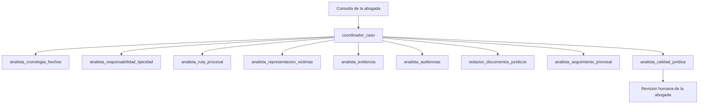

# Documento Unico de Aprobacion — Sistema Penal-Victimas (Colombia)

**Version:** 1.0  
**Fecha de generacion:** 2026-08-03 20:44  
**Audiencia:** Abogada lider del despacho  
**Proposito:** Revisar, aprobar o editar los 11 agentes, 90 skills y reglas del sistema en un solo lugar.

---

## Como usar este documento

1. Lea primero las partes 1 a 7 para entender el sistema completo.
2. Revise cada agente en la parte 8 (hay 11).
3. Revise cada skill en la parte 9 (hay 90).
4. Valide flujos de conversacion en la parte 10.
5. Complete el checklist maestro en la parte 11.
6. Use la parte 12 si necesita cambiar prompts, skills o reglas.

**Regla de oro:** La IA propone; la abogada revisa, ajusta y aprueba.

---

## Parte 0 — Resumen ejecutivo

Este sistema tiene **11 agentes** y **90 skills** para apoyar la representacion de victimas en casos penales en Colombia.

### Los 11 agentes

1. `coordinador_caso` — Coordinador del Caso
2. `analista_cronologia_hechos` — Cronología y Hechos
3. `analista_responsabilidad_tipicidad` — Tipicidad y Responsabilidad
4. `analista_ruta_procesal` — Ruta Procesal Ley 906
5. `analista_representacion_victimas` — Representación de Víctimas
6. `analista_evidencia` — Evidencia y Pruebas
7. `analista_audiencias` — Audiencias Penales
8. `redactor_documentos_juridicos` — Redacción Documentos
9. `analista_seguimiento_procesal` — Seguimiento Procesal
10. `analista_calidad_juridica` — Control de Calidad Jurídica

### Que hace el sistema

- Ordena hechos y pruebas rapidamente.
- Ayuda a decidir la ruta procesal correcta bajo Ley 906.
- Produce borradores juridicos con trazabilidad.
- Controla riesgos: hechos sin soporte, citas no verificadas, tono revictimizante.
- Mantiene seguimiento de terminos y actuaciones.

### Que NO hace el sistema

- No reemplaza a la abogada.
- No firma ni radica documentos por cuenta propia.
- No atiende asuntos fuera de penal-victimas.
- No envia salidas externas sin revision humana.

**Checklist de aprobacion — Resumen ejecutivo**

| Decision | Marcar |
|---|---|
| APROBAR | [ ] |
| AJUSTAR | [ ] |
| ELIMINAR | [ ] |
| PENDIENTE | [ ] |

**Observaciones / cambios sugeridos:**

> (espacio para la abogada)

---

## Parte 1 — Por que estamos creando estos agentes

- Para ahorrar tiempo en tareas repetitivas (ordenar hechos, revisar pruebas, preparar borradores).
- Para mantener una forma de trabajo consistente en todos los casos penales de victimas.
- Para reducir errores graves: hechos sin soporte, citas no verificadas o pasos fuera de tiempo.
- Para mejorar la preparacion de audiencias y escritos con informacion clara y ordenada.
- Para que la abogada tenga control final con revision humana antes de usar cualquier salida importante.

## Parte 2 — Que valor aportan

- **Mas productividad:** menos tiempo operativo y mas tiempo para estrategia legal.
- **Mas calidad:** mejores borradores iniciales y mejor trazabilidad de fuentes.
- **Menos riesgo:** controles para evitar inventar datos, normas o decisiones.
- **Mejor servicio a la victima:** respuestas mas claras y centradas en sus derechos.

---

## Parte 3 — Alcance y limites

### Alcance habilitado

- Jurisdiccion: Colombia.
- Materia: penal con enfoque en representacion de victimas.
- Marco principal: Ley 906 de 2004, Constitucion Politica y jurisprudencia aplicable.

### Limites no negociables

- El sistema no sustituye criterio profesional ni firma del abogado.
- No se inventan hechos, normas, sentencias, radicados ni autoridades.
- Toda salida externa requiere validacion humana.
- Los datos sensibles se tratan con minimizacion y confidencialidad.
- Si llega un asunto fuera de penal-victimas, el sistema lo declara fuera de alcance.

**Checklist de aprobacion — Alcance y limites**

| Decision | Marcar |
|---|---|
| APROBAR | [ ] |
| AJUSTAR | [ ] |
| ELIMINAR | [ ] |
| PENDIENTE | [ ] |

**Observaciones / cambios sugeridos:**

> (espacio para la abogada)

---

## Parte 4 — Arquitectura del sistema

```mermaid
flowchart TD
  userConsulta[Consulta de la abogada] --> coordinator[coordinador_caso]
  coordinator --> hechos[analista_cronologia_hechos]
  coordinator --> tipicidad[analista_responsabilidad_tipicidad]
  coordinator --> ruta906[analista_ruta_procesal]
  coordinator --> victimas[analista_representacion_victimas]
  coordinator --> evidencia[analista_evidencia]
  coordinator --> audiencias[analista_audiencias]
  coordinator --> redaccion[redactor_documentos_juridicos]
  coordinator --> seguimiento[analista_seguimiento_procesal]
  coordinator --> calidad[analista_calidad_juridica]
  calidad --> hitl[Revision humana de la abogada]
```

### Lectura simple de la arquitectura

1. La abogada hace una consulta.
2. El **coordinador** entiende que necesita y envia al especialista correcto.
3. El **especialista** trabaja con sus skills y produce un borrador o analisis.
4. El **analista de calidad** revisa antes de entregar.
5. La **abogada** aprueba, ajusta o rechaza.

**Checklist de aprobacion — Arquitectura**

| Decision | Marcar |
|---|---|
| APROBAR | [ ] |
| AJUSTAR | [ ] |
| ELIMINAR | [ ] |
| PENDIENTE | [ ] |

**Observaciones / cambios sugeridos:**

> (espacio para la abogada)

---

## Parte 5 — Reglas del sistema (guardrails)

Estas reglas protegen la calidad juridica y la responsabilidad profesional:

| Regla | Que significa en la practica |
|---|---|
| No inventar | Si no hay fuente verificada, se marca como pendiente de verificar |
| Pedir datos faltantes | Si faltan hechos, etapa o radicado, el sistema pregunta antes de concluir |
| Separar hecho de inferencia | Distingue lo confirmado, lo narrado y lo inferido |
| Revision humana obligatoria | Escritos, estrategia, tutela y reportes a cliente requieren aprobacion |
| No revictimizar | El lenguaje no culpa ni expone indebidamente a la victima |
| Confidencialidad | Detecta y controla datos sensibles innecesarios |
| Fuera de alcance | Consultas no penales se declaran fuera de alcance penal-victimas |
| Aviso de borrador | Toda respuesta termina con aviso de revision profesional |

### Cuando se activa revision humana obligatoria

Se activa cuando la consulta o respuesta involucra: redaccion, escritos, recursos, solicitudes, memoriales, tutela, estrategia, seguimiento, informes, radicacion, audiencias o entrevistas.

**Checklist de aprobacion — Guardrails**

| Decision | Marcar |
|---|---|
| APROBAR | [ ] |
| AJUSTAR | [ ] |
| ELIMINAR | [ ] |
| PENDIENTE | [ ] |

**Observaciones / cambios sugeridos:**

> (espacio para la abogada)

---

## Parte 6 — Base de conocimiento (fuentes internas)

El sistema consulta solo estos archivos de conocimiento penal:

| Archivo | Contenido esperado |
|---|---|
| `agente/conocimiento/penal.md` | Tipos penales, elementos, conceptos sustantivos |
| `agente/conocimiento/proceso-penal-906.md` | Etapas, actuaciones, terminos Ley 906 |
| `agente/conocimiento/normas-clave.md` | Normas constitucionales y legales de referencia |

**Principio:** toda afirmacion juridica debe tener fuente verificable o marcarse como pendiente.

**Checklist de aprobacion — Base de conocimiento RAG**

| Decision | Marcar |
|---|---|
| APROBAR | [ ] |
| AJUSTAR | [ ] |
| ELIMINAR | [ ] |
| PENDIENTE | [ ] |

**Observaciones / cambios sugeridos:**

> (espacio para la abogada)

---

## Parte 7 — URLs oficiales y reputables

### Normativa y vigencia

- SUIN-Juriscol: https://www.suin-juriscol.gov.co/
- Ley 906 consolidada: http://www.secretariasenado.gov.co/senado/basedoc/ley_0906_2004.html
- Diario Oficial: https://svrpubindc.imprenta.gov.co/diario/index.xhtml

### Jurisprudencia

- Corte Constitucional — Relatoria: https://corteconstitucional.gov.co/relatoria/
- Corte Suprema — Sala Penal: https://cortesuprema.gov.co/sala-de-casacion-penal-relatoria/
- Consulta jurisprudencial (CENDOJ): https://consultajurisprudencial.ramajudicial.gov.co/WebRelatoria/csj/index.xhtml

### Estado procesal y entidades

- Consulta de procesos Rama Judicial: https://consultaprocesos.ramajudicial.gov.co/Procesos/Index
- Fiscalia General de la Nacion: https://www.fiscalia.gov.co/
- Instituto Nacional de Medicina Legal: https://www.medicinalegal.gov.co/

**Checklist de aprobacion — URLs oficiales**

| Decision | Marcar |
|---|---|
| APROBAR | [ ] |
| AJUSTAR | [ ] |
| ELIMINAR | [ ] |
| PENDIENTE | [ ] |

**Observaciones / cambios sugeridos:**

> (espacio para la abogada)

---

## Parte 8 — Los 11 agentes (detalle para aprobacion)

### 8.1 `coordinador_caso`

**Nombre corto:** Coordinador del Caso

**Proposito:** Coordina el caso: recibe la consulta, verifica completitud y prioridad, asigna al especialista correcto y responde con una sola voz de despacho.

**Problema que resuelve:** Evita respuestas mal enfocadas y actuaciones sobre expedientes incompletos; ordena el trabajo por prioridad legal y urgencia.

**Por que es necesario en Colombia:** En penal-victimas la estrategia cambia por etapa Ley 906; esta coordinación reduce errores de enfoque y pérdida de términos.

**No reemplaza:** El analisis de fondo por especialidad ni la aprobacion y firma final del abogado titular.

**Prompt del agente (lenguaje simple):**

- Solo trabaja en casos de penal-victimas en Colombia.
- Antes de todo, verifica que el caso tenga los datos y documentos minimos.
- Decide a que especialista enviar cada consulta segun necesidad del caso.
- Si faltan datos importantes, primero los pide antes de dar una conclusion.
- No inventa normas, sentencias, radicados ni hechos.

**Skills asignados (5):**

- `actualizar_tareas_responsable` — ver seccion 9
- `clasificar_tarea_y_etapa` — ver seccion 9
- `detectar_urgencia_penal` — ver seccion 9
- `gestionar_faltantes_expediente` — ver seccion 9
- `marcar_pendientes_verificacion` — ver seccion 9

**Checklist de aprobacion — Agente coordinador_caso**

| Decision | Marcar |
|---|---|
| APROBAR | [ ] |
| AJUSTAR | [ ] |
| ELIMINAR | [ ] |
| PENDIENTE | [ ] |

**Observaciones / cambios sugeridos:**

> (espacio para la abogada)

---

### 8.2 `analista_cronologia_hechos`

**Nombre corto:** Cronología y Hechos

**Proposito:** Convierte relatos y documentos en una historia factual ordenada y verificable.

**Problema que resuelve:** Evita contradicciones y vacios de hecho que debilitan memoriales o solicitudes.

**Por que es necesario en Colombia:** En litigio penal, la consistencia factual impacta tipicidad, audiencia y credibilidad.

**No reemplaza:** La calificacion penal definitiva.

**Prompt del agente (lenguaje simple):**

- Ordena hechos en linea de tiempo con fechas y actores.
- Separa hechos confirmados, narrados e inferidos.
- Detecta contradicciones y vacios factuales.
- No inventa hechos ni fuentes.

**Skills asignados (11):**

- `clasificar_fuente_factual` — ver seccion 9
- `construir_cronologia_penal` — ver seccion 9
- `crear_matriz_hecho_fuente` — ver seccion 9
- `detectar_contradicciones_factuales` — ver seccion 9
- `detectar_vacios_factuales` — ver seccion 9
- `extraer_hechos_relevantes` — ver seccion 9
- `generar_preguntas_aclaracion` — ver seccion 9
- `generar_preguntas_testigos_peritos` — ver seccion 9
- `generar_preguntas_tipicidad` — ver seccion 9
- `identificar_actores_y_roles` — ver seccion 9
- `verificar_hechos_soportados` — ver seccion 9

**Checklist de aprobacion — Agente analista_cronologia_hechos**

| Decision | Marcar |
|---|---|
| APROBAR | [ ] |
| AJUSTAR | [ ] |
| ELIMINAR | [ ] |
| PENDIENTE | [ ] |

**Observaciones / cambios sugeridos:**

> (espacio para la abogada)

---

### 8.3 `analista_responsabilidad_tipicidad`

**Nombre corto:** Tipicidad y Responsabilidad

**Proposito:** Traduce hechos y pruebas en hipotesis juridicas de tipicidad y responsabilidad preliminar.

**Problema que resuelve:** Evita pedir actuaciones sin base tipica suficiente o con riesgo de atipicidad.

**Por que es necesario en Colombia:** Determina pertinencia de intervenciones en Ley 906 y fortalece teoria de caso de victima.

**No reemplaza:** El juicio del despacho sobre imputacion, acusacion o estrategia final.

**Prompt del agente (lenguaje simple):**

- Analiza tipicidad, autoria, participacion y dolo/culpa de forma preliminar.
- Identifica agravantes, atenuantes y riesgos de atipicidad.
- No afirma conclusiones definitivas.
- No inventa normas ni jurisprudencia.

**Skills asignados (9):**

- `analizar_autoria_y_participacion` — ver seccion 9
- `analizar_dolo_culpa_elemento_subjetivo` — ver seccion 9
- `construir_matriz_hecho_prueba` — ver seccion 9
- `descomponer_elementos_tipo_penal` — ver seccion 9
- `detectar_agravantes_atenuantes` — ver seccion 9
- `detectar_riesgos_atipicidad` — ver seccion 9
- `generar_preguntas_tipicidad` — ver seccion 9
- `identificar_conductas_punibles_preliminares` — ver seccion 9
- `mapear_tipo_penal_hecho_prueba` — ver seccion 9

**Checklist de aprobacion — Agente analista_responsabilidad_tipicidad**

| Decision | Marcar |
|---|---|
| APROBAR | [ ] |
| AJUSTAR | [ ] |
| ELIMINAR | [ ] |
| PENDIENTE | [ ] |

**Observaciones / cambios sugeridos:**

> (espacio para la abogada)

---

### 8.4 `analista_ruta_procesal`

**Nombre corto:** Ruta Procesal Ley 906

**Proposito:** Ubica la etapa exacta y la mejor ruta procesal para representar a la victima.

**Problema que resuelve:** Evita extemporaneidad, improcedencia y solicitudes mal dirigidas.

**Por que es necesario en Colombia:** Ley 906 exige precision de oportunidad y forma en cada actuacion.

**No reemplaza:** El seguimiento operativo diario del radicado.

**Prompt del agente (lenguaje simple):**

- Identifica etapa procesal y oportunidades de intervencion.
- Evalua terminos, riesgos procesales y actuaciones posibles.
- Propone ruta recomendada para la victima.
- No hace seguimiento operativo diario.

**Skills asignados (13):**

- `analizar_intervencion_victima` — ver seccion 9
- `clasificar_tarea_y_etapa` — ver seccion 9
- `controlar_terminos_procesales_preliminares` — ver seccion 9
- `crear_ruta_procesal_recomendada` — ver seccion 9
- `detectar_inactividad_procesal` — ver seccion 9
- `detectar_riesgos_procesales` — ver seccion 9
- `evaluar_oportunidad_procesal` — ver seccion 9
- `evaluar_solicitud_fiscalia_juez` — ver seccion 9
- `generar_alertas_terminos_vencimientos` — ver seccion 9
- `identificar_etapa_procesal_ley906` — ver seccion 9
- `mapear_actuaciones_posibles_victima` — ver seccion 9
- `preparar_solicitudes_orales` — ver seccion 9
- `redactar_recurso_o_intervencion_preliminar` — ver seccion 9

**Checklist de aprobacion — Agente analista_ruta_procesal**

| Decision | Marcar |
|---|---|
| APROBAR | [ ] |
| AJUSTAR | [ ] |
| ELIMINAR | [ ] |
| PENDIENTE | [ ] |

**Observaciones / cambios sugeridos:**

> (espacio para la abogada)

---

### 8.5 `analista_representacion_victimas`

**Nombre corto:** Representación de Víctimas

**Proposito:** Garantiza que la estrategia este centrada en derechos, intereses y no revictimizacion.

**Problema que resuelve:** Evita estrategias tecnicamente correctas pero desconectadas del objetivo real de la victima.

**Por que es necesario en Colombia:** La representacion de victimas exige enfoque diferencial y proteccion de derechos fundamentales.

**No reemplaza:** La decision politica o reputacional del despacho sobre el caso.

**Prompt del agente (lenguaje simple):**

- Construye teoria del caso desde derechos e intereses de la victima.
- Evalua dano, afectacion y riesgo de revictimizacion.
- Aplica enfoque diferencial cuando corresponda.
- No promete resultados judiciales.

**Skills asignados (15):**

- `alinear_estrategia_prueba_proceso` — ver seccion 9
- `analizar_derechos_victima` — ver seccion 9
- `analizar_enfoque_diferencial` — ver seccion 9
- `construir_teoria_caso_victima` — ver seccion 9
- `controlar_no_revictimizacion` — ver seccion 9
- `crear_plan_recaudo_probatorio` — ver seccion 9
- `crear_resumen_ejecutivo_litigante` — ver seccion 9
- `detectar_brechas_probatorias` — ver seccion 9
- `detectar_riesgo_revictimizacion` — ver seccion 9
- `evaluar_dano_y_afectacion` — ver seccion 9
- `evaluar_suficiencia_probatoria` — ver seccion 9
- `identificar_actores_y_roles` — ver seccion 9
- `identificar_intereses_victima` — ver seccion 9
- `mapear_actuaciones_posibles_victima` — ver seccion 9
- `priorizar_objetivos_representacion` — ver seccion 9

**Checklist de aprobacion — Agente analista_representacion_victimas**

| Decision | Marcar |
|---|---|
| APROBAR | [ ] |
| AJUSTAR | [ ] |
| ELIMINAR | [ ] |
| PENDIENTE | [ ] |

**Observaciones / cambios sugeridos:**

> (espacio para la abogada)

---

### 8.6 `analista_evidencia`

**Nombre corto:** Evidencia y Pruebas

**Proposito:** Transforma evidencia dispersa en inventario util y plan probatorio accionable.

**Problema que resuelve:** Reduce perdida de evidencia, falta de cadena de custodia y brechas probatorias.

**Por que es necesario en Colombia:** Sin soporte probatorio claro, la estrategia de victima se debilita en audiencia y escritos.

**No reemplaza:** La pericia tecnica forense ni la cadena de custodia certificada.

**Prompt del agente (lenguaje simple):**

- Inventaria evidencia y construye matriz hecho-prueba.
- Detecta brechas y propone plan de recaudo.
- Marca escalamiento cuando la cadena de custodia es estricta.
- No altera ni manipula evidencia.

**Skills asignados (11):**

- `clasificar_tipo_prueba` — ver seccion 9
- `construir_matriz_hecho_prueba` — ver seccion 9
- `controlar_cadena_custodia_preliminar` — ver seccion 9
- `crear_plan_recaudo_probatorio` — ver seccion 9
- `detectar_brechas_probatorias` — ver seccion 9
- `evaluar_suficiencia_probatoria` — ver seccion 9
- `extraer_hechos_relevantes` — ver seccion 9
- `generar_preguntas_aclaracion` — ver seccion 9
- `inventariar_evidencia` — ver seccion 9
- `mapear_tipo_penal_hecho_prueba` — ver seccion 9
- `preservar_evidencia_digital` — ver seccion 9

**Checklist de aprobacion — Agente analista_evidencia**

| Decision | Marcar |
|---|---|
| APROBAR | [ ] |
| AJUSTAR | [ ] |
| ELIMINAR | [ ] |
| PENDIENTE | [ ] |

**Observaciones / cambios sugeridos:**

> (espacio para la abogada)

---

### 8.7 `analista_audiencias`

**Nombre corto:** Audiencias Penales

**Proposito:** Prepara audiencias con objetivo, guion, preguntas y solicitudes.

**Problema que resuelve:** Evita improvisacion y omisiones tacticas.

**Por que es necesario en Colombia:** Las audiencias en Ley 906 son determinantes y exigen preparacion tecnica previa.

**No reemplaza:** La intervencion oral de quien representa en estrados.

**Prompt del agente (lenguaje simple):**

- Define objetivo juridico y tactico de la audiencia.
- Prepara guion, solicitudes, preguntas y contraargumentos.
- Entrega checklist previo a la audiencia.
- No reemplaza la intervencion oral del abogado.

**Skills asignados (15):**

- `analizar_intervencion_victima` — ver seccion 9
- `construir_cronologia_penal` — ver seccion 9
- `construir_matriz_hecho_prueba` — ver seccion 9
- `construir_teoria_caso_victima` — ver seccion 9
- `controlar_audiencias` — ver seccion 9
- `crear_checklist_previo_audiencia` — ver seccion 9
- `crear_resumen_ejecutivo_litigante` — ver seccion 9
- `detectar_riesgos_audiencia` — ver seccion 9
- `generar_preguntas_testigos_peritos` — ver seccion 9
- `identificar_objetivo_audiencia` — ver seccion 9
- `preparar_contraargumentos` — ver seccion 9
- `preparar_guion_intervencion_oral` — ver seccion 9
- `preparar_preguntas_audiencia` — ver seccion 9
- `preparar_solicitudes_orales` — ver seccion 9
- `simular_escenarios_audiencia` — ver seccion 9

**Checklist de aprobacion — Agente analista_audiencias**

| Decision | Marcar |
|---|---|
| APROBAR | [ ] |
| AJUSTAR | [ ] |
| ELIMINAR | [ ] |
| PENDIENTE | [ ] |

**Observaciones / cambios sugeridos:**

> (espacio para la abogada)

---

### 8.8 `redactor_documentos_juridicos`

**Nombre corto:** Redacción Documentos

**Proposito:** Convierte analisis juridico en escritos utilizables por el despacho.

**Problema que resuelve:** Reduce tiempo de redaccion y mejora estandar tecnico del primer borrador.

**Por que es necesario en Colombia:** Memoriales, solicitudes y recursos exigen estructura y soporte normativo preciso.

**No reemplaza:** El criterio de firma y aprobacion de radicacion.

**Prompt del agente (lenguaje simple):**

- Redacta borradores de memoriales, solicitudes, ampliaciones y recursos.
- Estructura hechos, fundamentos y peticiones.
- Marca pendientes de verificacion.
- No inventa hechos, citas, radicados ni anexos.

**Skills asignados (15):**

- `controlar_separacion_hecho_inferencia` — ver seccion 9
- `controlar_tono_juridico_documento` — ver seccion 9
- `controlar_tono_riesgo_reputacional` — ver seccion 9
- `estructurar_hechos_fundamentos_solicitudes` — ver seccion 9
- `evaluar_derecho_peticion` — ver seccion 9
- `evaluar_solicitud_fiscalia_juez` — ver seccion 9
- `extraer_hechos_relevantes` — ver seccion 9
- `redactar_ampliacion_denuncia` — ver seccion 9
- `redactar_derecho_peticion_penal` — ver seccion 9
- `redactar_memorial_penal` — ver seccion 9
- `redactar_recurso_o_intervencion_preliminar` — ver seccion 9
- `redactar_solicitud_impulso_procesal` — ver seccion 9
- `verificar_citas_normativas` — ver seccion 9
- `verificar_hechos_soportados` — ver seccion 9
- `verificar_jurisprudencia` — ver seccion 9

**Checklist de aprobacion — Agente redactor_documentos_juridicos**

| Decision | Marcar |
|---|---|
| APROBAR | [ ] |
| AJUSTAR | [ ] |
| ELIMINAR | [ ] |
| PENDIENTE | [ ] |

**Observaciones / cambios sugeridos:**

> (espacio para la abogada)

---

### 8.9 `analista_seguimiento_procesal`

**Nombre corto:** Seguimiento Procesal

**Proposito:** Monitorea estado de radicado, actuaciones, audiencias y terminos.

**Problema que resuelve:** Evita perdida de oportunidad por falta de control operativo.

**Por que es necesario en Colombia:** La trazabilidad procesal diaria impacta calidad de defensa de derechos de victima.

**No reemplaza:** El analisis juridico estrategico.

**Prompt del agente (lenguaje simple):**

- Monitorea radicados, actuaciones y audiencias.
- Genera alertas de terminos y vencimientos.
- Produce reportes de estado del caso.
- Funcion operativa, no estrategica.

**Skills asignados (12):**

- `actualizar_tareas_responsable` — ver seccion 9
- `controlar_terminos_procesales_preliminares` — ver seccion 9
- `crear_reporte_estado_caso` — ver seccion 9
- `detectar_inactividad_procesal` — ver seccion 9
- `detectar_urgencia_penal` — ver seccion 9
- `evaluar_derecho_peticion` — ver seccion 9
- `generar_alertas_terminos_vencimientos` — ver seccion 9
- `monitorear_radicado` — ver seccion 9
- `preparar_resumen_operativo_cliente` — ver seccion 9
- `redactar_solicitud_impulso_procesal` — ver seccion 9
- `registrar_actuacion_procesal` — ver seccion 9
- `seguimiento_documentos_radicados` — ver seccion 9

**Checklist de aprobacion — Agente analista_seguimiento_procesal**

| Decision | Marcar |
|---|---|
| APROBAR | [ ] |
| AJUSTAR | [ ] |
| ELIMINAR | [ ] |
| PENDIENTE | [ ] |

**Observaciones / cambios sugeridos:**

> (espacio para la abogada)

---

### 8.10 `analista_calidad_juridica`

**Nombre corto:** Control de Calidad Jurídica

**Proposito:** Revisa salida final antes de compartir externamente.

**Problema que resuelve:** Disminuye riesgo de alucinacion legal, inconsistencia estrategica y filtracion de datos sensibles.

**Por que es necesario en Colombia:** Refuerza responsabilidad profesional del despacho y soporte de auditoria interna.

**No reemplaza:** La aprobacion final de quien representa.

**Prompt del agente (lenguaje simple):**

- Verifica soporte factico, citas normativas y coherencia estrategica.
- Controla confidencialidad y no revictimizacion.
- Clasifica si la salida es aprobable, requiere cambios o debe rechazarse.
- Nunca aprueba automaticamente sin marcar hallazgos.

**Skills asignados (26):**

- `alinear_estrategia_prueba_proceso` — ver seccion 9
- `analizar_enfoque_diferencial` — ver seccion 9
- `clasificar_aprobacion_juridica` — ver seccion 9
- `controlar_audiencias` — ver seccion 9
- `controlar_cadena_custodia_preliminar` — ver seccion 9
- `controlar_confidencialidad_datos_sensibles` — ver seccion 9
- `controlar_no_revictimizacion` — ver seccion 9
- `controlar_separacion_hecho_inferencia` — ver seccion 9
- `controlar_tono_juridico_documento` — ver seccion 9
- `controlar_tono_riesgo_reputacional` — ver seccion 9
- `crear_checklist_previo_audiencia` — ver seccion 9
- `crear_matriz_hecho_fuente` — ver seccion 9
- `detectar_alucinaciones_legales` — ver seccion 9
- `detectar_contradicciones_factuales` — ver seccion 9
- `detectar_riesgo_revictimizacion` — ver seccion 9
- `detectar_riesgos_atipicidad` — ver seccion 9
- `detectar_riesgos_audiencia` — ver seccion 9
- `detectar_riesgos_procesales` — ver seccion 9
- `detectar_urgencia_penal` — ver seccion 9
- `evaluar_oportunidad_procesal` — ver seccion 9
- `mapear_tipo_penal_hecho_prueba` — ver seccion 9
- `preparar_resumen_operativo_cliente` — ver seccion 9
- `revisar_coherencia_estrategica` — ver seccion 9
- `verificar_citas_normativas` — ver seccion 9
- `verificar_hechos_soportados` — ver seccion 9
- `verificar_jurisprudencia` — ver seccion 9

**Checklist de aprobacion — Agente analista_calidad_juridica**

| Decision | Marcar |
|---|---|
| APROBAR | [ ] |
| AJUSTAR | [ ] |
| ELIMINAR | [ ] |
| PENDIENTE | [ ] |

**Observaciones / cambios sugeridos:**

> (espacio para la abogada)

---

## Parte 9 — Los 90 skills (ficha detallada)

Cada skill es una capacidad atomica que un agente usa para una tarea especifica.

### Categoria: Skills de audiencias

#### 9.1 `controlar_audiencias`

**Para que sirve:** Controlar que la preparación de audiencia cumpla requisitos formales y sustantivos Ley 906 antes de la intervención.

**Archivo:** `agente/skills/controlar_audiencias/SKILL.md`

**Agentes que lo usan:** `analista_audiencias`, `analista_calidad_juridica`

**Instruccion tipo:** Administrar fechas, horas, enlaces y preparacion de audiencias.

**Que necesita para funcionar (entradas):**

- Tipo de audiencia, fecha y etapa procesal.
- Objetivo, guion, preguntas y solicitudes orales preparadas.
- Plazos y requisitos de intervención de la víctima.

**Que produce (salidas):**

- `checklist`: ítem | cumple | no_cumple | pendiente.
- `bloqueantes` que impiden intervenir sin corrección.
- Etiqueta: `CONTROL AUDIENCIA — REVISAR CON ABOGADO`.

**Pasos del skill:**

1. Registrar fechas, horas, enlaces y tipo de audiencia.
2. Vincular audiencia con checklist de preparación.
3. Alertar conflictos de agenda o datos incompletos.
4. Entregar salida estructurada, marcar `[PENDIENTE DE VERIFICAR]` lo no soportado y someter a revisión humana.

**Herramientas:** `buscar_en_expediente`, `buscar_en_conocimiento`, `leer_area_derecho`, `leer_playbook_proceso`, `leer_normas_clave`, `listar_areas_derecho`

**Cuidados y riesgos:**

- **g4:** HITL obligatorio antes de audiencia.
- **g8:** Aviso de revisión profesional.

**Checklist de aprobacion — Skill controlar_audiencias**

| Decision | Marcar |
|---|---|
| APROBAR | [ ] |
| AJUSTAR | [ ] |
| ELIMINAR | [ ] |
| PENDIENTE | [ ] |

**Observaciones / cambios sugeridos:**

> (espacio para la abogada)

#### 9.2 `crear_checklist_previo_audiencia`

**Para que sirve:** Generar lista verificable de tareas y documentos antes de una audiencia penal.

**Archivo:** `agente/skills/crear_checklist_previo_audiencia/SKILL.md`

**Agentes que lo usan:** `analista_audiencias`, `analista_calidad_juridica`

**Instruccion tipo:** Listar requisitos antes de audiencia.

**Que necesita para funcionar (entradas):**

- Tipo de audiencia y fecha.
- Objetivo de audiencia (`identificar_objetivo_audiencia`).
- Materiales preparados (guion, preguntas, pruebas).

**Que produce (salidas):**

- Checklist: `ítem`, `responsable`, `estado` (listo | pendiente | no_aplica).
- `documentos_requeridos` y plazos internos.
- Etiqueta: `CHECKLIST PRE-AUDIENCIA`.

**Pasos del skill:**

1. Listar documentos, pruebas y autorizaciones requeridas para la audiencia.
2. Verificar fecha, enlace/sala, participantes y rol de la víctima.
3. Cerrar checklist con responsables y plazos de preparación.
4. Entregar salida estructurada, marcar `[PENDIENTE DE VERIFICAR]` lo no soportado y someter a revisión humana.

**Herramientas:** `buscar_en_expediente`, `buscar_en_conocimiento`, `leer_area_derecho`, `leer_playbook_proceso`, `leer_normas_clave`, `listar_areas_derecho`

**Cuidados y riesgos:**

- **g4:** HITL antes de audiencia.
- **g8:** Aviso de revisión profesional.

**Checklist de aprobacion — Skill crear_checklist_previo_audiencia**

| Decision | Marcar |
|---|---|
| APROBAR | [ ] |
| AJUSTAR | [ ] |
| ELIMINAR | [ ] |
| PENDIENTE | [ ] |

**Observaciones / cambios sugeridos:**

> (espacio para la abogada)

#### 9.3 `detectar_riesgos_audiencia`

**Para que sirve:** Identificar riesgos tácticos y procesales específicos de una audiencia programada.

**Archivo:** `agente/skills/detectar_riesgos_audiencia/SKILL.md`

**Agentes que lo usan:** `analista_audiencias`, `analista_calidad_juridica`

**Instruccion tipo:** Detectar riesgos de intervencion, oportunidad, revelacion de estrategia o revictimizacion.

**Que necesita para funcionar (entradas):**

- Tipo de audiencia, postura de Fiscalía/defensa (hipótesis).
- Debilidades probatorias y objetivo de audiencia.
- Antecedentes de audiencias previas en el caso.

**Que produce (salidas):**

- `riesgos`: descripción | probabilidad | impacto | mitigación sugerida.
- `riesgo_global`: alto | medio | bajo.
- Etiqueta: `RIESGOS AUDIENCIA PRELIMINARES`.

**Pasos del skill:**

1. Identificar riesgos de oportunidad, revelación de estrategia y revictimización.
2. Evaluar impacto de preguntas, solicitudes y exposición de la víctima.
3. Proponer mitigaciones y líneas rojas para la intervención.
4. Entregar salida estructurada, marcar `[PENDIENTE DE VERIFICAR]` lo no soportado y someter a revisión humana.

**Herramientas:** `buscar_en_expediente`, `buscar_en_conocimiento`, `leer_area_derecho`, `leer_playbook_proceso`, `leer_normas_clave`, `listar_areas_derecho`

**Cuidados y riesgos:**

- **g3:** Riesgos son hipótesis, no predicciones certas.
- **g4:** HITL obligatorio antes de usar en audiencia o comunicar a terceros.
- **g8:** Aviso de revisión profesional.

**Checklist de aprobacion — Skill detectar_riesgos_audiencia**

| Decision | Marcar |
|---|---|
| APROBAR | [ ] |
| AJUSTAR | [ ] |
| ELIMINAR | [ ] |
| PENDIENTE | [ ] |

**Observaciones / cambios sugeridos:**

> (espacio para la abogada)

#### 9.4 `generar_preguntas_testigos_peritos`

**Para que sirve:** Formular preguntas para testigos o peritos (no para la víctima) alineadas a hechos pendientes de aclarar.

**Archivo:** `agente/skills/generar_preguntas_testigos_peritos/SKILL.md`

**Agentes que lo usan:** `analista_audiencias`, `analista_cronologia_hechos`

**Instruccion tipo:** Preparar preguntas neutrales para testigos o peritos.

**Que necesita para funcionar (entradas):**

- Matriz hecho-prueba y vacíos factuales.
- Tipo de testigo/perito y objeto de su declaración.
- Objetivo probatorio por bloque.

**Que produce (salidas):**

- Preguntas: `destinatario` (testigo | perito), `pregunta`, `hecho_que_aclara`, `riesgo` (bajo | medio).
- Etiqueta: `PREGUNTAS TERCEROS — NO VÍCTIMA`.

**Pasos del skill:**

1. Seleccionar testigos/peritos según hechos a esclarecer.
2. Formular preguntas neutrales alineadas con matriz hecho-prueba.
3. Evitar preguntas inductivas o revictimizantes.
4. Entregar salida estructurada, marcar `[PENDIENTE DE VERIFICAR]` lo no soportado y someter a revisión humana.

**Herramientas:** `buscar_en_expediente`, `buscar_en_conocimiento`, `leer_area_derecho`, `leer_playbook_proceso`, `leer_normas_clave`, `listar_areas_derecho`

**Cuidados y riesgos:**

- **g4:** HITL antes de audiencia.
- **g8:** Aviso de revisión profesional.

**Checklist de aprobacion — Skill generar_preguntas_testigos_peritos**

| Decision | Marcar |
|---|---|
| APROBAR | [ ] |
| AJUSTAR | [ ] |
| ELIMINAR | [ ] |
| PENDIENTE | [ ] |

**Observaciones / cambios sugeridos:**

> (espacio para la abogada)

#### 9.5 `identificar_objetivo_audiencia`

**Para que sirve:** Definir qué debe lograr la víctima en la audiencia: objetivo jurídico (Ley 906) y táctico (postura procesal).

**Archivo:** `agente/skills/identificar_objetivo_audiencia/SKILL.md`

**Agentes que lo usan:** `analista_audiencias`

**Instruccion tipo:** Definir objetivo juridico y tactico de la audiencia para la victima.

**Que necesita para funcionar (entradas):**

- Tipo de audiencia programada (legalización, formulación, juicio, etc.).
- Etapa procesal y actuación que se discute.
- Teoría del caso y matriz hecho-prueba (preliminar).
- Peticiones o pretensiones ya planteadas en expediente.

**Que produce (salidas):**

- `tipo_audiencia` y norma Ley 906 habilitante.
- `objetivo_juridico`: qué se pide al juez/Fiscalía según la ley.
- `objetivo_tactico`: postura procesal (presionar recaudo, oponerse, participar, etc.).
- `peticiones_orientativas` alineadas al objetivo.
- `coherencia_teoria_caso`: alineado | parcial | `[PENDIENTE DE VERIFICAR]`.
- Etiqueta: `OBJETIVO AUDIENCIA — VALIDAR CON ABOGADO`.

**Pasos del skill:**

1. Precisar tipo de audiencia y marco normativo Ley 906 aplicable.
2. Definir objetivo jurídico y táctico para la representación de la víctima.
3. Alinear objetivo con teoría del caso y prueba disponible.
4. Documentar peticiones orientativas y riesgos si no se logra el objetivo.
5. Entregar salida estructurada, marcar `[PENDIENTE DE VERIFICAR]` lo no soportado y someter a revisión humana.

**Herramientas:** `buscar_en_expediente`, `buscar_en_conocimiento`, `leer_area_derecho`, `leer_playbook_proceso`, `leer_normas_clave`, `listar_areas_derecho`

**Cuidados y riesgos:**

- **g1:** No inventar tipo de audiencia ni competencias.
- **g3:** Objetivo táctico separado de hechos probados.
- **g4:** HITL antes de audiencia.
- **g8:** Aviso de revisión profesional.

**Checklist de aprobacion — Skill identificar_objetivo_audiencia**

| Decision | Marcar |
|---|---|
| APROBAR | [ ] |
| AJUSTAR | [ ] |
| ELIMINAR | [ ] |
| PENDIENTE | [ ] |

**Observaciones / cambios sugeridos:**

> (espacio para la abogada)

#### 9.6 `preparar_contraargumentos`

**Para que sirve:** Anticipar argumentos de defensa o Fiscalía y preparar réplicas para audiencia o memorial.

**Archivo:** `agente/skills/preparar_contraargumentos/SKILL.md`

**Agentes que lo usan:** `analista_audiencias`

**Instruccion tipo:** Anticipar argumentos de defensa, Fiscalia u otros intervinientes.

**Que necesita para funcionar (entradas):**

- Teoría del caso contraria (hipótesis documentada).
- Prueba disponible y matriz hecho-prueba.
- Tipo de audiencia u escrito objetivo.

**Que produce (salidas):**

- `contraargumentos`: argumento_ajeno | réplica_sugerida | prueba_de_apoyo | riesgo.
- Etiqueta: `HIPÓTESIS TÁCTICA — NO AFIRMAR HECHOS NO PROBADOS`.

**Pasos del skill:**

1. Anticipar líneas de defensa, Fiscalía y otros intervinientes probables.
2. Formular réplicas con soporte fáctico y normativo preliminar.
3. Priorizar contraargumentos según objetivo de audiencia.
4. Entregar salida estructurada, marcar `[PENDIENTE DE VERIFICAR]` lo no soportado y someter a revisión humana.

**Herramientas:** `buscar_en_expediente`, `buscar_en_conocimiento`, `leer_area_derecho`, `leer_playbook_proceso`, `leer_normas_clave`, `listar_areas_derecho`

**Cuidados y riesgos:**

- **g3:** Réplicas basadas en hechos soportados, no en especulación.
- **g4:** HITL obligatorio antes de usar en audiencia o memorial.
- **g8:** Aviso de revisión profesional.

**Checklist de aprobacion — Skill preparar_contraargumentos**

| Decision | Marcar |
|---|---|
| APROBAR | [ ] |
| AJUSTAR | [ ] |
| ELIMINAR | [ ] |
| PENDIENTE | [ ] |

**Observaciones / cambios sugeridos:**

> (espacio para la abogada)

#### 9.7 `preparar_guion_intervencion_oral`

**Para que sirve:** Armar guion breve de intervención oral del abogado de la víctima: apertura, argumento, réplicas y cierre con peticiones.

**Archivo:** `agente/skills/preparar_guion_intervencion_oral/SKILL.md`

**Agentes que lo usan:** `analista_audiencias`

**Instruccion tipo:** Estructurar intervencion oral clara y breve.

**Que necesita para funcionar (entradas):**

- Objetivo jurídico y táctico (`identificar_objetivo_audiencia`).
- Cronología verificada y matriz hecho-prueba.
- Tipo de audiencia, etapa Ley 906 y tiempo estimado de intervención.
- Contraargumentos anticipados (`preparar_contraargumentos`, si existe).

**Que produce (salidas):**

- Guion por bloques: `apertura`, `nucleo_argumentativo`, `replicas_criticas`, `cierre_peticiones`.
- Tiempo estimado por bloque (minutos).
- Frases marcadas `REVISAR_TONO` si riesgo de revictimización.
- Etiqueta: `GUION PRELIMINAR — ENSAYAR CON ABOGADO ANTES DE AUDIENCIA`.

**Pasos del skill:**

1. Definir objetivo jurídico y táctico de la intervención en audiencia.
2. Ubicar etapa procesal y norma Ley 906 que habilita la intervención.
3. Estructurar apertura breve con postura de la víctima.
4. Desarrollar núcleo argumentativo solo con hechos soportados.
5. Anticipar réplicas a defensa y Fiscalía en puntos críticos.
6. Revisar lenguaje para evitar revictimización y filtración de estrategia.
7. Cerrar con peticiones concretas alineadas al objetivo de audiencia.
8. Entregar salida estructurada, marcar `[PENDIENTE DE VERIFICAR]` lo no soportado y someter a revisión humana.

**Herramientas:** `buscar_en_expediente`, `buscar_en_conocimiento`, `leer_area_derecho`, `leer_playbook_proceso`, `leer_normas_clave`, `listar_areas_derecho`

**Cuidados y riesgos:**

- **g1:** No inventar hechos ni normas en el argumento oral.
- **g3:** Distinguir hechos soportados de hipótesis tácticas.
- **g4:** HITL obligatorio; no usar guion sin ensayo del abogado.
- **g5:** Lenguaje respetuoso; no exponer detalles gráficos innecesarios.
- **g8:** Aviso de revisión profesional.

**Checklist de aprobacion — Skill preparar_guion_intervencion_oral**

| Decision | Marcar |
|---|---|
| APROBAR | [ ] |
| AJUSTAR | [ ] |
| ELIMINAR | [ ] |
| PENDIENTE | [ ] |

**Observaciones / cambios sugeridos:**

> (espacio para la abogada)

#### 9.8 `preparar_preguntas_audiencia`

**Para que sirve:** Redactar preguntas neutrales y no inductivas para víctima, testigos o peritos, alineadas a matriz hecho-prueba y objetivo de audiencia.

**Archivo:** `agente/skills/preparar_preguntas_audiencia/SKILL.md`

**Agentes que lo usan:** `analista_audiencias`

**Instruccion tipo:** Sugerir preguntas para victima, testigos o peritos.

**Que necesita para funcionar (entradas):**

- Objetivo de audiencia (`identificar_objetivo_audiencia`).
- Matriz hecho-prueba y cronología verificada.
- Tipo de audiencia y etapa Ley 906.

**Que produce (salidas):**

- Preguntas por bloque: `destinatario`, `objetivo_probatorio`, `pregunta`, `riesgo`, `alternativa_segura`.
- Orden lógico; preguntas de alto riesgo señaladas.
- Etiqueta: `REVISAR CON ABOGADO — ESPECIALMENTE PREGUNTAS A VÍCTIMA`.

**Pasos del skill:**

1. Definir objetivo probatorio de cada bloque de preguntas.
2. Seleccionar destinatario (víctima, testigo, perito) según matriz hecho-prueba.
3. Redactar preguntas neutrales, no inductivas y en orden lógico.
4. Revisar cada pregunta con criterio de no revictimización.
5. Señalar preguntas de alto riesgo y alternativas más seguras.
6. Alinear preguntas con solicitudes orales previstas en la audiencia.
7. Entregar salida estructurada, marcar `[PENDIENTE DE VERIFICAR]` lo no soportado y someter a revisión humana.

**Herramientas:** `buscar_en_expediente`, `buscar_en_conocimiento`, `leer_area_derecho`, `leer_playbook_proceso`, `leer_normas_clave`, `listar_areas_derecho`

**Cuidados y riesgos:**

- **g4:** HITL obligatorio antes de audiencia.
- **g5:** No revictimizar; evitar preguntas sobre vida íntima no pertinente.
- **g8:** Aviso de revisión profesional.

**Checklist de aprobacion — Skill preparar_preguntas_audiencia**

| Decision | Marcar |
|---|---|
| APROBAR | [ ] |
| AJUSTAR | [ ] |
| ELIMINAR | [ ] |
| PENDIENTE | [ ] |

**Observaciones / cambios sugeridos:**

> (espacio para la abogada)

#### 9.9 `preparar_solicitudes_orales`

**Para que sirve:** Identificar y formular solicitudes orales procedentes según etapa y tipo de audiencia.

**Archivo:** `agente/skills/preparar_solicitudes_orales/SKILL.md`

**Agentes que lo usan:** `analista_audiencias`, `analista_ruta_procesal`

**Instruccion tipo:** Formular solicitudes orales posibles segun etapa.

**Que necesita para funcionar (entradas):**

- Etapa procesal y tipo de audiencia.
- Objetivo de intervención (`analizar_intervencion_victima`).
- Hechos y prueba disponibles.

**Que produce (salidas):**

- Lista: `solicitud`, `fundamento_normativo`, `hecho_soporte`, `prioridad`, `riesgo`.
- Etiqueta en ruta 906: `PRELIMINAR — DETALLE EN PREPARADOR AUDIENCIAS`.

**Pasos del skill:**

1. Identificar solicitudes orales procedentes según etapa y tipo de audiencia.
2. Formular peticiones con fundamento normativo preliminar.
3. Ordenar por prioridad y dependencias probatorias.
4. Entregar salida estructurada, marcar `[PENDIENTE DE VERIFICAR]` lo no soportado y someter a revisión humana.

**Herramientas:** `buscar_en_expediente`, `buscar_en_conocimiento`, `leer_area_derecho`, `leer_playbook_proceso`, `leer_normas_clave`, `listar_areas_derecho`

**Cuidados y riesgos:**

- **g1:** Fundamentos desde RAG.
- **g4:** HITL antes de audiencia.
- **g5:** Solicitudes que expongan víctima: señalar riesgo.
- **g8:** Aviso de revisión profesional.

**Checklist de aprobacion — Skill preparar_solicitudes_orales**

| Decision | Marcar |
|---|---|
| APROBAR | [ ] |
| AJUSTAR | [ ] |
| ELIMINAR | [ ] |
| PENDIENTE | [ ] |

**Observaciones / cambios sugeridos:**

> (espacio para la abogada)

#### 9.10 `simular_escenarios_audiencia`

**Para que sirve:** Anticipar escenarios favorable, intermedio y adverso en audiencia y preparar respuesta táctica del abogado.

**Archivo:** `agente/skills/simular_escenarios_audiencia/SKILL.md`

**Agentes que lo usan:** `analista_audiencias`

**Instruccion tipo:** Plantear escenarios probables y preparacion del abogado.

**Que necesita para funcionar (entradas):**

- Objetivo de audiencia y teoría del caso.
- Contraargumentos anticipados (`preparar_contraargumentos`, si existe).
- Fortalezas y debilidades probatorias preliminares.
- Postura probable de Fiscalía y defensa (hipótesis, no certezas).

**Que produce (salidas):**

- Tres escenarios: `favorable`, `intermedio`, `adverso` con descripción breve.
- `respuesta_tactica` por escenario (qué decir, qué pedir, qué evitar).
- `senales_cambio_escenario` durante la audiencia.
- Etiqueta: `SIMULACIÓN PRELIMINAR — NO PREDICE DECISIÓN DEL JUEZ`.

**Pasos del skill:**

1. Plantear escenarios favorable, intermedio y adverso probables.
2. Definir respuesta táctica para cada escenario.
3. Listar señales en audiencia que indiquen cambio de escenario.
4. Cruzar escenario adverso con plan de contingencia procesal.
5. Entregar salida estructurada, marcar `[PENDIENTE DE VERIFICAR]` lo no soportado y someter a revisión humana.

**Herramientas:** `buscar_en_expediente`, `buscar_en_conocimiento`, `leer_area_derecho`, `leer_playbook_proceso`, `leer_normas_clave`, `listar_areas_derecho`

**Cuidados y riesgos:**

- **g1:** No predecir decisiones del juez ni declaraciones de testigos no documentadas.
- **g3:** Escenarios son hipótesis tácticas, no hechos.
- **g4:** HITL; simulación para preparación del abogado, no para la víctima sin filtro.
- **g8:** Aviso de revisión profesional.

**Checklist de aprobacion — Skill simular_escenarios_audiencia**

| Decision | Marcar |
|---|---|
| APROBAR | [ ] |
| AJUSTAR | [ ] |
| ELIMINAR | [ ] |
| PENDIENTE | [ ] |

**Observaciones / cambios sugeridos:**

> (espacio para la abogada)

### Categoria: Skills de calidad juridica

#### 9.11 `clasificar_aprobacion_juridica`

**Para que sirve:** Emitir dictamen final de aprobación sobre salidas destinadas a uso externo o comunicación con cliente.

**Archivo:** `agente/skills/clasificar_aprobacion_juridica/SKILL.md`

**Agentes que lo usan:** `analista_calidad_juridica`

**Instruccion tipo:** Clasificar la salida como aprobable, aprobable con cambios, rechazada o escalar.

**Que necesita para funcionar (entradas):**

- Salida a evaluar (documento, análisis, recomendación).
- Hallazgos de: `detectar_alucinaciones_legales`, `verificar_hechos_soportados`, `controlar_no_revictimizacion`, `controlar_confidencialidad_datos_sensibles`, tono.
- Contexto del caso y tier del skill origen.

**Que produce (salidas):**

- `dictamen`: aprobable | con_cambios | rechazar | escalar.
- `hallazgos_por_categoria`: factual | normativo | tono | confidencialidad | revictimización | estrategia.
- `cambios_requeridos` (lista priorizada si aplica).
- Etiqueta: `ULTIMO_FILTRO_SALIDA_EXTERNA`.

**Pasos del skill:**

1. Revisar soporte fáctico, normativo y jurisprudencial de la salida.
2. Aplicar checklist de riesgos (alucinación, confidencialidad, tono, revictimización).
3. Entregar salida estructurada, marcar `[PENDIENTE DE VERIFICAR]` lo no soportado y someter a revisión humana.

**Herramientas:** `buscar_en_expediente`, `buscar_en_conocimiento`, `leer_area_derecho`, `leer_playbook_proceso`, `leer_normas_clave`, `listar_areas_derecho`

**Cuidados y riesgos:**

- **g4:** Nunca aprobar automáticamente con hallazgos críticos sin marcar `con_cambios` o `rechazar`.
- **g8:** Aviso de revisión profesional; dictamen preliminar de la IA.

**Checklist de aprobacion — Skill clasificar_aprobacion_juridica**

| Decision | Marcar |
|---|---|
| APROBAR | [ ] |
| AJUSTAR | [ ] |
| ELIMINAR | [ ] |
| PENDIENTE | [ ] |

**Observaciones / cambios sugeridos:**

> (espacio para la abogada)

#### 9.12 `controlar_confidencialidad_datos_sensibles`

**Para que sirve:** Detectar y mitigar exposición innecesaria de datos personales sensibles en salidas del sistema.

**Archivo:** `agente/skills/controlar_confidencialidad_datos_sensibles/SKILL.md`

**Agentes que lo usan:** `analista_calidad_juridica`

**Instruccion tipo:** Detectar datos sensibles o innecesarios.

**Que necesita para funcionar (entradas):**

- Texto o documento a revisar.
- Destinatario previsto (interno, cliente, juzgado, tercero).

**Que produce (salidas):**

- `datos_sensibles_detectados`: tipo | fragmento | necesidad (necesario | reducible | eliminar).
- `recomendacion`: publicar | redactar | solo_abogado.
- Etiqueta: `CONTROL LEY 1581 / DATOS SENSIBLES`.

**Pasos del skill:**

1. Detectar PII y datos sensibles innecesarios en la salida.
2. Proponer redacción alternativa o anonimización.
3. Entregar salida estructurada, marcar `[PENDIENTE DE VERIFICAR]` lo no soportado y someter a revisión humana.

**Herramientas:** `buscar_en_expediente`, `buscar_en_conocimiento`, `leer_area_derecho`, `leer_playbook_proceso`, `leer_normas_clave`, `listar_areas_derecho`

**Cuidados y riesgos:**

- **g6:** Minimización de datos por defecto.
- **g4:** HITL antes de compartir externamente.
- **g8:** Aviso de revisión profesional.

**Checklist de aprobacion — Skill controlar_confidencialidad_datos_sensibles**

| Decision | Marcar |
|---|---|
| APROBAR | [ ] |
| AJUSTAR | [ ] |
| ELIMINAR | [ ] |
| PENDIENTE | [ ] |

**Observaciones / cambios sugeridos:**

> (espacio para la abogada)

#### 9.13 `controlar_no_revictimizacion`

**Para que sirve:** Detectar lenguaje, preguntas o estrategias que culpen, minimicen o expongan indebidamente a la víctima; proponer reformulaciones.

**Archivo:** `agente/skills/controlar_no_revictimizacion/SKILL.md`

**Agentes que lo usan:** `analista_calidad_juridica`, `analista_representacion_victimas`

**Instruccion tipo:** Revisar que la salida no culpe ni exponga indebidamente a la victima.

**Que necesita para funcionar (entradas):**

- Texto a revisar (memorial, guion, preguntas, resumen cliente, teoría del caso).
- Tipo de audiencia o documento y destinatario (juez, víctima, Fiscalía).
- Contexto del delito (violencia sexual, intrafamiliar, etc.) si consta.

**Que produce (salidas):**

- `hallazgos`: lista con `fragmento`, `tipo_riesgo` (culpabilización | minimización | exposición_gráfica | dato_sensible_innecesario | pregunta_inductiva), `severidad` (alta | media | baja).
- `reformulaciones_sugeridas` por hallazgo.
- `riesgo_residual` y decisión recomendada: `ajustar` | `escalar_abogado` | `sin_hallazgos`.
- Etiqueta: `REVISIÓN REVICTIMIZACIÓN — NO ENVIAR SIN ABOGADO`.

**Pasos del skill:**

1. Revisar lenguaje que culpe, minimice o exponga indebidamente a la víctima.
2. Evaluar preguntas y estrategias propuestas con enfoque de derechos.
3. Detectar exposición innecesaria de datos sensibles o relato gráfico.
4. Proponer reformulaciones respetuosas y centradas en derechos.
5. Documentar riesgos residuales para decisión del abogado.
6. Entregar salida estructurada, marcar `[PENDIENTE DE VERIFICAR]` lo no soportado y someter a revisión humana.

**Herramientas:** `buscar_en_expediente`, `buscar_en_conocimiento`, `leer_area_derecho`, `leer_playbook_proceso`, `leer_normas_clave`, `listar_areas_derecho`

**Cuidados y riesgos:**

- **g1:** No inventar conductas de la víctima ni contexto no documentado.
- **g5:** Prohibido sugerir que la víctima “provocó”, “consintió tácitamente” o “debió denunciar antes” sin prueba.
- **g6:** No reproducir detalles gráficos innecesarios en reformulaciones.
- **g4:** HITL obligatorio; no aprobar salida con hallazgos de severidad alta.
- **g8:** Aviso de revisión profesional.

**Checklist de aprobacion — Skill controlar_no_revictimizacion**

| Decision | Marcar |
|---|---|
| APROBAR | [ ] |
| AJUSTAR | [ ] |
| ELIMINAR | [ ] |
| PENDIENTE | [ ] |

**Observaciones / cambios sugeridos:**

> (espacio para la abogada)

#### 9.14 `controlar_separacion_hecho_inferencia`

**Para que sirve:** Verificar que hechos confirmados, narrados, inferidos y pendientes estén claramente separados en la salida.

**Archivo:** `agente/skills/controlar_separacion_hecho_inferencia/SKILL.md`

**Agentes que lo usan:** `redactor_documentos_juridicos`, `analista_calidad_juridica`

**Instruccion tipo:** Verificar que no se confundan hechos probados, narrados, inferidos y pendientes.

**Que necesita para funcionar (entradas):**

- Texto del memorial, petición o análisis.
- Matriz hecho-fuente o cronología (si existe).

**Que produce (salidas):**

- `fragmentos`: texto | clasificación (confirmado | narrado | inferido | pendiente) | observación.
- `correcciones_sugeridas` para separar hecho de argumentación.
- Etiqueta: `CONTROL HECHO-INFERENCIA`.

**Pasos del skill:**

1. Etiquetar cada afirmación como hecho confirmado, narrado, inferido o pendiente.
2. Detectar conclusiones presentadas como hechos sin soporte.
3. Exigir corrección o marcación antes de uso externo.
4. Entregar salida estructurada, marcar `[PENDIENTE DE VERIFICAR]` lo no soportado y someter a revisión humana.

**Herramientas:** `buscar_en_expediente`, `buscar_en_conocimiento`, `leer_area_derecho`, `leer_playbook_proceso`, `leer_normas_clave`, `listar_areas_derecho`

**Cuidados y riesgos:**

- **g3:** No reclasificar hecho confirmado sin fuente.
- **g4:** HITL obligatorio antes de usar la salida en memorial, estrategia o comunicación con cliente.
- **g8:** Aviso de revisión profesional.

**Checklist de aprobacion — Skill controlar_separacion_hecho_inferencia**

| Decision | Marcar |
|---|---|
| APROBAR | [ ] |
| AJUSTAR | [ ] |
| ELIMINAR | [ ] |
| PENDIENTE | [ ] |

**Observaciones / cambios sugeridos:**

> (espacio para la abogada)

#### 9.15 `controlar_tono_juridico_documento`

**Para que sirve:** Revisar que el tono del escrito sea profesional, respetuoso y adecuado al destinatario judicial o administrativo.

**Archivo:** `agente/skills/controlar_tono_juridico_documento/SKILL.md`

**Agentes que lo usan:** `redactor_documentos_juridicos`, `analista_calidad_juridica`

**Instruccion tipo:** Asegurar tono formal, preciso, no agresivo y no especulativo.

**Que necesita para funcionar (entradas):**

- Borrador de memorial, petición o solicitud.
- Destinatario (juez, Fiscalía, autoridad administrativa).

**Que produce (salidas):**

- `hallazgos_tono`: agresivo | coloquial | emocional_excesivo | procesal_inadecuado | ok.
- `reformulaciones` sugeridas por fragmento.
- Etiqueta: `CONTROL TONO JURÍDICO`.

**Pasos del skill:**

1. Revisar borrador completo con criterios de tono formal y preciso.
2. Detectar agresividad, especulación o lenguaje no profesional.
3. Proponer correcciones manteniendo contenido jurídico.
4. Entregar salida estructurada, marcar `[PENDIENTE DE VERIFICAR]` lo no soportado y someter a revisión humana.

**Herramientas:** `buscar_en_expediente`, `buscar_en_conocimiento`, `leer_area_derecho`, `leer_playbook_proceso`, `leer_normas_clave`, `listar_areas_derecho`

**Cuidados y riesgos:**

- **g5:** Tono respetuoso con la víctima y las autoridades.
- **g4:** HITL obligatorio antes de usar la salida en memorial, estrategia o comunicación con cliente.
- **g8:** Aviso de revisión profesional.

**Checklist de aprobacion — Skill controlar_tono_juridico_documento**

| Decision | Marcar |
|---|---|
| APROBAR | [ ] |
| AJUSTAR | [ ] |
| ELIMINAR | [ ] |
| PENDIENTE | [ ] |

**Observaciones / cambios sugeridos:**

> (espacio para la abogada)

#### 9.16 `controlar_tono_riesgo_reputacional`

**Para que sirve:** Detectar contenido que exponga al despacho o a la víctima a riesgo reputacional o mediático innecesario.

**Archivo:** `agente/skills/controlar_tono_riesgo_reputacional/SKILL.md`

**Agentes que lo usan:** `redactor_documentos_juridicos`, `analista_calidad_juridica`

**Instruccion tipo:** Revisar tono profesional y evitar lenguaje riesgoso.

**Que necesita para funcionar (entradas):**

- Texto destinado a terceros (cliente, prensa, redes, contraparte no procesal).
- Contexto del caso y perfil público de las partes.

**Que produce (salidas):**

- `riesgos_reputacionales`: exposición_mediática | dato_sensible | acusación_pública | ok.
- `mitigaciones` recomendadas.
- Etiqueta: `SOLO_ABOGADO` si hay riesgo alto.

**Pasos del skill:**

1. Evaluar tono formal, preciso y no especulativo del documento.
2. Detectar expresiones agresivas, promesas de resultado o riesgo reputacional.
3. Sugerir ajustes de redacción profesional.
4. Entregar salida estructurada, marcar `[PENDIENTE DE VERIFICAR]` lo no soportado y someter a revisión humana.

**Herramientas:** `buscar_en_expediente`, `buscar_en_conocimiento`, `leer_area_derecho`, `leer_playbook_proceso`, `leer_normas_clave`, `listar_areas_derecho`

**Cuidados y riesgos:**

- **g6:** No amplificar datos sensibles en comunicaciones.
- **g4:** HITL obligatorio antes de comunicación externa.
- **g8:** Aviso de revisión profesional.

**Checklist de aprobacion — Skill controlar_tono_riesgo_reputacional**

| Decision | Marcar |
|---|---|
| APROBAR | [ ] |
| AJUSTAR | [ ] |
| ELIMINAR | [ ] |
| PENDIENTE | [ ] |

**Observaciones / cambios sugeridos:**

> (espacio para la abogada)

#### 9.17 `detectar_alucinaciones_legales`

**Para que sirve:** Detectar citas normativas, sentencias, radicados o hechos inventados o no localizables en fuentes verificables.

**Archivo:** `agente/skills/detectar_alucinaciones_legales/SKILL.md`

**Agentes que lo usan:** `analista_calidad_juridica`

**Instruccion tipo:** Detectar fuentes, hechos, conclusiones o citas inventadas.

**Que necesita para funcionar (entradas):**

- Documento, análisis o recomendación a revisar.
- Referencias citadas (artículos, sentencias, radicados, folios).
- Acceso RAG: normativo, jurisprudencia, expediente.

**Que produce (salidas):**

- `referencias_sospechosas`: lista con `tipo` (norma | sentencia | radicado | hecho), `fragmento`, `estado` (inventada | no_localizada | verificada | pendiente).
- `conteo`: verificadas / sospechosas / pendientes.
- `recomendacion`: `escalar_revision` | `corregir_antes_aprobacion` | `sin_hallazgos`.
- Etiqueta: `DETECCIÓN ALUCINACIONES — NO ES DICTAMEN DE APROBACIÓN`.

**Pasos del skill:**

1. Cruzar citas normativas, sentencias y radicados con fuentes verificables.
2. Marcar referencias inventadas o no localizadas en RAG.
3. Entregar salida estructurada, marcar `[PENDIENTE DE VERIFICAR]` lo no soportado y someter a revisión humana.

**Herramientas:** `buscar_en_expediente`, `buscar_en_conocimiento`, `leer_area_derecho`, `leer_playbook_proceso`, `leer_normas_clave`, `listar_areas_derecho`

**Cuidados y riesgos:**

- **g1:** No inventar verificaciones; si RAG no resuelve, marcar `no_localizada`.
- **g3:** Distinguir cita incorrecta de hecho no soportado.
- **g4:** HITL antes de marcar referencia como inventada en salida externa.
- **g8:** Aviso de revisión profesional.

**Checklist de aprobacion — Skill detectar_alucinaciones_legales**

| Decision | Marcar |
|---|---|
| APROBAR | [ ] |
| AJUSTAR | [ ] |
| ELIMINAR | [ ] |
| PENDIENTE | [ ] |

**Observaciones / cambios sugeridos:**

> (espacio para la abogada)

#### 9.18 `detectar_riesgo_revictimizacion`

**Para que sirve:** Alertar tempranamente sobre riesgo de revictimización en materiales o estrategia propuesta.

**Archivo:** `agente/skills/detectar_riesgo_revictimizacion/SKILL.md`

**Agentes que lo usan:** `analista_representacion_victimas`, `analista_calidad_juridica`

**Instruccion tipo:** Identificar lenguaje, preguntas, acciones o estrategias que puedan revictimizar.

**Que necesita para funcionar (entradas):**

- Texto o estrategia a evaluar (preguntas, teoría, resumen).
- Tipo de delito y contexto (si consta).

**Que produce (salidas):**

- `nivel_riesgo`: alto | medio | bajo | no_detectado.
- `indicadores` detectados (breve lista).
- `derivar_a`: `controlar_no_revictimizacion` si riesgo medio/alto.

**Pasos del skill:**

1. Analizar preguntas, estrategias y lenguaje propuestos.
2. Identificar conductas o formulaciones que revictimicen.
3. Proponer alternativas respetuosas y centradas en derechos.
4. Entregar salida estructurada, marcar `[PENDIENTE DE VERIFICAR]` lo no soportado y someter a revisión humana.

**Herramientas:** `buscar_en_expediente`, `buscar_en_conocimiento`, `leer_area_derecho`, `leer_playbook_proceso`, `leer_normas_clave`, `listar_areas_derecho`

**Cuidados y riesgos:**

- **g5:** Priorizar dignidad y derechos de la víctima.
- **g4:** HITL obligatorio antes de incorporar hallazgos a escritos o comunicación externa.
- **g8:** Aviso de revisión profesional.

**Checklist de aprobacion — Skill detectar_riesgo_revictimizacion**

| Decision | Marcar |
|---|---|
| APROBAR | [ ] |
| AJUSTAR | [ ] |
| ELIMINAR | [ ] |
| PENDIENTE | [ ] |

**Observaciones / cambios sugeridos:**

> (espacio para la abogada)

#### 9.19 `revisar_coherencia_estrategica`

**Para que sirve:** Contrastar salidas (documentos, recomendaciones) con teoría del caso y objetivos aprobados de la víctima.

**Archivo:** `agente/skills/revisar_coherencia_estrategica/SKILL.md`

**Agentes que lo usan:** `analista_calidad_juridica`

**Instruccion tipo:** Asegurar que documento o recomendacion sea coherente con la estrategia aprobada.

**Que necesita para funcionar (entradas):**

- Documento o recomendación a revisar.
- Teoría del caso y objetivos aprobados (si constan).
- Actuaciones previas del expediente.

**Que produce (salidas):**

- Coherencia: alineado | desalineado | `[PENDIENTE DE VERIFICAR]`.
- Contradicciones detectadas y recomendación de ajuste o escalamiento.

**Pasos del skill:**

1. Contrastar salida con teoría del caso y objetivos aprobados de la víctima.
2. Detectar contradicciones internas o con actuaciones previas.
3. Recomendar alineación o escalamiento estratégico.
4. Entregar salida estructurada, marcar `[PENDIENTE DE VERIFICAR]` lo no soportado y someter a revisión humana.

**Herramientas:** `buscar_en_expediente`, `buscar_en_conocimiento`, `leer_area_derecho`, `leer_playbook_proceso`, `leer_normas_clave`, `listar_areas_derecho`

**Cuidados y riesgos:**

- **g4:** No aprobar salida desalineada para uso externo.
- **g8:** Aviso de revisión profesional.

**Checklist de aprobacion — Skill revisar_coherencia_estrategica**

| Decision | Marcar |
|---|---|
| APROBAR | [ ] |
| AJUSTAR | [ ] |
| ELIMINAR | [ ] |
| PENDIENTE | [ ] |

**Observaciones / cambios sugeridos:**

> (espacio para la abogada)

#### 9.20 `verificar_citas_normativas`

**Para que sirve:** Verificar que leyes, artículos y decretos citados existan, estén vigentes y sean pertinentes al caso.

**Archivo:** `agente/skills/verificar_citas_normativas/SKILL.md`

**Agentes que lo usan:** `redactor_documentos_juridicos`, `analista_calidad_juridica`

**Instruccion tipo:** Verificar que normas, articulos y leyes citadas existan en el RAG o esten marcadas pendientes.

**Que necesita para funcionar (entradas):**

- Lista de citas normativas en el documento.
- Contexto del caso (penal-víctimas Colombia).

**Que produce (salidas):**

- Por cita: `referencia`, `existe_en_rag` (sí | no | pendiente), `vigente` (sí | no | pendiente), `pertinencia` (alta | media | baja).
- `citas_a_corregir` priorizadas.
- Etiqueta: `VERIFICACIÓN NORMATIVA — NO ES APROBACIÓN FINAL`.

**Pasos del skill:**

1. Validar existencia de leyes, artículos y decretos citados.
2. Verificar vigencia y pertinencia al caso penal-víctimas.
3. Entregar salida estructurada, marcar `[PENDIENTE DE VERIFICAR]` lo no soportado y someter a revisión humana.

**Herramientas:** `buscar_en_expediente`, `buscar_en_conocimiento`, `leer_area_derecho`, `leer_playbook_proceso`, `leer_normas_clave`, `listar_areas_derecho`

**Cuidados y riesgos:**

- **g1:** No afirmar vigencia sin verificar en RAG.
- **g4:** HITL obligatorio antes de usar la salida en memorial, estrategia o comunicación con cliente.
- **g8:** Aviso de revisión profesional.

**Checklist de aprobacion — Skill verificar_citas_normativas**

| Decision | Marcar |
|---|---|
| APROBAR | [ ] |
| AJUSTAR | [ ] |
| ELIMINAR | [ ] |
| PENDIENTE | [ ] |

**Observaciones / cambios sugeridos:**

> (espacio para la abogada)

#### 9.21 `verificar_jurisprudencia`

**Para que sirve:** Verificar que sentencias citadas existan en RAG y sean pertinentes al argumento.

**Archivo:** `agente/skills/verificar_jurisprudencia/SKILL.md`

**Agentes que lo usan:** `analista_calidad_juridica`, `redactor_documentos_juridicos`

**Instruccion tipo:** Revisar sentencias, radicados, fechas y organos judiciales.

**Que necesita para funcionar (entradas):**

- Citas jurisprudenciales en el documento.
- Tema jurídico del argumento donde se citan.

**Que produce (salidas):**

- Por sentencia: `referencia`, `localizada` (sí | no | pendiente), `pertinencia`, `extracto_relevante` (si aplica).
- Etiqueta: `VERIFICACIÓN JURISPRUDENCIAL`.

**Pasos del skill:**

1. Validar sentencias, radicados, fechas y órganos judiciales citados.
2. Confirmar que el precedente es pertinente al problema jurídico.
3. Marcar jurisprudencia no verificada como pendiente.
4. Entregar salida estructurada, marcar `[PENDIENTE DE VERIFICAR]` lo no soportado y someter a revisión humana.

**Herramientas:** `buscar_en_expediente`, `buscar_en_conocimiento`, `leer_area_derecho`, `leer_playbook_proceso`, `leer_normas_clave`, `listar_areas_derecho`

**Cuidados y riesgos:**

- **g1:** No inventar sentencias ni extractos.
- **g4:** HITL obligatorio antes de usar la salida en memorial, estrategia o comunicación con cliente.
- **g8:** Aviso de revisión profesional.

**Checklist de aprobacion — Skill verificar_jurisprudencia**

| Decision | Marcar |
|---|---|
| APROBAR | [ ] |
| AJUSTAR | [ ] |
| ELIMINAR | [ ] |
| PENDIENTE | [ ] |

**Observaciones / cambios sugeridos:**

> (espacio para la abogada)

### Categoria: Skills de evidencia y soporte probatorio

#### 9.22 `clasificar_tipo_prueba`

**Para que sirve:** Clasificar cada elemento probatorio según tipo procesal (documental, testimonial, pericial, etc.).

**Archivo:** `agente/skills/clasificar_tipo_prueba/SKILL.md`

**Agentes que lo usan:** `analista_evidencia`

**Instruccion tipo:** Clasificar evidencia como documental, testimonial, digital, fisica, pericial, institucional o pendiente.

**Que necesita para funcionar (entradas):**

- Inventario de evidencia (`inventariar_evidencia`).
- Descripción y origen de cada elemento.

**Que produce (salidas):**

- Por ítem: `id`, `tipo_prueba`, `fuerza_preliminar`, `observaciones`.
- Etiqueta: `CLASIFICACIÓN PROBATORIA PRELIMINAR`.

**Pasos del skill:**

1. Inventariar elementos probatorios y clasificar por tipo (documental, testimonial, digital, pericial, etc.).
2. Registrar origen, fecha y custodia preliminar de cada elemento.
3. Señalar elementos sin clasificación definitiva como pendientes.
4. Entregar salida estructurada, marcar `[PENDIENTE DE VERIFICAR]` lo no soportado y someter a revisión humana.

**Herramientas:** `buscar_en_expediente`, `buscar_en_conocimiento`, `leer_area_derecho`, `leer_playbook_proceso`, `leer_normas_clave`, `listar_areas_derecho`

**Cuidados y riesgos:**

- **g1:** No inventar tipo ni origen.
- **g9:** Sin plazo, notificación o etapa Ley 906 verificados, no certificar oportunidad; marcar `[PENDIENTE DE VERIFICAR]`.
- **g4:** HITL obligatorio antes de usar la salida en memorial, estrategia o comunicación con cliente.
- **g8:** Aviso de revisión profesional.

**Checklist de aprobacion — Skill clasificar_tipo_prueba**

| Decision | Marcar |
|---|---|
| APROBAR | [ ] |
| AJUSTAR | [ ] |
| ELIMINAR | [ ] |
| PENDIENTE | [ ] |

**Observaciones / cambios sugeridos:**

> (espacio para la abogada)

#### 9.23 `construir_matriz_hecho_prueba`

**Para que sirve:** Vincular hechos relevantes con prueba existente, faltante o en trámite, priorizando brechas críticas.

**Archivo:** `agente/skills/construir_matriz_hecho_prueba/SKILL.md`

**Agentes que lo usan:** `analista_evidencia`, `analista_responsabilidad_tipicidad`, `analista_audiencias`

**Instruccion tipo:** Relacionar hechos con pruebas existentes y faltantes.

**Que necesita para funcionar (entradas):**

- Hechos relevantes de la teoría del caso (cronología verificada).
- Inventario probatorio disponible.
- Objetivo: tipicidad | audiencia | memorial.

**Que produce (salidas):**

- Matriz: `hecho`, `prueba_existente`, `prueba_faltante`, `en_tramite`, `fortaleza`, `brecha`, `accion_sugerida`.
- Brechas priorizadas que afectan tipicidad o audiencia.

**Pasos del skill:**

1. Listar hechos relevantes para la teoría del caso.
2. Vincular cada hecho con prueba existente, faltante o en trámite.
3. Priorizar brechas que afecten tipicidad o audiencia.
4. Entregar salida estructurada, marcar `[PENDIENTE DE VERIFICAR]` lo no soportado y someter a revisión humana.

**Herramientas:** `buscar_en_expediente`, `buscar_en_conocimiento`, `leer_area_derecho`, `leer_playbook_proceso`, `leer_normas_clave`, `listar_areas_derecho`

**Cuidados y riesgos:**

- **g1:** No inventar pruebas ni estados “en trámite” sin constancia.
- **g3:** Hecho sin prueba = brecha, no hecho probado.
- **g4:** Matriz para memorial requiere revisión humana.
- **g9:** Sin plazo, notificación o etapa Ley 906 verificados, no certificar oportunidad; marcar `[PENDIENTE DE VERIFICAR]`.
- **g8:** Aviso de revisión profesional.

**Checklist de aprobacion — Skill construir_matriz_hecho_prueba**

| Decision | Marcar |
|---|---|
| APROBAR | [ ] |
| AJUSTAR | [ ] |
| ELIMINAR | [ ] |
| PENDIENTE | [ ] |

**Observaciones / cambios sugeridos:**

> (espacio para la abogada)

#### 9.24 `controlar_cadena_custodia_preliminar`

**Para que sirve:** Verificar si la evidencia requiere cadena de custodia formal y detectar rupturas que afecten admisibilidad.

**Archivo:** `agente/skills/controlar_cadena_custodia_preliminar/SKILL.md`

**Agentes que lo usan:** `analista_evidencia`, `analista_calidad_juridica`

**Instruccion tipo:** Alertar si la evidencia puede requerir cadena de custodia.

**Que necesita para funcionar (entradas):**

- Inventario de evidencia (`inventariar_evidencia`) con origen, fecha y custodio.
- Protocolo de recolección documentado (si existe).
- Tipo de prueba: biológica, digital, arma, documento original, etc.

**Que produce (salidas):**

- `requiere_cadena_formal`: sí | no | `[PENDIENTE DE VERIFICAR]`.
- `registro_custodia`: quién recolectó, cuándo, dónde, traslados, almacenamiento.
- `rupturas_detectadas`: lista con impacto en admisibilidad (alto | medio | bajo).
- `medidas_correctivas`: perito, oficio, nueva copia forense, etc.
- Etiqueta: `CUSTODIA PRELIMINAR — NO AFIRMAR ADMISIBILIDAD SIN PERITO/AUTORIDAD`.

**Pasos del skill:**

1. Identificar evidencia que exija cadena de custodia formal.
2. Revisar recolección: quién, cuándo, dónde y protocolo usado.
3. Verificar traslado, almacenamiento y cadena de acceso documentada.
4. Detectar rupturas o vacíos que afecten admisibilidad.
5. Alertar necesidad de perito, cadena certificada u oficio urgente.
6. Proponer medidas correctivas sin alterar el elemento probatorio.
7. Entregar salida estructurada, marcar `[PENDIENTE DE VERIFICAR]` lo no soportado y someter a revisión humana.

**Herramientas:** `buscar_en_expediente`, `buscar_en_conocimiento`, `leer_area_derecho`, `leer_playbook_proceso`, `leer_normas_clave`, `listar_areas_derecho`

**Cuidados y riesgos:**

- **g1:** No inventar custodios, fechas ni protocolos.
- **g3:** Ruptura documentada ≠ conclusión de inadmisibilidad automática.
- **g4:** HITL antes de descartar evidencia en estrategia.
- **g9:** Sin plazo, notificación o etapa Ley 906 verificados, no certificar oportunidad; marcar `[PENDIENTE DE VERIFICAR]`.
- **g8:** Aviso de revisión profesional.

**Checklist de aprobacion — Skill controlar_cadena_custodia_preliminar**

| Decision | Marcar |
|---|---|
| APROBAR | [ ] |
| AJUSTAR | [ ] |
| ELIMINAR | [ ] |
| PENDIENTE | [ ] |

**Observaciones / cambios sugeridos:**

> (espacio para la abogada)

#### 9.25 `crear_plan_recaudo_probatorio`

**Para que sirve:** Planificar obtención de pruebas faltantes críticas según matriz hecho-prueba y etapa procesal.

**Archivo:** `agente/skills/crear_plan_recaudo_probatorio/SKILL.md`

**Agentes que lo usan:** `analista_evidencia`, `analista_representacion_victimas`

**Instruccion tipo:** Proponer plan para obtener pruebas faltantes.

**Que necesita para funcionar (entradas):**

- Brechas probatorias (`detectar_brechas_probatorias`) o matriz hecho-prueba.
- Etapa procesal y plazos de recaudo disponibles.
- Recursos del despacho y acceso a víctima/testigos.

**Que produce (salidas):**

- Plan por ítem: `prueba_faltante`, `hecho_que_sostiene`, `via_obtencion` (oficio | solicitud | peritaje | declaración), `responsable`, `plazo`, `urgencia`.
- Orden por impacto procesal (alto → bajo).
- Etiqueta: `PLAN RECAUDO — EJECUCIÓN CON APROBACIÓN ABOGADO`.

**Pasos del skill:**

1. Listar pruebas faltantes críticas según matriz hecho-prueba.
2. Asignar responsable, plazo y vía de obtención (oficio, solicitud, peritaje).
3. Ordenar por impacto procesal y urgencia.
4. Señalar dependencias (custodia antes de peritaje, etc.).
5. Entregar salida estructurada, marcar `[PENDIENTE DE VERIFICAR]` lo no soportado y someter a revisión humana.

**Herramientas:** `buscar_en_expediente`, `buscar_en_conocimiento`, `leer_area_derecho`, `leer_playbook_proceso`, `leer_normas_clave`, `listar_areas_derecho`

**Cuidados y riesgos:**

- **g1:** No inventar pruebas ya existentes en expediente.
- **g4:** HITL antes de oficios o contacto con víctima para recaudo.
- **g5:** Minimizar exposición de la víctima en vías de obtención innecesarias.
- **g9:** Sin plazo, notificación o etapa Ley 906 verificados, no certificar oportunidad; marcar `[PENDIENTE DE VERIFICAR]`.
- **g8:** Aviso de revisión profesional.

**Checklist de aprobacion — Skill crear_plan_recaudo_probatorio**

| Decision | Marcar |
|---|---|
| APROBAR | [ ] |
| AJUSTAR | [ ] |
| ELIMINAR | [ ] |
| PENDIENTE | [ ] |

**Observaciones / cambios sugeridos:**

> (espacio para la abogada)

#### 9.26 `detectar_brechas_probatorias`

**Para que sirve:** Identificar hechos relevantes sin prueba suficiente en el expediente.

**Archivo:** `agente/skills/detectar_brechas_probatorias/SKILL.md`

**Agentes que lo usan:** `analista_evidencia`, `analista_representacion_victimas`

**Instruccion tipo:** Identificar hechos relevantes sin soporte suficiente.

**Que necesita para funcionar (entradas):**

- Matriz hecho-prueba (`construir_matriz_hecho_prueba`).
- Inventario de evidencia (`inventariar_evidencia`).

**Que produce (salidas):**

- `brechas`: hecho | prueba_ausente_o_débil | impacto (alto | medio | bajo).
- `prioridad_recaudo` ordenada.
- Etiqueta: `BRECHAS PROBATORIAS PRELIMINARES`.

**Pasos del skill:**

1. Contrastar hechos relevantes con soporte probatorio disponible.
2. Clasificar brechas por gravedad (crítica, media, baja).
3. Proponer acciones de cierre de brecha.
4. Entregar salida estructurada, marcar `[PENDIENTE DE VERIFICAR]` lo no soportado y someter a revisión humana.

**Herramientas:** `buscar_en_expediente`, `buscar_en_conocimiento`, `leer_area_derecho`, `leer_playbook_proceso`, `leer_normas_clave`, `listar_areas_derecho`

**Cuidados y riesgos:**

- **g1:** No asumir prueba existente sin constar en inventario.
- **g9:** Sin plazo, notificación o etapa Ley 906 verificados, no certificar oportunidad; marcar `[PENDIENTE DE VERIFICAR]`.
- **g4:** HITL obligatorio antes de usar la salida en memorial, estrategia o comunicación con cliente.
- **g8:** Aviso de revisión profesional.

**Checklist de aprobacion — Skill detectar_brechas_probatorias**

| Decision | Marcar |
|---|---|
| APROBAR | [ ] |
| AJUSTAR | [ ] |
| ELIMINAR | [ ] |
| PENDIENTE | [ ] |

**Observaciones / cambios sugeridos:**

> (espacio para la abogada)

#### 9.27 `evaluar_suficiencia_probatoria`

**Para que sirve:** Evaluar preliminarmente la fuerza del soporte probatorio sin afirmar certeza judicial ni condena.

**Archivo:** `agente/skills/evaluar_suficiencia_probatoria/SKILL.md`

**Agentes que lo usan:** `analista_evidencia`, `analista_representacion_victimas`

**Instruccion tipo:** Evaluar preliminarmente fuerza de soporte probatorio.

**Que necesita para funcionar (entradas):**

- Matriz hecho-prueba (`construir_matriz_hecho_prueba`).
- Inventario de evidencia y clasificación de prueba.
- Elementos del tipo penal (preliminar, si existen).

**Que produce (salidas):**

- Por elemento/hecho: `fuerza` (directa | indirecta | circunstancial | ausente).
- `suficiencia_global_preliminar`: robusta | media | débil | no_evaluable.
- Elementos críticos sin soporte adecuado.
- Advertencia: `NO ES CERTEZA JUDICIAL NI DICTAMEN DE CULPABILIDAD`.
- Etiqueta: `ANÁLISIS PRELIMINAR PROBATORIO`.

**Pasos del skill:**

1. Evaluar fuerza preliminar del soporte (directo, indirecto, circunstancial).
2. Identificar elementos del tipo penal con soporte débil o ausente.
3. Conclusión preliminar de suficiencia sin afirmar certeza judicial.
4. Relacionar debilidades probatorias con plan de recaudo sugerido.
5. Entregar salida estructurada, marcar `[PENDIENTE DE VERIFICAR]` lo no soportado y someter a revisión humana.

**Herramientas:** `buscar_en_expediente`, `buscar_en_conocimiento`, `leer_area_derecho`, `leer_playbook_proceso`, `leer_normas_clave`, `listar_areas_derecho`

**Cuidados y riesgos:**

- **g1:** No inventar pruebas ni testimonios.
- **g3:** Suficiencia preliminar ≠ más allá de duda razonable demostrado.
- **g5:** No usar lenguaje que culpe a la víctima por “falta de prueba”.
- **g9:** Sin plazo, notificación o etapa Ley 906 verificados, no certificar oportunidad; marcar `[PENDIENTE DE VERIFICAR]`.
- **g4:** HITL obligatorio antes de usar la salida en memorial, estrategia o comunicación con cliente.
- **g8:** Aviso de revisión profesional.

**Checklist de aprobacion — Skill evaluar_suficiencia_probatoria**

| Decision | Marcar |
|---|---|
| APROBAR | [ ] |
| AJUSTAR | [ ] |
| ELIMINAR | [ ] |
| PENDIENTE | [ ] |

**Observaciones / cambios sugeridos:**

> (espacio para la abogada)

#### 9.28 `inventariar_evidencia`

**Para que sirve:** Recopilar y numerar todos los elementos probatorios con metadatos y custodia preliminar.

**Archivo:** `agente/skills/inventariar_evidencia/SKILL.md`

**Agentes que lo usan:** `analista_evidencia`

**Instruccion tipo:** Crear inventario de todos los elementos disponibles.

**Que necesita para funcionar (entradas):**

- Documentos, audios, mensajes, objetos aportados o en expediente.
- Metadatos disponibles (fecha, origen, formato).

**Que produce (salidas):**

- Inventario numerado: `id`, `tipo`, `descripción`, `origen`, `fecha`, `ubicación_custodia`, `hash` (si aplica).
- Elementos sin clasificar marcados `[PENDIENTE DE VERIFICAR]`.

**Pasos del skill:**

1. Recopilar todos los elementos disponibles (documentos, audios, mensajes, objetos).
2. Registrar metadatos, hash y ubicación de custodia preliminar.
3. Emitir inventario numerado para el expediente.
4. Entregar salida estructurada, marcar `[PENDIENTE DE VERIFICAR]` lo no soportado y someter a revisión humana.

**Herramientas:** `buscar_en_expediente`, `buscar_en_conocimiento`, `leer_area_derecho`, `leer_playbook_proceso`, `leer_normas_clave`, `listar_areas_derecho`

**Cuidados y riesgos:**

- **g1:** No inventar elementos ni hashes.
- **g6:** Minimizar exposición de datos sensibles en descripciones.
- **g9:** Sin plazo, notificación o etapa Ley 906 verificados, no certificar oportunidad; marcar `[PENDIENTE DE VERIFICAR]`.
- **g4:** HITL obligatorio antes de usar la salida en memorial, estrategia o comunicación con cliente.
- **g8:** Aviso de revisión profesional.

**Checklist de aprobacion — Skill inventariar_evidencia**

| Decision | Marcar |
|---|---|
| APROBAR | [ ] |
| AJUSTAR | [ ] |
| ELIMINAR | [ ] |
| PENDIENTE | [ ] |

**Observaciones / cambios sugeridos:**

> (espacio para la abogada)

#### 9.29 `preservar_evidencia_digital`

**Para que sirve:** Proteger mensajes, archivos, audios o videos digitales sin alterarlos, con hash y custodia preliminar.

**Archivo:** `agente/skills/preservar_evidencia_digital/SKILL.md`

**Agentes que lo usan:** `analista_evidencia`

**Instruccion tipo:** Definir medidas para proteger evidencia digital sin alterarla.

**Que necesita para funcionar (entradas):**

- Archivos digitales: chats, correos, fotos, videos, audios, capturas.
- Origen (dispositivo, cuenta, fecha aproximada de obtención).
- Urgencia de pérdida (plataforma que borra, dispositivo compartido, etc.).

**Que produce (salidas):**

- `hash_integridad` por archivo (algoritmo y valor).
- `metadatos`: nombre, tamaño, fecha extracción, herramienta usada.
- `copia_resguardo`: ubicación segura y custodio designado.
- `cadena_preliminar`: accesos autorizados registrados.
- `escalar`: perito | autoridad | ninguno.
- Etiqueta: `NO MODIFICAR ORIGINAL — COPIA FORENSE SI ES CRÍTICO`.

**Pasos del skill:**

1. Identificar archivos, mensajes o medios vulnerables a alteración o pérdida.
2. Generar hash y metadatos de integridad sin modificar el original.
3. Definir copia forense o resguardo seguro y quién custodia.
4. Documentar cadena de custodia preliminar y accesos autorizados.
5. Escalar a perito o autoridad si la evidencia es crítica para el caso.
6. Entregar salida estructurada, marcar `[PENDIENTE DE VERIFICAR]` lo no soportado y someter a revisión humana.

**Herramientas:** `buscar_en_expediente`, `buscar_en_conocimiento`, `leer_area_derecho`, `leer_playbook_proceso`, `leer_normas_clave`, `listar_areas_derecho`

**Cuidados y riesgos:**

- **g1:** No inventar hashes ni metadatos.
- **g6:** Minimizar copias innecesarias de material sensible.
- **g4:** HITL antes de compartir evidencia digital fuera del despacho.
- **g9:** Sin plazo, notificación o etapa Ley 906 verificados, no certificar oportunidad; marcar `[PENDIENTE DE VERIFICAR]`.
- **g8:** Aviso de revisión profesional.

**Checklist de aprobacion — Skill preservar_evidencia_digital**

| Decision | Marcar |
|---|---|
| APROBAR | [ ] |
| AJUSTAR | [ ] |
| ELIMINAR | [ ] |
| PENDIENTE | [ ] |

**Observaciones / cambios sugeridos:**

> (espacio para la abogada)

### Categoria: Skills de hechos y cronologia

#### 9.30 `clasificar_fuente_factual`

**Para que sirve:** Clasificar cada afirmación factual según su fuente y nivel de soporte, antes de derivar análisis o redacción. Evita que inferencias o relatos no corroborados se traten como hechos probados.

**Archivo:** `agente/skills/clasificar_fuente_factual/SKILL.md`

**Agentes que lo usan:** `analista_cronologia_hechos`

**Instruccion tipo:** Distinguir documento, relato de victima, relato de tercero, autoridad, inferencia o dato pendiente.

**Que necesita para funcionar (entradas):**

- Texto del turno: consulta del abogado, relato de víctima, extractos documentales.
- Documentos o fragmentos disponibles en el expediente (denuncia, informe de policía, actuaciones).
- Referencias de fuente cuando existan (folio, fecha, remitente, timestamp).

**Que produce (salidas):**

- Matriz hecho-fuente preliminar por afirmación: `hecho`, `tipo_fuente` (`documento` | `relato_victima` | `relato_tercero` | `autoridad` | `inferencia` | `pendiente`), `nivel_soporte` (`confirmado` | `narrado` | `inferido` | `sin_fuente`).
- Lista de afirmaciones marcadas `[PENDIENTE DE VERIFICAR]`.
- Nota explícita: no es cronología ni conclusión de tipicidad.

**Pasos del skill:**

1. Inventariar cada afirmación factual en los insumos del turno.
2. Clasificar fuente: documento, relato víctima, tercero, autoridad, inferencia o pendiente.
3. Asignar nivel de soporte sin mezclar hecho confirmado, narrado e inferido.
4. Construir matriz hecho-fuente preliminar (no cronología completa).
5. Señalar afirmaciones sin fuente para verificación humana.
6. Entregar salida estructurada, marcar `[PENDIENTE DE VERIFICAR]` lo no soportado y someter a revisión humana.

**Herramientas:** `buscar_en_expediente`, `buscar_en_conocimiento`, `leer_area_derecho`, `leer_playbook_proceso`, `leer_normas_clave`, `listar_areas_derecho`

**Cuidados y riesgos:**

- **g1:** No inventar fuentes, folios ni documentos no aportados.
- **g2:** Si no hay insumos factuales, pedir relato o documentos antes de clasificar.
- **g3:** Obligatorio: separar confirmado, narrado, inferido y pendiente en columnas distintas.
- **g4:** La matriz es insumo interno; no usar como memorial ni escrito externo sin revisión.
- **g5:** Al clasificar relatos de víctima, no usar lenguaje que implique culpa o incredibilidad.
- **g6:** Minimizar datos sensibles en la matriz; referir al documento fuente cuando baste.
- **g8:** Cerrar con aviso de revisión profesional antes de usar en estrategia o redacción.

**Checklist de aprobacion — Skill clasificar_fuente_factual**

| Decision | Marcar |
|---|---|
| APROBAR | [ ] |
| AJUSTAR | [ ] |
| ELIMINAR | [ ] |
| PENDIENTE | [ ] |

**Observaciones / cambios sugeridos:**

> (espacio para la abogada)

#### 9.31 `construir_cronologia_penal`

**Para que sirve:** Construir línea de tiempo penal con hechos fechados, actores y nivel de soporte, separando confirmados, narrados e inferidos.

**Archivo:** `agente/skills/construir_cronologia_penal/SKILL.md`

**Agentes que lo usan:** `analista_cronologia_hechos`, `analista_audiencias`

**Instruccion tipo:** Ordenar hechos en linea de tiempo.

**Que necesita para funcionar (entradas):**

- Hechos extraídos con referencia de fuente (`extraer_hechos_relevantes`).
- Matriz hecho-fuente (si existe).
- Mapa de actores (`identificar_actores_y_roles`).
- Fechas/horas explícitas o aproximadas en documentos y relatos.

**Que produce (salidas):**

- Cronología ordenada: `fecha_hora`, `evento`, `actores`, `nivel_soporte`, `fuente`.
- Eventos sin fecha exacta (cola o rango estimado marcado `[PENDIENTE DE VERIFICAR]`).
- Inconsistencias temporales señaladas (no resueltas).
- Tres bloques separados: hechos confirmados | narrados | inferidos.

**Pasos del skill:**

1. Extraer hechos con fecha, hora y actores de fuentes verificadas.
2. Ordenar línea de tiempo y señalar eventos sin fecha exacta.
3. Marcar inconsistencias entre versiones.
4. Validar coherencia temporal con matriz hecho-fuente y marcar huecos.
5. Entregar salida estructurada, marcar `[PENDIENTE DE VERIFICAR]` lo no soportado y someter a revisión humana.

**Herramientas:** `buscar_en_expediente`, `buscar_en_conocimiento`, `leer_area_derecho`, `leer_playbook_proceso`, `leer_normas_clave`, `listar_areas_derecho`

**Cuidados y riesgos:**

- **g1:** No inventar fechas, horas ni eventos para completar la línea de tiempo.
- **g2:** Sin fuentes con fecha, dejar evento en cola sin fecha; no inferir secuencia cerrada.
- **g3:** Obligatorio: tres bloques (confirmado / narrado / inferido) en la salida final.
- **g4:** Cronología para memorial o audiencia requiere revisión del abogado antes de uso externo.
- **g5:** No ordenar relatos de víctima de forma que implique incredibilidad o culpa.
- **g6:** Minimizar datos sensibles; referir a fuente documental cuando baste.
- **g8:** Aviso de revisión profesional.

**Checklist de aprobacion — Skill construir_cronologia_penal**

| Decision | Marcar |
|---|---|
| APROBAR | [ ] |
| AJUSTAR | [ ] |
| ELIMINAR | [ ] |
| PENDIENTE | [ ] |

**Observaciones / cambios sugeridos:**

> (espacio para la abogada)

#### 9.32 `crear_matriz_hecho_fuente`

**Para que sirve:** Relacionar cada hecho relevante con su fuente exacta (documento, folio, timestamp) y nivel de soporte.

**Archivo:** `agente/skills/crear_matriz_hecho_fuente/SKILL.md`

**Agentes que lo usan:** `analista_cronologia_hechos`, `analista_calidad_juridica`

**Instruccion tipo:** Relacionar cada hecho con su fuente exacta.

**Que necesita para funcionar (entradas):**

- Lista de hechos extraídos (`extraer_hechos_relevantes`).
- Expediente y documentos disponibles.
- Clasificación preliminar de fuentes (si viene del coordinador).

**Que produce (salidas):**

- Tabla: `hecho`, `fuente_exacta`, `tipo_fuente`, `nivel_soporte`, `pendiente` (sí/no).
- Conteo de hechos sin fuente.
- Lista de fuentes a solicitar al abogado.

**Pasos del skill:**

1. Listar hechos relevantes uno a uno.
2. Vincular cada hecho con fuente exacta (documento, folio, timestamp).
3. Señalar hechos sin fuente como pendientes.
4. Entregar salida estructurada, marcar `[PENDIENTE DE VERIFICAR]` lo no soportado y someter a revisión humana.

**Herramientas:** `buscar_en_expediente`, `buscar_en_conocimiento`, `leer_area_derecho`, `leer_playbook_proceso`, `leer_normas_clave`, `listar_areas_derecho`

**Cuidados y riesgos:**

- **g1:** No inventar folios, timestamps ni documentos.
- **g2:** Sin acceso al documento citado, marcar fuente `[PENDIENTE DE VERIFICAR]`.
- **g3:** Un hecho por fila; no mezclar inferencias con hechos documentados.
- **g4:** Matriz usada en escrito requiere revisión humana.
- **g6:** No exponer PII innecesaria en la columna hecho.
- **g5:** Lenguaje respetuoso con la víctima; sin juicios de credibilidad ni exposición innecesaria.
- **g8:** Aviso de revisión profesional.

**Checklist de aprobacion — Skill crear_matriz_hecho_fuente**

| Decision | Marcar |
|---|---|
| APROBAR | [ ] |
| AJUSTAR | [ ] |
| ELIMINAR | [ ] |
| PENDIENTE | [ ] |

**Observaciones / cambios sugeridos:**

> (espacio para la abogada)

#### 9.33 `detectar_contradicciones_factuales`

**Para que sirve:** Detectar y documentar inconsistencias entre versiones (víctima, testigos, documentos, autoridades) sin resolverlas ni concluir culpabilidad.

**Archivo:** `agente/skills/detectar_contradicciones_factuales/SKILL.md`

**Agentes que lo usan:** `analista_cronologia_hechos`, `analista_calidad_juridica`

**Instruccion tipo:** Encontrar inconsistencias entre versiones, documentos, fechas, valores o actores.

**Que necesita para funcionar (entradas):**

- Cronología o matriz hecho-fuente.
- Versiones de víctima, testigos, informes de autoridad, documentos.
- Mapa de actores.

**Que produce (salidas):**

- Registro por contradicción: `hecho_en_tension`, `fuente_A`, `fuente_B`, `tipo` (fecha | monto | actor | secuencia | otro), `impacto` (alto | medio | bajo).
- Preguntas de aclaración sugeridas (no inductivas).
- Nota: contradicción documentada ≠ hecho desmentido.

**Pasos del skill:**

1. Comparar versiones de víctima, testigos, documentos y autoridades.
2. Documentar contradicciones por hecho, fecha, monto o actor.
3. Sugerir preguntas de aclaración no inductivas.
4. Entregar salida estructurada, marcar `[PENDIENTE DE VERIFICAR]` lo no soportado y someter a revisión humana.

**Herramientas:** `buscar_en_expediente`, `buscar_en_conocimiento`, `leer_area_derecho`, `leer_playbook_proceso`, `leer_normas_clave`, `listar_areas_derecho`

**Cuidados y riesgos:**

- **g1:** No inventar versiones ni citar documentos no aportados.
- **g3:** Contradicción es tensión entre fuentes, no conclusión de falsedad.
- **g4:** No comunicar contradicciones a contraparte sin revisión del abogado.
- **g5:** No formular contradicciones en lenguaje que culpe a la víctima (ej. “la víctima miente”).
- **g8:** Aviso de revisión profesional.

**Checklist de aprobacion — Skill detectar_contradicciones_factuales**

| Decision | Marcar |
|---|---|
| APROBAR | [ ] |
| AJUSTAR | [ ] |
| ELIMINAR | [ ] |
| PENDIENTE | [ ] |

**Observaciones / cambios sugeridos:**

> (espacio para la abogada)

#### 9.34 `detectar_vacios_factuales`

**Para que sirve:** Identificar información factual ausente que impide comprender el caso o sostener una actuación, y priorizar qué aclarar primero.

**Archivo:** `agente/skills/detectar_vacios_factuales/SKILL.md`

**Agentes que lo usan:** `analista_cronologia_hechos`

**Instruccion tipo:** Identificar lo que falta para comprender o probar el caso.

**Que necesita para funcionar (entradas):**

- Relato disponible (víctima, abogado, documentos).
- Matriz hecho-fuente preliminar (si existe).
- Tipo de actuación pretendida (denuncia, memorial, audiencia, petición).
- Etapa procesal aparente.

**Que produce (salidas):**

- Lista de vacíos: `descripción`, `impacto` (tipicidad | prueba | oportunidad_procesal | comprensión_caso), `prioridad` (crítica | media | baja).
- Preguntas sugeridas al abogado o víctima (no inductivas).
- Agente sugerido para profundizar (cronología, tipicidad, evidencia).

**Pasos del skill:**

1. Identificar información faltante para comprender el caso o sostener actuación.
2. Priorizar vacíos por impacto en tipicidad, prueba o oportunidad procesal.
3. Formular solicitud de datos al abogado o cliente.
4. Entregar salida estructurada, marcar `[PENDIENTE DE VERIFICAR]` lo no soportado y someter a revisión humana.

**Herramientas:** `buscar_en_expediente`, `buscar_en_conocimiento`, `leer_area_derecho`, `leer_playbook_proceso`, `leer_normas_clave`, `listar_areas_derecho`

**Cuidados y riesgos:**

- **g1:** No suponer hechos para “cerrar” vacíos.
- **g2:** Pedir aclaración antes de recomendar actuación que dependa del dato faltante.
- **g3:** Vacíos son lagunas de información, no inferencias presentadas como hechos.
- **g4:** Preguntas a víctima requieren revisión del abogado (riesgo revictimización).
- **g5:** Formular preguntas abiertas; no insinuar culpa o incredibilidad.
- **g8:** Aviso de revisión profesional.

**Checklist de aprobacion — Skill detectar_vacios_factuales**

| Decision | Marcar |
|---|---|
| APROBAR | [ ] |
| AJUSTAR | [ ] |
| ELIMINAR | [ ] |
| PENDIENTE | [ ] |

**Observaciones / cambios sugeridos:**

> (espacio para la abogada)

#### 9.35 `extraer_hechos_relevantes`

**Para que sirve:** Extraer hechos materiales de documentos, relatos, audios o mensajes, con referencia de fuente, filtrando opiniones e inferencias.

**Archivo:** `agente/skills/extraer_hechos_relevantes/SKILL.md`

**Agentes que lo usan:** `analista_cronologia_hechos`, `redactor_documentos_juridicos`, `analista_evidencia`

**Instruccion tipo:** Extraer hechos relevantes de documentos, relatos, audios o comunicaciones.

**Que necesita para funcionar (entradas):**

- Documentos PDF/imagen, textos, transcripciones de audio o mensajes del turno/expediente.
- Objetivo del análisis (comprensión del caso, memorial, audiencia).
- Tipos de hecho relevantes según consulta (conducta, lugar, fecha, daño, participantes).

**Que produce (salidas):**

- Lista de hechos: `descripción`, `fuente`, `fecha_si_consta`, `actor_si_consta`, `tipo_fuente`, `nivel_soporte`.
- Opiniones e inferencias filtradas (listadas aparte, no como hechos).
- Elementos no legibles o no procesables marcados `[PENDIENTE DE VERIFICAR]`.

**Pasos del skill:**

1. Procesar documentos, relatos, audios o mensajes del expediente.
2. Extraer hechos materiales con referencia de fuente.
3. Filtrar opiniones e inferencias no soportadas.
4. Entregar salida estructurada, marcar `[PENDIENTE DE VERIFICAR]` lo no soportado y someter a revisión humana.

**Herramientas:** `buscar_en_expediente`, `buscar_en_conocimiento`, `leer_area_derecho`, `leer_playbook_proceso`, `leer_normas_clave`, `listar_areas_derecho`

**Cuidados y riesgos:**

- **g1:** No completar lagunas del relato con hechos inventados.
- **g2:** Audio/documento ilegible → pedir nueva copia o transcripción humana.
- **g3:** Separar hecho material de opinión del declarante o de la IA.
- **g5:** En relatos de víctima, extraer sin juicio de credibilidad.
- **g6:** No reproducir datos sensibles innecesarios en la lista de hechos.
- **g4:** HITL obligatorio antes de usar la salida en memorial, estrategia o comunicación con cliente.
- **g8:** Aviso de revisión profesional.

**Checklist de aprobacion — Skill extraer_hechos_relevantes**

| Decision | Marcar |
|---|---|
| APROBAR | [ ] |
| AJUSTAR | [ ] |
| ELIMINAR | [ ] |
| PENDIENTE | [ ] |

**Observaciones / cambios sugeridos:**

> (espacio para la abogada)

#### 9.36 `generar_preguntas_aclaracion`

**Para que sirve:** Formular preguntas abiertas y no inductivas para cerrar ambigüedades factuales, dirigidas a víctima, testigos o abogado.

**Archivo:** `agente/skills/generar_preguntas_aclaracion/SKILL.md`

**Agentes que lo usan:** `analista_cronologia_hechos`, `analista_evidencia`

**Instruccion tipo:** Crear preguntas para victima, testigos o abogado humano sin inducir respuestas.

**Que necesita para funcionar (entradas):**

- Vacíos factuales o contradicciones documentadas.
- Cronología o matriz hecho-fuente.
- Destinatario previsto: víctima | testigo | abogado interno.
- Contexto de sensibilidad (violencia sexual, doméstica, etc.) si consta.

**Que produce (salidas):**

- Preguntas numeradas: `pregunta`, `objetivo_probatorio`, `destinatario`, `prioridad`, `riesgo` (revictimización | inducción | bajo).
- Orden por prioridad probatoria.
- Etiqueta: `REVISAR CON ABOGADO ANTES DE ENVIAR A VÍCTIMA`.

**Pasos del skill:**

1. Identificar puntos ambiguos o incompletos en la narrativa.
2. Redactar preguntas abiertas y no inductivas para víctima, testigos o abogado.
3. Ordenar preguntas por prioridad probatoria.
4. Entregar salida estructurada, marcar `[PENDIENTE DE VERIFICAR]` lo no soportado y someter a revisión humana.

**Herramientas:** `buscar_en_expediente`, `buscar_en_conocimiento`, `leer_area_derecho`, `leer_playbook_proceso`, `leer_normas_clave`, `listar_areas_derecho`

**Cuidados y riesgos:**

- **g1:** No presuponer respuesta en la formulación de la pregunta.
- **g4:** HITL obligatorio antes de contacto con víctima.
- **g5:** Evitar preguntas sobre vestimenta, conducta previa o vida íntima salvo estricta pertinencia probatoria y aprobación del abogado.
- **g6:** No incluir datos sensibles de terceros en las preguntas.
- **g8:** Aviso de revisión profesional.

**Checklist de aprobacion — Skill generar_preguntas_aclaracion**

| Decision | Marcar |
|---|---|
| APROBAR | [ ] |
| AJUSTAR | [ ] |
| ELIMINAR | [ ] |
| PENDIENTE | [ ] |

**Observaciones / cambios sugeridos:**

> (espacio para la abogada)

#### 9.37 `identificar_actores_y_roles`

**Para que sirve:** Extraer personas y entidades mencionadas en las fuentes y asignar rol procesal preliminar.

**Archivo:** `agente/skills/identificar_actores_y_roles/SKILL.md`

**Agentes que lo usan:** `analista_cronologia_hechos`, `analista_representacion_victimas`

**Instruccion tipo:** Identificar victima, presunto responsable, testigos, autoridades, terceros y entidades.

**Que necesita para funcionar (entradas):**

- Hechos extraídos y documentos del expediente.
- Denuncia, informes de policía, actuaciones procesales (si existen).
- Nombres, alias, cargos y entidades mencionados en el turno.

**Que produce (salidas):**

- Mapa: `nombre_o_referencia`, `rol_preliminar` (víctima | indiciado/imputado | testigo | autoridad | tercero | entidad), `fuente`, `relevancia`, `datos_sensibles` (sí/no).
- Actores sin rol claro marcados `[PENDIENTE DE VERIFICAR]`.
- Alertas PII para control de confidencialidad.

**Pasos del skill:**

1. Extraer personas y entidades mencionadas en las fuentes.
2. Asignar rol procesal preliminar (víctima, imputado, testigo, autoridad, tercero).
3. Entregar salida estructurada, marcar `[PENDIENTE DE VERIFICAR]` lo no soportado y someter a revisión humana.

**Herramientas:** `buscar_en_expediente`, `buscar_en_conocimiento`, `leer_area_derecho`, `leer_playbook_proceso`, `leer_normas_clave`, `listar_areas_derecho`

**Cuidados y riesgos:**

- **g1:** No inventar personas no mencionadas en fuentes.
- **g3:** Rol preliminar ≠ calidad procesal acreditada (imputado solo si consta en actuación).
- **g6:** Marcar y minimizar PII; no listar documentos de identidad completos.
- **g5:** No etiquetar a la víctima con roles que impliquen culpa compartida.
- **g4:** HITL obligatorio antes de usar la salida en memorial, estrategia o comunicación con cliente.
- **g8:** Aviso de revisión profesional.

**Checklist de aprobacion — Skill identificar_actores_y_roles**

| Decision | Marcar |
|---|---|
| APROBAR | [ ] |
| AJUSTAR | [ ] |
| ELIMINAR | [ ] |
| PENDIENTE | [ ] |

**Observaciones / cambios sugeridos:**

> (espacio para la abogada)

### Categoria: Skills de redaccion juridica penal

#### 9.38 `estructurar_hechos_fundamentos_solicitudes`

**Para que sirve:** Organizar esquema hechos-fundamentos-peticiones antes de redactar memorial o escrito.

**Archivo:** `agente/skills/estructurar_hechos_fundamentos_solicitudes/SKILL.md`

**Agentes que lo usan:** `redactor_documentos_juridicos`

**Instruccion tipo:** Ordenar cualquier documento juridico.

**Que necesita para funcionar (entradas):**

- Hechos soportados y pretensiones.
- Norma y plantilla aplicable.
- Tipo de escrito (memorial, solicitud, recurso).

**Que produce (salidas):**

- Esquema numerado: bloque hechos | fundamentos | peticiones con referencias cruzadas.
- Pendientes `[PENDIENTE DE VERIFICAR]` por bloque.
- Etiqueta: `ESQUEMA — NO ES BORRADOR FINAL`.

**Pasos del skill:**

1. Definir tipo de documento y secciones obligatorias.
2. Organizar hechos, fundamentos normativos y peticiones en orden lógico.
3. Verificar coherencia interna y remisiones a anexos.
4. Entregar salida estructurada, marcar `[PENDIENTE DE VERIFICAR]` lo no soportado y someter a revisión humana.

**Herramientas:** `buscar_en_expediente`, `buscar_en_conocimiento`, `leer_area_derecho`, `leer_playbook_proceso`, `leer_normas_clave`, `listar_areas_derecho`

**Cuidados y riesgos:**

- **g3:** Esquema separa hecho de argumento.
- **g4:** HITL obligatorio antes de usar la salida en memorial, estrategia o comunicación con cliente.
- **g8:** Aviso de revisión profesional.

**Checklist de aprobacion — Skill estructurar_hechos_fundamentos_solicitudes**

| Decision | Marcar |
|---|---|
| APROBAR | [ ] |
| AJUSTAR | [ ] |
| ELIMINAR | [ ] |
| PENDIENTE | [ ] |

**Observaciones / cambios sugeridos:**

> (espacio para la abogada)

#### 9.39 `redactar_ampliacion_denuncia`

**Para que sirve:** Redactar borrador de ampliación de denuncia con nuevos hechos o elementos.

**Archivo:** `agente/skills/redactar_ampliacion_denuncia/SKILL.md`

**Agentes que lo usan:** `redactor_documentos_juridicos`

**Instruccion tipo:** Estructurar hechos nuevos, pruebas y anexos para ampliar denuncia.

**Que necesita para funcionar (entradas):**

- Denuncia o informe previo (si consta).
- Nuevos hechos verificados o narrados con fuente.
- Radicado o número de noticia criminal (si existe).

**Que produce (salidas):**

- Borrador de ampliación: hechos nuevos, relación con denuncia previa, peticiones.
- Etiqueta: `BORRADOR — NO RADICAR SIN FIRMA`.

**Pasos del skill:**

1. Identificar hechos nuevos y pruebas no incorporadas en denuncia previa.
2. Estructurar ampliación con hechos, fundamentos y anexos.
3. Marcar hechos no verificados como pendientes.
4. Entregar salida estructurada, marcar `[PENDIENTE DE VERIFICAR]` lo no soportado y someter a revisión humana.

**Herramientas:** `buscar_en_expediente`, `buscar_en_conocimiento`, `leer_area_derecho`, `leer_playbook_proceso`, `leer_normas_clave`, `listar_areas_derecho`

**Cuidados y riesgos:**

- **g1:** No inventar radicados ni hechos.
- **g4:** HITL y firma humana.
- **g8:** Aviso de revisión profesional.

**Checklist de aprobacion — Skill redactar_ampliacion_denuncia**

| Decision | Marcar |
|---|---|
| APROBAR | [ ] |
| AJUSTAR | [ ] |
| ELIMINAR | [ ] |
| PENDIENTE | [ ] |

**Observaciones / cambios sugeridos:**

> (espacio para la abogada)

#### 9.40 `redactar_derecho_peticion_penal`

**Para que sirve:** Redactar borrador de derecho de petición relacionado con el caso penal cuando `evaluar_derecho_peticion` indica procedencia.

**Archivo:** `agente/skills/redactar_derecho_peticion_penal/SKILL.md`

**Agentes que lo usan:** `redactor_documentos_juridicos`

**Instruccion tipo:** Redactar derecho de peticion relacionado con autoridad o informacion del caso.

**Que necesita para funcionar (entradas):**

- Salida de `evaluar_derecho_peticion` (procedencia preliminar).
- Destinatario, objeto, hechos y anexos disponibles.
- Plantilla y norma aplicable (RAG).

**Que produce (salidas):**

- Borrador: hechos, fundamentos, peticiones, anexos referenciados.
- `plazo_respuesta_esperado`.
- Etiqueta: `BORRADOR — NO RADICAR SIN FIRMA`.

**Pasos del skill:**

1. Precisar destinatario, objeto y hechos que motivan la petición.
2. Redactar peticiones claras con fundamento constitucional/legal.
3. Incluir anexos y plazo de respuesta esperado.
4. Entregar salida estructurada, marcar `[PENDIENTE DE VERIFICAR]` lo no soportado y someter a revisión humana.

**Herramientas:** `buscar_en_expediente`, `buscar_en_conocimiento`, `leer_area_derecho`, `leer_playbook_proceso`, `leer_normas_clave`, `listar_areas_derecho`

**Cuidados y riesgos:**

- **g4:** HITL y firma humana antes de radicar.
- **g8:** Aviso de revisión profesional.

**Checklist de aprobacion — Skill redactar_derecho_peticion_penal**

| Decision | Marcar |
|---|---|
| APROBAR | [ ] |
| AJUSTAR | [ ] |
| ELIMINAR | [ ] |
| PENDIENTE | [ ] |

**Observaciones / cambios sugeridos:**

> (espacio para la abogada)

#### 9.41 `redactar_memorial_penal`

**Para que sirve:** Redactar borrador de memorial penal con hechos soportados, fundamentos y peticiones.

**Archivo:** `agente/skills/redactar_memorial_penal/SKILL.md`

**Agentes que lo usan:** `redactor_documentos_juridicos`

**Instruccion tipo:** Crear borrador de memorial penal.

**Que necesita para funcionar (entradas):**

- Hechos verificados y cronología (`verificar_hechos_soportados`).
- Evaluación de solicitud si aplica (`evaluar_solicitud_fiscalia_juez`).
- Plantilla del despacho y norma Ley 906 (RAG).
- Tipicidad y matriz hecho-prueba (preliminar).

**Que produce (salidas):**

- Memorial: hechos, fundamentos, peticiones, anexos referenciados.
- Pendientes `[PENDIENTE DE VERIFICAR]` antes de firma.
- Etiqueta: `BORRADOR — NO RADICAR SIN FIRMA`.

**Pasos del skill:**

1. Recopilar hechos soportados y pretensiones de la víctima.
2. Verificar citas normativas aplicables al memorial.
3. Revisar estructura hechos-fundamentos-peticiones según plantilla del despacho.
4. Redactar memorial integrando hechos, fundamentos y peticiones.
5. Marcar pendientes de verificación antes de firma humana.
6. Entregar salida estructurada, marcar `[PENDIENTE DE VERIFICAR]` lo no soportado y someter a revisión humana.

**Herramientas:** `buscar_en_expediente`, `buscar_en_conocimiento`, `leer_area_derecho`, `leer_playbook_proceso`, `leer_normas_clave`, `listar_areas_derecho`

**Cuidados y riesgos:**

- **g1:** No inventar hechos, citas ni anexos.
- **g3:** Hechos separados de argumentación y peticiones.
- **g4:** HITL y firma humana obligatorias.
- **g5:** Lenguaje respetuoso con la víctima.
- **g8:** Aviso de borrador.

**Checklist de aprobacion — Skill redactar_memorial_penal**

| Decision | Marcar |
|---|---|
| APROBAR | [ ] |
| AJUSTAR | [ ] |
| ELIMINAR | [ ] |
| PENDIENTE | [ ] |

**Observaciones / cambios sugeridos:**

> (espacio para la abogada)

#### 9.42 `redactar_recurso_o_intervencion_preliminar`

**Para que sirve:** Confirmar oportunidad y preparar insumos para recurso o intervención; el borrador lo redacta el agente redactor.

**Archivo:** `agente/skills/redactar_recurso_o_intervencion_preliminar/SKILL.md`

**Agentes que lo usan:** `redactor_documentos_juridicos`, `analista_ruta_procesal`

**Instruccion tipo:** Crear borrador preliminar de recurso o intervencion, sujeto a revision procesal.

**Que necesita para funcionar (entradas):**

- Acto a impugnar o intervención objetivo.
- `evaluar_oportunidad_procesal` y términos (`controlar_terminos_procesales_preliminares`).
- Hechos soportados y fundamentos normativos (RAG).

**Que produce (salidas):**

- `tipo_recurso_intervencion`, `oportunidad`, `agravios_preliminares`, `terminos_pendientes_verificar`.
- `derivar_a`: `redactor_documentos_juridicos`.
- Etiqueta: `NO ES BORRADOR — SOLO INSUMOS PROCESALES`.

**Pasos del skill:**

1. Confirmar oportunidad procesal y tipo de recurso/intervención.
2. Redactar borrador con argumentos y peticiones procedentes.
3. Alertar términos y requisitos de forma pendientes de verificación.
4. Entregar salida estructurada, marcar `[PENDIENTE DE VERIFICAR]` lo no soportado y someter a revisión humana.

**Herramientas:** `buscar_en_expediente`, `buscar_en_conocimiento`, `leer_area_derecho`, `leer_playbook_proceso`, `leer_normas_clave`, `listar_areas_derecho`

**Cuidados y riesgos:**

- **g1:** No inventar actos procesales ni plazos.
- **g4:** HITL y firma humana antes de radicar.
- **g8:** Aviso de revisión profesional.

**Checklist de aprobacion — Skill redactar_recurso_o_intervencion_preliminar**

| Decision | Marcar |
|---|---|
| APROBAR | [ ] |
| AJUSTAR | [ ] |
| ELIMINAR | [ ] |
| PENDIENTE | [ ] |

**Observaciones / cambios sugeridos:**

> (espacio para la abogada)

#### 9.43 `redactar_solicitud_impulso_procesal`

**Para que sirve:** Redactar solicitud de impulso procesal ante inactividad de Fiscalía o juez.

**Archivo:** `agente/skills/redactar_solicitud_impulso_procesal/SKILL.md`

**Agentes que lo usan:** `redactor_documentos_juridicos`, `analista_seguimiento_procesal`

**Instruccion tipo:** Crear borrador para solicitar impulso procesal o actuaciones.

**Que necesita para funcionar (entradas):**

- Registro de inactividad y última actuación.
- Etapa procesal y actuación solicitada.
- Norma Ley 906 que fundamente el impulso.

**Que produce (salidas):**

- Borrador: hechos de parálisis, fundamentos, petición concreta de actuación.
- Etiqueta: `BORRADOR — NO RADICAR SIN FIRMA`.

**Pasos del skill:**

1. Identificar inactividad o actuación omitida por Fiscalía o juez.
2. Redactar solicitud de impulso con hechos y fundamento Ley 906.
3. Proponer peticiones concretas y plazos.
4. Entregar salida estructurada, marcar `[PENDIENTE DE VERIFICAR]` lo no soportado y someter a revisión humana.

**Herramientas:** `buscar_en_expediente`, `buscar_en_conocimiento`, `leer_area_derecho`, `leer_playbook_proceso`, `leer_normas_clave`, `listar_areas_derecho`

**Cuidados y riesgos:**

- **g1:** No inventar actuaciones ni fechas.
- **g4:** HITL antes de radicar.
- **g8:** Aviso de revisión profesional.

**Checklist de aprobacion — Skill redactar_solicitud_impulso_procesal**

| Decision | Marcar |
|---|---|
| APROBAR | [ ] |
| AJUSTAR | [ ] |
| ELIMINAR | [ ] |
| PENDIENTE | [ ] |

**Observaciones / cambios sugeridos:**

> (espacio para la abogada)

### Categoria: Skills de redaccion y seguimiento procesal

#### 9.44 `evaluar_derecho_peticion`

**Para que sirve:** Verificar si hay petición previa incumplida y si procede un nuevo derecho de petición, impulso o seguimiento en vía penal.

**Archivo:** `agente/skills/evaluar_derecho_peticion/SKILL.md`

**Agentes que lo usan:** `redactor_documentos_juridicos`, `analista_seguimiento_procesal`

**Instruccion tipo:** Revisar si existe derecho de peticion incumplido.

**Que necesita para funcionar (entradas):**

- Copia o datos de petición previa (fecha, destinatario, objeto, radicado si consta).
- Plazo legal de respuesta y fecha de vencimiento.
- Respuesta recibida o constancia de silencio (si existe).

**Que produce (salidas):**

- `peticion_existe`: sí | no | `[PENDIENTE DE VERIFICAR]`.
- `incumplimiento`: sí | no | parcial | no_evaluable.
- `via_recomendada`: nueva_peticion | impulso_procesal | solicitud_906 | aguardar_respuesta.
- `plazos_clave` y actuación siguiente.
- Etiqueta: `EVALUACIÓN PETICIÓN — VÍA PENAL (NO TUTELA)`.

**Pasos del skill:**

1. Verificar existencia de petición previa, destinatario y objeto solicitado.
2. Constatar plazo de respuesta y silencio administrativo si aplica.
3. Determinar si procede derecho de petición, tutela u otra vía según el caso.
4. Documentar requisitos faltantes para interponer nueva petición o tutela.
5. Entregar salida estructurada, marcar `[PENDIENTE DE VERIFICAR]` lo no soportado y someter a revisión humana.

**Herramientas:** `buscar_en_expediente`, `buscar_en_conocimiento`, `leer_area_derecho`, `leer_playbook_proceso`, `leer_normas_clave`, `listar_areas_derecho`

**Cuidados y riesgos:**

- **g1:** No inventar peticiones ni fechas de radicación.
- **g3:** Silencio administrativo solo si consta plazo y vencimiento.
- **g4:** Redactor solo actúa con evaluación favorable a petición/impulso.
- **g8:** Aviso de revisión profesional.
- **g9:** No recomendar acción de tutela (fuera del producto).

**Checklist de aprobacion — Skill evaluar_derecho_peticion**

| Decision | Marcar |
|---|---|
| APROBAR | [ ] |
| AJUSTAR | [ ] |
| ELIMINAR | [ ] |
| PENDIENTE | [ ] |

**Observaciones / cambios sugeridos:**

> (espacio para la abogada)

### Categoria: Skills de representacion de victimas

#### 9.45 `alinear_estrategia_prueba_proceso`

**Para que sirve:** Detectar desalineación entre teoría del caso, ruta Ley 906 y plan probatorio; proponer ajustes coordinados.

**Archivo:** `agente/skills/alinear_estrategia_prueba_proceso/SKILL.md`

**Agentes que lo usan:** `analista_representacion_victimas`, `analista_calidad_juridica`

**Instruccion tipo:** Alinear teoria de victima con ruta procesal y plan probatorio.

**Que necesita para funcionar (entradas):**

- Teoría del caso de la víctima (`construir_teoria_caso_victima`).
- Ruta procesal recomendada y etapa Ley 906.
- Matriz hecho-prueba y plan de recaudo (`crear_plan_recaudo_probatorio`, si existe).
- Objetivos priorizados de la víctima.

**Que produce (salidas):**

- `desalineaciones`: lista con `area` (teoria | ruta | prueba), `descripcion`, `impacto` (alto | medio | bajo).
- `ajustes_recomendados` priorizados por urgencia procesal.
- `coherencia_global`: alineado | parcial | desalineado.
- Etiqueta: `ESTRATEGIA PRELIMINAR — APROBACIÓN ABOGADO`.

**Pasos del skill:**

1. Contrastar teoría del caso con etapa procesal y prueba disponible.
2. Detectar desalineaciones entre ruta 906 y plan probatorio.
3. Proponer ajustes coordinados para representación de la víctima.
4. Priorizar ajustes por plazos procesales y objetivos de la víctima.
5. Entregar salida estructurada, marcar `[PENDIENTE DE VERIFICAR]` lo no soportado y someter a revisión humana.

**Herramientas:** `buscar_en_expediente`, `buscar_en_conocimiento`, `leer_area_derecho`, `leer_playbook_proceso`, `leer_normas_clave`, `listar_areas_derecho`

**Cuidados y riesgos:**

- **g3:** Ajustes basados en hechos y etapa, no en deseos sin soporte probatorio.
- **g4:** HITL obligatorio antes de cambiar teoría o ruta aprobada.
- **g5:** Lenguaje respetuoso con la víctima; sin juicios de credibilidad ni exposición innecesaria.
- **g8:** Aviso de revisión profesional.

**Checklist de aprobacion — Skill alinear_estrategia_prueba_proceso**

| Decision | Marcar |
|---|---|
| APROBAR | [ ] |
| AJUSTAR | [ ] |
| ELIMINAR | [ ] |
| PENDIENTE | [ ] |

**Observaciones / cambios sugeridos:**

> (espacio para la abogada)

#### 9.46 `analizar_derechos_victima`

**Para que sirve:** Mapear derechos de la víctima en el proceso penal (participación, información, reparación, protección) y su vínculo con los hechos.

**Archivo:** `agente/skills/analizar_derechos_victima/SKILL.md`

**Agentes que lo usan:** `analista_representacion_victimas`

**Instruccion tipo:** Mapear derechos de victima aplicables al caso.

**Que necesita para funcionar (entradas):**

- Hechos verificados y etapa procesal Ley 906.
- Conductas u omisiones de Fiscalía, juez o autoridad que afecten a la víctima.
- Normativa de víctimas (Ley 906, Ley 1712, etc.) vía RAG.

**Que produce (salidas):**

- `derechos_mapeados`: participación | información | reparación | protección | otros.
- Por derecho: `hecho_vinculado`, `autoridad_responsable`, `estado` (vulnerado | en_riesgo | respetado | pendiente).
- `prioridad_atencion` (alta | media | baja).
- Etiqueta: `MAPEO DERECHOS VÍCTIMA — VÍA PENAL`.

**Pasos del skill:**

1. Mapear derechos de participación, información, reparación y protección aplicables.
2. Relacionar derechos con hechos y etapa del proceso.
3. Priorizar derechos más vulnerados o urgentes.
4. Entregar salida estructurada, marcar `[PENDIENTE DE VERIFICAR]` lo no soportado y someter a revisión humana.

**Herramientas:** `buscar_en_expediente`, `buscar_en_conocimiento`, `leer_area_derecho`, `leer_playbook_proceso`, `leer_normas_clave`, `listar_areas_derecho`

**Cuidados y riesgos:**

- **g1:** No inventar vulneraciones ni normas.
- **g3:** Derecho procesal de víctima se atiende en vía Ley 906 / petición / impulso.
- **g5:** Lenguaje respetuoso con la víctima; sin juicios de credibilidad ni exposición innecesaria.
- **g4:** HITL obligatorio antes de incorporar hallazgos a escritos o comunicación externa.
- **g8:** Aviso de revisión profesional.

**Checklist de aprobacion — Skill analizar_derechos_victima**

| Decision | Marcar |
|---|---|
| APROBAR | [ ] |
| AJUSTAR | [ ] |
| ELIMINAR | [ ] |
| PENDIENTE | [ ] |

**Observaciones / cambios sugeridos:**

> (espacio para la abogada)

#### 9.47 `analizar_enfoque_diferencial`

**Para que sirve:** Identificar factores diferenciales relevantes (género, edad, discapacidad, etnia, etc.) que exijan enfoque especial en la representación.

**Archivo:** `agente/skills/analizar_enfoque_diferencial/SKILL.md`

**Agentes que lo usan:** `analista_representacion_victimas`, `analista_calidad_juridica`

**Instruccion tipo:** Identificar sujetos de especial proteccion y necesidades diferenciadas.

**Que necesita para funcionar (entradas):**

- Datos de la víctima disponibles (solo los documentados; no inferir).
- Tipo de delito y contexto del caso.
- Materiales a revisar (teoría, preguntas, memorial).

**Que produce (salidas):**

- `factores_diferenciales` documentados con fuente o `[PENDIENTE DE VERIFICAR]`.
- `ajustes_recomendados` en lenguaje, ritmo procesal o medidas de protección.
- `alertas` si el material ignora enfoque diferencial obligatorio.

**Pasos del skill:**

1. Identificar factores de especial protección (género, edad, discapacidad, etnia, etc.).
2. Ajustar recomendaciones a necesidades diferenciadas de la víctima.
3. Evitar estereotipos y proteger datos sensibles.
4. Entregar salida estructurada, marcar `[PENDIENTE DE VERIFICAR]` lo no soportado y someter a revisión humana.

**Herramientas:** `buscar_en_expediente`, `buscar_en_conocimiento`, `leer_area_derecho`, `leer_playbook_proceso`, `leer_normas_clave`, `listar_areas_derecho`

**Cuidados y riesgos:**

- **g1:** No inferir identidad o condición no documentada.
- **g5:** No estigmatizar a la víctima al nombrar factores diferenciales.
- **g6:** Minimizar datos sensibles innecesarios.
- **g4:** HITL obligatorio antes de incorporar hallazgos a escritos o comunicación externa.
- **g8:** Aviso de revisión profesional.

**Checklist de aprobacion — Skill analizar_enfoque_diferencial**

| Decision | Marcar |
|---|---|
| APROBAR | [ ] |
| AJUSTAR | [ ] |
| ELIMINAR | [ ] |
| PENDIENTE | [ ] |

**Observaciones / cambios sugeridos:**

> (espacio para la abogada)

#### 9.48 `construir_teoria_caso_victima`

**Para que sirve:** Formular teoría preliminar del caso centrada en la víctima: hechos, intereses, tipicidad preliminar y plan probatorio.

**Archivo:** `agente/skills/construir_teoria_caso_victima/SKILL.md`

**Agentes que lo usan:** `analista_representacion_victimas`, `analista_audiencias`

**Instruccion tipo:** Formular teoria preliminar desde la victima.

**Que necesita para funcionar (entradas):**

- Cronología y hechos soportados.
- Intereses de la víctima (`identificar_intereses_victima`).
- Hipótesis tipicidad y matriz tipo-prueba (si existen).
- Enfoque diferencial y riesgo revictimización.

**Que produce (salidas):**

- Teoría del caso: narrativa factual, objetivos, fortalezas/debilidades, riesgos.
- Vínculo con actuaciones Ley 906 disponibles.
- Etiqueta: `TEORÍA PRELIMINAR — APROBACIÓN ABOGADO Y VÍCTIMA`.

**Pasos del skill:**

1. Precisar intereses y objetivos de la víctima en el caso concreto.
2. Sintetizar narrativa factual centrada en la víctima con fuentes.
3. Vincular teoría con tipicidad preliminar y elementos del tipo.
4. Integrar plan probatorio y actuaciones Ley 906 disponibles.
5. Identificar fortalezas, debilidades y riesgos de la postura.
6. Alinear con enfoque diferencial y no revictimización.
7. Entregar salida estructurada, marcar `[PENDIENTE DE VERIFICAR]` lo no soportado y someter a revisión humana.

**Herramientas:** `buscar_en_expediente`, `buscar_en_conocimiento`, `leer_area_derecho`, `leer_playbook_proceso`, `leer_normas_clave`, `listar_areas_derecho`

**Cuidados y riesgos:**

- **g1:** No inventar hechos ni normas.
- **g3:** Narrativa factual separada de estrategia y de calificación penal definitiva.
- **g4:** HITL obligatorio; no comunicar teoría al cliente sin abogado.
- **g5:** Teoría no culpa ni expone innecesariamente a la víctima.
- **g8:** Aviso de revisión profesional.

**Checklist de aprobacion — Skill construir_teoria_caso_victima**

| Decision | Marcar |
|---|---|
| APROBAR | [ ] |
| AJUSTAR | [ ] |
| ELIMINAR | [ ] |
| PENDIENTE | [ ] |

**Observaciones / cambios sugeridos:**

> (espacio para la abogada)

#### 9.49 `crear_resumen_ejecutivo_litigante`

**Para que sirve:** Síntesis ejecutiva del caso para el abogado litigante (estrategia y estado, no para cliente).

**Archivo:** `agente/skills/crear_resumen_ejecutivo_litigante/SKILL.md`

**Agentes que lo usan:** `analista_audiencias`, `analista_representacion_victimas`

**Instruccion tipo:** Crear resumen de una pagina para el abogado que interviene.

**Que necesita para funcionar (entradas):**

- Teoría del caso, etapa procesal, prueba clave.
- Objetivos de representación y próximas audiencias.

**Que produce (salidas):**

- Resumen: situación | fortalezas | debilidades | próximos pasos | decisiones pendientes.
- Etiqueta: `RESUMEN ABOGADO — CONFIDENCIAL`.

**Pasos del skill:**

1. Sintetizar objetivo, etapa procesal y postura de la víctima en una página.
2. Incluir hechos clave, riesgos y decisiones tácticas pendientes.
3. Formato listo para lectura previa del abogado en estrados.
4. Entregar salida estructurada, marcar `[PENDIENTE DE VERIFICAR]` lo no soportado y someter a revisión humana.

**Herramientas:** `buscar_en_expediente`, `buscar_en_conocimiento`, `leer_area_derecho`, `leer_playbook_proceso`, `leer_normas_clave`, `listar_areas_derecho`

**Cuidados y riesgos:**

- **g4:** HITL obligatorio; uso interno del abogado — no envío a cliente ni terceros.
- **g6:** Confidencial; no formato cliente.
- **g5:** Lenguaje respetuoso con la víctima; sin juicios de credibilidad ni exposición innecesaria.
- **g8:** Aviso de revisión profesional.

**Checklist de aprobacion — Skill crear_resumen_ejecutivo_litigante**

| Decision | Marcar |
|---|---|
| APROBAR | [ ] |
| AJUSTAR | [ ] |
| ELIMINAR | [ ] |
| PENDIENTE | [ ] |

**Observaciones / cambios sugeridos:**

> (espacio para la abogada)

#### 9.50 `evaluar_dano_y_afectacion`

**Para que sirve:** Describir preliminarmente el daño o afectación a la víctima con base documentada (físico, psicológico, patrimonial, social).

**Archivo:** `agente/skills/evaluar_dano_y_afectacion/SKILL.md`

**Agentes que lo usan:** `analista_representacion_victimas`

**Instruccion tipo:** Organizar danos y afectaciones alegadas.

**Que necesita para funcionar (entradas):**

- Relatos, informes médicos/psicológicos, declaraciones (si constan).
- Hechos verificados del caso.
- Pretensiones de reparación ya planteadas.

**Que produce (salidas):**

- `tipos_daño`: físico | psicológico | patrimonial | social | otros.
- Por tipo: `descripción`, `fuente`, `gravedad_preliminar` (alta | media | baja | pendiente).
- Etiqueta: `AFECTACIÓN PRELIMINAR — NO ES PERITAJE`.

**Pasos del skill:**

1. Organizar daños materiales, morales y afectaciones psicosociales alegadas.
2. Vincular daño con prueba disponible o pendiente.
3. Evitar minimizar o dramatizar sin soporte.
4. Entregar salida estructurada, marcar `[PENDIENTE DE VERIFICAR]` lo no soportado y someter a revisión humana.

**Herramientas:** `buscar_en_expediente`, `buscar_en_conocimiento`, `leer_area_derecho`, `leer_playbook_proceso`, `leer_normas_clave`, `listar_areas_derecho`

**Cuidados y riesgos:**

- **g1:** No inventar diagnósticos ni secuelas.
- **g5:** No minimizar ni dramatizar el daño sin base.
- **g4:** HITL obligatorio antes de incorporar hallazgos a escritos o comunicación externa.
- **g8:** Aviso de revisión profesional.

**Checklist de aprobacion — Skill evaluar_dano_y_afectacion**

| Decision | Marcar |
|---|---|
| APROBAR | [ ] |
| AJUSTAR | [ ] |
| ELIMINAR | [ ] |
| PENDIENTE | [ ] |

**Observaciones / cambios sugeridos:**

> (espacio para la abogada)

#### 9.51 `identificar_intereses_victima`

**Para que sirve:** Identificar intereses y expectativas de la víctima en el proceso (reparación, verdad, seguridad, celeridad, etc.).

**Archivo:** `agente/skills/identificar_intereses_victima/SKILL.md`

**Agentes que lo usan:** `analista_representacion_victimas`

**Instruccion tipo:** Aclarar el objetivo real de la victima.

**Que necesita para funcionar (entradas):**

- Relato o declaración de la víctima (si consta).
- Notas del abogado sobre objetivos del cliente.
- Etapa procesal y opciones disponibles.

**Que produce (salidas):**

- `intereses`: lista priorizada con fuente (declarada | inferida_documentada | pendiente).
- `tensiones` entre intereses si las hay.
- Etiqueta: `INTERVIEW HITL — NO SUSTITUYE DECISIÓN ABOGADO`.

**Pasos del skill:**

1. Aclarar objetivos reales de la víctima (justicia, reparación, celeridad, protección).
2. Distinguir intereses de la víctima de objetivos procesales técnicos.
3. Priorizar intereses para decisiones estratégicas.
4. Entregar salida estructurada, marcar `[PENDIENTE DE VERIFICAR]` lo no soportado y someter a revisión humana.

**Herramientas:** `buscar_en_expediente`, `buscar_en_conocimiento`, `leer_area_derecho`, `leer_playbook_proceso`, `leer_normas_clave`, `listar_areas_derecho`

**Cuidados y riesgos:**

- **g2:** Sin input de la víctima, marcar pendiente; no inventar intereses.
- **g5:** No presionar objetivos que revictimicen.
- **g4:** HITL obligatorio.
- **g8:** Aviso de revisión profesional.

**Checklist de aprobacion — Skill identificar_intereses_victima**

| Decision | Marcar |
|---|---|
| APROBAR | [ ] |
| AJUSTAR | [ ] |
| ELIMINAR | [ ] |
| PENDIENTE | [ ] |

**Observaciones / cambios sugeridos:**

> (espacio para la abogada)

#### 9.52 `priorizar_objetivos_representacion`

**Para que sirve:** Listar y ordenar objetivos posibles de la representación de la víctima según urgencia, viabilidad y alineación con sus intereses, documentando trade-offs para decisión del abogado.

**Archivo:** `agente/skills/priorizar_objetivos_representacion/SKILL.md`

**Agentes que lo usan:** `analista_representacion_victimas`

**Instruccion tipo:** Ordenar objetivos de la representacion.

**Que necesita para funcionar (entradas):**

- Intereses declarados por la víctima o el abogado (justicia, reparación, celeridad, protección, no confrontación).
- Etapa procesal aparente y actuaciones disponibles.
- Riesgos conocidos (revictimización, términos, debilidad probatoria).
- Objetivos procesales técnicos ya identificados (si existen).

**Que produce (salidas):**

- Lista ordenada: `objetivo`, `prioridad` (1–n), `razón`, `dependencia`, `riesgo` (procesal | probatorio | revictimización).
- Trade-offs explícitos para decisión del abogado (ej. celeridad vs. recaudo probatorio).
- Etiqueta: `PRELIMINAR — VALIDAR CON VÍCTIMA Y ABOGADO TITULAR`.

**Pasos del skill:**

1. Listar objetivos posibles de la representación en el caso.
2. Ordenar por urgencia, viabilidad y alineación con intereses de la víctima.
3. Documentar trade-offs para decisión del abogado.
4. Entregar salida estructurada, marcar `[PENDIENTE DE VERIFICAR]` lo no soportado y someter a revisión humana.

**Herramientas:** `buscar_en_expediente`, `buscar_en_conocimiento`, `leer_area_derecho`, `leer_playbook_proceso`, `leer_normas_clave`, `listar_areas_derecho`

**Cuidados y riesgos:**

- **g1:** No inventar intereses de la víctima no expresados.
- **g2:** Sin input sobre intereses de la víctima, listar solo objetivos procesales genéricos marcados `[PENDIENTE DE VERIFICAR]`.
- **g3:** Objetivos son hipótesis estratégicas, no hechos.
- **g4:** HITL obligatorio: estrategia de representación requiere aprobación del abogado y, cuando aplique, consulta con la víctima.
- **g5:** No presionar rutas que revictimicen (ej. confrontación pública innecesaria).
- **g8:** Aviso de borrador estratégico.

**Checklist de aprobacion — Skill priorizar_objetivos_representacion**

| Decision | Marcar |
|---|---|
| APROBAR | [ ] |
| AJUSTAR | [ ] |
| ELIMINAR | [ ] |
| PENDIENTE | [ ] |

**Observaciones / cambios sugeridos:**

> (espacio para la abogada)

### Categoria: Skills de ruta procesal Ley 906

#### 9.53 `analizar_intervencion_victima`

**Para que sirve:** Definir formas de intervención procedentes de la víctima en una actuación o audiencia específica bajo Ley 906.

**Archivo:** `agente/skills/analizar_intervencion_victima/SKILL.md`

**Agentes que lo usan:** `analista_ruta_procesal`, `analista_audiencias`

**Instruccion tipo:** Definir intervencion posible de la victima en una actuacion o audiencia.

**Que necesita para funcionar (entradas):**

- Tipo de audiencia o actuación (fecha si consta).
- Etapa procesal.
- Objetivos de la víctima.
- Norma Ley 906 y derechos de víctimas.

**Que produce (salidas):**

- `formas_intervencion_procedentes` (oral, escrita, solicitudes, etc.).
- `contenido_sugerido` y `momento_procesal`.
- `limites` de intervención.
- `riesgos` (revictimización, revelación de estrategia).
- Etiqueta: `MARCO PROCESAL — PREPARACIÓN TÁCTICA EN OTRO AGENTE`.

**Pasos del skill:**

1. Identificar actuación o audiencia específica y marco Ley 906.
2. Determinar formas de intervención de la víctima procedentes.
3. Proponer contenido y momento de la intervención.
4. Documentar riesgos procesales si la intervención no es oportuna.
5. Entregar salida estructurada, marcar `[PENDIENTE DE VERIFICAR]` lo no soportado y someter a revisión humana.

**Herramientas:** `buscar_en_expediente`, `buscar_en_conocimiento`, `leer_area_derecho`, `leer_playbook_proceso`, `leer_normas_clave`, `listar_areas_derecho`

**Cuidados y riesgos:**

- **g1:** No inventar facultades de intervención no previstas en norma verificada.
- **g4:** HITL antes de que la víctima intervenga en audiencia.
- **g5:** Minimizar exposición innecesaria de la víctima.
- **g9:** Sin plazo, notificación o etapa Ley 906 verificados, no certificar oportunidad; marcar `[PENDIENTE DE VERIFICAR]`.
- **g8:** Aviso de revisión profesional.

**Checklist de aprobacion — Skill analizar_intervencion_victima**

| Decision | Marcar |
|---|---|
| APROBAR | [ ] |
| AJUSTAR | [ ] |
| ELIMINAR | [ ] |
| PENDIENTE | [ ] |

**Observaciones / cambios sugeridos:**

> (espacio para la abogada)

#### 9.54 `controlar_terminos_procesales_preliminares`

**Para que sirve:** Identificar términos procesales relevantes y estimar fechas límite, con advertencia explícita de verificación humana.

**Archivo:** `agente/skills/controlar_terminos_procesales_preliminares/SKILL.md`

**Agentes que lo usan:** `analista_ruta_procesal`, `analista_seguimiento_procesal`

**Instruccion tipo:** Identificar y alertar terminos relevantes. No reemplaza calculo humano.

**Que necesita para funcionar (entradas):**

- Etapa procesal y tipo de actuación (recurso, solicitud, audiencia).
- Fecha de notificación o actuación fundante (si consta).
- Calendario procesal y reglas Ley 906 (RAG).

**Que produce (salidas):**

- Por término: `nombre`, `fecha_base`, `fecha_limite_estimada`, `nivel_confianza` (alto | medio | bajo), `accion_recomendada`.
- Etiqueta obligatoria: `ESTIMACIÓN IA — VERIFICAR CON ABOGADO`.
- Pendientes si falta fecha base.

**Pasos del skill:**

1. Identificar términos relevantes según etapa y actuación pendiente.
2. Calcular o estimar fechas límite con advertencia de verificación humana.
3. Generar alertas con acción recomendada.
4. Entregar salida estructurada, marcar `[PENDIENTE DE VERIFICAR]` lo no soportado y someter a revisión humana.

**Herramientas:** `buscar_en_expediente`, `buscar_en_conocimiento`, `leer_area_derecho`, `leer_playbook_proceso`, `leer_normas_clave`, `listar_areas_derecho`

**Cuidados y riesgos:**

- **g1:** No inventar fechas de notificación.
- **g2:** Sin fecha base, no cerrar fecha límite; marcar pendiente.
- **g4:** Nunca radicar recurso solo por alerta IA.
- **g9:** Sin plazo, notificación o etapa Ley 906 verificados, no certificar oportunidad; marcar `[PENDIENTE DE VERIFICAR]`.
- **g8:** Aviso de verificación humana obligatoria en cada salida.

**Checklist de aprobacion — Skill controlar_terminos_procesales_preliminares**

| Decision | Marcar |
|---|---|
| APROBAR | [ ] |
| AJUSTAR | [ ] |
| ELIMINAR | [ ] |
| PENDIENTE | [ ] |

**Observaciones / cambios sugeridos:**

> (espacio para la abogada)

#### 9.55 `crear_ruta_procesal_recomendada`

**Para que sirve:** Proponer secuencia de próximos pasos procesales para la representación de la víctima, con responsables y plazos, para revisión del abogado.

**Archivo:** `agente/skills/crear_ruta_procesal_recomendada/SKILL.md`

**Agentes que lo usan:** `analista_ruta_procesal`

**Instruccion tipo:** Crear plan de proximos pasos procesales para revision del abogado.

**Que necesita para funcionar (entradas):**

- Etapa procesal actual (confirmada o `[PENDIENTE DE VERIFICAR]`).
- Actuaciones pendientes y últimas actuaciones del radicado.
- Objetivos preliminares de la víctima (si constan).
- Términos o audiencias próximas conocidas.
- Riesgos procesales (`detectar_riesgos_procesales`).

**Que produce (salidas):**

- Ruta numerada: paso, actuación, responsable, plazo estimado, dependencia.
- Riesgos procesales de la ruta (oportunidad, improcedencia, extemporaneidad).
- Agentes IA o abogados sugeridos por paso.
- Etiqueta: `BORRADOR PARA REVISIÓN — NO EJECUTAR SIN APROBACIÓN`.

**Pasos del skill:**

1. Sintetizar etapa actual y actuaciones pendientes.
2. Proponer secuencia de próximos pasos con responsables y plazos.
3. Incluir riesgos procesales de la ruta propuesta.
4. Entregar ruta numerada con responsable y plazo por paso.
5. Entregar salida estructurada, marcar `[PENDIENTE DE VERIFICAR]` lo no soportado y someter a revisión humana.

**Herramientas:** `buscar_en_expediente`, `buscar_en_conocimiento`, `leer_area_derecho`, `leer_playbook_proceso`, `leer_normas_clave`, `listar_areas_derecho`

**Cuidados y riesgos:**

- **g1:** No citar artículos Ley 906 sin verificar en RAG.
- **g2:** Sin etapa ni radicado, no proponer ruta cerrada.
- **g3:** Distinguir hechos del expediente de supuestos para planificar.
- **g4:** HITL obligatorio: estrategia procesal no se ejecuta sin firma.
- **g5:** Ruta centrada en derechos de la víctima.
- **g9:** Sin plazo, notificación o etapa Ley 906 verificados, no certificar oportunidad; marcar `[PENDIENTE DE VERIFICAR]`.
- **g8:** Aviso de borrador y revisión profesional.

**Checklist de aprobacion — Skill crear_ruta_procesal_recomendada**

| Decision | Marcar |
|---|---|
| APROBAR | [ ] |
| AJUSTAR | [ ] |
| ELIMINAR | [ ] |
| PENDIENTE | [ ] |

**Observaciones / cambios sugeridos:**

> (espacio para la abogada)

#### 9.56 `detectar_riesgos_procesales`

**Para que sirve:** Identificar y priorizar riesgos procesales que puedan causar improcedencia, pérdida de derechos o extemporaneidad.

**Archivo:** `agente/skills/detectar_riesgos_procesales/SKILL.md`

**Agentes que lo usan:** `analista_ruta_procesal`, `analista_calidad_juridica`

**Instruccion tipo:** Detectar riesgos de oportunidad, legitimacion, competencia, improcedencia o perdida de derechos.

**Que necesita para funcionar (entradas):**

- Etapa procesal y actuaciones del expediente.
- Legitimación de la víctima/apoderado (poder, calidad).
- Actuaciones propuestas o pendientes.
- Términos próximos.

**Que produce (salidas):**

- Registro: `riesgo`, `tipo` (oportunidad | legitimación | competencia | improcedencia | preclusión), `severidad`, `accion_preventiva`, `responsable`, `plazo`.
- Riesgos críticos destacados para decisión inmediata.

**Pasos del skill:**

1. Revisar oportunidad, legitimación, competencia e improcedencia.
2. Documentar riesgos de pérdida de derechos o extemporaneidad.
3. Priorizar riesgos críticos para decisión inmediata.
4. Recomendar actuación inmediata para riesgos críticos extemporáneos.
5. Entregar salida estructurada, marcar `[PENDIENTE DE VERIFICAR]` lo no soportado y someter a revisión humana.

**Herramientas:** `buscar_en_expediente`, `buscar_en_conocimiento`, `leer_area_derecho`, `leer_playbook_proceso`, `leer_normas_clave`, `listar_areas_derecho`

**Cuidados y riesgos:**

- **g1:** No inventar vicios procesales sin actuación de soporte.
- **g4:** Riesgos críticos requieren escalamiento al abogado titular.
- **g9:** Sin plazo, notificación o etapa Ley 906 verificados, no certificar oportunidad; marcar `[PENDIENTE DE VERIFICAR]`.
- **g8:** Aviso de revisión profesional.

**Checklist de aprobacion — Skill detectar_riesgos_procesales**

| Decision | Marcar |
|---|---|
| APROBAR | [ ] |
| AJUSTAR | [ ] |
| ELIMINAR | [ ] |
| PENDIENTE | [ ] |

**Observaciones / cambios sugeridos:**

> (espacio para la abogada)

#### 9.57 `evaluar_oportunidad_procesal`

**Para que sirve:** Determinar si una actuación propuesta es oportuna, prematura o extemporánea para la víctima en la etapa actual.

**Archivo:** `agente/skills/evaluar_oportunidad_procesal/SKILL.md`

**Agentes que lo usan:** `analista_ruta_procesal`, `analista_calidad_juridica`

**Instruccion tipo:** Determinar si una solicitud o intervencion es oportuna, prematura o extemporanea.

**Que necesita para funcionar (entradas):**

- Actuación o solicitud propuesta (tipo, destinatario, objeto).
- Etapa procesal y actuaciones previas del radicado.
- Fechas límite estimadas (`controlar_terminos_procesales_preliminares`).
- Estado probatorio relevante (si aplica).

**Que produce (salidas):**

- `dictamen_preliminar`: oportuna | prematura | extemporánea | `[PENDIENTE DE VERIFICAR]`.
- `razon`, `consecuencias_de_actuar_o_no`, `fecha_alternativa_sugerida`.
- `datos_faltantes` para cerrar dictamen.
- Advertencia: cálculo de términos requiere verificación humana.

**Pasos del skill:**

1. Ubicar la actuación propuesta en la etapa exacta del proceso penal.
2. Verificar plazos y términos aplicables con advertencia de cálculo humano.
3. Contrastar con actuaciones previas y estado del radicado.
4. Determinar si es oportuna, prematura o extemporánea para la víctima.
5. Evaluar consecuencias de actuar o no actuar en este momento.
6. Sugerir fecha o actuación alternativa si no es oportuna.
7. Entregar salida estructurada, marcar `[PENDIENTE DE VERIFICAR]` lo no soportado y someter a revisión humana.

**Herramientas:** `buscar_en_expediente`, `buscar_en_conocimiento`, `leer_area_derecho`, `leer_playbook_proceso`, `leer_normas_clave`, `listar_areas_derecho`

**Cuidados y riesgos:**

- **g1:** No inventar plazos ni actuaciones previas.
- **g2:** Sin fecha de notificación de acto a impugnar, dictamen extemporaneidad = pendiente.
- **g3:** Oportunidad es dictamen preliminar, no certeza judicial.
- **g4:** HITL obligatorio antes de interponer recurso o solicitud.
- **g9:** Sin plazo, notificación o etapa Ley 906 verificados, no certificar oportunidad; marcar `[PENDIENTE DE VERIFICAR]`.
- **g8:** Aviso: términos deben verificarse por abogado.

**Checklist de aprobacion — Skill evaluar_oportunidad_procesal**

| Decision | Marcar |
|---|---|
| APROBAR | [ ] |
| AJUSTAR | [ ] |
| ELIMINAR | [ ] |
| PENDIENTE | [ ] |

**Observaciones / cambios sugeridos:**

> (espacio para la abogada)

#### 9.58 `evaluar_solicitud_fiscalia_juez`

**Para que sirve:** Evaluar procedencia formal y conveniencia estratégica de una solicitud a Fiscalía o juez de control de garantías / conocimiento.

**Archivo:** `agente/skills/evaluar_solicitud_fiscalia_juez/SKILL.md`

**Agentes que lo usan:** `analista_ruta_procesal`, `redactor_documentos_juridicos`

**Instruccion tipo:** Evaluar si una solicitud a Fiscalia o juez es procedente y conveniente.

**Que necesita para funcionar (entradas):**

- Tipo de solicitud propuesta (oficio, memorial, incidente, etc.).
- Autoridad destino (Fiscalía, Juez PGA/JUEZ).
- Etapa procesal y hechos soportados.
- Objetivo de la víctima.

**Que produce (salidas):**

- `procedencia_preliminar`: procedente | improcedente | `[PENDIENTE DE VERIFICAR]`.
- `conveniencia_estrategica` para la víctima.
- `requisitos_y_anexos` necesarios.
- `documento_sugerido` y agente (`redactor_documentos_juridicos` si procede).
- `riesgos` (improcedencia, rechazo, efecto adverso).

**Pasos del skill:**

1. Verificar procedencia formal de la solicitud a Fiscalía o juez.
2. Evaluar conveniencia estratégica para la víctima.
3. Listar requisitos y anexos necesarios.
4. Entregar salida estructurada, marcar `[PENDIENTE DE VERIFICAR]` lo no soportado y someter a revisión humana.

**Herramientas:** `buscar_en_expediente`, `buscar_en_conocimiento`, `leer_area_derecho`, `leer_playbook_proceso`, `leer_normas_clave`, `listar_areas_derecho`

**Cuidados y riesgos:**

- **g1:** Fundamentos normativos verificados en RAG.
- **g3:** Conveniencia estratégica ≠ predicción de resultado favorable.
- **g4:** HITL antes de radicación.
- **g5:** Solicitudes que expongan innecesariamente a la víctima señalar riesgo.
- **g9:** Sin plazo, notificación o etapa Ley 906 verificados, no certificar oportunidad; marcar `[PENDIENTE DE VERIFICAR]`.
- **g8:** Aviso de revisión profesional.

**Checklist de aprobacion — Skill evaluar_solicitud_fiscalia_juez**

| Decision | Marcar |
|---|---|
| APROBAR | [ ] |
| AJUSTAR | [ ] |
| ELIMINAR | [ ] |
| PENDIENTE | [ ] |

**Observaciones / cambios sugeridos:**

> (espacio para la abogada)

#### 9.59 `identificar_etapa_procesal_ley906`

**Para que sirve:** Determinar la etapa procesal del caso penal bajo Ley 906 de 2004 con base en actuaciones verificables, señalando incertidumbres.

**Archivo:** `agente/skills/identificar_etapa_procesal_ley906/SKILL.md`

**Agentes que lo usan:** `analista_ruta_procesal`

**Instruccion tipo:** Determinar etapa del caso.

**Que necesita para funcionar (entradas):**

- Radicado y últimas actuaciones procesales (auto, informe, audiencia, imputación).
- Consulta a estado del proceso (`process_lookup_query`) si está disponible.
- Fechas y tipos de actuación en expediente.
- Declaración de etapa por el abogado (si existe) para contrastar.

**Que produce (salidas):**

- `etapa_ley906`: indagación | investigación | etapa_intermedia | juicio | ejecución_penal | archivo | `[PENDIENTE DE VERIFICAR]`.
- `evidencia_etapa`: actuación + fecha + fuente.
- `incertidumbres` y `siguiente_dato_a_verificar`.
- Nota: conclusión preliminar, no dictamen procesal vinculante.

**Pasos del skill:**

1. Revisar actuaciones y estado del radicado.
2. Determinar etapa procesal según Ley 906 (indagación, investigación, juicio, etc.).
3. Señalar incertidumbres si el expediente es incompleto.
4. Señalar actuaciones habilitadas en la etapa identificada.
5. Entregar salida estructurada, marcar `[PENDIENTE DE VERIFICAR]` lo no soportado y someter a revisión humana.

**Herramientas:** `buscar_en_expediente`, `buscar_en_conocimiento`, `leer_area_derecho`, `leer_playbook_proceso`, `leer_normas_clave`, `listar_areas_derecho`

**Cuidados y riesgos:**

- **g1:** No inventar actuaciones ni fechas para ubicar etapa.
- **g2:** Expediente incompleto → etapa `[PENDIENTE DE VERIFICAR]` y pedir actuación fundante.
- **g3:** Distinguir etapa inferida de etapa acreditada en auto o estado del radicado.
- **g4:** Etapa incorrecta invalida oportunidad de solicitudes; HITL obligatorio.
- **g7:** Solo aplica a proceso penal Ley 906 en Colombia.
- **g9:** Sin plazo, notificación o etapa Ley 906 verificados, no certificar oportunidad; marcar `[PENDIENTE DE VERIFICAR]`.
- **g8:** Aviso de revisión profesional.

**Checklist de aprobacion — Skill identificar_etapa_procesal_ley906**

| Decision | Marcar |
|---|---|
| APROBAR | [ ] |
| AJUSTAR | [ ] |
| ELIMINAR | [ ] |
| PENDIENTE | [ ] |

**Observaciones / cambios sugeridos:**

> (espacio para la abogada)

#### 9.60 `mapear_actuaciones_posibles_victima`

**Para que sirve:** Listar actuaciones que la representación de víctimas puede promover en la etapa actual, con requisitos y efectos esperados.

**Archivo:** `agente/skills/mapear_actuaciones_posibles_victima/SKILL.md`

**Agentes que lo usan:** `analista_ruta_procesal`, `analista_representacion_victimas`

**Instruccion tipo:** Indicar que puede hacer la representacion de victimas segun etapa.

**Que necesita para funcionar (entradas):**

- Etapa Ley 906 confirmada o `[PENDIENTE DE VERIFICAR]`.
- Objetivos preliminares de la víctima.
- Actuaciones ya realizadas en el expediente.
- Norma Ley 906 y derechos de víctimas (RAG).

**Que produce (salidas):**

- Lista: `actuacion`, `autoridad_destino`, `requisitos`, `oportunidad_preliminar`, `efecto_esperado`, `riesgo`, `norma_soporte`.
- Priorización según intereses de la víctima.
- Actuaciones no procedentes en etapa marcadas con motivo.

**Pasos del skill:**

1. Listar actuaciones que la representación de víctimas puede promover en la etapa actual.
2. Indicar requisitos, oportunidad y efectos esperados de cada una.
3. Priorizar según intereses de la víctima.
4. Entregar salida estructurada, marcar `[PENDIENTE DE VERIFICAR]` lo no soportado y someter a revisión humana.

**Herramientas:** `buscar_en_expediente`, `buscar_en_conocimiento`, `leer_area_derecho`, `leer_playbook_proceso`, `leer_normas_clave`, `listar_areas_derecho`

**Cuidados y riesgos:**

- **g1:** Normas solo desde RAG verificado.
- **g2:** Sin etapa, listar solo categorías genéricas marcadas pendientes.
- **g4:** HITL antes de radicar cualquier actuación.
- **g5:** Actuaciones que expongan a la víctima señalar riesgo revictimización.
- **g9:** Sin plazo, notificación o etapa Ley 906 verificados, no certificar oportunidad; marcar `[PENDIENTE DE VERIFICAR]`.
- **g8:** Aviso de revisión profesional.

**Checklist de aprobacion — Skill mapear_actuaciones_posibles_victima**

| Decision | Marcar |
|---|---|
| APROBAR | [ ] |
| AJUSTAR | [ ] |
| ELIMINAR | [ ] |
| PENDIENTE | [ ] |

**Observaciones / cambios sugeridos:**

> (espacio para la abogada)

### Categoria: Skills de seguimiento procesal

#### 9.61 `actualizar_tareas_responsable`

**Para que sirve:** Mantener actualizada la lista de tareas del caso con estado, plazo y responsable, para que el despacho no pierda actuaciones por falta de seguimiento.

**Archivo:** `agente/skills/actualizar_tareas_responsable/SKILL.md`

**Agentes que lo usan:** `coordinador_caso`, `analista_seguimiento_procesal`

**Instruccion tipo:** Mantener lista de tareas por agente o abogado.

**Que necesita para funcionar (entradas):**

- Lista de tareas abiertas del caso (id, descripción, estado actual).
- Cambios reportados en el turno (nueva tarea, cierre, replazo de responsable, nuevo plazo).
- Radicado o identificador interno del caso.
- Responsable asignado: abogado de planta, agente IA o pendiente de asignación.

**Que produce (salidas):**

Alineados al ledger real (`src/agents/completeness.py`):
- Tabla de tareas: `id`, `titulo`/`descripción`, `responsable`, `tipo` (`faltante` | `verificacion_especialista` | …), `estado` (`pendiente` | `cerrada`).
- Campos opcionales: `prioridad`, `motivo`, `pendiente_tipo`, `impacto_juridico`, `origen`, `creada_en`/`cerrada_en`.
- Tareas nuevas o modificadas marcadas para revisión humana.
- Alertas de tareas vencidas o sin responsable (cuando el turno las reporte).

Nota: estados ricos (`abierta`/`en_curso`/`bloqueada`) no viven en el ledger del POC; el código usa solo `pendiente`|`cerrada` para menos churn.

**Pasos del skill:**

1. Actualizar estado, plazo y responsable de cada tarea pendiente del caso.
2. Entregar salida estructurada, marcar `[PENDIENTE DE VERIFICAR]` lo no soportado y someter a revisión humana.

**Herramientas:** `sin function_tools (side-effect gerencia_ledger / tareas_gerencia)`

**Cuidados y riesgos:**

- **g1:** No inventar tareas, plazos ni actuaciones no reportadas en el expediente o el turno.
- **g2:** Si falta responsable en tarea crítica, dejar `pendiente` y solicitar dato al abogado (no inventar cierre).
- **g3:** Distinguir tarea confirmada de tarea sugerida por la IA (etiquetar sugeridas como preliminares).
- **g4:** Cambios de plazo en actuaciones procesales requieren validación del abogado responsable.
- **g6:** No incluir datos sensibles de la víctima en descripciones de tarea si no son necesarios.
- **g9:** Sin plazo, notificación o etapa Ley 906 verificados, no certificar oportunidad; marcar `[PENDIENTE DE VERIFICAR]`.
- **g8:** Cerrar con aviso de que la asignación y plazos requieren revisión profesional.

**Checklist de aprobacion — Skill actualizar_tareas_responsable**

| Decision | Marcar |
|---|---|
| APROBAR | [ ] |
| AJUSTAR | [ ] |
| ELIMINAR | [ ] |
| PENDIENTE | [ ] |

**Observaciones / cambios sugeridos:**

> (espacio para la abogada)

#### 9.62 `crear_reporte_estado_caso`

**Para que sirve:** Generar reporte interno del estado del caso para el despacho (no para cliente).

**Archivo:** `agente/skills/crear_reporte_estado_caso/SKILL.md`

**Agentes que lo usan:** `analista_seguimiento_procesal`

**Instruccion tipo:** Crear reporte interno periodico.

**Que necesita para funcionar (entradas):**

- Radicado, actuaciones recientes, tareas pendientes.
- Alertas de términos y seguimiento documental.

**Que produce (salidas):**

- Reporte: etapa, últimas actuaciones, pendientes, riesgos procesales, próximos pasos.
- Etiqueta: `REPORTE INTERNO DESPACHO`.

**Pasos del skill:**

1. Consolidar actuaciones recientes, etapa y alertas del caso.
2. Estructurar reporte interno periódico para el despacho.
3. Excluir estrategia sensible no apta para todo el equipo.
4. Entregar salida estructurada, marcar `[PENDIENTE DE VERIFICAR]` lo no soportado y someter a revisión humana.

**Herramientas:** `buscar_en_expediente`, `buscar_en_conocimiento`, `leer_area_derecho`, `leer_playbook_proceso`, `leer_normas_clave`, `listar_areas_derecho`

**Cuidados y riesgos:**

- **g6:** Reporte interno; no incluir datos innecesarios.
- **g9:** Sin plazo, notificación o etapa Ley 906 verificados, no certificar oportunidad; marcar `[PENDIENTE DE VERIFICAR]`.
- **g4:** HITL obligatorio antes de compartir reporte con cliente o terceros; uso interno despacho con revisión.
- **g8:** Aviso de revisión profesional.

**Checklist de aprobacion — Skill crear_reporte_estado_caso**

| Decision | Marcar |
|---|---|
| APROBAR | [ ] |
| AJUSTAR | [ ] |
| ELIMINAR | [ ] |
| PENDIENTE | [ ] |

**Observaciones / cambios sugeridos:**

> (espacio para la abogada)

#### 9.63 `detectar_inactividad_procesal`

**Para que sirve:** Detectar periodos sin movimiento procesal relevante y sugerir impulso si corresponde.

**Archivo:** `agente/skills/detectar_inactividad_procesal/SKILL.md`

**Agentes que lo usan:** `analista_ruta_procesal`, `analista_seguimiento_procesal`

**Instruccion tipo:** Alertar falta de movimientos por periodo relevante.

**Que necesita para funcionar (entradas):**

- Última actuación registrada (fecha, tipo, fuente).
- Etapa procesal y plazos razonables de la etapa.
- Consulta estado radicado (`process_lookup_query`).

**Que produce (salidas):**

- `periodo_inactividad` (días/meses).
- `ultima_actuacion` con fuente.
- `riesgo` (pérdida prueba, archivo, olvido víctima).
- `accion_sugerida` (solicitud impulso, derecho petición, seguimiento).
- Derivar a `evaluar_solicitud_fiscalia_juez` si procede impulso.

**Pasos del skill:**

1. Comparar última actuación con plazos razonables de la etapa.
2. Alertar periodos sin movimiento relevante.
3. Sugerir actuación de impulso si corresponde.
4. Entregar salida estructurada, marcar `[PENDIENTE DE VERIFICAR]` lo no soportado y someter a revisión humana.

**Herramientas:** `buscar_en_expediente`, `buscar_en_conocimiento`, `leer_area_derecho`, `leer_playbook_proceso`, `leer_normas_clave`, `listar_areas_derecho`

**Cuidados y riesgos:**

- **g1:** Última actuación con fuente y timestamp de consulta.
- **g3:** Inactividad inferida sin consulta radicado = pendiente.
- **g9:** Sin plazo, notificación o etapa Ley 906 verificados, no certificar oportunidad; marcar `[PENDIENTE DE VERIFICAR]`.
- **g4:** HITL obligatorio antes de usar la salida en memorial, estrategia o comunicación con cliente.
- **g8:** Aviso de revisión profesional.

**Checklist de aprobacion — Skill detectar_inactividad_procesal**

| Decision | Marcar |
|---|---|
| APROBAR | [ ] |
| AJUSTAR | [ ] |
| ELIMINAR | [ ] |
| PENDIENTE | [ ] |

**Observaciones / cambios sugeridos:**

> (espacio para la abogada)

#### 9.64 `generar_alertas_terminos_vencimientos`

**Para que sirve:** Generar alertas de vencimientos próximos clasificadas por criticidad.

**Archivo:** `agente/skills/generar_alertas_terminos_vencimientos/SKILL.md`

**Agentes que lo usan:** `analista_ruta_procesal`, `analista_seguimiento_procesal`

**Instruccion tipo:** Crear alertas de posibles vencimientos.

**Que necesita para funcionar (entradas):**

- Términos identificados (`controlar_terminos_procesales_preliminares`).
- Calendario de audiencias y actuaciones.
- Responsable asignado por alerta.

**Que produce (salidas):**

- Alertas: `id`, `descripcion`, `fecha_objetivo`, `criticidad` (crítica | alta | media), `responsable`, `nivel_confianza`.
- Notificación sugerida (sí/no).

**Pasos del skill:**

1. Identificar vencimientos próximos en calendario procesal.
2. Clasificar alertas por criticidad.
3. Entregar salida estructurada, marcar `[PENDIENTE DE VERIFICAR]` lo no soportado y someter a revisión humana.

**Herramientas:** `buscar_en_expediente`, `buscar_en_conocimiento`, `leer_area_derecho`, `leer_playbook_proceso`, `leer_normas_clave`, `listar_areas_derecho`

**Cuidados y riesgos:**

- **g1:** Fechas estimadas etiquetadas como tales.
- **g4:** Alerta crítica dispara revisión humana, no actuación automática.
- **g9:** Sin plazo, notificación o etapa Ley 906 verificados, no certificar oportunidad; marcar `[PENDIENTE DE VERIFICAR]`.
- **g8:** Verificación humana de términos.

**Checklist de aprobacion — Skill generar_alertas_terminos_vencimientos**

| Decision | Marcar |
|---|---|
| APROBAR | [ ] |
| AJUSTAR | [ ] |
| ELIMINAR | [ ] |
| PENDIENTE | [ ] |

**Observaciones / cambios sugeridos:**

> (espacio para la abogada)

#### 9.65 `monitorear_radicado`

**Para que sirve:** Consultar o registrar estado del radicado con fuente y timestamp.

**Archivo:** `agente/skills/monitorear_radicado/SKILL.md`

**Agentes que lo usan:** `analista_seguimiento_procesal`

**Instruccion tipo:** Consultar o registrar estado de radicado.

**Que necesita para funcionar (entradas):**

- Número de radicado (si consta).
- Última consulta registrada (si existe).

**Que produce (salidas):**

- Estado del radicado, fuente, `timestamp_consulta`.
- Cambios respecto a consulta anterior (si aplica).

**Pasos del skill:**

1. Consultar o registrar estado del radicado con fuente y timestamp de la consulta.
2. Entregar salida estructurada, marcar `[PENDIENTE DE VERIFICAR]` lo no soportado y someter a revisión humana.

**Herramientas:** `buscar_en_expediente`, `buscar_en_conocimiento`, `leer_area_derecho`, `leer_playbook_proceso`, `leer_normas_clave`, `listar_areas_derecho`

**Cuidados y riesgos:**

- **g1:** No inventar actuaciones ni estados.
- **g9:** Sin plazo, notificación o etapa Ley 906 verificados, no certificar oportunidad; marcar `[PENDIENTE DE VERIFICAR]`.
- **g4:** HITL obligatorio antes de usar la salida en memorial, estrategia o comunicación con cliente.
- **g8:** Aviso de revisión profesional.

**Checklist de aprobacion — Skill monitorear_radicado**

| Decision | Marcar |
|---|---|
| APROBAR | [ ] |
| AJUSTAR | [ ] |
| ELIMINAR | [ ] |
| PENDIENTE | [ ] |

**Observaciones / cambios sugeridos:**

> (espacio para la abogada)

#### 9.66 `preparar_resumen_operativo_cliente`

**Para que sirve:** Redactar resumen simple del estado del proceso para la víctima o cliente, sin estrategia sensible.

**Archivo:** `agente/skills/preparar_resumen_operativo_cliente/SKILL.md`

**Agentes que lo usan:** `analista_seguimiento_procesal`, `analista_calidad_juridica`

**Instruccion tipo:** Crear version simple del estado del proceso para cliente, sin estrategia sensible.

**Que necesita para funcionar (entradas):**

- Estado del radicado y últimas actuaciones.
- Próximos pasos procesales públicos (no estrategia interna).
- Aprobación previa del abogado (si aplica).

**Que produce (salidas):**

- Resumen en lenguaje accesible: qué pasó, qué sigue, qué necesita el cliente.
- `excluido_estrategia_sensible`: confirmación explícita.
- Etiqueta: `SOLO_TRAS_APROBACION_ABOGADO — NO ENVIAR DIRECTO`.

**Pasos del skill:**

1. Sintetizar estado del proceso en lenguaje accesible.
2. Incluir próximos pasos sin revelar estrategia sensible.
3. Marcar para revisión humana antes de envío al cliente.
4. Entregar salida estructurada, marcar `[PENDIENTE DE VERIFICAR]` lo no soportado y someter a revisión humana.

**Herramientas:** `buscar_en_expediente`, `buscar_en_conocimiento`, `leer_area_derecho`, `leer_playbook_proceso`, `leer_normas_clave`, `listar_areas_derecho`

**Cuidados y riesgos:**

- **g4:** HITL obligatorio; nunca envío automático al cliente.
- **g6:** No incluir datos de terceros ni detalles gráficos innecesarios.
- **g9:** Sin plazo, notificación o etapa Ley 906 verificados, no certificar oportunidad; marcar `[PENDIENTE DE VERIFICAR]`.
- **g8:** Aviso de revisión profesional.

**Checklist de aprobacion — Skill preparar_resumen_operativo_cliente**

| Decision | Marcar |
|---|---|
| APROBAR | [ ] |
| AJUSTAR | [ ] |
| ELIMINAR | [ ] |
| PENDIENTE | [ ] |

**Observaciones / cambios sugeridos:**

> (espacio para la abogada)

#### 9.67 `registrar_actuacion_procesal`

**Para que sirve:** Registrar en el sistema una actuación procesal nueva con fuente y fecha.

**Archivo:** `agente/skills/registrar_actuacion_procesal/SKILL.md`

**Agentes que lo usan:** `analista_seguimiento_procesal`

**Instruccion tipo:** Registrar una actuacion nueva en la bitacora del caso.

**Que necesita para funcionar (entradas):**

- Descripción de la actuación, fecha, documento fuente.
- Radicado del caso.

**Que produce (salidas):**

- Registro: `actuacion`, `fecha`, `fuente`, `timestamp_registro`.
- Confirmación de actualización de estado del caso.

**Pasos del skill:**

1. Registrar en bitácora: fecha, tipo, resumen y fuente de la actuación nueva.
2. Entregar salida estructurada, marcar `[PENDIENTE DE VERIFICAR]` lo no soportado y someter a revisión humana.

**Herramientas:** `buscar_en_expediente`, `buscar_en_conocimiento`, `leer_area_derecho`, `leer_playbook_proceso`, `leer_normas_clave`, `listar_areas_derecho`

**Cuidados y riesgos:**

- **g1:** No inventar actuaciones.
- **g9:** Sin plazo, notificación o etapa Ley 906 verificados, no certificar oportunidad; marcar `[PENDIENTE DE VERIFICAR]`.
- **g4:** HITL obligatorio antes de usar la salida en memorial, estrategia o comunicación con cliente.
- **g8:** Aviso de revisión profesional.

**Checklist de aprobacion — Skill registrar_actuacion_procesal**

| Decision | Marcar |
|---|---|
| APROBAR | [ ] |
| AJUSTAR | [ ] |
| ELIMINAR | [ ] |
| PENDIENTE | [ ] |

**Observaciones / cambios sugeridos:**

> (espacio para la abogada)

#### 9.68 `seguimiento_documentos_radicados`

**Para que sirve:** Hacer seguimiento a documentos enviados o radicados y su estado de respuesta.

**Archivo:** `agente/skills/seguimiento_documentos_radicados/SKILL.md`

**Agentes que lo usan:** `analista_seguimiento_procesal`

**Instruccion tipo:** Controlar documentos enviados y respuestas pendientes.

**Que necesita para funcionar (entradas):**

- Lista de documentos radicados (fecha, destinatario, radicado interno).
- Plazos de respuesta esperados.

**Que produce (salidas):**

- Por documento: `estado` (pendiente | respondido | vencido | desconocido), `días_transcurridos`, `acción_sugerida`.
- Alertas de vencimiento.

**Pasos del skill:**

1. Listar documentos enviados y respuestas pendientes.
2. Controlar versiones y fechas de radicación.
3. Alertar plazos de respuesta institucional.
4. Entregar salida estructurada, marcar `[PENDIENTE DE VERIFICAR]` lo no soportado y someter a revisión humana.

**Herramientas:** `buscar_en_expediente`, `buscar_en_conocimiento`, `leer_area_derecho`, `leer_playbook_proceso`, `leer_normas_clave`, `listar_areas_derecho`

**Cuidados y riesgos:**

- **g1:** No inventar respuestas de autoridad.
- **g9:** Sin plazo, notificación o etapa Ley 906 verificados, no certificar oportunidad; marcar `[PENDIENTE DE VERIFICAR]`.
- **g4:** HITL obligatorio antes de usar la salida en memorial, estrategia o comunicación con cliente.
- **g8:** Aviso de revisión profesional.

**Checklist de aprobacion — Skill seguimiento_documentos_radicados**

| Decision | Marcar |
|---|---|
| APROBAR | [ ] |
| AJUSTAR | [ ] |
| ELIMINAR | [ ] |
| PENDIENTE | [ ] |

**Observaciones / cambios sugeridos:**

> (espacio para la abogada)

### Categoria: Skills de tipicidad y responsabilidad penal

#### 9.69 `analizar_autoria_y_participacion`

**Para que sirve:** Evaluar preliminarmente autoría y participación (autor, coautor, cómplice) según hechos, sin imputación formal.

**Archivo:** `agente/skills/analizar_autoria_y_participacion/SKILL.md`

**Agentes que lo usan:** `analista_responsabilidad_tipicidad`

**Instruccion tipo:** Evaluar posibles roles de los intervinientes de manera preliminar.

**Que necesita para funcionar (entradas):**

- Mapa de actores (`identificar_actores_y_roles`).
- Hechos soportados sobre conducta de cada interviniente.
- Tipo penal hipotético y elementos descompuestos.

**Que produce (salidas):**

- Por actor: `rol_preliminar` (autor | coautor | partícipe | testigo | sin_datos), `hechos_soporte`, `vacios_probatorios`, `riesgo`.
- Etiqueta: `PRELIMINAR — NO IMPUTACIÓN FORMAL`.

**Pasos del skill:**

1. Identificar posibles autores, coautores y partícipes según hechos.
2. Evaluar preliminarmente conductas de cada interviniente.
3. Señalar vacíos probatorios en autoria/participación.
4. Entregar salida estructurada, marcar `[PENDIENTE DE VERIFICAR]` lo no soportado y someter a revisión humana.

**Herramientas:** `buscar_en_expediente`, `buscar_en_conocimiento`, `leer_area_derecho`, `leer_playbook_proceso`, `leer_normas_clave`, `listar_areas_derecho`

**Cuidados y riesgos:**

- **g1:** No atribuir conducta sin hecho soportado.
- **g3:** Distinción entre “mencionado” y “partícipe acreditado”.
- **g4:** No comunicar roles a Fiscalía o víctima sin revisión del abogado.
- **g5:** No sugerir participación de la víctima sin base factual.
- **g8:** Aviso de revisión profesional.

**Checklist de aprobacion — Skill analizar_autoria_y_participacion**

| Decision | Marcar |
|---|---|
| APROBAR | [ ] |
| AJUSTAR | [ ] |
| ELIMINAR | [ ] |
| PENDIENTE | [ ] |

**Observaciones / cambios sugeridos:**

> (espacio para la abogada)

#### 9.70 `analizar_dolo_culpa_elemento_subjetivo`

**Para que sirve:** Identificar indicios factuales que podrían soportar dolo, culpa u otro elemento subjetivo, sin afirmar certeza.

**Archivo:** `agente/skills/analizar_dolo_culpa_elemento_subjetivo/SKILL.md`

**Agentes que lo usan:** `analista_responsabilidad_tipicidad`

**Instruccion tipo:** Identificar hechos que podrian soportar dolo, culpa u otro elemento subjetivo.

**Que necesita para funcionar (entradas):**

- Elementos subjetivos del tipo penal descompuesto.
- Hechos sobre intención, conocimiento, advertencia, inobservancia de deber.
- Declaraciones y conductas posteriores al hecho (si constan).

**Que produce (salidas):**

- `modalidad_preliminar`: dolo_directo | dolo_eventual | culpa_consciente | culpa_inconsciente | indeterminado.
- `hechos_soporte` e `indicios` (separados).
- `debilidades` y prueba pendiente.
- Etiqueta: `NO AFIRMAR ELEMENTO SUBJETIVO SIN SOPORTE`.

**Pasos del skill:**

1. Analizar elementos subjetivos (dolo, culpa) según hechos narrados.
2. Distinguir intención, conocimiento y negligencia preliminarmente.
3. No afirmar elemento subjetivo sin soporte suficiente.
4. Entregar salida estructurada, marcar `[PENDIENTE DE VERIFICAR]` lo no soportado y someter a revisión humana.

**Herramientas:** `buscar_en_expediente`, `buscar_en_conocimiento`, `leer_area_derecho`, `leer_playbook_proceso`, `leer_normas_clave`, `listar_areas_derecho`

**Cuidados y riesgos:**

- **g1:** No inferir dolo solo del resultado; exigir hechos de conocimiento/voluntad.
- **g3:** Indicio ≠ prueba de dolo; etiquetar separadamente.
- **g4:** Conclusión subjetiva nunca va a memorial sin abogado.
- **g5:** En violencia sexual, no inferir consentimiento o dolo de la víctima.
- **g8:** Aviso de revisión profesional.

**Checklist de aprobacion — Skill analizar_dolo_culpa_elemento_subjetivo**

| Decision | Marcar |
|---|---|
| APROBAR | [ ] |
| AJUSTAR | [ ] |
| ELIMINAR | [ ] |
| PENDIENTE | [ ] |

**Observaciones / cambios sugeridos:**

> (espacio para la abogada)

#### 9.71 `descomponer_elementos_tipo_penal`

**Para que sirve:** Descomponer tipos penales hipotéticos en elementos objetivos, subjetivos y normativos verificables contra el expediente.

**Archivo:** `agente/skills/descomponer_elementos_tipo_penal/SKILL.md`

**Agentes que lo usan:** `analista_responsabilidad_tipicidad`

**Instruccion tipo:** Dividir un posible delito en elementos juridicos verificables.

**Que necesita para funcionar (entradas):**

- Hipótesis de tipos penales preliminares.
- Hechos soportados y cronología verificada.
- Artículos del CP verificados en RAG (`citation_checker`).

**Que produce (salidas):**

- Por cada tipo hipotético: `elemento` (conducta | resultado | nexo | tipicidad_especial | dolo | culpa | sujeto), `hecho_soporte`, `estado` (cubierto | parcial | vacío), `duda_tipicidad`.
- Lista de elementos sin soporte factual.
- Etiqueta: `ANÁLISIS DOGMÁTICO PRELIMINAR`.

**Pasos del skill:**

1. Seleccionar tipos penales hipotéticos aplicables.
2. Descomponer conducta, resultado, nexo y elementos normativos.
3. Documentar dudas de tipicidad.
4. Registrar dudas de tipicidad por elemento sin concluir culpabilidad.
5. Entregar salida estructurada, marcar `[PENDIENTE DE VERIFICAR]` lo no soportado y someter a revisión humana.

**Herramientas:** `buscar_en_expediente`, `buscar_en_conocimiento`, `leer_area_derecho`, `leer_playbook_proceso`, `leer_normas_clave`, `listar_areas_derecho`

**Cuidados y riesgos:**

- **g1:** Artículos y elementos normativos solo desde RAG verificado.
- **g3:** Elemento cubierto requiere hecho soportado, no inferencia sola.
- **g4:** No usar en escrito de acusación o memorial sin revisión del abogado.
- **g5:** En delitos sexuales/violencia, no presuponer consentimiento en elementos subjetivos.
- **g8:** Aviso de revisión profesional.

**Checklist de aprobacion — Skill descomponer_elementos_tipo_penal**

| Decision | Marcar |
|---|---|
| APROBAR | [ ] |
| AJUSTAR | [ ] |
| ELIMINAR | [ ] |
| PENDIENTE | [ ] |

**Observaciones / cambios sugeridos:**

> (espacio para la abogada)

#### 9.72 `detectar_agravantes_atenuantes`

**Para que sirve:** Identificar circunstancias de agravación o atenuación aplicables con soporte factual y normativo preliminar.

**Archivo:** `agente/skills/detectar_agravantes_atenuantes/SKILL.md`

**Agentes que lo usan:** `analista_responsabilidad_tipicidad`

**Instruccion tipo:** Identificar circunstancias relevantes que puedan afectar gravedad juridica.

**Que necesita para funcionar (entradas):**

- Tipo penal hipotético y hechos soportados.
- Circunstancias del hecho (vínculo con víctima, premeditación, grupo, etc.).
- Norma penal verificada en RAG.

**Que produce (salidas):**

- Registro: `circunstancia`, `tipo` (agravante | atenuante | cualificadora), `norma_cp`, `hecho_soporte`, `prueba`, `estado` (acreditado | pendiente).
- Circunstancias no acreditadas marcadas `[PENDIENTE DE VERIFICAR]`.

**Pasos del skill:**

1. Revisar hechos que configuren agravantes o atenuantes aplicables.
2. Vincular con norma penal y prueba disponible.
3. Marcar elementos no acreditados como pendientes.
4. Entregar salida estructurada, marcar `[PENDIENTE DE VERIFICAR]` lo no soportado y someter a revisión humana.

**Herramientas:** `buscar_en_expediente`, `buscar_en_conocimiento`, `leer_area_derecho`, `leer_playbook_proceso`, `leer_normas_clave`, `listar_areas_derecho`

**Cuidados y riesgos:**

- **g1:** No inventar circunstancias ni artículos.
- **g3:** Circunstancia alegada sin hecho = pendiente, no acreditada.
- **g4:** No prometer pena o resultado al cliente.
- **g5:** No usar circunstancias que culpen a la víctima (ej. “provocación” sin soporte).
- **g8:** Aviso de revisión profesional.

**Checklist de aprobacion — Skill detectar_agravantes_atenuantes**

| Decision | Marcar |
|---|---|
| APROBAR | [ ] |
| AJUSTAR | [ ] |
| ELIMINAR | [ ] |
| PENDIENTE | [ ] |

**Observaciones / cambios sugeridos:**

> (espacio para la abogada)

#### 9.73 `detectar_riesgos_atipicidad`

**Para que sirve:** Detectar riesgo de atipicidad o naturaleza no penal antes de actuaciones que presupongan delito.

**Archivo:** `agente/skills/detectar_riesgos_atipicidad/SKILL.md`

**Agentes que lo usan:** `analista_responsabilidad_tipicidad`, `analista_calidad_juridica`

**Instruccion tipo:** Detectar cuando un caso puede ser atipico o tener naturaleza no penal.

**Que necesita para funcionar (entradas):**

- Hipótesis de tipos penales.
- Descomposición de elementos (si existe).
- Hechos soportados y vacíos documentados.

**Que produce (salidas):**

- `riesgo_atipicidad`: alto | medio | bajo.
- `elementos_faltantes` (objetivos y subjetivos).
- `conducta_alternativa` (civil, disciplinaria, administrativa — solo si hay indicios, marcados preliminares).
- `recomendacion_interna`: continuar análisis penal | explorar vía no penal | pedir hechos adicionales.

**Pasos del skill:**

1. Evaluar si faltan elementos objetivos o subjetivos del tipo.
2. Identificar conductas alternativas más ajustadas.
3. Alertar riesgo de atipicidad antes de actuación.
4. Entregar salida estructurada, marcar `[PENDIENTE DE VERIFICAR]` lo no soportado y someter a revisión humana.

**Herramientas:** `buscar_en_expediente`, `buscar_en_conocimiento`, `leer_area_derecho`, `leer_playbook_proceso`, `leer_normas_clave`, `listar_areas_derecho`

**Cuidados y riesgos:**

- **g1:** No citar jurisprudencia no verificada en RAG.
- **g3:** Atipicidad es hipótesis; no afirmar que “no es delito”.
- **g4:** Alerta de atipicidad alta debe llegar al abogado antes de radicar denuncia o memorial.
- **g7:** Si el caso es claramente no penal, declararlo y no forzar tipicidad.
- **g8:** Aviso de revisión profesional.

**Checklist de aprobacion — Skill detectar_riesgos_atipicidad**

| Decision | Marcar |
|---|---|
| APROBAR | [ ] |
| AJUSTAR | [ ] |
| ELIMINAR | [ ] |
| PENDIENTE | [ ] |

**Observaciones / cambios sugeridos:**

> (espacio para la abogada)

#### 9.74 `generar_preguntas_tipicidad`

**Para que sirve:** Formular preguntas para completar elementos del tipo penal, sin presuponer culpabilidad.

**Archivo:** `agente/skills/generar_preguntas_tipicidad/SKILL.md`

**Agentes que lo usan:** `analista_responsabilidad_tipicidad`, `analista_cronologia_hechos`

**Instruccion tipo:** Crear preguntas para completar elementos del tipo penal.

**Que necesita para funcionar (entradas):**

- Vacíos factuales ya documentados (`detectar_vacios_factuales`).
- Hipótesis de conducta preliminar (si existe, marcada como tal).
- Elementos del tipo penal incompletos por falta de hecho, no por análisis jurídico.

**Que produce (salidas):**

- Preguntas: `pregunta`, `elemento_factual_que_aclara`, `riesgo_induccion` (alto | medio | bajo).
- Nota de derivación a `analista_responsabilidad_tipicidad` si el vacío es jurídico-dogmático.
- Etiqueta: `NO SUSTITUYE ANÁLISIS DE TIPICIDAD`.

**Pasos del skill:**

1. Identificar vacíos en elementos del tipo penal.
2. Formular preguntas para víctima, testigos o abogado.
3. Evitar preguntas que presupongan culpabilidad.
4. Entregar salida estructurada, marcar `[PENDIENTE DE VERIFICAR]` lo no soportado y someter a revisión humana.

**Herramientas:** `buscar_en_expediente`, `buscar_en_conocimiento`, `leer_area_derecho`, `leer_playbook_proceso`, `leer_normas_clave`, `listar_areas_derecho`

**Cuidados y riesgos:**

- **g1:** No asumir que el tipo penal está configurado.
- **g3:** Preguntas aclaran hechos, no califican conducta.
- **g5:** No preguntas del tipo “¿por qué no denunció antes?” o que presupongan consentimiento.
- **g4:** Revisión del abogado antes de enviar a víctima.
- **g8:** Aviso de revisión profesional.

**Checklist de aprobacion — Skill generar_preguntas_tipicidad**

| Decision | Marcar |
|---|---|
| APROBAR | [ ] |
| AJUSTAR | [ ] |
| ELIMINAR | [ ] |
| PENDIENTE | [ ] |

**Observaciones / cambios sugeridos:**

> (espacio para la abogada)

#### 9.75 `identificar_conductas_punibles_preliminares`

**Para que sirve:** Mapear conductas descritas en hechos verificados contra tipos penales hipotéticos, sin conclusión definitiva ni imputación.

**Archivo:** `agente/skills/identificar_conductas_punibles_preliminares/SKILL.md`

**Agentes que lo usan:** `analista_responsabilidad_tipicidad`

**Instruccion tipo:** Proponer posibles conductas punibles con base en hechos, sin conclusion definitiva.

**Que necesita para funcionar (entradas):**

- Cronología y hechos soportados (`verificar_hechos_soportados` del analista de cronología).
- Mapa de actores.
- Objetivos de la víctima (si constan).
- Tipos penales a explorar (si el abogado los indicó).

**Que produce (salidas):**

- Hipótesis: `tipo_penal_hipotetico`, `articulo_cp` (solo si verificado en RAG), `conducta_mapeada`, `nivel_confianza` (alta | media | baja), `motivo`.
- Atipicidad evidente descartada (con razón).
- Etiqueta obligatoria: `HIPÓTESIS PRELIMINAR — NO IMPUTACIÓN`.

**Pasos del skill:**

1. Mapear conductas descritas contra tipos penales del catálogo.
2. Priorizar hipótesis más sólidas y descartar atipicidad evidente.
3. Presentar como hipótesis, no conclusión.
4. Entregar salida estructurada, marcar `[PENDIENTE DE VERIFICAR]` lo no soportado y someter a revisión humana.

**Herramientas:** `buscar_en_expediente`, `buscar_en_conocimiento`, `leer_area_derecho`, `leer_playbook_proceso`, `leer_normas_clave`, `listar_areas_derecho`

**Cuidados y riesgos:**

- **g1:** No inventar artículos del Código Penal ni conductas no descritas en hechos.
- **g2:** Sin hechos soportados mínimos, no proponer tipos; derivar a cronología.
- **g3:** Hipótesis ≠ hecho probado; separar conducta narrada de calificación.
- **g4:** HITL obligatorio antes de comunicar calificación a víctima o contraparte.
- **g5:** No sugerir tipos que revictimicen (ej. calificar defensa de víctima como delito).
- **g8:** Aviso de revisión profesional.

**Checklist de aprobacion — Skill identificar_conductas_punibles_preliminares**

| Decision | Marcar |
|---|---|
| APROBAR | [ ] |
| AJUSTAR | [ ] |
| ELIMINAR | [ ] |
| PENDIENTE | [ ] |

**Observaciones / cambios sugeridos:**

> (espacio para la abogada)

#### 9.76 `mapear_tipo_penal_hecho_prueba`

**Para que sirve:** Relacionar cada elemento del tipo penal con hechos y pruebas, visualizando fortalezas, debilidades y recaudo necesario.

**Archivo:** `agente/skills/mapear_tipo_penal_hecho_prueba/SKILL.md`

**Agentes que lo usan:** `analista_responsabilidad_tipicidad`, `analista_evidencia`, `analista_calidad_juridica`

**Instruccion tipo:** Relacionar elementos del tipo con hechos y pruebas.

**Que necesita para funcionar (entradas):**

- Elementos del tipo descompuestos.
- Matriz hecho-fuente y hecho-prueba (si existen).
- Inventario probatorio del expediente.

**Que produce (salidas):**

- Matriz: `elemento_tipo`, `hecho`, `prueba_existente`, `prueba_faltante`, `fortaleza` (alta | media | baja), `riesgo`.
- Prioridad de recaudo por elemento débil.
- Etiqueta: `INSUMO ESTRATÉGICO — REVISIÓN ABOGADO`.

**Pasos del skill:**

1. Relacionar cada elemento del tipo con hechos y pruebas.
2. Visualizar fortalezas y debilidades por elemento.
3. Proponer recaudo orientado a elementos débiles.
4. Entregar matriz tabular por elemento del tipo con fortalezas y debilidades.
5. Entregar salida estructurada, marcar `[PENDIENTE DE VERIFICAR]` lo no soportado y someter a revisión humana.

**Herramientas:** `buscar_en_expediente`, `buscar_en_conocimiento`, `leer_area_derecho`, `leer_playbook_proceso`, `leer_normas_clave`, `listar_areas_derecho`

**Cuidados y riesgos:**

- **g1:** No inventar pruebas ni elementos cubiertos artificialmente.
- **g3:** Elemento “cubierto” requiere prueba identificada o hecho confirmado.
- **g4:** HITL obligatorio antes de audiencia o memorial.
- **g8:** Aviso de revisión profesional.

**Checklist de aprobacion — Skill mapear_tipo_penal_hecho_prueba**

| Decision | Marcar |
|---|---|
| APROBAR | [ ] |
| AJUSTAR | [ ] |
| ELIMINAR | [ ] |
| PENDIENTE | [ ] |

**Observaciones / cambios sugeridos:**

> (espacio para la abogada)

### Categoria: Skills transversales

#### 9.77 `clasificar_tarea_y_etapa`

**Para que sirve:** Entender qué pide el despacho en el turno, clasificar el tipo de tarea y ubicar la etapa procesal aparente para derivar al especialista correcto o pedir datos faltantes.

**Archivo:** `agente/skills/clasificar_tarea_y_etapa/SKILL.md`

**Agentes que lo usan:** `coordinador_caso`, `analista_ruta_procesal`

**Instruccion tipo:** Clasificar la solicitud del usuario interno y detectar la etapa aparente del caso.

**Que necesita para funcionar (entradas):**

- Solicitud textual del abogado o usuario interno.
- Resumen de caso y radicado (si existe).
- Documentos disponibles en el turno o expediente.
- Estado procesal conocido (última actuación, audiencia programada, etapa declarada).

**Que produce (salidas):**

Alineados a `TriageResult` (`src/agents/schemas.py`):
- `tipo_tarea`: `redaccion` | `analisis_factual` | `tipicidad` | `ruta_906` | `representacion_victima` | `evidencia` | `audiencia` | `seguimiento` | `fuera_de_alcance`.
- `etapa_aparente`: `indagacion` | `investigacion` | `imputacion` | `juicio` | `ejecucion` | `desconocida` | `pendiente_verificar`.
- `agente_destino` recomendado (agent id).
- `datos_faltantes_bloqueantes` (lista corta de labels) o confirmación de derivación.
- `puede_continuar`: bool.
- `urgencia_preliminar`: bool (true si `nivel_urgencia` ∈ {critica, alta}).
- `nivel_urgencia`: `critica` | `alta` | `media` | `baja`.
- `motivos_urgencia`, `escalar_humano`, `accion_inmediata_urgencia`.

**Pasos del skill:**

1. Analizar solicitud del usuario y objetivo del turno.
2. Clasificar tipo de tarea y etapa procesal aparente del caso.
3. Derivar al agente especialista correcto o pedir datos faltantes.
4. Entregar salida estructurada, marcar `[PENDIENTE DE VERIFICAR]` lo no soportado y someter a revisión humana.

**Herramientas:** `buscar_en_expediente`

**Cuidados y riesgos:**

- **g1:** No inventar etapa, radicado ni actuaciones para justificar derivación.
- **g2:** Sin radicado ni actuaciones mínimas, no concluir etapa; marcar `desconocida` y pedir datos.
- **g3:** Etapa aparente es hipótesis de enrutamiento, no conclusión procesal definitiva.
- **g4:** Derivación con implicación estratégica (memorial, audiencia, impulso) requiere revisión del abogado.
- **g7:** Consultas no penales o ajenas a representación de víctimas en Colombia → declarar fuera de alcance y no derivar a redactor.
- **g8:** Cerrar con aviso de revisión profesional.

**Checklist de aprobacion — Skill clasificar_tarea_y_etapa**

| Decision | Marcar |
|---|---|
| APROBAR | [ ] |
| AJUSTAR | [ ] |
| ELIMINAR | [ ] |
| PENDIENTE | [ ] |

**Observaciones / cambios sugeridos:**

> (espacio para la abogada)

#### 9.78 `detectar_urgencia_penal`

**Para que sirve:** Detectar si el caso o el turno exigen atención humana inmediata por riesgo a derechos, términos, integridad o pérdida probatoria.

**Archivo:** `agente/skills/detectar_urgencia_penal/SKILL.md`

**Agentes que lo usan:** `coordinador_caso`, `analista_seguimiento_procesal`, `analista_calidad_juridica`

**Instruccion tipo:** Identificar si el caso requiere atencion humana inmediata.

**Que necesita para funcionar (entradas):**

- Solicitud del turno y hechos reportados.
- Fechas de audiencias, términos o vencimientos mencionados o en expediente.
- Indicios de riesgo a integridad de la víctima, libertad, destrucción de evidencia o silencio procesal prolongado.
- Estado del radicado y última actuación (si existe).

**Que produce (salidas):**

Alineados a `UrgencyResult` / campos de `TriageResult`:
- `nivel_urgencia`: `critica` | `alta` | `media` | `baja`.
- `motivos` (lista verificable o `[PENDIENTE DE VERIFICAR]`).
- `accion_inmediata_sugerida` (ej. contactar abogado titular, preservar evidencia, verificar término).
- `escalar_humano`: bool (true si critica|alta).
- `urgencia_preliminar`: bool derivado (`critica`|`alta` → true).
- `evaluada_en`: unix timestamp.

**Pasos del skill:**

1. Evaluar indicios de riesgo inminente (términos, libertad, integridad, evidencia).
2. Clasificar nivel de urgencia y necesidad de atención humana inmediata.
3. Escalar con notificación si aplica.
4. Documentar motivo de escalamiento y agente destino.
5. Entregar salida estructurada, marcar `[PENDIENTE DE VERIFICAR]` lo no soportado y someter a revisión humana.

**Herramientas:** `buscar_en_expediente`

**Cuidados y riesgos:**

- **g1:** No inventar vencimientos ni amenazas no reportadas.
- **g2:** Si falta fecha de audiencia o término crítico, marcar urgencia `[PENDIENTE DE VERIFICAR]` y pedir dato.
- **g3:** Distinguir riesgo reportado de inferencia de la IA.
- **g4:** Nivel critica/alta siempre requiere confirmación humana antes de actuar.
- **g5:** En riesgo a integridad, no exponer datos sensibles de la víctima en la notificación de escalamiento.
- **g8:** Aviso de que la urgencia es preliminar y debe confirmar el abogado.

**Checklist de aprobacion — Skill detectar_urgencia_penal**

| Decision | Marcar |
|---|---|
| APROBAR | [ ] |
| AJUSTAR | [ ] |
| ELIMINAR | [ ] |
| PENDIENTE | [ ] |

**Observaciones / cambios sugeridos:**

> (espacio para la abogada)

#### 9.79 `gestionar_faltantes_expediente`

**Para que sirve:** Identificar datos y documentos mínimos que faltan en el expediente **antes** de autorizar análisis de fondo o redacción, y bloquear conclusiones prematuras.

**Archivo:** `agente/skills/gestionar_faltantes_expediente/SKILL.md`

**Agentes que lo usan:** `coordinador_caso`

**Instruccion tipo:** Identificar datos y documentos faltantes antes de analizar o redactar.

**Que necesita para funcionar (entradas):**

- Tipo de tarea / destino clasificado.
- Inventario de documentos en expediente o adjuntos del turno.
- Radicado, poder, actuaciones procesales conocidas.
- Checklist mínimo por destino (código).

**Que produce (salidas):**

- `faltantes_detalle`: lista de `{elemento, prioridad (bloqueante|deseable), motivo, responsable_sugerido}`.
- `faltantes`: `list[str]` (compat; labels de `elemento`).
- `puede_continuar`: bool (false si hay bloqueantes).
- Checklist canónico (labels): hechos mínimos del caso; número de radicado; poder o calidad en que actúa el despacho; última actuación procesal; partes relevantes; etapa o última actuación procesal.
- Tareas de recolección en `tareas_gerencia` (estado `pendiente` hasta cerrar).
- Mensaje al abogado con solicitud concreta (`format_missing_request`).

**Pasos del skill:**

1. Inventariar datos y documentos mínimos para el análisis solicitado.
2. Listar faltantes por prioridad (bloqueante vs deseable).
3. Solicitar al abogado completar antes de concluir.
4. Entregar salida estructurada, marcar `[PENDIENTE DE VERIFICAR]` lo no soportado y someter a revisión humana.

**Herramientas:** `buscar_en_expediente`

**Cuidados y riesgos:**

- **g1:** No afirmar que un documento existe si no está en expediente o adjuntos.
- **g2:** Obligatorio pedir faltantes bloqueantes antes de derivar a redactor.
- **g3:** Distinguir documento no aportado de documento mencionado pero no verificado.
- **g4:** No autorizar redacción de memorial, petición o recurso con faltantes bloqueantes sin excepción aprobada por abogado.
- **g6:** No listar datos sensibles innecesarios en la solicitud de completitud.
- **g8:** Aviso de revisión profesional.

**Checklist de aprobacion — Skill gestionar_faltantes_expediente**

| Decision | Marcar |
|---|---|
| APROBAR | [ ] |
| AJUSTAR | [ ] |
| ELIMINAR | [ ] |
| PENDIENTE | [ ] |

**Observaciones / cambios sugeridos:**

> (espacio para la abogada)

#### 9.80 `marcar_pendientes_verificacion`

**Para que sirve:** Recorrer la salida del turno e insertar `[PENDIENTE DE VERIFICAR]` en todo dato, cita normativa, hecho o radicado sin fuente verificable.

**Archivo:** `agente/skills/marcar_pendientes_verificacion/SKILL.md`

**Agentes que lo usan:** `coordinador_caso`

**Instruccion tipo:** Marcar cualquier dato, cita o hecho incompleto como `[PENDIENTE DE VERIFICAR]`.

**Que necesita para funcionar (entradas):**

- Texto o estructura de salida a revisar (del turno actual o borrador consolidado).
- Fuentes disponibles en expediente o RAG para contrastar.
- Lista opcional de elementos ya marcados por otros skills.

**Que produce (salidas):**

- Texto con marcadores `[PENDIENTE DE VERIFICAR]` insertados.
- Registro de pendientes: `elemento`, `tipo` (`hecho` | `cita` | `radicado` | `fecha` | `otro`), `impacto_juridico` (`alto` | `medio` | `bajo`).
- En ledger: tareas `verificacion_especialista` con `pendiente_tipo` e `impacto_juridico`.
- Conteo de pendientes y recomendación de no uso externo si hay impacto alto.

**Pasos del skill:**

1. Recorrer salida e insertar `[PENDIENTE DE VERIFICAR]` en cada dato, cita o hecho sin fuente.
2. Entregar salida estructurada, marcar `[PENDIENTE DE VERIFICAR]` lo no soportado y someter a revisión humana.

**Herramientas:** `sin function_tools (side-effect audit_trace / tareas_gerencia)`

**Cuidados y riesgos:**

- **g1:** Implementación directa de g1 — todo sin fuente queda marcado, nunca inventado.
- **g3:** No eliminar la distinción hecho/inferencia al marcar; solo etiquetar.
- **g4:** Si impacto alto (etapa, memorial, término), bloquear uso externo hasta revisión humana.
- **g8:** Incluir aviso estándar de revisión profesional al final.

**Checklist de aprobacion — Skill marcar_pendientes_verificacion**

| Decision | Marcar |
|---|---|
| APROBAR | [ ] |
| AJUSTAR | [ ] |
| ELIMINAR | [ ] |
| PENDIENTE | [ ] |

**Observaciones / cambios sugeridos:**

> (espacio para la abogada)

#### 9.81 `verificar_hechos_soportados`

**Para que sirve:** Cruzar cada afirmación factual del análisis con fuente en expediente y clasificar soporte.

**Archivo:** `agente/skills/verificar_hechos_soportados/SKILL.md`

**Agentes que lo usan:** `analista_cronologia_hechos`, `analista_calidad_juridica`, `redactor_documentos_juridicos`

**Instruccion tipo:** Revisar si cada afirmacion factual tiene fuente.

**Que necesita para funcionar (entradas):**

- Texto o estructura a verificar (cronología, matriz, lista de hechos).
- Expediente y fuentes disponibles en RAG.
- Matriz hecho-fuente (si existe).

**Que produce (salidas):**

- `hechos_soportados`: afirmación + fuente + nivel de confianza.
- `hechos_no_soportados`: afirmación + motivo + `[PENDIENTE DE VERIFICAR]`.
- `tipo_fuente` por afirmación.
- Recomendación: apto para uso interno | requiere completar fuentes | no apto para memorial.

**Pasos del skill:**

1. Listar afirmaciones factuales en el texto o análisis.
2. Cruzar cada afirmación con fuente documental o expediente.
3. Entregar salida estructurada, marcar `[PENDIENTE DE VERIFICAR]` lo no soportado y someter a revisión humana.

**Herramientas:** `buscar_en_expediente`, `buscar_en_conocimiento`, `leer_area_derecho`, `leer_playbook_proceso`, `leer_normas_clave`, `listar_areas_derecho`

**Cuidados y riesgos:**

- **g1:** Implementación operativa de g1 — sin fuente, no soportado.
- **g3:** Distinguir “no encontrado en expediente” de “falso”.
- **g4:** Bloquear uso en memorial si hay hechos no soportados de impacto alto.
- **g8:** Aviso de revisión profesional.

**Checklist de aprobacion — Skill verificar_hechos_soportados**

| Decision | Marcar |
|---|---|
| APROBAR | [ ] |
| AJUSTAR | [ ] |
| ELIMINAR | [ ] |
| PENDIENTE | [ ] |

**Observaciones / cambios sugeridos:**

> (espacio para la abogada)

---

## Parte 10 — Flujos de conversacion (ejemplos para aprobacion)

### 10.1 Flujo completo (todos los agentes)

**Caso tipo:** macrocaso con hechos extensos, multiples pruebas, audiencia proxima y posible tutela.

```mermaid
flowchart LR
  A[Ingreso] --> B[Coordinador]
  B --> C[Cronologia]
  C --> D[Tipicidad]
  D --> E[Ruta 906]
  E --> F[Representacion victimas]
  F --> G[Evidencia]
  G --> H[Audiencias]
  H --> I[Redaccion]
  I --> J[Seguimiento]
  J --> K[Tutela]
  K --> L[Calidad]
  L --> M[Abogada aprueba]
```

### 10.2 Ampliacion de denuncia

**Agentes:** coordinador -> cronologia -> evidencia -> redaccion -> calidad

**Ejemplo de consulta:** "Tengo nuevos hechos y anexos; necesito ampliar denuncia."

**Que hace el sistema:**

1. Ordena hechos por fecha
2. Vincula cada hecho a su fuente
3. Arma borrador de ampliacion
4. Pasa control de calidad y queda pendiente de aprobacion humana

**Checklist de aprobacion — 10.2 Ampliacion de denuncia**

| Decision | Marcar |
|---|---|
| APROBAR | [ ] |
| AJUSTAR | [ ] |
| ELIMINAR | [ ] |
| PENDIENTE | [ ] |

**Observaciones / cambios sugeridos:**

> (espacio para la abogada)

### 10.3 Preparacion de audiencia

**Agentes:** coordinador -> ruta906 -> audiencias -> calidad

**Ejemplo de consulta:** "Tengo audiencia en 48 horas; necesito objetivo, solicitudes y guion."

**Que hace el sistema:**

1. Valida etapa procesal
2. Propone objetivo juridico
3. Construye checklist, guion y contraargumentos
4. Revisa riesgo de tono y soporte de citas

**Checklist de aprobacion — 10.3 Preparacion de audiencia**

| Decision | Marcar |
|---|---|
| APROBAR | [ ] |
| AJUSTAR | [ ] |
| ELIMINAR | [ ] |
| PENDIENTE | [ ] |

**Observaciones / cambios sugeridos:**

> (espacio para la abogada)

### 10.4 Seguimiento de radicado

**Agentes:** coordinador -> seguimiento -> calidad

**Ejemplo de consulta:** "Dame estado de radicado y alertas de vencimiento de esta semana."

**Que hace el sistema:**

1. Resume actuaciones recientes
2. Alerta terminos relevantes
3. Produce resumen operativo para cliente sin estrategia sensible

**Checklist de aprobacion — 10.4 Seguimiento de radicado**

| Decision | Marcar |
|---|---|
| APROBAR | [ ] |
| AJUSTAR | [ ] |
| ELIMINAR | [ ] |
| PENDIENTE | [ ] |

**Observaciones / cambios sugeridos:**

> (espacio para la abogada)

### 10.5 Tutela por inaccion institucional

**Agentes:** coordinador -> tutela -> redaccion -> calidad

**Ejemplo de consulta:** "Fiscalia no responde; evaluar tutela y borrador."

**Que hace el sistema:**

1. Revisa subsidiariedad e inmediatez
2. Identifica derecho afectado y perjuicio
3. Sugiere tutela o via alternativa
4. Si procede, entrega borrador preliminar para revision humana

**Checklist de aprobacion — 10.5 Tutela por inaccion institucional**

| Decision | Marcar |
|---|---|
| APROBAR | [ ] |
| AJUSTAR | [ ] |
| ELIMINAR | [ ] |
| PENDIENTE | [ ] |

**Observaciones / cambios sugeridos:**

> (espacio para la abogada)

### 10.6 Memorial de impulso procesal

**Agentes:** redaccion -> calidad

**Ejemplo de consulta:** "Prepare memorial de impulso procesal por inactividad, con solicitud concreta."

**Que hace el sistema:**

1. Estructura hechos, fundamentos y peticiones
2. Verifica citas normativas
3. Marca pendientes de validacion

**Checklist de aprobacion — 10.6 Memorial de impulso procesal**

| Decision | Marcar |
|---|---|
| APROBAR | [ ] |
| AJUSTAR | [ ] |
| ELIMINAR | [ ] |
| PENDIENTE | [ ] |

**Observaciones / cambios sugeridos:**

> (espacio para la abogada)

---

## Parte 11 — Checklist maestro de aprobacion

### 11.1 Agentes (11)

| # | Agente | APROBAR | AJUSTAR | ELIMINAR | PENDIENTE | Observaciones |
|---|---|---|---|---|---|---|
| 1 | `coordinador_caso` | [ ] | [ ] | [ ] | [ ] | |
| 2 | `analista_cronologia_hechos` | [ ] | [ ] | [ ] | [ ] | |
| 3 | `analista_responsabilidad_tipicidad` | [ ] | [ ] | [ ] | [ ] | |
| 4 | `analista_ruta_procesal` | [ ] | [ ] | [ ] | [ ] | |
| 5 | `analista_representacion_victimas` | [ ] | [ ] | [ ] | [ ] | |
| 6 | `analista_evidencia` | [ ] | [ ] | [ ] | [ ] | |
| 7 | `analista_audiencias` | [ ] | [ ] | [ ] | [ ] | |
| 8 | `redactor_documentos_juridicos` | [ ] | [ ] | [ ] | [ ] | |
| 9 | `analista_seguimiento_procesal` | [ ] | [ ] | [ ] | [ ] | |
| 10 | `analista_calidad_juridica` | [ ] | [ ] | [ ] | [ ] | |

### 11.2 Skills (90)

| # | Skill | Agente principal | APROBAR | AJUSTAR | ELIMINAR | PENDIENTE |
|---|---|---|---|---|---|---|
| 1 | `actualizar_tareas_responsable` | `coordinador_caso` | [ ] | [ ] | [ ] | [ ] |
| 2 | `alinear_estrategia_prueba_proceso` | `analista_representacion_victimas` | [ ] | [ ] | [ ] | [ ] |
| 3 | `analizar_autoria_y_participacion` | `analista_responsabilidad_tipicidad` | [ ] | [ ] | [ ] | [ ] |
| 4 | `analizar_derechos_victima` | `analista_representacion_victimas` | [ ] | [ ] | [ ] | [ ] |
| 5 | `analizar_dolo_culpa_elemento_subjetivo` | `analista_responsabilidad_tipicidad` | [ ] | [ ] | [ ] | [ ] |
| 6 | `analizar_enfoque_diferencial` | `analista_representacion_victimas` | [ ] | [ ] | [ ] | [ ] |
| 7 | `analizar_intervencion_victima` | `analista_ruta_procesal` | [ ] | [ ] | [ ] | [ ] |
| 8 | `clasificar_aprobacion_juridica` | `analista_calidad_juridica` | [ ] | [ ] | [ ] | [ ] |
| 9 | `clasificar_fuente_factual` | `analista_cronologia_hechos` | [ ] | [ ] | [ ] | [ ] |
| 10 | `clasificar_tarea_y_etapa` | `coordinador_caso` | [ ] | [ ] | [ ] | [ ] |
| 11 | `clasificar_tipo_prueba` | `analista_evidencia` | [ ] | [ ] | [ ] | [ ] |
| 12 | `construir_cronologia_penal` | `analista_cronologia_hechos` | [ ] | [ ] | [ ] | [ ] |
| 13 | `construir_matriz_hecho_prueba` | `analista_evidencia` | [ ] | [ ] | [ ] | [ ] |
| 14 | `construir_teoria_caso_victima` | `analista_representacion_victimas` | [ ] | [ ] | [ ] | [ ] |
| 15 | `controlar_audiencias` | `analista_audiencias` | [ ] | [ ] | [ ] | [ ] |
| 16 | `controlar_cadena_custodia_preliminar` | `analista_evidencia` | [ ] | [ ] | [ ] | [ ] |
| 17 | `controlar_confidencialidad_datos_sensibles` | `analista_calidad_juridica` | [ ] | [ ] | [ ] | [ ] |
| 18 | `controlar_no_revictimizacion` | `analista_calidad_juridica` | [ ] | [ ] | [ ] | [ ] |
| 19 | `controlar_separacion_hecho_inferencia` | `redactor_documentos_juridicos` | [ ] | [ ] | [ ] | [ ] |
| 20 | `controlar_terminos_procesales_preliminares` | `analista_ruta_procesal` | [ ] | [ ] | [ ] | [ ] |
| 21 | `controlar_tono_juridico_documento` | `redactor_documentos_juridicos` | [ ] | [ ] | [ ] | [ ] |
| 22 | `controlar_tono_riesgo_reputacional` | `redactor_documentos_juridicos` | [ ] | [ ] | [ ] | [ ] |
| 23 | `crear_checklist_previo_audiencia` | `analista_audiencias` | [ ] | [ ] | [ ] | [ ] |
| 24 | `crear_matriz_hecho_fuente` | `analista_cronologia_hechos` | [ ] | [ ] | [ ] | [ ] |
| 25 | `crear_plan_recaudo_probatorio` | `analista_evidencia` | [ ] | [ ] | [ ] | [ ] |
| 26 | `crear_reporte_estado_caso` | `analista_seguimiento_procesal` | [ ] | [ ] | [ ] | [ ] |
| 27 | `crear_resumen_ejecutivo_litigante` | `analista_audiencias` | [ ] | [ ] | [ ] | [ ] |
| 28 | `crear_ruta_procesal_recomendada` | `analista_ruta_procesal` | [ ] | [ ] | [ ] | [ ] |
| 29 | `descomponer_elementos_tipo_penal` | `analista_responsabilidad_tipicidad` | [ ] | [ ] | [ ] | [ ] |
| 30 | `detectar_agravantes_atenuantes` | `analista_responsabilidad_tipicidad` | [ ] | [ ] | [ ] | [ ] |
| 31 | `detectar_alucinaciones_legales` | `analista_calidad_juridica` | [ ] | [ ] | [ ] | [ ] |
| 32 | `detectar_brechas_probatorias` | `analista_evidencia` | [ ] | [ ] | [ ] | [ ] |
| 33 | `detectar_contradicciones_factuales` | `analista_cronologia_hechos` | [ ] | [ ] | [ ] | [ ] |
| 34 | `detectar_inactividad_procesal` | `analista_ruta_procesal` | [ ] | [ ] | [ ] | [ ] |
| 35 | `detectar_riesgo_revictimizacion` | `analista_representacion_victimas` | [ ] | [ ] | [ ] | [ ] |
| 36 | `detectar_riesgos_atipicidad` | `analista_responsabilidad_tipicidad` | [ ] | [ ] | [ ] | [ ] |
| 37 | `detectar_riesgos_audiencia` | `analista_audiencias` | [ ] | [ ] | [ ] | [ ] |
| 38 | `detectar_riesgos_procesales` | `analista_ruta_procesal` | [ ] | [ ] | [ ] | [ ] |
| 39 | `detectar_urgencia_penal` | `coordinador_caso` | [ ] | [ ] | [ ] | [ ] |
| 40 | `detectar_vacios_factuales` | `analista_cronologia_hechos` | [ ] | [ ] | [ ] | [ ] |
| 41 | `estructurar_hechos_fundamentos_solicitudes` | `redactor_documentos_juridicos` | [ ] | [ ] | [ ] | [ ] |
| 42 | `evaluar_dano_y_afectacion` | `analista_representacion_victimas` | [ ] | [ ] | [ ] | [ ] |
| 43 | `evaluar_derecho_peticion` | `redactor_documentos_juridicos` | [ ] | [ ] | [ ] | [ ] |
| 44 | `evaluar_oportunidad_procesal` | `analista_ruta_procesal` | [ ] | [ ] | [ ] | [ ] |
| 45 | `evaluar_solicitud_fiscalia_juez` | `analista_ruta_procesal` | [ ] | [ ] | [ ] | [ ] |
| 46 | `evaluar_suficiencia_probatoria` | `analista_evidencia` | [ ] | [ ] | [ ] | [ ] |
| 47 | `extraer_hechos_relevantes` | `analista_cronologia_hechos` | [ ] | [ ] | [ ] | [ ] |
| 48 | `generar_alertas_terminos_vencimientos` | `analista_ruta_procesal` | [ ] | [ ] | [ ] | [ ] |
| 49 | `generar_preguntas_aclaracion` | `analista_cronologia_hechos` | [ ] | [ ] | [ ] | [ ] |
| 50 | `generar_preguntas_testigos_peritos` | `analista_audiencias` | [ ] | [ ] | [ ] | [ ] |
| 51 | `generar_preguntas_tipicidad` | `analista_responsabilidad_tipicidad` | [ ] | [ ] | [ ] | [ ] |
| 52 | `gestionar_faltantes_expediente` | `coordinador_caso` | [ ] | [ ] | [ ] | [ ] |
| 53 | `identificar_actores_y_roles` | `analista_cronologia_hechos` | [ ] | [ ] | [ ] | [ ] |
| 54 | `identificar_conductas_punibles_preliminares` | `analista_responsabilidad_tipicidad` | [ ] | [ ] | [ ] | [ ] |
| 55 | `identificar_etapa_procesal_ley906` | `analista_ruta_procesal` | [ ] | [ ] | [ ] | [ ] |
| 56 | `identificar_intereses_victima` | `analista_representacion_victimas` | [ ] | [ ] | [ ] | [ ] |
| 57 | `identificar_objetivo_audiencia` | `analista_audiencias` | [ ] | [ ] | [ ] | [ ] |
| 58 | `inventariar_evidencia` | `analista_evidencia` | [ ] | [ ] | [ ] | [ ] |
| 59 | `mapear_actuaciones_posibles_victima` | `analista_ruta_procesal` | [ ] | [ ] | [ ] | [ ] |
| 60 | `mapear_tipo_penal_hecho_prueba` | `analista_responsabilidad_tipicidad` | [ ] | [ ] | [ ] | [ ] |
| 61 | `marcar_pendientes_verificacion` | `coordinador_caso` | [ ] | [ ] | [ ] | [ ] |
| 62 | `monitorear_radicado` | `analista_seguimiento_procesal` | [ ] | [ ] | [ ] | [ ] |
| 63 | `preparar_contraargumentos` | `analista_audiencias` | [ ] | [ ] | [ ] | [ ] |
| 64 | `preparar_guion_intervencion_oral` | `analista_audiencias` | [ ] | [ ] | [ ] | [ ] |
| 65 | `preparar_preguntas_audiencia` | `analista_audiencias` | [ ] | [ ] | [ ] | [ ] |
| 66 | `preparar_resumen_operativo_cliente` | `analista_seguimiento_procesal` | [ ] | [ ] | [ ] | [ ] |
| 67 | `preparar_solicitudes_orales` | `analista_audiencias` | [ ] | [ ] | [ ] | [ ] |
| 68 | `preservar_evidencia_digital` | `analista_evidencia` | [ ] | [ ] | [ ] | [ ] |
| 69 | `priorizar_objetivos_representacion` | `analista_representacion_victimas` | [ ] | [ ] | [ ] | [ ] |
| 70 | `redactar_ampliacion_denuncia` | `redactor_documentos_juridicos` | [ ] | [ ] | [ ] | [ ] |
| 71 | `redactar_derecho_peticion_penal` | `redactor_documentos_juridicos` | [ ] | [ ] | [ ] | [ ] |
| 72 | `redactar_memorial_penal` | `redactor_documentos_juridicos` | [ ] | [ ] | [ ] | [ ] |
| 73 | `redactar_recurso_o_intervencion_preliminar` | `redactor_documentos_juridicos` | [ ] | [ ] | [ ] | [ ] |
| 74 | `redactar_solicitud_impulso_procesal` | `redactor_documentos_juridicos` | [ ] | [ ] | [ ] | [ ] |
| 75 | `registrar_actuacion_procesal` | `analista_seguimiento_procesal` | [ ] | [ ] | [ ] | [ ] |
| 76 | `revisar_coherencia_estrategica` | `analista_calidad_juridica` | [ ] | [ ] | [ ] | [ ] |
| 77 | `seguimiento_documentos_radicados` | `analista_seguimiento_procesal` | [ ] | [ ] | [ ] | [ ] |
| 78 | `simular_escenarios_audiencia` | `analista_audiencias` | [ ] | [ ] | [ ] | [ ] |
| 79 | `verificar_citas_normativas` | `redactor_documentos_juridicos` | [ ] | [ ] | [ ] | [ ] |
| 80 | `verificar_hechos_soportados` | `analista_cronologia_hechos` | [ ] | [ ] | [ ] | [ ] |
| 81 | `verificar_jurisprudencia` | `analista_calidad_juridica` | [ ] | [ ] | [ ] | [ ] |

### 11.3 Reglas del sistema

| Regla | APROBAR | AJUSTAR | ELIMINAR | PENDIENTE |
|---|---|---|---|---|
| No inventar hechos ni normas | [ ] | [ ] | [ ] | [ ] |
| Revision humana en salidas externas | [ ] | [ ] | [ ] | [ ] |
| No revictimizacion | [ ] | [ ] | [ ] | [ ] |
| Confidencialidad de datos sensibles | [ ] | [ ] | [ ] | [ ] |
| Fuera de alcance penal-victimas | [ ] | [ ] | [ ] | [ ] |
| Aviso de borrador obligatorio | [ ] | [ ] | [ ] | [ ] |

### 11.4 Base de conocimiento y URLs

| Elemento | APROBAR | AJUSTAR | PENDIENTE |
|---|---|---|---|
| penal.md | [ ] | [ ] | [ ] |
| proceso-penal-906.md | [ ] | [ ] | [ ] |
| normas-clave.md | [ ] | [ ] | [ ] |
| URLs normativas | [ ] | [ ] | [ ] |
| URLs jurisprudencia | [ ] | [ ] | [ ] |
| URLs estado procesal | [ ] | [ ] | [ ] |

### 11.5 Flujos de conversacion

| Flujo | APROBAR | AJUSTAR | PENDIENTE |
|---|---|---|---|
| Flujo completo | [ ] | [ ] | [ ] |
| Ampliacion de denuncia | [ ] | [ ] | [ ] |
| Preparacion de audiencia | [ ] | [ ] | [ ] |
| Seguimiento de radicado | [ ] | [ ] | [ ] |
| Tutela por inaccion | [ ] | [ ] | [ ] |
| Memorial de impulso | [ ] | [ ] | [ ] |

### 11.6 Campos de ajuste recomendados

- Nivel de formalidad del lenguaje: ___________________________
- Profundidad de analisis por tipo de caso: ___________________________
- Evidencia minima exigida por salida: ___________________________
- Politica de escalamiento a revision humana: ___________________________
- Fuentes permitidas por tipo de escrito: ___________________________

### 11.7 Decision final de la abogada

- [ ] Aprobar sistema completo
- [ ] Aprobar con ajustes (detallar en observaciones)
- [ ] No aprobar (detallar motivos)

**Firma / fecha:** ___________________________

---

## Parte 12 — Como editar el sistema

| Si quiere cambiar... | Edite este archivo |
|---|---|
| Reglas comunes de todos los agentes | `agente/prompts/sistema.md` |
| Comportamiento de un agente especifico | `src/agents/orchestrator.py` |
| Un skill (pasos, entradas, salidas) | `agente/skills/<nombre>/SKILL.md` |
| Reglas de revision humana | `src/agents/guardrails.py` |
| Archivos de conocimiento penal | `agente/conocimiento/*.md` |

### Orden sugerido de revision por skill

1. Proposito — ¿tiene sentido para la practica del despacho?
2. Pasos — ¿son los pasos que haria un abogado humano?
3. Salida esperada — ¿es util y completa?
4. Cuidados — ¿protegen bien a la victima y al despacho?

---

## Documentos de respaldo (no borrar)

- `docs/archive/entrega-md-razones-valor-agentes-skills-pasos.md`
- `docs/archive/reporte-maestro-revision-abogada-penal-victimas.md`
- `docs/canon/guia-aprobacion-abogada-flujos-penal-victimas.md`
- `docs/canon/lista-aprobacion-agentes-skills-pasos.md`

*Generado automaticamente desde codigo y skills — 2026-08-03 20:44*
