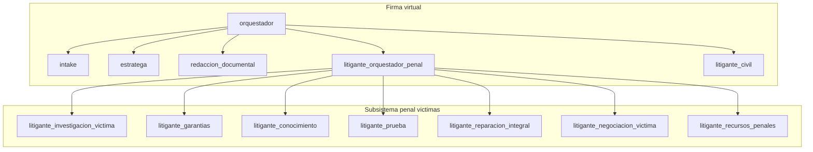

# Plan: sistema agéntico penal — representación de víctimas

**Estado:** implementado (documento vivo para revisión del abogado)  
**Última revisión:** 2026-06-29  
**SDK:** OpenAI Agents SDK (`from agents import Agent, handoff`)  
**Fuente sagrada:** `agente/fuente/GUIA_PROYECTO_AGENTE_JURIDICO.md`, `agente/requisitos/requisitos_asistente.json`

## Decisión de diseño

El despacho actúa **siempre como representante de víctimas** en materia penal (Ley 906). No se asume defensa del imputado. El campo `rol_despacho` en expediente penal queda fijado en `victima`.

La IA propone; el abogado revisa y aprueba. No se inventan sentencias, radicados ni normas.

---

## Arquitectura (dos niveles de orquestación)

**Flujo:**
1. `orquestador` detecta materia penal → handoff a `litigante_orquestador_penal`.
2. `litigante_orquestador_penal` clasifica etapa + objeto → handoff al litigante especialista.
3. Si hace falta escrito formal → `redaccion_documental` (transversal).
4. Salidas pasan por guardrails HITL existentes.

**Roles transversales (no duplicados en penal):** intake, estratega, comunicacion_clientes, redaccion_documental, dependiente_judicial.

---

## Catálogo de agentes litigantes

| Agente SDK | Rol real | Etapa Ley 906 | REQ |
|---|---|---|---|
| `litigante_orquestador_penal` | Coordinador penal | Todas | REQ-007, REQ-018, REQ-023 |
| `litigante_investigacion_victima` | Abogado víctima ante Fiscalía | Indagación/investigación | REQ-007, REQ-017, REQ-020, REQ-023 |
| `litigante_garantias` | Audiencias preliminares | Control de garantías | REQ-007, REQ-023, REQ-037 |
| `litigante_conocimiento` | Juez de conocimiento | Acusación, preparatoria, juicio | REQ-007, REQ-023, REQ-027, REQ-037 |
| `litigante_prueba` | Estrategia probatoria | Investigación → juicio | REQ-020..023 |
| `litigante_reparacion_integral` | Pretensiones indemnizatorias | Investigación → sentencia | REQ-007, REQ-019, REQ-027 |
| `litigante_negociacion_victima` | Salidas alternas | Preacuerdo, principio de oportunidad | REQ-007, REQ-016, REQ-019 |
| `litigante_recursos_penales` | Impugnación | Post-decisión | REQ-028, REQ-027 |

### Reglas de enrutamiento (orquestador penal)

| Señal | Destino |
|---|---|
| denuncia, querella, fiscalía, indagación, carpeta | `litigante_investigacion_victima` |
| captura, legalización, imputación, aseguramiento, garantías | `litigante_garantias` |
| acusación, preparatoria, juicio oral, alegatos, interrogatorio | `litigante_conocimiento` |
| prueba, testigo, perito, objeción, cadena de custodia | `litigante_prueba` |
| reparación, indemnización, perjuicios | `litigante_reparacion_integral` |
| preacuerdo, principio de oportunidad, negociación | `litigante_negociacion_victima` |
| recurso, apelación, casación, reposición | `litigante_recursos_penales` |

---

## Catálogo de skills por agente

Convención: skill = instrucción + tools + KB + (opcional) schema. Estado: EXISTE | AMPLIAR | NUEVO.

### litigante_orquestador_penal

| ID | Skill | Tipo | Estado |
|---|---|---|---|
| PEN-ORQ-01 | Clasificar etapa penal | tool | NUEVO |
| PEN-ORQ-02 | Clasificar objeto litigioso | tool | NUEVO |
| PEN-ORQ-03 | Playbook penal víctima | knowledge | NUEVO |
| PEN-ORQ-04 | Enrutar litigantes | prompt | NUEVO |
| PEN-ORQ-05 | Postura fija víctima | guardrail | NUEVO |
| PEN-ORQ-06 | Tools compartidas RAG | tool | EXISTE |

### litigante_investigacion_victima

| ID | Skill | Tipo | Estado |
|---|---|---|---|
| PEN-INV-01 | Derechos víctima investigación | knowledge | NUEVO |
| PEN-INV-02 | Estructurar denuncia/querella | tool | NUEVO |
| PEN-INV-03 | Peticiones al fiscal | tool | NUEVO |
| PEN-INV-04 | Entrevista víctima/testigos | tool | AMPLIAR |
| PEN-INV-05 | Pruebas faltantes | tool | NUEVO |
| PEN-INV-06 | RAG expediente | tool | EXISTE |
| PEN-INV-07 | Schemas DenunciaVictima, PeticionFiscal | schema | NUEVO |

### litigante_garantias

| ID | Skill | Tipo | Estado |
|---|---|---|---|
| PEN-GAR-01 | Playbook garantías víctima | knowledge | NUEVO |
| PEN-GAR-02 | Preparar audiencia preliminar | tool | NUEVO |
| PEN-GAR-03 | Solicitar audiencia | tool | AMPLIAR |
| PEN-GAR-04 | Intervención víctima en garantías | prompt | NUEVO |
| PEN-GAR-05 | Medidas de protección | tool | NUEVO |
| PEN-GAR-06 | Memorial garantías | schema | AMPLIAR |

### litigante_conocimiento

| ID | Skill | Tipo | Estado |
|---|---|---|---|
| PEN-CON-01 | Playbook conocimiento víctima | knowledge | AMPLIAR |
| PEN-CON-02 | Audiencia preparatoria | tool | NUEVO |
| PEN-CON-03 | Juicio oral | tool | NUEVO |
| PEN-CON-04 | Interrogatorio víctima | tool | NUEVO |
| PEN-CON-05 | Alegatos de cierre | tool | NUEVO |
| PEN-CON-06 | Intervención conocimiento | knowledge | NUEVO |
| PEN-CON-07 | PlanAudienciaPenal, InterrogatorioVictima | schema | NUEVO |

### litigante_prueba

| ID | Skill | Tipo | Estado |
|---|---|---|---|
| PEN-PRU-01 | Teoría probatoria víctima | tool | NUEVO |
| PEN-PRU-02 | Matriz de prueba | tool | NUEVO |
| PEN-PRU-03 | Objeciones y admisión | tool | NUEVO |
| PEN-PRU-04 | Peritajes y cadena custodia | knowledge | NUEVO |
| PEN-PRU-05 | Pruebas faltantes | tool | AMPLIAR |
| PEN-PRU-06 | RAG | tool | EXISTE |

### litigante_reparacion_integral

| ID | Skill | Tipo | Estado |
|---|---|---|---|
| PEN-REP-01 | Marco reparación integral | knowledge | NUEVO |
| PEN-REP-02 | Cuantificar rubros (sin inventar cifras) | tool | NUEVO |
| PEN-REP-03 | Memorial reparación | tool | NUEVO |
| PEN-REP-04 | Incidente reparación | tool | NUEVO |
| PEN-REP-05 | MemorialReparacionIntegral | schema | NUEVO |

### litigante_negociacion_victima

| ID | Skill | Tipo | Estado |
|---|---|---|---|
| PEN-NEG-01 | Salidas alternas víctima | knowledge | NUEVO |
| PEN-NEG-02 | Evaluar preacuerdo | tool | NUEVO |
| PEN-NEG-03 | Oposición principio oportunidad | tool | NUEVO |
| PEN-NEG-04 | Estrategia negociación | prompt | NUEVO |
| PEN-NEG-05 | InformePreacuerdoVictima | schema | NUEVO |

### litigante_recursos_penales

| ID | Skill | Tipo | Estado |
|---|---|---|---|
| PEN-REC-01 | Tipos impugnación | knowledge | NUEVO |
| PEN-REC-02 | Evaluar procedencia | tool | NUEVO |
| PEN-REC-03 | Preparar recurso | tool | NUEVO |
| PEN-REC-04 | Memorial recurso | schema | AMPLIAR |

---

## Base de conocimiento

| Archivo | Uso |
|---|---|
| `agente/conocimiento/proceso-penal-victima-906.md` | Playbook integral víctima |
| `agente/conocimiento/derechos-victima-ley906.md` | Derechos de participación |
| `agente/conocimiento/audiencias-garantias-victima.md` | Garantías |
| `agente/conocimiento/intervencion-victima-conocimiento.md` | Conocimiento/juicio |
| `agente/conocimiento/prueba-penal-victima.md` | Prueba |
| `agente/conocimiento/reparacion-integral-victima.md` | Reparación |
| `agente/conocimiento/salidas-alternas-victima.md` | Negociación |
| `agente/conocimiento/recursos-penales-victima.md` | Recursos |

---

## Schemas Pydantic (`src/agents/schemas.py`)

- `DenunciaVictima`, `PeticionFiscal`
- `PlanAudienciaPenal`, `InterrogatorioVictima`
- `MemorialReparacionIntegral`, `InformePreacuerdoVictima`
- `MatrizPrueba`, `FilaMatrizPrueba`

---

## Implementación en código

| Archivo | Responsabilidad |
|---|---|
| `src/agents/penal_orchestrator.py` | 8 agentes penales + sub-orquestador |
| `src/mcp/penal_tools.py` | Tools PEN-* y `get_penal_victima_tools()` |
| `src/agents/orchestrator.py` | Handoff a `litigante_orquestador_penal` |
| `src/agents/runner.py` | KAN IDs, inferencia, borradores HITL |
| `src/mcp/tools.py` | `leer_playbook_penal_victima`, registro KB |

---

## Criterios de aceptación

- Consulta penal → `litigante_orquestador_penal` → especialista correcto
- Ningún agente penal pregunta defensa vs. víctima
- Afirmaciones normativas desde KB/RAG únicamente
- Memoriales y denuncias con validación de campos obligatorios
- Trazas: `orquestador → litigante_orquestador_penal → litigante_*`
- Tests pytest verdes

---

## Casos de prueba (validación con abogado)

1. **Investigación:** denuncia por hurto calificado; petición medidas de protección al fiscal.
2. **Garantías + reparación:** audiencia de imputación; memorial de reparación integral en rubros.
3. **Juicio oral:** preparatoria con matriz de prueba; interrogatorio a testigo presencial.

---

## Fuera de alcance

- Integración Rama Judicial / Fiscalía en vivo (REQ-045)
- Cálculo automático de términos penales
- Agente de defensa del imputado
- WhatsApp / Slack prod
