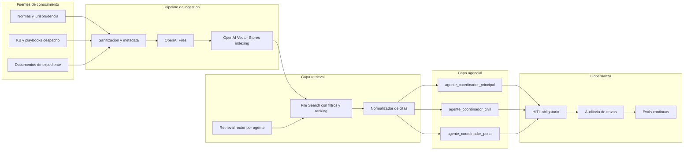

# Plan vivo: RAG y Vector Databases managed en OpenAI (Colombia)

Estado: activo (documento vivo)  
Version: 0.1  
Ultima actualizacion: 2026-06-30  
Alcance: firma virtual completa (coordinacion principal + civil + penal victimas)

## 1) Objetivo de negocio y tecnico

Construir una arquitectura RAG robusta para la firma juridica, con estas condiciones:

- El almacenamiento vectorial y funciones de retrieval pasan a servicios managed de OpenAI.
- La IA propone; el abogado revisa, corrige y aprueba siempre.
- No se inventan normas, sentencias, radicados ni hechos.
- El sistema mantiene enfoque 100% Colombia (normativa, procedimiento y cumplimiento local).
- Se diseña para escalar de un solo corpus a multiples vector stores por dominio.

## 2) Diagnostico actual del repositorio

Estado actual (base sobre la cual migramos):

- RAG local implementado en `src/services/rag.py` con embeddings y busqueda en `pgvector`.
- Tools de grounding en `src/mcp/tools.py` (`buscar_en_conocimiento`, `buscar_en_expediente`).
- Subsistema penal en `src/mcp/penal_tools.py` con herramientas especializadas.
- Subsistema civil en `src/mcp/civil_tools.py` con herramientas especializadas.
- Prompts de agentes embebidos en:
  - `src/agents/orchestrator.py`
  - `src/agents/penal_orchestrator.py`
  - `src/agents/civil_orchestrator.py`
  - prompt base: `agente/prompts/sistema.md`

Resultado: ya existe una base funcional fuerte; falta migrar retrieval a OpenAI managed, estandarizar prompts con politica de citas obligatorias y cerrar el circuito de evaluacion continua.

## 3) Documentos que necesitamos para RAG (uno o varios vector DB)

Esta seccion responde directamente "que documentos necesitamos".  
Se separa en: corpus, cumplimiento legal, y operacion tecnica.

### 3.1 Corpus juridico (contenido a indexar)

1. Normativa primaria Colombia (fuente oficial y versionada)
   - Constitucion Politica
   - Codigos aplicables (Civil, Comercio, CGP, CPP/Ley 906, etc.)
   - Leyes especiales por materia
2. Jurisprudencia curada y trazable
   - Altas cortes relevantes por materia (civil/penal/tutela)
   - Fichas de precedentes (ratio, regla, limite)
3. Doctrina y guias internas del despacho
   - Playbooks del repo `agente/conocimiento/*.md`
   - Criterios internos y plantillas validadas por abogado
4. Documentos de caso (expediente)
   - Demandas, contestaciones, memoriales, autos, providencias, anexos
   - Correos y actas cuando tengan valor probatorio o estrategico

### 3.2 Documentos de cumplimiento legal (Colombia)

Minimo obligatorio para operar RAG con datos de clientes:

1. Politica de Tratamiento de Datos Personales (Ley 1581)
2. Aviso de privacidad y formatos de autorizacion
3. Inventario y clasificacion de bases de datos (incluye RNBD si aplica)
4. Matriz de transferencias y encargados internacionales
5. Evaluacion de impacto de privacidad (PIA/DPIA) para RAG
6. Procedimiento de atencion de derechos del titular (consulta/reclamo/supresion)
7. Protocolo de incidentes de seguridad y notificacion
8. Politica de retencion y eliminacion por tipo documental
9. Politica de anonimización/pseudonimizacion para entrenamiento interno
10. Manual de evidencia digital y cadena de custodia documental (Ley 527 + practica forense)

### 3.3 Documentos tecnicos de arquitectura y operacion

1. Especificacion de metadatos de indexing
2. Estandar de chunking y citacion
3. Contrato de prompts por agente (incluye "cuando no responder")
4. Catalogo de herramientas por agente (tooling permitidas/prohibidas)
5. Runbook de ingestion (fuentes, validacion, versionado, rollback)
6. Politica de evaluacion continua (offline evals + online sampling)
7. SLO/SLA de retrieval (latencia, precision, cobertura de citas)
8. Plan de costos y capacidad (por store, por token, por consulta)
9. Plan de continuidad/contingencia (caida de API, fallback)
10. Registro de decisiones (ADR) y changelog del plan

## 4) Marco normativo y regulatorio de referencia (Colombia)

Base minima para este plan:

- Ley 1581 de 2012 (proteccion de datos personales y habeas data).
- Decretos reglamentarios (p. ej. 1377/2013 y compilaciones posteriores como 1081/2015).
- Lineamientos SIC sobre responsabilidad demostrada (accountability) y guias de implementacion.
- Ley 527 de 1999 (validez y fuerza probatoria de mensajes de datos/documentos electronicos).
- Lineamientos de expediente judicial electronico en Rama Judicial (protocolos de gestion documental y SGDE).

Implicacion clave: si se indexan datos personales/sensibles de clientes en servicios externos, el despacho debe poder demostrar legalidad, finalidad, minimizacion, seguridad, trazabilidad y supresion.

## 5) Arquitectura recomendada: OpenAI managed retrieval

### 5.1 Vista logica

### 5.2 Analisis: un vector store vs varios

| Opcion | Ventajas | Riesgos | Cuando usar |
|---|---|---|---|
| Un solo vector store global | Setup simple, menor complejidad operativa | Menor precision por ruido, controles de acceso mas dificiles, mezcla de dominios | MVP rapido o bajo volumen |
| Varios vector stores por dominio | Mejor precision, filtros mas limpios, mejor gobierno de acceso y costos | Mayor complejidad de ingestion/ruteo | Operacion seria por areas (recomendado) |
| Hibrido (global + especializados) | Balance entre simpleza y precision | Requiere buen router y observabilidad | Despacho multi-area con crecimiento (recomendado para este proyecto) |

### 5.3 Recomendacion concreta para esta firma

Adoptar **modelo hibrido multi-store**:

1. `vs_kb_normativa_colombia`
2. `vs_kb_jurisprudencia_colombia`
3. `vs_kb_playbooks_firma`
4. `vs_penal_victimas`
5. `vs_civil_cgp`
6. `vs_expedientes_activos` (o store por expediente sensible, segun politica de riesgo)

### 5.4 Esquema de metadatos obligatorio (para filtros)

Campos minimos por archivo/chunk:

- `materia` (penal/civil/tutela/comercial/etc.)
- `submateria` (garantias, juicio, recursos, etc.)
- `jurisdiccion` (CO)
- `fuente_tipo` (norma, jurisprudencia, playbook, expediente)
- `fuente_oficial` (si/no)
- `fecha_documento`
- `vigencia_desde` / `vigencia_hasta`
- `radicado` (si aplica)
- `cliente_id` (tokenizado)
- `expediente_id`
- `nivel_confidencialidad` (publico/interno/reservado/sensible)
- `version_doc`

### 5.5 Restricciones y capacidades reales de OpenAI (hoy)

Puntos tecnicos que deben reflejarse en diseno y costos:

- File Search indexa automaticamente (chunking/embedding/indexing).
- Chunking por defecto reportado en docs: 800 tokens y overlap 400; puede personalizarse por archivo/lote.
- Search soporta filtros por atributos + ranking tuning (score threshold e hibrido semantico/texto).
- En Assistants, normalmente se opera con 1 vector store del assistant y 1 del thread; el retrieval de run consulta ambos.
- Vector stores creados por adjuntos en thread tienen expiracion default (inactividad) de 7 dias, configurable.
- Vector stores son estado persistente hasta borrado; la estrategia de supresion debe ser explicita.
- Segun `your-data` de OpenAI, `/v1/vector_stores` no aparece como endpoint elegible para ZDR en la tabla base; por eso se requiere politica de minimizacion + borrado + evaluacion legal previa para datos sensibles.

## 6) Que funciones seran managed por OpenAI y cuales no

### Managed por OpenAI (objetivo)

- Upload de archivos.
- Chunking/indexing en vector stores.
- Embeddings y almacenamiento vectorial.
- Search semantica + keyword + ranking.
- Filtros por atributos.
- Citas de fragmentos recuperados.

### No managed (debe mantener el despacho)

- Sanitizacion de PII y politica de minimizacion.
- Control de acceso por caso/cliente/rol.
- Regla de "no inventar" + enforcement en prompts.
- Validacion juridica y aprobacion humana (HITL).
- Evaluacion de calidad legal (precision y riesgo).
- Retencion, supresion y evidencia de cumplimiento normativo.

## 7) Cambios de prompts por agente (obligatorio antes de migrar)

### 7.1 Contrato comun para todos los prompts

Agregar este bloque base en todos los agentes:

1. Antes de afirmar norma/jurisprudencia: ejecutar retrieval.
2. Toda conclusion juridica debe incluir:
   - fuentes recuperadas,
   - estado de certeza (alto/medio/bajo),
   - datos faltantes.
3. Si no hay evidencia suficiente: detener y pedir informacion concreta.
4. Salida siempre como borrador para revision de abogado.
5. Si hay conflicto de fuentes: exponer contradiccion, no resolver inventando.

### 7.2 Ajustes especificos por familia de agentes

- Coordinadores (`agente_coordinador_principal`, `agente_coordinador_penal`, `agente_coordinador_civil`)
  - Deben enrutar primero por materia y etapa.
  - Deben limitar retrieval al dominio antes de handoff.
- Agentes de redaccion (documental, tutela, recursos)
  - Deben usar plantillas estructuradas y checklist de campos obligatorios.
  - Deben rechazar borrador si faltan partes/radicado/pretension.
- Agentes de estrategia/prueba
  - Deben separar hechos, inferencias y riesgos.
  - Deben exigir soporte documental por cada hipotesis clave.
- Agentes de servicio cliente
  - Deben usar lenguaje claro sin perder trazabilidad de fuente.

## 8) Matriz de skills + herramientas por agente

Nota: esta matriz mezcla skills juridicos y operativos de IA.  
Tooling sugerido: retrieval OpenAI + herramientas especializadas ya existentes en `src/mcp/*_tools.py`.

### 8.1 Firma principal

| Agente | Skills clave | Herramientas recomendadas |
|---|---|---|
| `agente_coordinador_principal` | triage juridico, ruteo por etapa, control de riesgo | retrieval_router, buscar_en_conocimiento, verificar_citas |
| `agente_conocimiento_derecho` | analisis normativo, vigencia normativa, mapeo de fuentes | file_search_normas, file_search_jurisprudencia, leer_normas_clave |
| `agente_recepcionista` | entrevista legal, estructuracion de hechos, deteccion de faltantes | checklist_ingreso_caso, extractor_hechos, solicitar_datos_faltantes |
| `agente_estrategia_casos` | teoria del caso, analisis de riesgo, hipotesis y escenarios | buscador_precedentes, matriz_riesgo, matriz_prueba |
| `agente_servicio_cliente` | comunicacion empatica, simplificacion juridica, gestion de objeciones | redactor_cliente, traductor_juridico_claro, resumidor_con_citas |
| `agente_redaccion_documental` | redaccion tecnica, consistencia procesal, control de requisitos formales | plantillas_struct_output, validador_campos, buscador_expediente |
| `agente_conceptos_juridicos` | concepto motivado, razonamiento legal comparado, recomendacion accionable | concept_builder, file_search_normas, file_search_jurisprudencia |
| `agente_tutela_constitucional` | derechos fundamentales, procedencia, urgencia y medidas | plantilla_tutela, checklist_procedencia, control_terminos |
| `agente_seguimiento_procesal` | tracking de actuaciones, hitos, terminos y alertas | timeline_expediente, monitor_terminos, generador_informe_mensual |

### 8.2 Penal victimas

| Agente | Skills clave | Herramientas recomendadas |
|---|---|---|
| `agente_coordinador_penal` | ruteo por etapa Ley 906, control postura victima | detectar_etapa_penal, clasificar_objeto_penal, retrieval_penal |
| `subagente_investigacion_victima` | denuncia, peticiones a fiscalia, teoria inicial de hechos | preparar_denuncia_victima, preparar_peticion_fiscal, detectar_pruebas_faltantes_victima |
| `subagente_penal_garantias` | audiencias preliminares, medidas de proteccion | preparar_audiencia_garantias, evaluar_medidas_proteccion_victima, kb_garantias |
| `subagente_penal_juicios` | preparatoria, juicio oral, alegatos | preparar_audiencia_preparatoria, preparar_juicio_oral, preparar_alegatos_victima |
| `subagente_penal_pruebas` | estrategia probatoria, objeciones, matriz de prueba | construir_teoria_probatoria_victima, generar_matriz_prueba, evaluar_objecion_prueba |
| `subagente_penal_reparacion` | rubros indemnizatorios, incidente de reparacion | estimar_rubros_reparacion, preparar_memorial_reparacion, preparar_incidente_reparacion |
| `subagente_penal_negociacion` | evaluacion de preacuerdos, principio de oportunidad | evaluar_preacuerdo_victima, evaluar_oposicion_principio_oportunidad, kb_negociacion |
| `subagente_penal_recursos` | procedencia de recursos, argumentacion de impugnacion | evaluar_recurso_penal, preparar_recurso_penal, kb_recursos_penales |

### 8.3 Civil (CGP)

| Agente | Skills clave | Herramientas recomendadas |
|---|---|---|
| `agente_coordinador_civil` | ruteo por etapa CGP, control rol demandante/demandado | detectar_etapa_civil, retrieval_civil, control_rol_despacho |
| `agente_civil_demanda` | estructuracion de demanda, requisitos de admision | preparar_demanda_civil, kb_demanda, checklist_admision |
| `agente_civil_contestacion` | excepciones, reconvencion, defensa tecnica | preparar_contestacion_civil, kb_contestacion, matriz_excepciones |
| `agente_civil_audiencia_inicial` | manejo audiencia art 372, fijacion de litigio | preparar_audiencia_372, kb_audiencia_372, checklist_audiencia |
| `agente_civil_instruccion` | audiencia art 373, practica probatoria y alegatos | preparar_audiencia_373, kb_audiencia_373, plan_alegatos |
| `agente_civil_prueba` | estrategia probatoria civil, carga y pertinencia | generar_matriz_prueba_civil, evaluador_pertinencia, buscador_expediente |
| `agente_civil_recursos` | apelacion, reposicion, queja, casacion (cuando aplique) | preparar_recurso_civil, kb_recursos, verificador_termino_recurso |
| `agente_civil_ejecucion` | titulo ejecutivo, embargo, remate y liquidacion | preparar_ejecucion_civil, kb_ejecucion, checklist_ejecutivo |

## 9) Buenas practicas con evidencia externa (casos de exito)

Patrones que debemos adoptar:

1. Human-in-the-loop obligatorio (modelo Ironclad/OpenAI):
   - La IA sugiere; humano acepta/rechaza cada salida critica.
2. Productividad con control de calidad (Steuerrecht):
   - Ganancias de tiempo reales cuando hay prompts estandar + retrieval fiable.
3. RAG empresarial con corpus grande (Fidal):
   - Escala posible solo con gobierno documental, taxonomia y observabilidad.
4. Limite de "solo RAG" en casos complejos (Harvey):
   - Para litigio complejo, combinar retrieval + razonamiento juridico guiado + revision experta.
5. Integracion de conocimiento disperso (Fennemore):
   - Exito cuando se unifica data estructurada + no estructurada con API y governance.

## 10) Plan de implementacion por fases (roadmap tecnico)

### Fase 0 - Gobierno y cumplimiento (1-2 semanas)

- Crear politicas y runbooks de datos (seccion 3.2 y 3.3).
- Definir taxonomia y metadata obligatoria.
- Aprobar matriz de retencion/supresion por abogado y compliance.

Entregables:
- `docs/politica-datos-rag-colombia.md`
- `docs/especificacion-metadata-rag.md`
- `docs/runbook-incidentes-rag.md`

### Fase 1 - Capa OpenAI managed retrieval (1 semana)

Cambios de codigo previstos:

- `src/config.py`: nuevas variables `OPENAI_VECTOR_STORE_*`.
- Nuevo servicio `src/services/openai_retrieval.py`:
  - upload/index/search/filter/ranking
  - normalizacion de resultados y citas
- `src/services/rag.py`: wrapper de compatibilidad o deprecacion progresiva.

### Fase 2 - Integracion de tools agenciales (1 semana)

- `src/mcp/tools.py`: migrar `buscar_en_conocimiento` y `buscar_en_expediente` al backend OpenAI.
- `src/mcp/penal_tools.py` y `src/mcp/civil_tools.py`: reforzar uso de retrieval por dominio.
- Agregar filtros por `materia`, `expediente_id`, `nivel_confidencialidad`.

### Fase 3 - Refuerzo de prompts por agente (1 semana)

- `src/agents/orchestrator.py`
- `src/agents/penal_orchestrator.py`
- `src/agents/civil_orchestrator.py`
- `agente/prompts/sistema.md`

Aplicar contrato comun de citacion, incertidumbre, datos faltantes y bloqueo de alucinacion.

### Fase 4 - Evals y observabilidad (1 semana)

- Dataset de pruebas juridicas por agente (golden set).
- Metricas:
  - precision de cita
  - grounding rate
  - tasa de respuesta "falta informacion"
  - tasa de correccion humana.
- Integrar chequeos en `tests/` y CI.

### Fase 5 - Hardening de produccion (continuo)

- Costos y limites por store.
- Auditoria mensual de calidad documental.
- Revision trimestral de prompts + KB + jurisprudencia activa.

## 11) Auto-reflexion obligatoria del asistente (quality gate)

Antes de cada respuesta final, cada agente debe autoevaluarse en 2 pasadas:

Pasada A (generacion):
- redactar respuesta preliminar con citas.

Pasada B (critica interna):
- verificar 8 puntos:
  1) ¿Todas las afirmaciones juridicas tienen fuente?
  2) ¿La fuente es vigente y de Colombia?
  3) ¿Hay separacion clara entre hecho y suposicion?
  4) ¿Faltan datos procesales criticos?
  5) ¿Hay contradicciones entre fuentes?
  6) ¿La recomendacion excede el rol de borrador?
  7) ¿Se activo disclaimer de revision del abogado?
  8) ¿El lenguaje es claro para cliente/no cliente?

Si falla cualquiera, se regenera antes de entregar.

## 12) Riesgos clave y mitigaciones

| Riesgo | Impacto | Mitigacion |
|---|---|---|
| Alucinacion normativa | Alto | retrieval obligatorio + bloqueo sin fuente + HITL |
| Mezcla de expedientes | Alto | filtros por expediente y control de acceso por metadata |
| Exposicion de datos personales | Alto | minimizacion, pseudonimizacion, politica de retencion y supresion |
| Baja precision en retrieval | Medio/Alto | multi-store por dominio + ranking tuning + evals |
| Costos crecientes | Medio | lifecycle de archivos, expiracion, monitoreo por store |
| Drift de prompts | Medio | versionado de prompts y revision mensual |

## 13) KPIs de aceptacion del plan

Metas iniciales (ajustables por sprint):

- Grounding rate >= 95% en respuestas juridicas.
- Cita valida >= 90% en borradores complejos.
- Reduccion de tiempo de primer borrador >= 30%.
- Rechazo por abogado por error de fundamento < 10%.
- Tasa de incidentes de privacidad = 0.

## 14) Referencias externas de trabajo (para iterar el plan)

OpenAI (producto y seguridad):
- Retrieval guide: https://developers.openai.com/api/docs/guides/retrieval
- File Search tool: https://developers.openai.com/api/docs/assistants/tools/file-search
- Vector Stores API: https://developers.openai.com/api/reference/resources/vector_stores/
- Data controls: https://developers.openai.com/api/docs/guides/your-data
- Enterprise privacy: https://openai.com/enterprise-privacy/

Casos y patrones de adopcion:
- Ironclad (OpenAI): https://openai.com/customer-stories/ironclad
- Steuerrecht (OpenAI): https://openai.com/index/steuerrecht/
- Harvey (OpenAI): https://openai.com/index/harvey/
- Fidal (Azure OpenAI): https://www.microsoft.com/en/customers/story/25200-fidal-azure-openai
- Fennemore (deepsense + OpenAI): https://deepsense.ai/case-studies/cutting-search-time-streamlining-ops-and-scaling-expertise-with-genai/

Normativa Colombia:
- Ley 1581 (Funcion Publica): https://www.funcionpublica.gov.co/eva/gestornormativo/norma.php?i=49981
- Ley 527 (Funcion Publica): https://www.funcionpublica.gov.co/eva/gestornormativo/norma.php?i=4276
- Portal SIC proteccion de datos: https://www.sic.gov.co/content/sobre-la-proteccion-de-datos-personales
- Circular SIC 003 de 2024: https://sedeelectronica.sic.gov.co/sites/default/files/normativa/Circular%20externa%20No.%20003%20del%2022%20de%20agosto%20de%202024.pdf
- Rama Judicial SGDE (noticia institucional): https://www.ramajudicial.gov.co/web/consejo-superior-de-la-judicatura/-/rama-judicial-apuesta-por-la-gesti%C3%B3n-de-expedientes-100%25-digitales-para-2025

## 15) Ritual de actualizacion continua (documento vivo)

Frecuencia:

- Revision semanal tecnica (arquitectura, prompts, evaluaciones).
- Revision quincenal juridica (vigencia normativa, criterios y riesgos).
- Revision mensual de cumplimiento (datos y seguridad).

Regla de actualizacion:

- Ningun cambio de arquitectura o prompt se considera vigente hasta quedar reflejado aqui con fecha y responsable.

## 16) Changelog del plan

| Fecha | Version | Cambio |
|---|---|---|
| 2026-06-30 | 0.1 | Version inicial: documentos requeridos, arquitectura OpenAI managed, skills por agente, roadmap, compliance Colombia |

