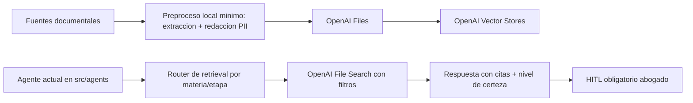

# Plan vivo de arquitectura RAG con OpenAI managed (Colombia)

**Estado:** activo (borrador para revision y aprobacion del abogado)  
**Version:** 1.1  
**Ultima actualizacion:** 2026-06-30  
**Alcance:** firma virtual multiagente (`src/agents/*`) con enfoque Colombia  
**Principio rector:** la IA propone; el abogado revisa, corrige y aprueba  

---

## 1) Diagnostico actual del sistema (basado en el repo)

### 1.1 Lo que ya existe y funciona

- Arquitectura multiagente en produccion con coordinador principal, familia civil, familia penal victimas, redaccion, conceptos, tutela y seguimiento (`src/agents/orchestrator.py`, `src/agents/civil_orchestrator.py`, `src/agents/penal_orchestrator.py`).
- Prompt base compartido con postura juridica colombiana y regla de no invencion (`agente/prompts/sistema.md`).
- Guardrails transversales con disclaimer y revision humana (`src/agents/guardrails.py`).
- Pipeline de validacion y trazabilidad por turno (`src/agents/pipeline.py`, `src/agents/runner.py`).
- KB legal/playbooks por materia y etapa ya consolidada (`agente/conocimiento/*.md`).

### 1.2 Estado actual de RAG

- El retrieval actual usa `pgvector` en Postgres (`src/services/rag.py`, `src/storage/sql.py`).
- Hay tools de grounding ya incorporadas en los agentes (`buscar_en_conocimiento`, `buscar_en_expediente` en `src/mcp/tools.py`).
- Civil y penal ya tienen toolsets especializados por etapa/objeto (`src/mcp/civil_tools.py`, `src/mcp/penal_tools.py`).

### 1.3 Brecha a cerrar

- El despacho solicito que vector DB y funciones de retrieval sean managed en OpenAI.
- Falta migrar el backend de recuperacion desde `pgvector` a OpenAI Vector Stores + File Search, sin romper el enrutamiento actual de agentes ni HITL.
- Falta formalizar evaluacion continua de retrieval/calidad legal con criterios de aceptacion y rollback.

---

## 2) Arquitectura objetivo (OpenAI managed para retrieval/vector)

## 2.1 Servicios OpenAI que se adoptan como backbone

1. **OpenAI Files API** para carga de documentos.
2. **OpenAI Vector Stores API** para almacenamiento vectorial administrado.
3. **OpenAI File Search** para recuperacion semantica + lexical con filtros.
4. **OpenAI Responses API** para orquestar razonamiento y citacion sobre resultados recuperados.
5. **OpenAI Evals** para control de calidad recurrente (retrieval + respuesta legal).

## 2.2 Principios innegociables

- Ningun agente puede afirmar sentencias, radicados o normas sin evidencia recuperada.
- Toda salida juridica sigue siendo borrador sujeto a aprobacion humana.
- El retrieval debe ser trazable (fuente, version, fecha, store, score).
- Separacion por confidencialidad: datos de expediente no se mezclan con KB publica.

## 2.3 Flujo objetivo

## 2.4 Decision estructural

El **camino principal** de retrieval pasa a OpenAI managed.  
`pgvector` queda solo como plan de contingencia temporal durante migracion, no como backend final recomendado.

---

## 3) Opcion A vs Opcion B (vector store unico vs multiple)

| Opcion | Descripcion | Ventajas | Riesgos | Criterios de uso |
|---|---|---|---|---|
| **A. Store unico** | Un solo vector store para todo (normas, jurisprudencia, civil, penal, tutela, expedientes) | Implementacion rapida, menor complejidad inicial | Mas ruido semantico, mas riesgo de mezclar expedientes, filtros mas criticos | Piloto corto, bajo volumen, baja sensibilidad |
| **B. Multi-store** | Varios stores por dominio/confidencialidad | Mayor precision, mejor aislamiento de datos, gobierno de acceso mas claro | Mas complejidad operativa y de ruteo | Operacion estable, varias materias, datos sensibles (recomendado) |

### Decision recomendada para este repo

Adoptar **Opcion B** con modelo hibrido:

- `vs_normativa_colombia`
- `vs_jurisprudencia_colombia`
- `vs_kb_firma_playbooks`
- `vs_penal_victimas`
- `vs_civil_cgp`
- `vs_tutela_constitucional`
- `vs_expedientes_privados` (o store por expediente sensible cuando aplique)

### Criterios de decision continua (cuando ajustar stores)

- Si precision top-3 cae por debajo de 85% en un dominio: separar store.
- Si hay incidentes de mezcla de casos: segmentar por expediente/cliente.
- Si el costo mensual por retrieval supera umbral definido: revisar granularidad y politicas de retencion.

---

## 4) Taxonomia de datos/documentos (practica juridica Colombia)

| Dominio | Tipos de documento | Uso principal en RAG | Sensibilidad |
|---|---|---|---|
| Penal victimas | denuncias, peticiones a fiscalia, audiencias, matriz de prueba, reparacion integral, recursos | estrategia penal por etapa Ley 906 | Alta |
| Civil CGP | demanda, contestacion, excepciones, audiencias 372/373, ejecucion, recursos | redaccion y estrategia procesal civil | Alta |
| Tutela | borradores tutela, anexos, derechos vulnerados, antecedentes, decisiones de seguimiento | procedencia y estructura constitucional | Alta |
| Conceptos juridicos | conceptos previos, doctrina interna, lineamientos por area | consistencia argumentativa y recomendaciones | Media/Alta |
| Seguimiento procesal | radicados, actuaciones, estados, informes mensuales | tracking, alertas, comunicacion a cliente | Alta |
| Normativa/jurisprudencia | codigos, leyes, decretos, sentencias curadas, lineamientos oficiales | fundamento legal externo | Baja/Media |
| Gobierno y compliance | politicas privacidad, retencion, incidentes, control de acceso | cumplimiento y auditoria | Alta |

---

## 5) Documentos requeridos para la base de conocimiento RAG

Esta seccion responde de forma directa al requerimiento: **que documentos se necesitan**.

## 5.1 Corpus juridico externo minimo

1. Constitucion Politica de Colombia.
2. Codigos base: Civil, Comercio, CGP (Ley 1564), CPP/Ley 906.
3. Normativa sectorial por practica real del despacho (familia, laboral, consumidor, societario/comercial).
4. Jurisprudencia curada por materia con metadatos de vigencia y jerarquia.
5. Fuentes oficiales de entidades (Rama Judicial, Corte Constitucional, Corte Suprema, SIC cuando aplique).

## 5.2 Corpus interno del despacho

1. Playbooks ya existentes en `agente/conocimiento/`.
2. Plantillas validadas (contratos, memoriales, tutelas, conceptos, comunicaciones).
3. Criterios de estilo y estrategia aprobados por el abogado.
4. Historial de borradores aprobados (anonimizados cuando corresponda).

## 5.3 Corpus por expediente (privado)

1. Demandas/contestaciones/memoriales.
2. Providencias, autos, actas, anexos probatorios.
3. Correos relevantes de seguimiento procesal.
4. Datos de partes y radicado (con controles de minimizacion).

## 5.4 Documentos de cumplimiento y operacion

1. Politica de tratamiento de datos personales.
2. Politica de retencion/supresion documental.
3. Matriz de clasificacion de confidencialidad.
4. Runbook de incidentes de seguridad.
5. Bitacora de cambios de prompts y retrieval.

---

## 6) Pipeline de ingestion (diseno implementable en este repo)

## 6.1 Etapas del pipeline

1. **Ingreso y clasificacion**: detectar dominio (`civil`, `penal`, `tutela`, `concepto`, `seguimiento`, `normativa`).
2. **Extraccion de texto**: PDF/DOCX/MD hacia texto limpio.
3. **Redaccion/PII**: pseudonimizar datos sensibles cuando no sean necesarios para retrieval.
4. **Normalizacion**: limpiar duplicados, encabezados repetidos, OCR defectuoso.
5. **Chunking por tipo documental**.
6. **Enriquecimiento de metadata**.
7. **Carga a OpenAI Files + indexacion en Vector Store destino**.
8. **Quality gates** antes de habilitar consulta en produccion.

## 6.2 Estrategia de chunking (inicial)

| Tipo documental | Tamano chunk | Overlap | Razon |
|---|---|---|---|
| Norma/codigo | 700-900 tokens | 120-180 | preservar contexto normativo y definiciones |
| Jurisprudencia | 900-1200 tokens | 150-250 | mantener hechos + ratio + decision |
| Expediente (hechos/pruebas) | 350-600 tokens | 80-120 | precision alta en hechos concretos |
| Plantillas internas | 500-800 tokens | 100-150 | mantener estructura de redaccion |

> Nota operativa: en OpenAI File Search el chunking/indexado es managed; estos valores se usan como guia para la politica de presegmentacion cuando se requiera control adicional.

## 6.3 Esquema de metadata obligatorio

| Campo | Ejemplo | Uso |
|---|---|---|
| `jurisdiccion` | `CO` | filtro pais |
| `materia` | `penal`, `civil`, `tutela` | ruteo por agente |
| `submateria` | `garantias`, `audiencia_372`, `recursos` | precision por etapa |
| `fuente_tipo` | `norma`, `jurisprudencia`, `playbook`, `expediente` | ranking y gobierno |
| `fuente_oficial` | `true/false` | control de confiabilidad |
| `norma_jerarquia` | `constitucion`, `ley`, `decreto`, `sentencia` | filtros de jerarquia |
| `fecha_documento` | `2026-06-01` | vigencia temporal |
| `vigente` | `true/false` | evitar normas desactualizadas |
| `radicado` | `11001...` | trazabilidad procesal |
| `cliente_id` | `cli_...` | aislamiento por cliente |
| `expediente_id` | `exp_...` | retrieval de caso |
| `nivel_confidencialidad` | `publico`, `interno`, `reservado` | control de riesgo |
| `version_doc` | `v3` | versionado |
| `hash_origen` | SHA256 | integridad/proveniencia |

## 6.4 Versionado y proveniencia

- No se sobreescriben documentos sin dejar version historica.
- Todo chunk debe conservar referencia al documento fuente y hash de origen.
- Cambios de vigencia se manejan por metadata (`vigente`, `fecha_documento`, `version_doc`).

## 6.5 Quality gates de ingestion

| Gate | Regla de aprobacion | Accion si falla |
|---|---|---|
| Integridad | hash calculado y almacenado | bloquear indexacion |
| Metadata minima | 100% de campos obligatorios | enviar a cola de correccion |
| PII controlada | campos sensibles anonimizados segun politica | bloqueo y alerta |
| Duplicidad | similitud alta contra chunks existentes | consolidar o versionar |
| Legibilidad | OCR/utilidad mayor a umbral | reprocesar documento |
| Fuente valida | origen oficial o interno aprobado | marcar no confiable/no indexar |

---

## 7) Estrategias de retrieval y ranking legal

## 7.1 Query rewriting por agente (obligatorio)

Antes de buscar, cada agente transforma la consulta en:

1. consulta original del usuario,
2. consulta juridica normalizada (terminos procesales),
3. expansion de sinonimos legales (sin inventar autoridades),
4. filtros estructurados por metadata.

## 7.2 Patron de retrieval recomendado (OpenAI stack)

1. Router de dominio selecciona 1-3 stores candidatos.
2. File Search ejecuta recuperacion con filtros (`materia`, `jurisdiccion=CO`, `expediente_id`, `norma_jerarquia`, `vigente`).
3. Re-ranking final en aplicacion (si aplica) para priorizar:
   - fuentes oficiales,
   - vigencia,
   - relevancia por etapa procesal.
4. Respuesta obliga bloque de citas y nivel de certeza.

## 7.3 Filtros juridicos claves (Colombia)

- Jurisdiccion: siempre `CO`.
- Jerarquia normativa: Constitucion > ley > decreto > doctrina interna.
- Vigencia: excluir chunks no vigentes salvo consulta historica explicita.
- Ambito de caso: expediente y cliente obligatorios para datos privados.

## 7.4 Control de alucinacion en retrieval

- Si no hay evidencia suficiente: el agente no concluye, solicita datos faltantes.
- Si hay conflicto entre fuentes: mostrar conflicto y escalar a revision del abogado.
- Si score de retrieval bajo umbral: responder como analisis preliminar de baja certeza.

---

## 8) Actualizaciones de prompt por familia de agentes

## 8.1 Bloque comun obligatorio para todos los agentes

Agregar al prompt de cada agente:

1. "No afirmes normas, sentencias, radicados ni hechos sin respaldo recuperado."
2. "Toda recomendacion juridica debe incluir citas y nivel de certeza (alto/medio/bajo)."
3. "Si faltan datos criticos, formula preguntas concretas antes de continuar."
4. "Todas las salidas son borradores para revision y aprobacion del abogado."
5. "Si detectas conflicto de fuentes, explicitalo y no lo resuelvas inventando."

## 8.2 Ajustes por familia/agente actual

| Agente/familia | Ajuste principal de prompt | Tooling minimo |
|---|---|---|
| `agente_coordinador_principal` | enrutar por materia + etapa + confidencialidad | retrieval_router + file_search_federado |
| `agente_conocimiento_derecho` | priorizar normas/jurisprudencia vigentes y oficiales | file_search_normativa + filtro_jerarquia |
| `agente_recepcionista` | extraer hechos estructurados y faltantes obligatorios | extractor_hechos + validador_campos |
| `agente_estrategia_casos` | separar hechos vs inferencias y matriz de riesgos | file_search_expediente + matriz_riesgo |
| `agente_servicio_cliente` | simplificar lenguaje con trazabilidad de fuente | resumidor_claro + citas_obligatorias |
| `agente_redaccion_documental` | no redactar definitivo si faltan partes/radicado/pretension | validador_estructura + plantilla_doc |
| `agente_conceptos_juridicos` | concepto con problema, fundamento, conclusion y recomendacion | file_search_normativa + file_search_jurisprudencia |
| `agente_tutela_constitucional` | procedencia tutela + derecho vulnerado + pretensiones | checklist_tutela + filtro_ddff |
| `agente_seguimiento_procesal` | resumen cronologico con soporte documental y fechas | timeline_expediente + file_search_expediente |
| `agente_coordinador_penal` + subagentes | enrutar por etapa Ley 906 desde postura victima | detectar_etapa_penal + file_search_penal |
| `agente_coordinador_civil` + subagentes | enrutar por etapa CGP y rol demandante/demandado | detectar_etapa_civil + file_search_civil |

---

## 9) Matriz de skills por agente (skills + tools + handoff + KPI)

## 9.1 Firma principal

| Agente | Skills criticos | Tools recomendadas | Handoff cuando | KPI operativo |
|---|---|---|---|---|
| `agente_coordinador_principal` | triage legal, ruteo multiagente, control de riesgo | `retrieval_router`, `file_search_federado` | detecta materia especializada | precision de enrutamiento >= 92% |
| `agente_conocimiento_derecho` | analisis normativo, vigencia, jerarquia | `file_search_normativa`, `filtro_jerarquia` | consulta exige estrategia/caso | citas validas >= 95% |
| `agente_recepcionista` | intake legal, estructura de hechos, faltantes | `extractor_hechos`, `validador_campos` | caso ya estructurado | completitud intake >= 90% |
| `agente_estrategia_casos` | teoria del caso, riesgos, pruebas faltantes | `file_search_expediente`, `matriz_riesgo` | requiere redaccion formal | riesgo no sustentado < 5% |
| `agente_servicio_cliente` | comunicacion clara, empatia, precision | `resumidor_claro`, `citas_obligatorias` | se pide documento formal | satisfaccion abogado >= 4/5 |
| `agente_redaccion_documental` | redaccion procesal, consistencia formal | `plantilla_doc`, `validador_estructura` | falta base factual/normativa | retrabajo por forma < 10% |
| `agente_conceptos_juridicos` | concepto motivado, recomendacion accionable | `file_search_normativa`, `file_search_jurisprudencia` | requiere area puntual (civil/penal) | aprobacion en primera revision >= 80% |
| `agente_tutela_constitucional` | procedencia tutela, derechos fundamentales | `checklist_tutela`, `filtro_ddff` | no hay info de accionante/accionado | tutela incompleta < 5% |
| `agente_seguimiento_procesal` | tracking de hitos y terminos | `timeline_expediente`, `alertas_terminos` | requiere defensa tecnica | puntualidad de informes >= 95% |

## 9.2 Penal victimas

| Agente | Skills criticos | Tools recomendadas | Handoff cuando | KPI operativo |
|---|---|---|---|---|
| `agente_coordinador_penal` | ruteo Ley 906, postura victima | `detectar_etapa_penal`, `clasificar_objeto_penal` | etapa definida y objetivo concreto | enrutamiento penal correcto >= 93% |
| `subagente_investigacion_victima` | denuncia, peticiones fiscalia, faltantes prueba | `preparar_denuncia_victima`, `preparar_peticion_fiscal` | pasa a garantias/juicio | denuncias completas >= 90% |
| `subagente_penal_garantias` | audiencias preliminares, medidas proteccion | `preparar_audiencia_garantias`, `evaluar_medidas_proteccion_victima` | pasa a juicio/prueba | checklist garantias completo >= 90% |
| `subagente_penal_juicios` | preparatoria, juicio oral, alegatos | `preparar_audiencia_preparatoria`, `preparar_juicio_oral` | requiere matriz probatoria profunda | consistencia argumental >= 85% |
| `subagente_penal_pruebas` | teoria probatoria, objeciones, matriz | `generar_matriz_prueba`, `evaluar_objecion_prueba` | requiere reparacion/recursos | cobertura de hechos probados >= 85% |
| `subagente_penal_reparacion` | rubros, memorial e incidente | `estimar_rubros_reparacion`, `preparar_memorial_reparacion` | pasa a negociacion/recursos | rubros con soporte >= 90% |
| `subagente_penal_negociacion` | preacuerdos y oportunidad | `evaluar_preacuerdo_victima`, `evaluar_oposicion_principio_oportunidad` | hay decision impugnable | recomendaciones aceptadas >= 80% |
| `subagente_penal_recursos` | procedencia y redaccion de recurso | `evaluar_recurso_penal`, `preparar_recurso_penal` | requiere ajuste estrategia general | recursos con requisitos completos >= 90% |

## 9.3 Civil CGP

| Agente | Skills criticos | Tools recomendadas | Handoff cuando | KPI operativo |
|---|---|---|---|---|
| `agente_coordinador_civil` | ruteo por etapa CGP y rol procesal | `detectar_etapa_civil`, `control_rol_despacho` | etapa especifica detectada | enrutamiento civil correcto >= 93% |
| `agente_civil_demanda` | demanda, admision, procedibilidad | `preparar_demanda_civil`, `file_search_civil` | pasa a contestacion/audiencia | admision sin reproceso >= 85% |
| `agente_civil_contestacion` | excepciones, reconvencion, defensa | `preparar_contestacion_civil`, `matriz_excepciones` | pasa a audiencia/prueba | contestaciones completas >= 90% |
| `agente_civil_audiencia_inicial` | audiencia 372, fijacion del litigio | `preparar_audiencia_372`, `checklist_372` | pasa a instruccion | checklist 372 >= 90% |
| `agente_civil_instruccion` | audiencia 373 y alegatos | `preparar_audiencia_373`, `plan_alegatos` | pasa a recursos/ejecucion | coherencia probatoria >= 85% |
| `agente_civil_prueba` | estrategia de prueba civil | `generar_matriz_prueba_civil`, `evaluador_pertinencia` | requiere recurso/ejecucion | hechos con medio probatorio >= 85% |
| `agente_civil_recursos` | apelacion/reposicion/casacion | `preparar_recurso_civil`, `verificador_terminos` | requiere ejecucion | recursos admisibles >= 90% |
| `agente_civil_ejecucion` | titulo, embargo, remate | `preparar_ejecucion_civil`, `checklist_ejecutivo` | requiere seguimiento mensual | actuaciones ejecutivas validas >= 90% |

---

## 10) Recomendaciones de tooling por patrones exitosos (con racional y control de riesgo)

| Patron (mejor practica) | Aplicacion concreta en este proyecto | Racional operativo | Riesgo controlado |
|---|---|---|---|
| Retrieval-first antes de razonar | todo agente consulta File Search antes de concluir | reduce respuestas especulativas | alucinacion normativa |
| Citas obligatorias + nivel de certeza | bloque final de salida en todos los prompts | permite auditoria y defensa tecnica | afirmaciones sin respaldo |
| Structured outputs por tipo documental | mantener/expandir `schemas.py` para contratos, tutela, memorial, concepto, etc. | consistencia formal en escritos | omisiones criticas |
| Handoff especializado por etapa | conservar coordinadores civil/penal y subagentes por fase | precision por contexto procesal | respuestas genericas |
| HITL en todo borrador accionable | mantener `needs_human_review` y cola de aprobacion | control profesional del despacho | salida no revisada |
| Observabilidad de trazas | reforzar spans de retrieval, filtros y fuentes | permite diagnostico y mejora continua | errores silenciosos |
| Segmentacion por confidencialidad | stores separados para expediente vs normativo | minimiza fuga y mezcla de casos | incidente de privacidad |

### Nota sobre patrones de mercado legal

Los despliegues mas exitosos en legal-tech comparten estos elementos: retrieval confiable, salida estructurada, aprobacion humana y gobierno documental estricto. Este plan replica ese patron en la arquitectura existente del repo, sin rehacer el sistema multiagente desde cero.

---

## 11) Plan de evaluacion (retrieval + calidad legal + control de alucinacion)

## 11.1 Evaluacion offline de retrieval

- **Recall@k** por dominio (civil, penal, tutela, conceptos, seguimiento).
- **MRR/nDCG** para medir posicionamiento de chunks correctos.
- **Precision de cita**: porcentaje de citas realmente presentes en los chunks recuperados.
- **Cobertura de metadata**: porcentaje de resultados con filtros correctos (`jurisdiccion`, `materia`, `vigente`, `expediente_id`).

## 11.2 Evaluacion de calidad de respuesta legal

Rubrica de 1-5 por criterio:

1. exactitud juridica,
2. consistencia procesal por etapa,
3. completitud documental,
4. claridad para cliente,
5. accionabilidad para el abogado.

## 11.3 Control de alucinacion y checkpoints HITL

- Tasa de afirmaciones sin fuente (objetivo: ~0 en produccion).
- Tasa de respuestas que piden datos faltantes cuando corresponde (objetivo >= 90% en casos incompletos).
- Tasa de rechazo en revision humana por error de fundamento (objetivo < 10%).
- Muestreo semanal de casos aprobados para auditoria legal.

## 11.4 Criterios de aprobacion para pasar de fase

- Grounding rate >= 95%.
- Cita valida >= 90%.
- Enrutamiento correcto >= 92%.
- Cero incidentes criticos de confidencialidad.

---

## 12) Plan de rollout por fases (aceptacion, rollback, observabilidad y costos)

| Fase | Objetivo | Cambios en repo (pragmaticos) | Criterio de aceptacion | Rollback |
|---|---|---|---|---|
| F0 | baseline y gobierno | crear ADR, politica metadata, dataset evaluacion | documentos de gobierno aprobados | mantener estado actual |
| F1 | adapter OpenAI retrieval | nuevo `src/services/openai_retrieval.py`; extender `src/config.py`; feature flag | queries de prueba resuelven con OpenAI + citas | volver a `src/services/rag.py` actual |
| F2 | migrar tools a OpenAI | actualizar `src/mcp/tools.py`, `src/mcp/civil_tools.py`, `src/mcp/penal_tools.py` | civil/penal/tutela operan con retrieval OpenAI | flag de retorno a backend anterior |
| F3 | reforzar prompts y skills | actualizar prompts en `src/agents/*` + `agente/prompts/sistema.md` | alucinacion sin fuente < umbral | restaurar prompts versionados |
| F4 | evaluacion + observabilidad + costos | integrar evaluaciones y dashboards de trazas/costo | KPIs estables por 2 sprints | congelar despliegue y ajustar tuning |

## 12.1 Observabilidad minima obligatoria

- Latencia retrieval p50/p95 por agente.
- Store utilizado por consulta.
- Score promedio de chunks usados en respuesta final.
- Porcentaje de respuestas con al menos 1 cita valida.
- Costo por 100 consultas (tokens + almacenamiento).

## 12.2 Gobierno de costos

- Presupuesto mensual por dominio/store.
- Politica de expiracion y depuracion de expedientes cerrados.
- Reindexacion selectiva (no total) para controlar costo.
- Alertas por desviacion de costo > 20% contra baseline.

---

## 13) Seguridad y cumplimiento (contexto legal colombiano)

## 13.1 Controles de confidencialidad abogado-cliente

- Clasificacion de datos: publico, interno, reservado, sensible.
- Separacion estricta entre KB publica y expedientes privados.
- Minimizacion de datos en ingestion (solo lo necesario para la tarea).
- Registro de acceso y trazabilidad por consulta.

## 13.2 Marco regulatorio a considerar

- Ley 1581 de 2012 (proteccion de datos personales).
- Reglamentacion y lineamientos vigentes de SIC sobre responsabilidad demostrada.
- Ley 527 de 1999 (mensajes de datos y valor probatorio electronico).
- Politicas internas del despacho sobre secreto profesional.

## 13.3 Reglas operativas de seguridad

- No cargar a retrieval datos no autorizados por politica del despacho.
- Todo incidente de datos debe quedar en bitacora y activar protocolo.
- Supresion/retencion documental con ventana definida y auditable.

---

## 14) Gobernanza de este documento vivo (iteracion continua)

## 14.1 Cadencia de actualizacion

- Revision tecnica semanal.
- Revision juridica quincenal.
- Revision mensual de seguridad/cumplimiento/costos.

## 14.2 Regla de cambio

Ningun cambio de retrieval, prompt o toolset se considera vigente hasta:

1. quedar documentado aqui,
2. tener fecha y responsable,
3. incluir impacto esperado en KPI,
4. quedar aprobado por abogado responsable.

## 14.3 Plantilla minima por cada actualizacion

- contexto del cambio,
- decision tomada,
- archivos tocados,
- riesgo principal y mitigacion,
- KPI objetivo,
- plan de rollback.

## 14.4 Bitacora de versiones

| Fecha | Version | Cambio |
|---|---|---|
| 2026-06-30 | 1.0 | Plan inicial completo: diagnostico, arquitectura OpenAI managed, opciones A/B, taxonomia, prompts, skills, tooling, evaluacion, rollout, seguridad y gobernanza viva |

---

## 15) Supuestos y preguntas abiertas

## 15.1 Supuestos explicitos

1. El despacho acepta migrar retrieval principal a OpenAI managed.
2. Se mantendra HITL obligatorio para toda salida accionable.
3. Existe capacidad operativa para curar corpus juridico y metadata.
4. El equipo aceptara convivir temporalmente con doble backend durante migracion (feature flag).

## 15.2 Preguntas abiertas para cerrar antes de F1

1. ¿Se usara `vs_expedientes_privados` unico o store por expediente sensible?
2. ¿Que politica exacta de retencion/supresion se aplicara por materia y tipo documental?
3. ¿Que umbral de score obligara a "no concluir" y pedir mas datos?
4. ¿Que jurisdicciones adicionales (si alguna) deben coexistir con Colombia?
5. ¿Que set inicial de jurisprudencia curada se considerara "fuente oficial minima viable"?

---

## 16) Backlog de implementacion recomendado (siguiente iteracion)

1. Crear `src/services/openai_retrieval.py` con operaciones: upload, index, search, filtros, trazabilidad.
2. Agregar feature flags en `src/config.py`:
   - `RAG_BACKEND=openai|pgvector`
   - IDs de vector stores por dominio.
3. Refactorizar `buscar_en_conocimiento` y `buscar_en_expediente` en `src/mcp/tools.py` para usar backend configurable.
4. Adaptar `src/mcp/civil_tools.py` y `src/mcp/penal_tools.py` para filtros por metadata (materia, etapa, expediente, jerarquia).
5. Añadir pruebas de retrieval y citacion por dominio en `tests/`.
6. Incorporar gates de calidad en ingestion antes de indexar.

---

## 17) Revision empresarial 360 (ejecutiva y accionable)

## 17.1 Resumen ejecutivo

- El plan tecnico es viable, pero el exito depende mas de gobierno operativo, adopcion y control de riesgo que de la migracion tecnica sola.
- Se mantiene el principio rector: **la IA propone y el abogado aprueba**; no se habilita salida juridica accionable sin respaldo y revision humana.
- La prioridad de negocio en 90 dias es estabilizar calidad/costos del retrieval, reducir riesgo de confidencialidad y acelerar adopcion interna con metricas de uso real.
- Se recomienda operar con comite quincenal (legal + operaciones + tecnologia) para decisiones de riesgo/costo y ajustes de rollout.

## 17.2 Perspectivas clave (diagnostico, riesgo, recomendacion, KPI/KRI, owner)

| Perspectiva | Diagnostico actual | Riesgo principal | Recomendacion accionable | KPI / KRI sugerido | Owner sugerido |
|---|---|---|---|---|---|
| Estrategia | Hay direccion clara a OpenAI managed, pero faltan decisiones ejecutivas con SLA y umbrales de negocio. | Deriva de alcance y retrasos por prioridades cambiantes. | Cerrar un "mandato 90 dias" con 3 metas no negociables (calidad, riesgo, costo). | KPI: 3 metas cumplidas en plazo; KRI: >2 cambios de prioridad/mes. | Socio director + lider tecnologia |
| Operaciones | Existe arquitectura multiagente madura, pero sin runbook unificado de ingestion/retrieval/soporte. | Cuellos de botella y errores repetitivos en operacion diaria. | Definir SOP unico con RACI, tiempos de respuesta y protocolo de escalamiento. | KPI: TAT de ingestion <48h; KRI: incidentes operativos >3/mes. | Lider de operaciones legaltech |
| Riesgo legal Colombia | Base normativa inicial esta identificada, pero falta trazabilidad probatoria estandar por salida. | Riesgo de conclusiones sin soporte documental suficiente. | Exigir bloque obligatorio: fuente + vigencia + nivel de certeza + nota de alcance. | KPI: citas validas >=95%; KRI: hallazgos de fundamento en auditoria >5%. | Abogado lider de calidad juridica |
| IA responsable | Ya hay guardrails y HITL, pero no hay umbral formal para detener respuestas de baja evidencia. | Automatizar respuestas cuando la certeza no es suficiente. | Definir politica de "no concluir" por score y por falta de datos criticos. | KPI: respuestas que piden faltantes >=90% cuando aplica; KRI: respuestas sin evidencia >2%. | Comite IA (legal + producto) |
| Seguridad y confidencialidad | Segmentacion prevista por stores, pendiente formalizar controles de acceso por caso/cliente. | Mezcla de expedientes o exposicion indebida de datos sensibles. | Activar aislamiento por `cliente_id`/`expediente_id`, logging de acceso y revision mensual. | KPI: 0 incidentes criticos; KRI: intentos de acceso cruzado >0 sin bloqueo. | Responsable seguridad / DPO interno |
| Finanzas (unit economics) | Hay gobierno de costos conceptual, falta tablero unitario por consulta/caso aprobado. | Escalamiento de costo sin correlacion con valor entregado. | Medir costo por consulta util y por documento aprobado; fijar techo por materia. | KPI: costo por consulta dentro de presupuesto; KRI: desviacion >20% mensual. | Administracion/CFO |
| Adopcion y UX | El sistema puede producir valor alto, pero la adopcion del abogado depende de confianza y friccion minima. | Baja adopcion por experiencia compleja o inconsistente. | Estandarizar salida con formato unico (hechos, fundamento, riesgo, siguiente paso). | KPI: adopcion semanal >=70% del equipo; KRI: retrabajo manual >30%. | Lider de producto legal + abogado champion |
| Gobernanza | Existe regla de cambio en documento vivo, pero falta comite con decisiones registradas y seguimiento. | Cambios tecnicos sin aprobacion legal/cumplimiento/costo. | Instalar CAB juridico-tecnico quincenal con acta, decisiones y responsables. | KPI: 100% cambios criticos con acta; KRI: cambios sin aprobacion >0. | PMO / comite de gobierno IA |
| Dependencia de proveedor | Beneficio alto por managed services, con riesgo de lock-in tecnico/economico a mediano plazo. | Aumento de costos o restricciones del proveedor sin salida preparada. | Mantener adapter desacoplado, plan de contingencia y prueba trimestral de fallback. | KPI: fallback probado 1 vez/trimestre; KRI: tiempo de recuperacion >24h. | Arquitecto de plataforma |

## 17.3 Registro de riesgos priorizado

| Prioridad | Riesgo | Impacto/Probabilidad | Mitigacion inmediata | Owner |
|---|---|---|---|---|
| Alta | Respuesta juridica sin evidencia suficiente | Alto / Medio | Politica "no concluir" + bloqueo por baja evidencia + HITL estricto | Abogado lider de calidad juridica |
| Alta | Fuga o mezcla de informacion de expedientes | Alto / Medio | Segmentacion por cliente/expediente + control de acceso + auditoria de consultas | Responsable seguridad / DPO interno |
| Alta | Costo de retrieval crece sin control | Medio-Alto / Medio | Presupuesto por dominio + alertas >20% + depuracion de expedientes cerrados | Administracion/CFO |
| Media | Baja adopcion por parte del equipo juridico | Medio / Medio | UX estandar + entrenamiento por casos reales + metricas de uso por abogado | Lider de producto legal |
| Media | Dependencia excesiva de proveedor | Medio / Medio | Adapter portable + fallback operativo probado trimestralmente | Arquitecto de plataforma |
| Baja | Fatiga de gobernanza por exceso de controles | Medio / Bajo | Reducir a KPIs/KRIs minimos y comite quincenal breve | PMO / comite de gobierno IA |

## 17.4 Top 10 decisiones ejecutivas (cerrar en 30 dias)

1. Definir umbral oficial de evidencia para permitir o bloquear conclusiones.
2. Aprobar modelo de segmentacion final para `vs_expedientes_privados` (unico vs por expediente sensible).
3. Fijar presupuesto mensual y techo unitario por consulta util en cada materia.
4. Designar owners formales para calidad juridica, seguridad, costos y adopcion.
5. Aprobar formato unico de salida para todos los agentes (incluye citas y certeza).
6. Adoptar CAB juridico-tecnico quincenal con actas obligatorias.
7. Definir politica de retencion/supresion documental por tipo de caso.
8. Aprobar protocolo de incidentes de datos y ventana maxima de respuesta.
9. Establecer meta minima de adopcion interna por equipo/abogado.
10. Aprobar plan de contingencia y prueba periodica de fallback de retrieval.

## 17.5 Roadmap ejecutivo 30/60/90 dias

| Horizonte | Objetivo ejecutivo | Entregables minimos | KPI/KRI de control | Owner lider |
|---|---|---|---|---|
| 30 dias | Cerrar decisiones criticas de riesgo/calidad/costo | Umbrales aprobados, RACI oficial, formato unico de salida, CAB activo | KPI: 100% decisiones top-10 cerradas >=70%; KRI: decisiones criticas sin owner >0 | Socio director + lider tecnologia |
| 60 dias | Operacion estable con control visible | Tablero de calidad/costo/adopcion, SOP en produccion, auditoria de citas y accesos | KPI: grounding >=95% y adopcion >=60%; KRI: incidentes altos >0 | Operaciones + calidad juridica + seguridad |
| 90 dias | Escala controlada y gobernable | Revision integral de ROI, ajuste de stores, prueba de fallback, plan anual de mejora | KPI: costo unitario estable y aprobacion primera revision >=80%; KRI: desviacion de costo >20% | Comite IA + administracion/CFO |

## 17.6 Supuestos y preguntas abiertas (ejecutivo)

**Supuestos**

1. El despacho sostendra HITL obligatorio en toda recomendacion juridica accionable.
2. Habra disponibilidad de abogado champion para adopcion y auditoria de calidad.
3. Se podran medir costos y uso con granularidad por materia y por caso.
4. El equipo aceptara disciplina de gobierno quincenal con decisiones trazables.

**Preguntas abiertas**

1. ¿Cual es el umbral exacto de evidencia/certeza para bloquear respuesta?
2. ¿Que porcentaje de casos requiere store por expediente (vs store compartido)?
3. ¿Que nivel de costo por consulta se considera sostenible por area de practica?
4. ¿Que modelo de incentivos internos se usara para adopcion del equipo juridico?
5. ¿Que escenario dispara migracion parcial fuera del proveedor principal?

---

**Cierre operativo:** este plan permite migrar a retrieval/vector managed en OpenAI sin romper la arquitectura multiagente actual, conservando la regla central del proyecto: la IA apoya con borradores y evidencia; el abogado decide y aprueba.
